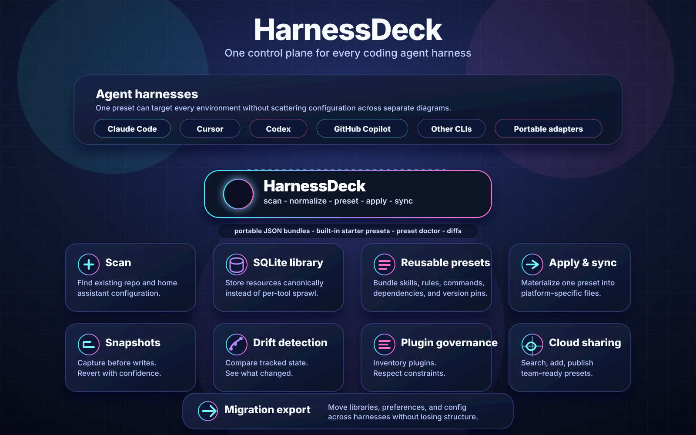
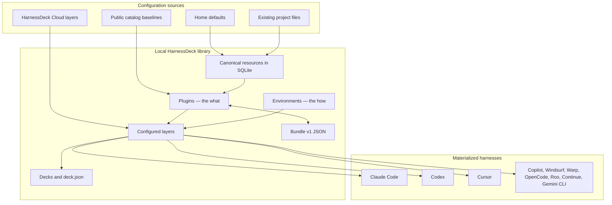
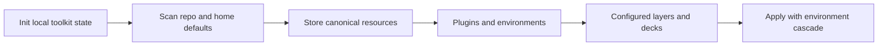

<div align="center">

# HarnessDeck

**Agent harness configuration toolkit** for Claude Code, Codex, Cursor, and other coding CLIs.

Scan existing setup → store canonical resources → compose **plugins** and **layers** → ship portable **decks** → materialize into any supported harness.

<br />

[](https://github.com/bqbooster/harnessdeck/actions/workflows/ci.yml)
[](LICENSE)
[](https://nodejs.org)
[](https://bun.sh)
[](https://www.typescriptlang.org)
[](https://github.com/bqbooster/harnessdeck)

<br />

[Quick start](#quick-start) · [Install](#install) · [Demo](#demo) · [Specification](SPEC.md) · [CLI reference](docs/cli/command-reference.md) · [Contributing](CONTRIBUTING.md)

<br />



</div>

---

## Table of contents

- [Features](#features)
- [Demo](#demo)
- [Requirements](#requirements)
- [Install](#install)
- [Quick start](#quick-start)
- [Architecture](#architecture)
- [Deck model](#deck-model)
- [Catalog baselines](#catalog-baselines)
- [More layer workflows](#more-layer-workflows)
- [Import and export](#import-and-export)
- [Plugin composition and sync](#plugin-composition-and-sync)
- [Output modes and exit codes](#output-modes-and-exit-codes)
- [Project maintenance and machine transfer](#project-maintenance-and-machine-transfer)
- [Supported harnesses](#supported-harnesses)
- [Where data lives](#where-data-lives)
- [HarnessDeck Cloud](#harnessdeck-cloud)
- [Contributing](#contributing)

---

## Features

`harnessdeck` keeps assistant configuration in one place while materializing platform-specific files.

| Capability | What it does |
| --- | --- |
| **Scan & import** | Detect Claude Code, Codex, Cursor, GitHub Copilot, Copilot CLI, and related project layouts |
| **Canonical library** | Store imported configuration as resources in local SQLite |
| **Plugins & layers** | Group resources into reusable **plugins**; bind plugins and **environments** into **layers** |
| **Multi-harness apply** | Materialize layers to one or more harnesses with environment cascade (home → layer default → deck active) |
| **Portable decks** | Ship git repos that work as Claude marketplaces and embed `.harnessdeck/deck.json` |
| **Layer tooling** | Create layers from scanned projects, diff layers, run `layer doctor` before apply |
| **Dependencies & pins** | Record layer dependencies and Claude plugin version pins in portable bundles |
| **Bundles** | Export or import layers as JSON bundles (`urn:harnessdeck:bundle:v1`) |
| **Snapshots & drift** | Snapshot tracked projects before apply, detect drift later, revert when needed |
| **Cloud catalog** | Search, add, and publish shared layers through HarnessDeck Cloud |
| **Machine transfer** | Export local layer library, harness preferences, and config for another machine |

**Supported targets:** Claude Code · Codex · Cursor · GitHub Copilot · Copilot CLI · Windsurf · Warp · OpenCode · Roo · Continue · Gemini CLI

---

## Demo

Initialise HarnessDeck, scan an existing repository, browse built-in layers, apply one, and confirm the final state — all in about a minute.

[](docs/scenarios/vhs/walkthroughs/01-existing-repo-adoption.md)

[Full walkthrough →](docs/scenarios/vhs/walkthroughs/01-existing-repo-adoption.md)

```bash
harnessdeck init                              # initialise HarnessDeck in the repository
harnessdeck project scan .                    # detect existing resources
harnessdeck resource list                     # review discovered resources
harnessdeck layer search fullstack            # browse catalog layers
harnessdeck project apply nextjs-fullstack \
  --project . --harness codex                 # apply a catalog baseline
harnessdeck project status .                  # confirm the final state
```

---

## Requirements

- **Node.js** 20 or later (to run the built CLI)
- **Bun** 1.3+ (recommended for install and development)

---

## Install

### Recommended: npx (no global install)

```bash
npx harnessdeck@latest init
```

### npm global

```bash
npm install -g harnessdeck
hd init
```

<details>
<summary><strong>Bun install</strong> (alternative)</summary>

```bash
bun install -g harnessdeck
hd init
```

Or run without a global install:

```bash
bunx harnessdeck@latest init
```

</details>

<details>
<summary><strong>Install from source</strong></summary>

```bash
git clone https://github.com/bqbooster/harnessdeck.git
cd harnessdeck
bun install
bun run build
bun link
hd init
```

`bun link` registers the checkout as the global `harnessdeck` and `hd` commands. If your shell cannot find them, add Bun's global bin directory to `PATH`:

```bash
export PATH="$HOME/.bun/bin:$PATH"
```

</details>

---

## Quick start

Apply a public catalog baseline in minutes. `hd` is shorthand for `harnessdeck`. For the full command surface and global flags, see [docs/cli/command-reference.md](docs/cli/command-reference.md).

1. **Initialize** local state (creates `~/.harnessdeck` and scans supported home harness folders).
   ```bash
   hd init
   hd init --main claude-code --aliases cursor,codex
   ```

2. **Apply** a catalog layer by bare name (fetches from the public `harnessdeck-cloud` catalog when needed).
   ```bash
   hd project apply nextjs-fullstack --project . --harness codex
   ```

3. **Inspect** project state and next steps.
   ```bash
   hd project status .
   hd guide
   ```

When a repository has a git `origin`, `hd project apply` stores a snapshot before writing files. Restore it later with `hd project revert`.

### Follow-up: scan, compose, and publish

After the baseline fits, build and share your own layers:

1. **Scan** the current repository and review imports.
   ```bash
   hd project scan .
   hd resource list
   ```

2. **Create** a reusable layer and combine resources.
   ```bash
   hd layer create my-setup --description "Shared project assistant setup"
   hd layer combine my-setup research-helper --type skill
   ```

3. **Apply**, mirror alias harnesses, or publish to the cloud catalog.
   ```bash
   hd project apply my-setup --project . --harness claude-code,cursor
   hd project mirror .
   hd auth login
   hd layer publish my-setup
   ```

4. **Manage** harness preferences after init.
   ```bash
   hd harness status --format json
   hd harness set --main claude-code --aliases cursor,codex
   ```

---

## Architecture




---

## Deck model

HarnessDeck separates **what** your agent loads (skills, MCP, hooks, rules) from **how** it is configured (secrets, env vars, models). The composition chain is **resource → plugin → layer → deck**, with **environment** on the side as the swappable configuration axis.

| Concept | Role |
| --- | --- |
| **Resource** | Atomic instruction, skill, rule, MCP, hook, etc. |
| **Plugin** | Bundle of *what* resources + Claude config + `needs` contract |
| **Environment** | Named *how* values (and secret refs) — prod, staging, personal |
| **Layer** | One or more plugins + optional default environment |
| **Deck** | Curated layers and environments; portable git repo |

**Cascade (last wins):** `home env ◂ layer default env ◂ deck active env`. Switch active environment to change how-values without reloading the same plugin stack.

**Hybrid repo:** a deck is a normal Claude marketplace repo *and* carries canonical state:

```
my-deck/.harnessdeck/deck.json            # source of truth (urn:harnessdeck:deck:v1)
my-deck/.harnessdeck/environments/
my-deck/.claude-plugin/marketplace.json   # generated; installable without HarnessDeck
```

Full specification: [SPEC.md](SPEC.md).



---

## Catalog baselines

Starter layers such as `nextjs-fullstack` and `python-fastapi` live in the **HarnessDeck Cloud** public catalog — not inside the npm package. `hd project apply <name>` resolves bare names against the public catalog (and any orgs or libraries you have connected).

```bash
hd layer search fullstack
hd project apply nextjs-fullstack --project . --harness codex
```

To opt out of anonymous public catalog lookups, set `catalog.publicCatalog: false` in `~/.harnessdeck/config.jsonc` or export `HARNESSDECK_PUBLIC_CATALOG=0`.

---

## More layer workflows

Compare, diagnose, or derive plugin bundles beyond the basic create/combine/apply loop:

```bash
hd layer combine team-stack layer:shared-baseline --version "^1.2.0"
hd layer doctor team-stack
hd layer diff team-stack ./team-stack.harnessdeck.json
hd layer from-project inferred-stack --project .
```

Layer dependencies are stored with semver constraints and round-trip through bundle export/import. `layer doctor` checks for duplicate resources, empty content, or invalid plugin metadata; `layer diff` compares layer metadata and contents; `layer from-project` scans a repository and turns imported resources into a new layer.

---

## Import and export

**Bundle v1** — plugin bundles move between machines as JSONC files (`hd layer export` / `import`). Export strips local-only database fields and keeps the portable plugin definition plus its resources.

**Deck v1** — whole setups use `.harnessdeck/deck.json` (`urn:harnessdeck:deck:v1`) inside a git repo; see [SPEC.md](SPEC.md#transport-formats) for the schema.

Layer bundles may include Claude Code marketplace configuration under a top-level `claude` key. When you apply such a layer to a project with `claude-code`, harnessdeck merges `extraKnownMarketplaces` and `enabledPlugins` into `.claude/settings.json`:

```json
{
  "$schema": "urn:harnessdeck:bundle:v1",
  "version": 1,
  "layer": {
    "name": "team-stack",
    "version": "1.0.0",
    "description": "...",
    "tags": []
  },
  "claude": {
    "marketplaces": {
      "team-plugins": {
        "source": { "source": "github", "repo": "org/claude-plugins" },
        "autoUpdate": true
      }
    },
    "plugins": [
      { "id": "formatter@team-plugins", "enabled": true, "version": "1.2.0" }
    ]
  },
  "resources": [],
  "plugins": [],
  "embedded_plugins": []
}
```

```bash
hd layer export my-setup --file ./my-setup.harnessdeck.jsonc
hd layer import ./my-setup.harnessdeck.jsonc
```

---

## Plugin composition and sync

Plugin references are `plugin` resources attached to a layer like any other composition item.

```bash
hd layer combine my-setup plugin:formatter@my-marketplace --version "^2.1.0"
hd layer combine my-setup plugin:formatter@my-marketplace --sync   # eager sync after combine
hd resource sync plugin:formatter@my-marketplace
hd resource show plugin:formatter@my-marketplace
hd layer detach my-setup plugin:formatter@my-marketplace --type plugin
hd layer export my-setup --file ./team.harnessdeck.jsonc --embed-plugins
hd project apply my-setup --project . --strict-plugin-versions
```

On `project apply`, harnessdeck compares layer plugin pins to library `resolved_version` values: it **warns** on mismatch by default; pass `--strict-plugin-versions` to fail (exit code 2), or `--ignore-plugin-versions` to skip validation. Pass `--sync-plugins` to refresh plugin resources before materialize. These strictness flags are mutually exclusive where documented in [SPEC.md](SPEC.md).

Use `hd -V`, `harnessdeck -V`, or `--harnessdeck-version` for the CLI version. `--version` on `layer combine` is the **plugin semver pin or range**, not the global version flag.

Layer export bundles use schema `urn:harnessdeck:bundle:v1` and include `plugins` and `embedded_plugins` arrays (empty when unused). `dependencies` is included when a layer declares versioned dependencies. See [Transport formats](SPEC.md#transport-formats) in SPEC.md.

Refresh policy for marketplace metadata is configured in `~/.harnessdeck/config.jsonc`:

```jsonc
{
  "plugins": {
    "refreshMaxAgeHours": 24
  }
}
```

`resource sync` uses cached metadata unless it is stale; pass `--force` to refresh regardless.

---

## Output modes and exit codes

Most reporting commands accept `--format human|json`. Prefer `--format json` for automation and scripting.

HarnessDeck intentionally uses non-zero exit codes for actionable findings:

| Exit code | Meaning | Examples |
| --- | --- | --- |
| `0` | Success / no actionable issue | `layer doctor` with no findings, `project drift` with no changes |
| `1` | Actionable finding or user-correctable error | `layer doctor` failures, drift detected, invalid command input |
| `2` | Strict validation failure during apply | `project apply --strict-plugin-versions` with mismatched plugin pins |

---

## Project maintenance and machine transfer

HarnessDeck keeps snapshots of generated project files for tracked repositories, which lets you inspect drift, sync alias harnesses, and move your local setup to another machine.

```bash
hd project drift --project .
hd project mirror . --force-shift-reference claude-code
hd migrate export ./harnessdeck-migrate.tar.gz
hd migrate import ./harnessdeck-migrate.tar.gz
```

`project drift` compares the current working tree against the latest apply/sync snapshot. Machine transfer archives export local layer bundles plus global harness preferences and `~/.harnessdeck/config.jsonc`; cloud profiles remain in `cloud-profiles.json`.

**Project command preconditions**

- `project history` and `project drift` require a git-backed project.
- `project apply` can write files outside git, but snapshot/history support only works when the target project has a git `origin`.
- `project revert` requires a snapshot ID from `project history`.
- `harness project set` and `harness project status` require a git-backed project.

---

## Supported harnesses

Dedicated serializers exist for **Claude Code**, **Codex**, and **Cursor**. A broader set registers through a generic path-driven serializer, including GitHub Copilot, Copilot CLI, Windsurf, Warp, OpenCode, Roo, Continue, Gemini CLI, and others.

```bash
hd harness list
```

---

## Where data lives

Operational state lives in `~/.harnessdeck/harnessdeck.db` (resources, plugins, environments, layers, decks, tracked projects, snapshots, harness preferences). Optional settings such as plugin refresh cache age live in `~/.harnessdeck/config.jsonc`. Home environment fragments may live under `~/.harnessdeck/environments/`.

When you run `hd init`, the CLI also checks registered platform default folders in your home directory (e.g. `~/.claude/`, `~/.codex/`) and imports any supported resources it finds.

Override the base directory with `HARNESSDECK_HOME`; cloud profiles live under `<HARNESSDECK_HOME>/cloud-profiles.json` when set.

---

## HarnessDeck Cloud

HarnessDeck Cloud supports publishing, searching, and installing shared layers. Local cloud profiles default to `~/.harnessdeck/cloud-profiles.json`.

1. **Authenticate** and create a profile.
   ```bash
   harnessdeck auth login [profile] [--base-url <url>]
   ```
   Device-code authentication in the browser/terminal. Default profile name: `default`. Default base URL: `https://harnessdeck.kayrnt.fr`.

2. **Inspect** the authenticated user.
   ```bash
   harnessdeck cloud whoami [--profile <name>] [--format human|json]
   ```

3. **List organizations** or switch the active organization.
   ```bash
   harnessdeck cloud orgs [--profile <name>] [--switch <slug>]
   ```

4. **Log out** and remove a local profile.
   ```bash
   harnessdeck cloud logout [--profile <name>]
   ```

5. **Search** the remote layer catalog.
   ```bash
   harnessdeck layer search <query> [--profile <name>] [--format human|json]
   ```

6. **Add** a layer from the cloud.
   ```bash
   harnessdeck layer add <org>/<library>[@version] [--as <name>] [--profile <name>]
   ```
   Downloads a layer bundle and imports it locally. Use `--as` to avoid name conflicts.

7. **Publish** a local layer.
   ```bash
   harnessdeck layer publish <layer> [--profile <name>]
   ```

8. **Apply** an installed layer to a project.
   ```bash
   harnessdeck project apply <layer> --project <path> [--harness <harnesses>]
   ```

Run `harnessdeck <command> --help` for full flag and output-format details.

---

## Contributing

Contributions are welcome. See [CONTRIBUTING.md](CONTRIBUTING.md) for development setup, testing, and publishing instructions.
