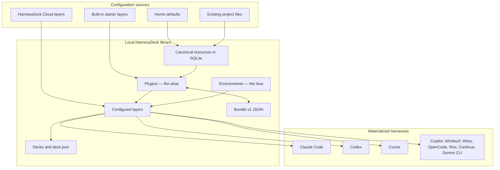
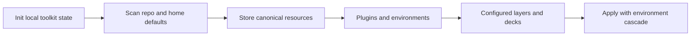
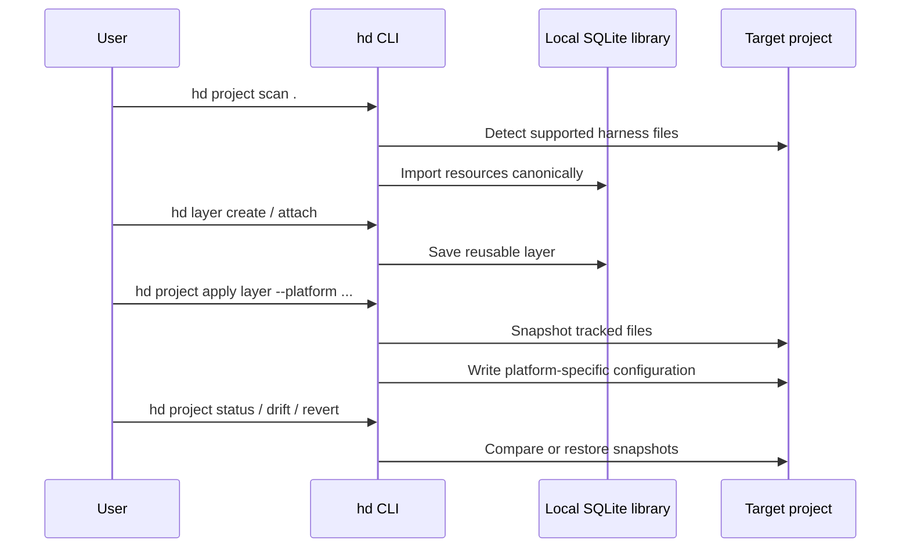

# harnessdeck

`harnessdeck` is an Agent harness configuration toolkit for Claude Code, Codex, Cursor, and other coding CLIs. It scans existing agent setup, stores canonical resources locally, groups **what** into **plugins**, binds plugins and **environments** into **layers** (configured capabilities), curates **decks** for transport, and materializes the resolved setup into one or more supported harnesses.

## What you can do with it

`harnessdeck` helps you keep assistant configuration in one place while still materializing platform-specific files.

- Scan existing Claude Code, Codex, Cursor, GitHub Copilot, Copilot CLI, and related project layouts.
- Store imported configuration as canonical resources in SQLite.
- Group resources into reusable **plugins** and bind them with **environments** into **layers**.
- Apply configured layers to one or more target harnesses with environment cascade (home → layer default → deck active).
- Ship portable **decks** as git repos that work as Claude marketplaces and embed `.harnessdeck/deck.json`.
- Create layers from scanned projects, diff layers, and run `layer doctor` before apply.
- Record layer dependencies and Claude plugin version pins in portable layer bundles.
- Export or import layers as JSON bundles.
- Seed and apply built-in starter layers.
- Snapshot tracked projects before apply, detect drift later, and revert when needed.
- Search, add, and publish shared layers through HarnessDeck Cloud.
- Export your local layer library, harness preferences, and config for machine transfer.




## Requirements

You need Node 20 or later to run the built CLI.

## Install

You can install `harnessdeck` globally with Bun either from the published npm package or from a local checkout of this repository.

### Install from the npm registry

```bash
bun install -g harnessdeck
hd init
```

```bash
bunx harnessdeck@latest init
```

### Install from a local git checkout

```bash
git clone https://github.com/bqbooster/harnessdeck.git
cd harnessdeck
bun install
bun run build
bun link
hd init
```

`bun link` registers the current checkout as the global `harnessdeck` and `hd` commands. After installation, you can invoke the CLI with either name. If your shell still cannot find them, make sure Bun's global bin directory is on your `PATH`:

```bash
export PATH="$HOME/.bun/bin:$PATH"
```

## Demo

Initialise HarnessDeck, scan an existing repository, browse built-in layers, apply one, and confirm the final state — all in about a minute:
[existing-repo-adoption demo](docs/scenarios/vhs/walkthroughs/01-existing-repo-adoption.md)

```
harnessdeck init #initialise HarnessDeck in the repository
harnessdeck project scan . #detect existing resources
harnessdeck resource list #review discovered resources
harnessdeck layer list  #browse available layers
harnessdeck project apply nextjs-fullstack --project . --platform codex #apply a layer
harnessdeck project status . #confirm the final state
```

## Quick start

The fastest way to try `harnessdeck` is to initialize the local database, import supported defaults from your home directory, scan an existing repository, turn the imported resources into a reusable layer, and apply that layer back to your preferred harnesses.

Once installed, `hd` is a shorthand alias for the same CLI. Use whichever form you prefer in the examples below.

The CLI groups related actions under noun-based commands such as `project`, `layer`, and `harness`.

For the full grouped command surface and global flags, see [docs/cli/command-reference.md](docs/cli/command-reference.md).

## Deck model

HarnessDeck separates **what** your agent loads (skills, MCP, hooks, rules) from **how** it is configured (secrets, env vars, models). The composition chain is **resource → plugin → layer → deck**, with **environment** on the side as the swappable configuration axis.


| Concept         | Role                                                           |
| --------------- | -------------------------------------------------------------- |
| **Resource**    | Atomic instruction, skill, rule, MCP, hook, etc.               |
| **Plugin**      | Bundle of *what* resources + Claude config + `needs` contract  |
| **Environment** | Named *how* values (and secret refs) — prod, staging, personal |
| **Layer**       | One or more plugins + optional default environment             |
| **Deck**        | Curated layers and environments; portable git repo             |


**Cascade (last wins):** `home env ◂ layer default env ◂ deck active env`. Switch active environment to change how-values without reloading the same plugin stack.

**Hybrid repo:** a deck is a normal Claude marketplace repo *and* carries canonical state:

```
my-deck/.harnessdeck/deck.json    # source of truth (urn:harnessdeck:deck:v1)
my-deck/.harnessdeck/environments/
my-deck/.claude-plugin/marketplace.json   # generated; installable without HarnessDeck
```

Full specification: [SPEC.md](SPEC.md).




1. Initialize the local database, import any supported home-directory defaults, and optionally choose a default main harness plus aliases.
  ```bash
   hd init
   hd init --main claude-code --aliases cursor,codex
  ```
2. Scan the current repository.
  ```bash
   hd project scan .
  ```
3. List the imported resources.
  ```bash
   hd resource list
  ```
4. Create a reusable plugin bundle.
  ```bash
   hd layer create my-setup --description "Shared project assistant setup"
  ```
5. Add imported resources to that plugin.
  ```bash
   hd layer attach my-setup research-helper --type skill
  ```
6. Apply the layer to one or more target platforms.
  ```bash
   hd project apply my-setup --project . --platform claude-code,codex,cursor
  ```
   `hd project apply` also accepts multiple layer names, a local `.harnessdeck.jsonc` bundle, or a bundle URL. When you pass multiple layer names, later layers override earlier ones for matching resources and plugin pins.
7. Check the tracked project state.
  ```bash
   hd project status .
   hd project history --project .
  ```
8. Inspect or change harness preferences after init.
  ```bash
   hd harness status --format json
   hd harness set --main claude-code --aliases cursor,codex
  ```

If the repository has a git `origin`, `hd project apply` stores a snapshot before it writes files. You can restore that snapshot later with `hd project revert`.




## Built-in plugins

`harnessdeck` ships with starter **plugins** (JSON under `builtin-layers/`, schema `urn:harnessdeck:bundle:v1`) that are seeded during `hd init`. The same command also scans supported default folders in your home directory, imports any resources it finds, and prints the discovered locations. Use these commands to inspect and apply them:

```bash
hd layer list
hd project apply nextjs-fullstack --project . --platform codex
```

The repository currently includes `nextjs-fullstack` and `python-fastapi`.

## More layer workflows

Use these commands when you want to compare, diagnose, or derive plugin bundles beyond the basic create/add/apply loop:

```bash
hd layer attach team-stack layer:shared-baseline --version "^1.2.0"
hd layer doctor team-stack
hd layer diff team-stack ./team-stack.harnessdeck.json
hd layer from-project inferred-stack --project .
```

Layer dependencies are stored with semver constraints and round-trip through bundle export/import. `layer doctor` checks for problems such as duplicate resources, empty content, or invalid plugin metadata, `layer diff` compares layer metadata and contents, and `layer from-project` scans a repository and turns the imported resources into a new layer.

## Import and export

**Bundle v1** — plugin bundles move between machines as JSONC files (`hd layer export` / `import`). Export strips local-only database fields and keeps the portable plugin definition plus its resources.

**Deck v1** — whole setups use `.harnessdeck/deck.json` (`urn:harnessdeck:deck:v1`) inside a git repo; see [SPEC.md](SPEC.md#transport-formats) for the schema.

Layer bundles may also include Claude Code marketplace configuration under a top-level `claude` key. When you apply such a layer to a project with `claude-code`, harnessdeck merges `extraKnownMarketplaces` and `enabledPlugins` into `.claude/settings.json`:

```json
{
  "$schema": "urn:harnessdeck:bundle:v1",
  "version": 1,
  "layer": {
    "name": "team-stack",
    "version": "1.0.0",
    "description": "...",
    "tags": []
  },
  "claude": {
    "marketplaces": {
      "team-plugins": {
        "source": { "source": "github", "repo": "org/claude-plugins" },
        "autoUpdate": true
      }
    },
    "plugins": [
      { "id": "formatter@team-plugins", "enabled": true, "version": "1.2.0" }
    ]
  },
  "resources": [],
  "plugins": [],
  "embedded_plugins": []
}
```

```bash
hd layer export my-setup --file ./my-setup.harnessdeck.jsonc
hd layer import ./my-setup.harnessdeck.jsonc
```

## Plugin composition and sync

Plugin references are `plugin` resources attached to a layer like any other composition item.

```bash
hd layer attach my-setup plugin:formatter@my-marketplace --version "^2.1.0"
hd layer attach my-setup plugin:formatter@my-marketplace --sync   # eager sync after attach
hd resource sync plugin:formatter@my-marketplace
hd resource show plugin:formatter@my-marketplace
hd layer detach my-setup plugin:formatter@my-marketplace --type plugin
hd layer export my-setup --file ./team.harnessdeck.jsonc --embed-plugins
hd project apply my-setup --project . --strict-plugin-versions
```

On `project apply`, harnessdeck compares layer plugin pins to library `resolved_version` values: it **warns** on mismatch by default; pass `--strict-plugin-versions` to fail (exit code 2), or `--ignore-plugin-versions` to skip validation. Pass `--sync-plugins` to refresh plugin resources before materialize. These strictness flags are mutually exclusive with each other where documented in [SPEC.md](SPEC.md).

Use `hd -V`, `harnessdeck -V`, or `--harnessdeck-version` for the CLI version. `--version` on `layer attach` is the **plugin semver pin or range**, not the global version flag.

Layer export bundles use schema `urn:harnessdeck:bundle:v1` and include `plugins` and `embedded_plugins` arrays (empty when unused). `dependencies` is included when a layer declares versioned dependencies. See [Transport formats](SPEC.md#transport-formats) in SPEC.md.

Refresh policy for marketplace metadata is configured in `~/.harnessdeck/config.jsonc`:

```jsonc
{
  "plugins": {
    "refreshMaxAgeHours": 24
  }
}
```

`resource sync` uses cached metadata unless it is stale; pass `--force` to refresh regardless.

## Output modes and exit codes

Most reporting commands accept `--format human|json`. Prefer `--format json` for automation and scripting.

HarnessDeck intentionally uses non-zero exit codes for some actionable findings:


| Exit code | Meaning                                      | Examples                                                             |
| --------- | -------------------------------------------- | -------------------------------------------------------------------- |
| `0`       | Success / no actionable issue                | `layer doctor` with no findings, `project drift` with no changes     |
| `1`       | Actionable finding or user-correctable error | `layer doctor` failures, drift detected, invalid command input       |
| `2`       | Strict validation failure during apply       | `project apply --strict-plugin-versions` with mismatched plugin pins |


## Project maintenance and machine transfer

HarnessDeck keeps snapshots of generated project files for tracked repositories, which lets you inspect drift, sync alias harnesses, and move your local setup to another machine.

```bash
hd project drift --project .
hd project sync . --force-shift-reference claude-code
hd migrate export ./harnessdeck-migrate.tar.gz
hd migrate import ./harnessdeck-migrate.tar.gz
```

`project drift` compares the current working tree against the latest apply/sync snapshot. Machine transfer archives export local layer bundles plus global harness preferences and `~/.harnessdeck/config.jsonc`; cloud profiles remain in `cloud-profiles.json`.

Project command preconditions:

- `project history` and `project drift` require a git-backed project.
- `project apply` can write files outside git, but snapshot/history support only works when the target project has a git `origin`.
- `project revert` requires a snapshot ID from `project history`.
- `harness project set` and `harness project status` require a git-backed project.

## Supported harnesses

`harnessdeck` has dedicated serializers for Claude Code, Codex, and Cursor. It also registers a broader set of harnesses through a generic path-driven serializer, including GitHub Copilot, Copilot CLI, Windsurf, Warp, OpenCode, Roo, Continue, Gemini CLI, and others.

Run this command to see the current registry in your installed version.

```bash
hd harness list
```

## Where data lives

`harnessdeck` stores its operational state in `~/.harnessdeck/harnessdeck.db`. The database holds resources, plugin bundles, environments, configured layers, decks, tracked projects, snapshots, and harness preference state. Optional settings (such as plugin refresh cache age) live in `~/.harnessdeck/config.jsonc`. Home environment fragments may live under `~/.harnessdeck/environments/`.

When you run `hd init`, the CLI also checks registered platform default folders in your home directory, such as `~/.claude/` and `~/.codex/`, and imports any supported resources it finds.

## HarnessDeck Cloud

HarnessDeck can interact with the Harness cloud for publishing, searching, and installing shared layers. Local cloud profiles are stored in `~/.harnessdeck/cloud-profiles.json` by default. You can override the base HarnessDeck directory by setting the `HARNESSDECK_HOME` environment variable; profiles will live under `<HARNESSDECK_HOME>/cloud-profiles.json` when set.

Common workflows

1. Authenticate and create a profile.
  ```bash
   harnessdeck cloud login [profile] [--base-url <url>]
  ```
   This performs device-code authentication in the browser/terminal and saves a named profile. If no name is provided the profile is saved as `default` and becomes the default profile. The default base URL is `https://harnessdeck.kayrnt.fr`.
2. Inspect the authenticated user.
  ```bash
   harnessdeck cloud whoami [--profile <name>] [--format human|json]
  ```
3. List organizations or switch the active organization.
  ```bash
   harnessdeck cloud orgs [--profile <name>] [--switch <slug>]
  ```
4. Log out and remove a local profile.
  ```bash
   harnessdeck cloud logout [--profile <name>]
  ```
5. Search the remote layer catalog.
  ```bash
   harnessdeck layer search <query> [--profile <name>] [--format human|json]
  ```
6. Add a layer from the cloud.
  ```bash
   harnessdeck layer add <org>/<library>[@version] [--as <name>] [--profile <name>]
  ```
   This downloads a layer bundle from the cloud and imports it into the local layer database. Use `--as` to avoid name conflicts with existing layers.
7. Publish a local layer to the cloud.
  ```bash
   harnessdeck layer publish <layer> [--profile <name>]
  ```
8. Apply an installed layer to a project.
  ```bash
   harnessdeck project apply <layer> --project <path> [--platform <harnesses>]
  ```

Notes

- Run `harnessdeck <command> --help` for full details on flags and output formats.
- Cloud profiles are JSON files stored under the HarnessDeck directory (default `~/.harnessdeck/cloud-profiles.json`). Setting `HARNESSDECK_HOME` changes the directory where these files are written.

## Contributing

If you'd like to contribute, please see the [CONTRIBUTING.md](CONTRIBUTING.md) file for development and publishing instructions.