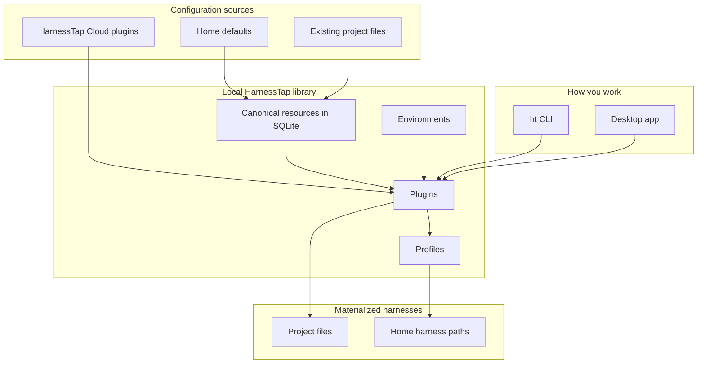

<div align="center">

<h1>
  
</h1>

**Agent harness configuration toolkit** for Claude Code, Codex, Cursor, and other coding CLIs.

Scan existing setup → store canonical resources → compose **plugins** → share offline or via catalog → materialize into any supported harness.

Use the **CLI** (`ht`) or **Desktop** — both talk to the same local library at `~/.harnesstap`.

<br />

[](https://github.com/harnesstap/harnesstap/actions/workflows/ci.yml)
[](LICENSE)
[](https://www.npmjs.com/package/harnesstap)
[](https://nodejs.org)

<br />

[Install](#install) · [Quick start](#quick-start) · [Desktop](#desktop) · [Demo](#demo) · [Supported harnesses](docs/supported-harnesses.md) · [CLI reference](docs/cli/command-reference.md)

<br />


</div>

---

## Table of contents

- [Features](#features)
- [Install](#install)
- [Quick start](#quick-start)
- [Desktop](#desktop)
- [Demo](#demo)
- [Concept model](#concept-model)
- [Catalog and Cloud](#catalog-and-cloud)
- [Supported harnesses](#supported-harnesses)
- [Where data lives](#where-data-lives)
- [Next steps](#next-steps)

---

## Features

`harnesstap` keeps assistant configuration in one place and writes the files each harness expects.

| Capability | What it does |
| --- | --- |
| **Scan & import** | Detect Claude Code, Codex, Cursor, Copilot, Goose, and other project or home layouts |
| **Canonical library** | Store imported configuration as resources in local SQLite |
| **Plugins** | Group resources into versioned plugins with dependencies and environments |
| **Profiles** | Switch a machine-wide setup (`ht profile use work` or `ht work`) |
| **Multi-harness apply** | Materialize a plugin to a project or to home paths, with environment cascade |
| **Snapshots & drift** | Snapshot tracked projects before apply, inspect drift, revert when needed |
| **Cloud catalog** | Search, pull, and publish shared plugins through HarnessTap Cloud |
| **Machine transfer** | Export the local library and harness preferences for another machine |
| **Desktop** | Browse plugins, profiles, and apply from a local app that shares the CLI library |

**42 harnesses** are registered today. Native serializers: Claude Code, Cursor, Codex, Goose, OpenCode, GitHub Copilot, Copilot CLI, Gemini CLI, Grok Build, DeepSeek Harness. The rest use a path-driven serializer. Full matrix: [Supported harnesses](docs/supported-harnesses.md).

---

## Install

**Requirements:** Node.js 20+ to run the published CLI.

### Recommended: npx (no global install)

```bash
npx harnesstap@latest init
```

### npm global

```bash
npm install -g harnesstap
ht init
```

`ht` is shorthand for `harnesstap`.

<details>
<summary><strong>Bun</strong> (alternative)</summary>

```bash
bun install -g harnesstap
ht init
```

Or without a global install: `bunx harnesstap@latest init`.

</details>

<details>
<summary><strong>Install from source</strong></summary>

```bash
git clone https://github.com/harnesstap/harnesstap.git
cd harnesstap
bun install
bun run link
ht init
```

`bun run link` builds the CLI and registers `harnesstap` and `ht`. If your shell cannot find them, add Bun's global bin directory to `PATH`:

```bash
export PATH="$HOME/.bun/bin:$PATH"
```

</details>

---

## Quick start

Two common paths: adopt an existing repo, or switch your **home** harness setup with a profile.

### Project: scan and apply

```bash
ht init --main codex --aliases claude-code,cursor
ht scan .
ht resource list
ht apply engineering-foundation --project .
ht status .
```

`ht apply engineering-foundation` resolves the public catalog when the plugin is not already local. When the repository has a git `origin`, apply stores a snapshot first; restore with `ht revert`.

### Machine: profile switch

```bash
ht init --main claude-code --aliases cursor,codex
ht profile use default
# after you compose a `work` profile:
ht work
```

`init` seeds a `default` profile plugin. It does **not** write home harness files until you run `profile use` (or the `ht <name>` shorthand).

More install and follow-up recipes: [Getting started](docs/cli/getting-started.md).

---

## Desktop

HarnessTap Desktop is a local app for the same library the CLI uses. Browse plugins and profiles, preview conflicts, and apply without leaving the GUI.

It is **not** in the npm package. Build it from this repo (macOS `.app` / `.dmg` today):

```bash
bun run desktop:dev      # development
bun run desktop:build    # packaged app under apps/desktop/src-tauri/target/release/bundle/
bun run desktop:install  # build + install HarnessTap.app into /Applications
```

Details, sidecar notes, and e2e: [apps/desktop/README.md](apps/desktop/README.md).

---

## Demo

Initialise HarnessTap, scan an existing repository, browse catalog plugins, apply one, and confirm the final state — all in about a minute.

[](docs/scenarios/vhs/walkthroughs/01-existing-repo-adoption.md)

[Full walkthrough →](docs/scenarios/vhs/walkthroughs/01-existing-repo-adoption.md)

```bash
ht init --main codex --aliases claude-code,cursor
ht scan .                    # detect existing resources
ht resource list             # review discovered resources
ht plugin list --search foundation --remote-only
ht apply engineering-foundation --project .
ht status .                  # confirm the final state
```

---

## Concept model

HarnessTap keeps one library of **resources** — skills, rules, MCP servers, hooks, agents, commands. You group them into **plugins**. `ht apply <plugin>` (project) or `ht profile use <plugin>` (home) resolves the dependency graph and writes harness files. When two plugins disagree, the one closest to what you applied wins; genuine ambiguity is an error you fix with an override. An **environment** fills in the values a plugin needs — model, permissions, tokens by reference. Secrets are never stored in a plugin.

| Concept | Role |
| --- | --- |
| **Resource** | Atomic instruction, skill, rule, MCP, hook, etc. |
| **Plugin** | Versioned package of resources, optional dependencies, and a `needs` contract |
| **Environment** | Named *how* values (and secret refs) — prod, staging, personal |
| **Profile** | A plugin tagged for machine-wide switching (`ht work`, `profile use`) |
| **Workspace** | Local library at `~/.harnesstap` |

**Cascade (last wins):** nearer plugins override farther ones; `home env ◂ plugin default env` for environment values.



---

## Catalog and Cloud

Starter plugins such as `engineering-foundation` live in the **HarnessTap Cloud** public catalog — not inside the npm package. Bare names on `ht apply` resolve against that catalog (and any orgs you have connected).

```bash
ht plugin list --search foundation --remote-only
ht apply engineering-foundation
ht auth login
ht plugin pull acme/library
ht plugin catalog register acme/default
ht plugin publish my-setup
```

To opt out of anonymous public catalog lookups, set `catalog.publicCatalog: false` in `~/.harnesstap/config.jsonc` or export `HARNESSTAP_PUBLIC_CATALOG=0`.

Auth, orgs, pull, and publish: [HarnessTap Cloud](docs/cli/cloud.md).

---

## Supported harnesses

```bash
ht harness list
ht harness list --supported    # native serializers only
ht harness set --main claude-code --aliases cursor,codex
```

See the full matrix — resource types, skill emission, plugin support, and paths — in **[Supported harnesses](docs/supported-harnesses.md)**.

---

## Where data lives

Operational state lives in `~/.harnesstap/harnesstap.db` (resources, plugins, environments, profiles, tracked projects, snapshots, harness preferences). Optional settings live in `~/.harnesstap/config.jsonc`. Cloud accounts: `~/.harnesstap/cloud-accounts.json`.

Override the base directory with `HARNESSTAP_HOME`.

`ht init` also checks registered home folders (e.g. `~/.claude/`, `~/.codex/`) and imports supported resources it finds.

Move a library between machines with `ht migrate export` / `import`. Older databases that cannot upgrade in place still open read-only for export — see [machine migration](docs/scenarios/details/28-machine-migration.md).

---

## Next steps

| I want to… | Start here |
| --- | --- |
| Learn every command | [CLI reference](docs/cli/command-reference.md) |
| Compose, doctor, or diff plugins | [Plugin concepts](docs/cli/concepts/plugins.md) · `ht plugin doctor` · `ht plugin from-project` |
| Sync marketplace pins | `ht plugin edit my-setup --add plugin:formatter@my-marketplace --version "^2.1.0"` |
| Add a scanned skill | `ht plugin edit my-setup --add research-helper --type skill` |
| Check project drift | `ht status . --check` · `ht mirror .` |
| Contribute | [CONTRIBUTING.md](CONTRIBUTING.md) |
