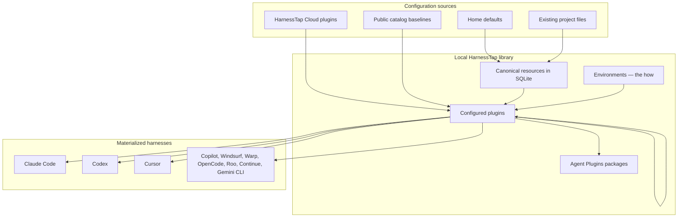
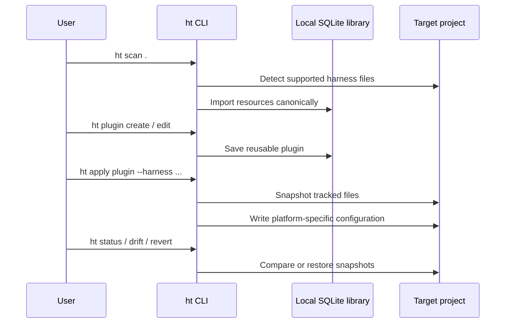
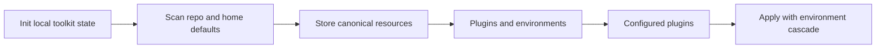

<div align="center">

<h1>
  
</h1>

**Agent harness configuration toolkit** for Claude Code, Codex, Cursor, and other coding CLIs.

Scan existing setup → store canonical resources → compose **plugins** → share offline or via catalog → materialize into any supported harness.

<br />

[](https://github.com/harnesstap/harnesstap/actions/workflows/ci.yml)
[](LICENSE)
[](https://nodejs.org)
[](https://bun.sh)
[](https://www.typescriptlang.org)
[](https://github.com/harnesstap/harnesstap)
[](https://hits.sh/github.com/harnesstap/harnesstap/)

<br />

[Quick start](#quick-start) · [Install](#install) · [Demo](#demo) · [Specification](SPEC.md) · [Supported harnesses](docs/supported-harnesses.md) · [CLI reference](docs/cli/command-reference.md) · [Contributing](CONTRIBUTING.md)

<br />


</div>

---

## Table of contents

- [Features](#features)
- [Demo](#demo)
- [Requirements](#requirements)
- [Install](#install)
- [Quick start](#quick-start)
- [Architecture](#architecture)
- [Concept model](#concept-model)
- [Catalog baselines](#catalog-baselines)
- [More plugin workflows](#more-plugin-workflows)
- [Import and export](#import-and-export)
- [Plugin composition and sync](#plugin-composition-and-sync)
- [Output modes and exit codes](#output-modes-and-exit-codes)
- [Project maintenance and machine transfer](#project-maintenance-and-machine-transfer)
- [Supported harnesses](#supported-harnesses)
- [Where data lives](#where-data-lives)
- [Upgrading from schema v18](#upgrading-from-schema-v18)
- [HarnessTap Cloud](#harnesstap-cloud)
- [Contributing](#contributing)

---

## Features

`harnesstap` keeps assistant configuration in one place while materializing platform-specific files.

| Capability | What it does |
| --- | --- |
| **Scan & import** | Detect Claude Code, Codex, Cursor, GitHub Copilot, Copilot CLI, and related project layouts |
| **Canonical library** | Store imported configuration as resources in local SQLite |
| **Plugins** | Group resources into versioned **plugins** with dependencies, host **plugin pins**, and bound **environments** |
| **Multi-harness apply** | Materialize plugins to one or more harnesses with environment cascade (home → plugin default) |
| **Offline sharing** | Move the full local workspace with `migrate export` / `import`, or share individual plugins as Agent Plugins packages |
| **Plugin tooling** | Create plugins from scanned projects, diff plugins, run `plugin doctor` before apply |
| **Dependencies & pins** | Record plugin dependencies and Claude plugin version pins in portable packages |
| **Plugin exports** | Export or import plugins as Agent Plugins packages (directory or `.ap.json` envelope) |
| **Snapshots & drift** | Snapshot tracked projects before apply, detect drift later, revert when needed |
| **Cloud catalog** | Search, add, and publish shared plugins through HarnessTap Cloud |
| **Machine transfer** | Export local plugin library, harness preferences, and config for another machine |

**Supported targets:** Claude Code · Codex · Cursor · GitHub Copilot · Copilot CLI · Windsurf · Warp · OpenCode · Roo · Continue · Gemini CLI

---

## Demo

Initialise HarnessTap, scan an existing repository, browse catalog plugins, apply one, and confirm the final state — all in about a minute.

[](docs/scenarios/vhs/walkthroughs/01-existing-repo-adoption.md)

[Full walkthrough →](docs/scenarios/vhs/walkthroughs/01-existing-repo-adoption.md)

```bash
harnesstap init --main codex --aliases claude-code,cursor
harnesstap scan .                    # detect existing resources
harnesstap resource list                     # review discovered resources
harnesstap plugin list --search foundation --remote-only  # browse catalog plugins
harnesstap apply engineering-foundation \
  --project .                                 # apply a catalog baseline
harnesstap status .                  # confirm the final state
```

---

## Requirements

- **Node.js** 20 or later (to run the built CLI)
- **Bun** 1.3+ (optional; required only for contributing from source)

---

## Install

### Recommended: npx (no global install)

```bash
npx harnesstap@latest init
```

### npm global

```bash
npm install -g harnesstap
ht init
```

<details>
<summary><strong>Bun install</strong> (alternative)</summary>

```bash
bun install -g harnesstap
ht init
```

Or run without a global install:

```bash
bunx harnesstap@latest init
```

</details>

<details>
<summary><strong>Install from source</strong></summary>

```bash
git clone https://github.com/harnesstap/harnesstap.git
cd harnesstap
bun install
bun run link
ht init
```

`bun run link` builds the CLI and registers the checkout as the global `harnesstap` and `ht` commands. If your shell cannot find them, add Bun's global bin directory to `PATH`:

```bash
export PATH="$HOME/.bun/bin:$PATH"
```

</details>

---

## Quick start

Apply a public catalog baseline in minutes. `ht` is shorthand for `harnesstap`. For the full command surface and global flags, see [docs/cli/command-reference.md](docs/cli/command-reference.md).

1. **Initialize** local state (creates `~/.harnesstap` and scans supported home harness folders).
   ```bash
   ht init --main codex --aliases claude-code,cursor
   ```

2. **Apply** a catalog plugin by bare name (fetches from the public `harnesstap-cloud` catalog when needed).
   ```bash
   ht plugin list --search foundation --remote-only
   ht apply engineering-foundation
   ```

3. **Inspect** project state and next steps.
   ```bash
   ht status .
   ht help
   ```

When a repository has a git `origin`, `ht apply` stores a snapshot before writing files. Restore it later with `ht revert`.

### Follow-up: scan, compose, and publish

After the baseline fits, build and share your own plugins:

1. **Scan** the current repository and review imports.
   ```bash
   ht scan .
   ht resource list
   ```

2. **Create** a reusable plugin and add resources.
   ```bash
   ht plugin create my-setup --description "Shared project assistant setup"
   ht plugin edit my-setup --add research-helper --type skill
   ```

3. **Apply**, mirror alias harnesses, or publish to the cloud catalog.
   ```bash
   ht apply my-setup --project . --harness claude-code,cursor
   ht mirror .
   ht auth login
   ht plugin catalog register acme/default
   ht plugin publish my-setup
   ```

4. **Manage** harness preferences after init.
   ```bash
   ht harness status --format json
   ht harness set --main claude-code --aliases cursor,codex
   ```

---

## Architecture





---

## Concept model

HarnessTap keeps one library of **resources** — skills, rules, MCP servers, hooks, agents, commands. You group resources into **plugins**. A plugin is a versioned package that can also depend on other plugins, from a marketplace, a repo, or your org's catalog. `ht apply <plugin>` resolves the whole dependency graph and materializes it into a repo, or into your machine with `--global`. When two plugins disagree, the one closest to what you applied wins, and anything genuinely ambiguous is an error you can fix by declaring an override. A **profile** is a plugin you switch to machine-wide, so `ht work` puts you in your work setup. An **environment** fills in the values a plugin says it needs — model, permissions, tokens by reference. Secrets are never stored in a plugin.

| Concept | Role |
| --- | --- |
| **Resource** | Atomic instruction, skill, rule, MCP, hook, etc. |
| **Plugin** | Versioned package of resources, optional dependencies, and a `needs` contract |
| **Environment** | Named *how* values (and secret refs) — prod, staging, personal |
| **Profile** | A plugin tagged for machine-wide switching (`ht work`, `profile use`) |
| **Workspace** | Local library of plugins, resources, and environments at `~/.harnesstap` |

**Cascade (last wins):** nearer plugins override farther ones; `home env ◂ plugin default env` for environment values.

**Offline sharing:** export the whole workspace, individual plugins, or resources with `ht migrate export` / `import`. For multiplayer distribution, publish to HarnessTap Cloud with `plugin publish` / `pull`.

Full specification: [SPEC.md](SPEC.md).



---

## Catalog baselines

Starter plugins such as `engineering-foundation` and `frontend-engineer` live in the **HarnessTap Cloud** public catalog — not inside the npm package. `ht apply <name>` resolves bare names against the public catalog (and any orgs or libraries you have connected).

```bash
ht plugin list --search foundation --remote-only
ht apply engineering-foundation
```

To opt out of anonymous public catalog lookups, set `catalog.publicCatalog: false` in `~/.harnesstap/config.jsonc` or export `HARNESSTAP_PUBLIC_CATALOG=0`.

---

## More plugin workflows

Compare, diagnose, or derive plugin bundles beyond the basic create/edit/apply loop:

```bash
ht plugin edit team-stack --add plugin:shared-baseline --version "^1.2.0"
ht plugin doctor team-stack
ht plugin diff team-stack ./team-stack.ap.json
ht plugin from-project inferred-stack --project .
```

Plugin dependencies are stored with semver constraints and round-trip through Agent Plugins package export/import. `plugin doctor` checks for duplicate resources, empty content, or invalid plugin metadata; `plugin diff` compares plugin metadata and contents; `plugin from-project` scans a repository and turns imported resources into a new plugin.

---

## Import and export

**Agent Plugins packages** — plugins move between machines as a package directory or a single `.ap.json` envelope via `ht migrate export --plugin` / `ht migrate import`. Default export is a directory; pass `--single-file` for one file. For a full workspace handoff, use `ht migrate export --workspace` with a `.tar.gz` archive (see [Scenario 28](docs/scenarios/details/28-machine-migration.md)).

```bash
ht migrate export ./my-setup --plugin my-setup
ht migrate import ./my-setup
ht migrate export ./my-setup.ap.json --plugin my-setup --single-file
ht migrate export ./team --plugin my-setup --embed-plugins
```

---

## Plugin composition and sync

Plugin references are `plugin` resources attached to a plugin like any other composition item.

```bash
ht plugin edit my-setup --add plugin:formatter@my-marketplace --version "^2.1.0"
ht plugin edit my-setup --add plugin:formatter@my-marketplace --sync   # eager sync after add
ht resource sync plugin:formatter@my-marketplace
ht resource show plugin:formatter@my-marketplace
ht plugin edit my-setup --remove plugin:formatter@my-marketplace --type plugin
ht migrate export ./team --plugin my-setup --embed-plugins
ht apply my-setup --project . --strict-plugin-versions
```

On `ht apply`, harnesstap compares plugin pins to library `resolved_version` values: it **warns** on mismatch by default; pass `--strict-plugin-versions` to fail (exit code 2), or `--ignore-plugin-versions` to skip validation. Pass `--sync-plugins` to refresh plugin resources before materialize. These strictness flags are mutually exclusive where documented in [SPEC.md](SPEC.md).

Use `ht -V`, `harnesstap -V`, or `--harnesstap-version` for the CLI version. `--version` on `plugin edit --add` is the **plugin semver pin or range**, not the global version flag.

Portable plugins are Agent Plugins packages exclusively — `plugin.json` plus optional `skills/`, `mcp.json`, and HarnessTap-only material under `extensions["com.harnesstap"]` / `com.harnesstap/`. See [Transport formats](SPEC.md#transport-formats) in SPEC.md.

Refresh policy for marketplace metadata is configured in `~/.harnesstap/config.jsonc`:

```jsonc
{
  "plugins": {
    "refreshMaxAgeHours": 24
  }
}
```

`resource sync` uses cached metadata unless it is stale; pass `--force` to refresh regardless.

---

## Output modes and exit codes

Most reporting commands accept `--format human|json`. Prefer `--format json` for automation and scripting.

HarnessTap intentionally uses non-zero exit codes for actionable findings:

| Exit code | Meaning | Examples |
| --- | --- | --- |
| `0` | Success / no actionable issue | `plugin doctor` with no findings, `status --check` with no changes |
| `1` | Actionable finding or user-correctable error | `plugin doctor` failures, drift detected, invalid command input |
| `2` | Strict validation failure during apply | `apply --strict-plugin-versions` with mismatched plugin pins |

---

## Project maintenance and machine transfer

HarnessTap keeps snapshots of generated project files for tracked repositories, which lets you inspect drift, sync alias harnesses, and move your local setup to another machine.

```bash
ht status . --check
ht mirror . --force-shift-reference claude-code
ht migrate export ./harnesstap-migrate.tar.gz
ht migrate import ./harnesstap-migrate.tar.gz
```

`status --check` compares the current working tree against the latest apply/mirror snapshot. Machine transfer archives export local plugin bundles plus global harness preferences and `~/.harnesstap/config.jsonc`; cloud accounts remain in `cloud-accounts.json`.

**Project command preconditions**

- `history` and `status --check` require a git-backed project.
- `apply` can write files outside git, but snapshot/history support only works when the target project has a git `origin`.
- `revert` requires a snapshot ID from `history`.
- `harness project set` and `harness project status` require a git-backed project.

---

## Supported harnesses

HarnessTap registers **41 harnesses** — from Claude Code, Codex, and Cursor through Antigravity, Amazon Q, GitHub Copilot, OpenCode, Windsurf, Warp, Gemini CLI, Grok Build, and many `.agents/skills/`-style CLIs. Each harness declares which plugin resources (skills, rules, MCP, hooks, …) and environment resources (env vars, model config, permissions) it can scan and materialize, plus default on-disk paths.

Seven harnesses have **native serializers** (`claude-code`, `codex`, `cursor`, `opencode`, `github-copilot`, `copilot-cli`, `gemini-cli`); the rest use a generic path-driven serializer. Plugin install/sync providers exist for **Claude Code** and **Cursor**; plugin-source scan covers `.claude-plugin/`, `.cursor-plugin/`, `.codex-plugin/`, and `.github/plugin/` layouts.

See the full matrix — resource types, skill emission modes, plugin support, and project paths — in **[Supported harnesses](docs/supported-harnesses.md)**.

```bash
ht harness list
ht harness list --supported    # native serializers only
```

---

## Where data lives

Operational state lives in `~/.harnesstap/harnesstap.db` (resources, plugins, environments, plugins, tracked projects, snapshots, harness preferences). Optional settings such as plugin refresh cache age live in `~/.harnesstap/config.jsonc`. Home environment fragments may live under `~/.harnesstap/environments/`.

The compiled desktop sidecar (`ht-agent`) writes a per-session loopback bearer token to `~/.harnesstap/agent-token` when it starts. Mutating agent routes require `Authorization: Bearer <token>`.

Build the sidecar binary with `bun run build:sidecar` (output: `dist/sidecar/ht-agent`, intended Tauri `externalBin` name). Engineering debug entrypoints: `ht agent serve` and `ht ui --serve`.

When you run `ht init`, the CLI also checks registered platform default folders in your home directory (e.g. `~/.claude/`, `~/.codex/`) and imports any supported resources it finds.

Override the base directory with `HARNESSTAP_HOME`; cloud accounts live under `<HARNESSTAP_HOME>/cloud-accounts.json` when set.

---

## Upgrading from schema v18

After upgrading the CLI, export your existing database before removing it:

```bash
ht migrate export backup.tar
# remove the old database (see `ht config path`)
ht migrate import backup.tar
```

`migrate export` opens legacy v18 databases read-only so you can export after upgrading the CLI. Other commands require a v19 database.

**Note:** `migrate export` archives plugins (as Agent Plugins packages), environments (secret refs only), harness preferences, and config — not tracked projects or snapshots. Back those up separately if you need them.

---

## HarnessTap Cloud

HarnessTap Cloud supports publishing, searching, and installing shared plugins. Local cloud accounts default to `~/.harnesstap/cloud-accounts.json`.

1. **Authenticate** and create an account.
   ```bash
   harnesstap auth login [account] [--base-url <url>]
   ```
   Device-code authentication in the browser/terminal. Default account name: `default`. Default base URL: `https://harnesstap.com`.

2. **Inspect** the authenticated user.
   ```bash
   harnesstap auth status [--account <name>] [--format human|json]
   ```

3. **List organizations** or switch the active organization.
   ```bash
   harnesstap auth orgs [--account <name>] [--switch <slug>]
   ```

4. **Log out** and remove a local account.
   ```bash
   harnesstap auth logout [--account <name>]
   ```

5. **Search** the remote plugin catalog.
   ```bash
   harnesstap plugin list --search <query> --remote-only [--account <name>] [--format human|json]
   ```

6. **Add** a plugin from the cloud.
   ```bash
   harnesstap plugin pull <org>/<library>[@version] [--as <name>] [--account <name>]
   ```
   Downloads a plugin bundle and imports it locally. Use `--as` to avoid name conflicts.

7. **Publish** a local plugin.
   ```bash
   harnesstap plugin catalog register <org>/<catalog>
   harnesstap plugin publish <plugin> [<org>/<catalog>] [--account <name>]
   harnesstap plugin publish plan <plugin>
   ```
   Publishes to all registered catalogs by default. Pass `org/catalog` or use `plugin catalog bindings` to restrict targets.

8. **Apply** an installed plugin to a project.
   ```bash
   harnesstap apply <plugin> --project <path> [--harness <harnesses>]
   ```

Run `harnesstap <command> --help` for full flag and output-format details.

---

## Contributing

Contributions are welcome. See [CONTRIBUTING.md](CONTRIBUTING.md) for development setup, testing, and publishing instructions.
