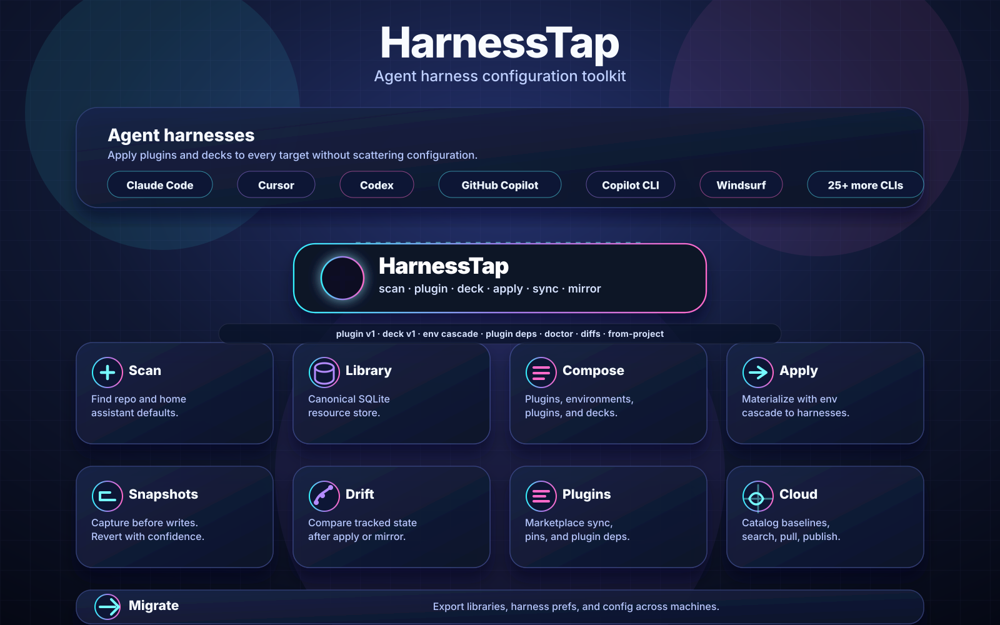
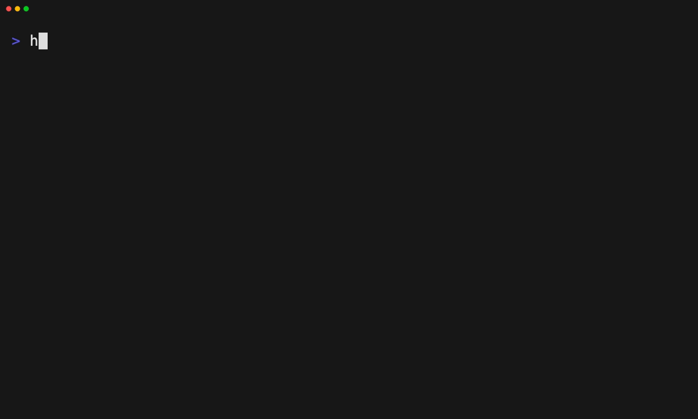
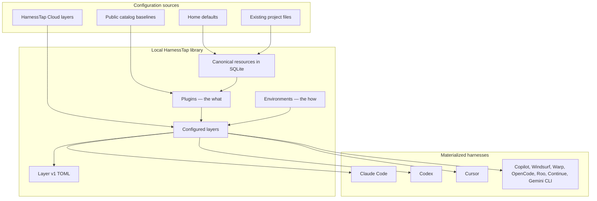
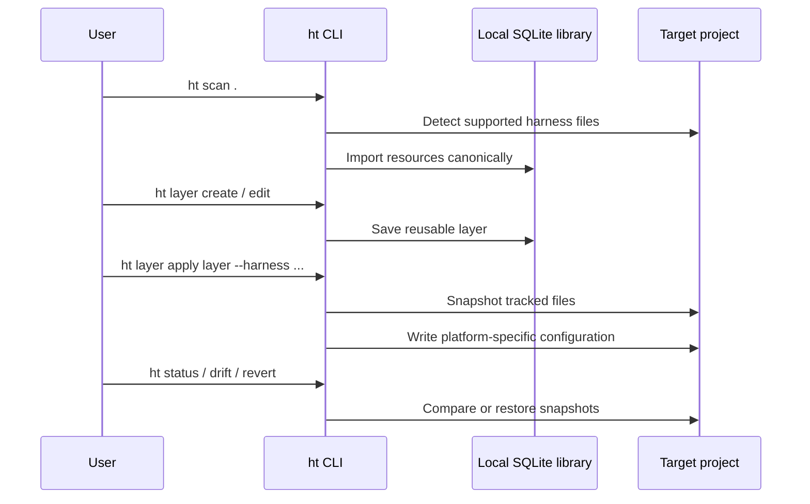
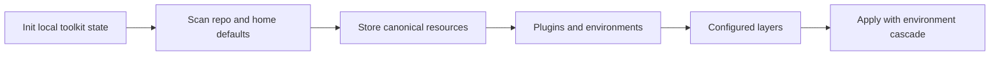

<div align="center">

<h1>
  
</h1>

**Agent harness configuration toolkit** for Claude Code, Codex, Cursor, and other coding CLIs.

Scan existing setup → store canonical resources → compose **plugins** and **layers** → share offline or via catalog → materialize into any supported harness.

<br />

[](https://github.com/harnesstap/harnesstap/actions/workflows/ci.yml)
[](LICENSE)
[](https://nodejs.org)
[](https://bun.sh)
[](https://www.typescriptlang.org)
[](https://github.com/harnesstap/harnesstap)
[](https://hits.sh/github.com/harnesstap/harnesstap/)

<br />

[Quick start](#quick-start) · [Install](#install) · [Demo](#demo) · [Specification](SPEC.md) · [Supported harnesses](docs/supported-harnesses.md) · [CLI reference](docs/cli/command-reference.md) · [Contributing](CONTRIBUTING.md)

<br />



</div>

---

## Table of contents

- [Features](#features)
- [Demo](#demo)
- [Requirements](#requirements)
- [Install](#install)
- [Quick start](#quick-start)
- [Architecture](#architecture)
- [Concept model](#concept-model)
- [Catalog baselines](#catalog-baselines)
- [More layer workflows](#more-layer-workflows)
- [Import and export](#import-and-export)
- [Plugin composition and sync](#plugin-composition-and-sync)
- [Output modes and exit codes](#output-modes-and-exit-codes)
- [Project maintenance and machine transfer](#project-maintenance-and-machine-transfer)
- [Supported harnesses](#supported-harnesses)
- [Where data lives](#where-data-lives)
- [Upgrading from schema v18](#upgrading-from-schema-v18)
- [HarnessTap Cloud](#harnesstap-cloud)
- [Contributing](#contributing)

---

## Features

`harnesstap` keeps assistant configuration in one place while materializing platform-specific files.

| Capability | What it does |
| --- | --- |
| **Scan & import** | Detect Claude Code, Codex, Cursor, GitHub Copilot, Copilot CLI, and related project layouts |
| **Canonical library** | Store imported configuration as resources in local SQLite |
| **Plugins & layers** | Group context-side resources into **layers**; attach host **plugin pins** and **layer** refs; bind **environments** |
| **Multi-harness apply** | Materialize layers to one or more harnesses with environment cascade (home → layer default) |
| **Offline sharing** | Move the full local workspace with `migrate export` / `import`, or share individual layers as TOML bundles |
| **Layer tooling** | Create layers from scanned projects, diff layers, run `layer doctor` before apply |
| **Dependencies & pins** | Record layer dependencies and Claude plugin version pins in portable bundles |
| **Layer exports** | Export or import layers as TOML (`urn:harnesstap:layer:v1`) |
| **Snapshots & drift** | Snapshot tracked projects before apply, detect drift later, revert when needed |
| **Cloud catalog** | Search, add, and publish shared layers through HarnessTap Cloud |
| **Machine transfer** | Export local layer library, harness preferences, and config for another machine |

**Supported targets:** Claude Code · Codex · Cursor · GitHub Copilot · Copilot CLI · Windsurf · Warp · OpenCode · Roo · Continue · Gemini CLI

---

## Demo

Initialise HarnessTap, scan an existing repository, browse catalog layers, apply one, and confirm the final state — all in about a minute.

[](docs/scenarios/vhs/walkthroughs/01-existing-repo-adoption.md)

[Full walkthrough →](docs/scenarios/vhs/walkthroughs/01-existing-repo-adoption.md)

```bash
harnesstap init --main codex --aliases claude-code,cursor
harnesstap scan .                    # detect existing resources
harnesstap resource list                     # review discovered resources
harnesstap layer list --search foundation --remote-only  # browse catalog layers
harnesstap layer apply engineering-foundation \
  --project .                                 # apply a catalog baseline
harnesstap status .                  # confirm the final state
```

---

## Requirements

- **Node.js** 20 or later (to run the built CLI)
- **Bun** 1.3+ (optional; required only for contributing from source)

---

## Install

### Recommended: npx (no global install)

```bash
npx harnesstap@latest init
```

### npm global

```bash
npm install -g harnesstap
ht init
```

<details>
<summary><strong>Bun install</strong> (alternative)</summary>

```bash
bun install -g harnesstap
ht init
```

Or run without a global install:

```bash
bunx harnesstap@latest init
```

</details>

<details>
<summary><strong>Install from source</strong></summary>

```bash
git clone https://github.com/harnesstap/harnesstap.git
cd harnesstap
bun install
bun run build
bun link
ht init
```

`bun link` registers the checkout as the global `harnesstap` and `ht` commands. If your shell cannot find them, add Bun's global bin directory to `PATH`:

```bash
export PATH="$HOME/.bun/bin:$PATH"
```

</details>

---

## Quick start

Apply a public catalog baseline in minutes. `ht` is shorthand for `harnesstap`. For the full command surface and global flags, see [docs/cli/command-reference.md](docs/cli/command-reference.md).

1. **Initialize** local state (creates `~/.harnesstap` and scans supported home harness folders).
   ```bash
   ht init --main codex --aliases claude-code,cursor
   ```

2. **Apply** a catalog layer by bare name (fetches from the public `harnesstap-cloud` catalog when needed).
   ```bash
   ht layer list --search foundation --remote-only
   ht layer apply engineering-foundation
   ```

3. **Inspect** project state and next steps.
   ```bash
   ht status .
   ht help
   ```

When a repository has a git `origin`, `ht layer apply` stores a snapshot before writing files. Restore it later with `ht revert`.

### Follow-up: scan, compose, and publish

After the baseline fits, build and share your own layers:

1. **Scan** the current repository and review imports.
   ```bash
   ht scan .
   ht resource list
   ```

2. **Create** a reusable layer and add resources.
   ```bash
   ht layer create my-setup --description "Shared project assistant setup"
   ht layer edit my-setup --add research-helper --type skill
   ```

3. **Apply**, mirror alias harnesses, or publish to the cloud catalog.
   ```bash
   ht layer apply my-setup --project . --harness claude-code,cursor
   ht mirror .
   ht auth login
   ht layer catalog register acme/default
   ht layer publish my-setup
   ```

4. **Manage** harness preferences after init.
   ```bash
   ht harness status --format json
   ht harness set --main claude-code --aliases cursor,codex
   ```

---

## Architecture





---

## Concept model

HarnessTap separates **context-side** configuration (skills, MCP, hooks, rules — what the model sees) from **environment-side** configuration (secrets, env vars, models — how it runs). A **layer** is the versioned context package; **plugin pins** and **layer** refs are dependencies. Your **workspace** is the single local SQLite library at `~/.harnesstap` — all layers and environments live there.

| Concept | Role |
| --- | --- |
| **Resource** | Atomic instruction, skill, rule, MCP, hook, etc. |
| **Plugin** | Bundle of *what* resources + Claude config + `needs` contract |
| **Environment** | Named *how* values (and secret refs) — prod, staging, personal |
| **Layer** | One or more plugins + optional default environment |
| **Workspace** | Local library of layers, resources, and environments |

**Cascade (last wins):** `home env ◂ layer default env`. Switch the home active environment to change how-values without reloading the same layer stack.

**Offline sharing:** export the whole workspace, individual layers, or resources with `ht migrate export` / `import`. For multiplayer distribution, publish to HarnessTap Cloud with `layer publish` / `pull`.

Full specification: [SPEC.md](SPEC.md).



---

## Catalog baselines

Starter layers such as `engineering-foundation` and `frontend-engineer` live in the **HarnessTap Cloud** public catalog — not inside the npm package. `ht layer apply <name>` resolves bare names against the public catalog (and any orgs or libraries you have connected).

```bash
ht layer list --search foundation --remote-only
ht layer apply engineering-foundation
```

To opt out of anonymous public catalog lookups, set `catalog.publicCatalog: false` in `~/.harnesstap/config.jsonc` or export `HARNESSTAP_PUBLIC_CATALOG=0`.

---

## More layer workflows

Compare, diagnose, or derive plugin bundles beyond the basic create/edit/apply loop:

```bash
ht layer edit team-stack --add layer:shared-baseline --version "^1.2.0"
ht layer doctor team-stack
ht layer diff team-stack ./team-stack.harnesstap.toml
ht layer from-project inferred-stack --project .
```

Layer dependencies are stored with semver constraints and round-trip through bundle export/import. `layer doctor` checks for duplicate resources, empty content, or invalid plugin metadata; `layer diff` compares layer metadata and contents; `layer from-project` scans a repository and turns imported resources into a new layer.

---

## Import and export

**Layer v1** — layers move between machines as TOML files via `ht migrate export --layer` / `ht migrate import`. Default path: `<name>.harnesstap.toml`. For a full workspace handoff, use `ht migrate export` with a `.tar.gz` archive (see [Scenario 28](docs/scenarios/details/28-machine-migration.md)).

```bash
ht migrate export ./my-setup.harnesstap.toml --layer my-setup
ht migrate import ./my-setup.harnesstap.toml
ht migrate export ./team.harnesstap.toml --layer my-setup --embed-plugins
```

---

## Plugin composition and sync

Plugin references are `plugin` resources attached to a layer like any other composition item.

```bash
ht layer edit my-setup --add plugin_pin:formatter@my-marketplace --version "^2.1.0"
ht layer edit my-setup --add plugin_pin:formatter@my-marketplace --sync   # eager sync after add
ht resource sync plugin_pin:formatter@my-marketplace
ht resource show plugin_pin:formatter@my-marketplace
ht layer edit my-setup --remove plugin_pin:formatter@my-marketplace --type plugin_pin
ht migrate export ./team.harnesstap.toml --layer my-setup --embed-plugins
ht layer apply my-setup --project . --strict-plugin-versions
```

On `layer apply`, harnesstap compares layer plugin pins to library `resolved_version` values: it **warns** on mismatch by default; pass `--strict-plugin-versions` to fail (exit code 2), or `--ignore-plugin-versions` to skip validation. Pass `--sync-plugins` to refresh plugin resources before materialize. These strictness flags are mutually exclusive where documented in [SPEC.md](SPEC.md).

Use `ht -V`, `harnesstap -V`, or `--harnesstap-version` for the CLI version. `--version` on `layer edit --add` is the **plugin semver pin or range**, not the global version flag.

Layer export bundles use schema `urn:harnesstap:layer:v1` with one or more `[[layers]]` entries, optional `plugin_pins`, and optional root `embedded_plugins` when plugin trees are inlined. `dependencies` is included when a layer declares versioned dependencies. See [Transport formats](SPEC.md#transport-formats) in SPEC.md.

Refresh policy for marketplace metadata is configured in `~/.harnesstap/config.jsonc`:

```jsonc
{
  "plugins": {
    "refreshMaxAgeHours": 24
  }
}
```

`resource sync` uses cached metadata unless it is stale; pass `--force` to refresh regardless.

---

## Output modes and exit codes

Most reporting commands accept `--format human|json`. Prefer `--format json` for automation and scripting.

HarnessTap intentionally uses non-zero exit codes for actionable findings:

| Exit code | Meaning | Examples |
| --- | --- | --- |
| `0` | Success / no actionable issue | `layer doctor` with no findings, `status --check` with no changes |
| `1` | Actionable finding or user-correctable error | `layer doctor` failures, drift detected, invalid command input |
| `2` | Strict validation failure during apply | `layer apply --strict-plugin-versions` with mismatched plugin pins |

---

## Project maintenance and machine transfer

HarnessTap keeps snapshots of generated project files for tracked repositories, which lets you inspect drift, sync alias harnesses, and move your local setup to another machine.

```bash
ht status . --check
ht mirror . --force-shift-reference claude-code
ht migrate export ./harnesstap-migrate.tar.gz
ht migrate import ./harnesstap-migrate.tar.gz
```

`status --check` compares the current working tree against the latest apply/mirror snapshot. Machine transfer archives export local layer bundles plus global harness preferences and `~/.harnesstap/config.jsonc`; cloud accounts remain in `cloud-accounts.json`.

**Project command preconditions**

- `history` and `status --check` require a git-backed project.
- `layer apply` can write files outside git, but snapshot/history support only works when the target project has a git `origin`.
- `revert` requires a snapshot ID from `history`.
- `harness project set` and `harness project status` require a git-backed project.

---

## Supported harnesses

HarnessTap registers **41 harnesses** — from Claude Code, Codex, and Cursor through Antigravity, Amazon Q, GitHub Copilot, OpenCode, Windsurf, Warp, Gemini CLI, Grok Build, and many `.agents/skills/`-style CLIs. Each harness declares which layer resources (skills, rules, MCP, hooks, …) and environment resources (env vars, model config, permissions) it can scan and materialize, plus default on-disk paths.

Seven harnesses have **native serializers** (`claude-code`, `codex`, `cursor`, `opencode`, `github-copilot`, `copilot-cli`, `gemini-cli`); the rest use a generic path-driven serializer. Plugin install/sync providers exist for **Claude Code** and **Cursor**; plugin-source scan covers `.claude-plugin/`, `.cursor-plugin/`, `.codex-plugin/`, and `.github/plugin/` layouts.

See the full matrix — resource types, skill emission modes, plugin support, and project paths — in **[Supported harnesses](docs/supported-harnesses.md)**.

```bash
ht harness list
ht harness list --supported    # native serializers only
```

---

## Where data lives

Operational state lives in `~/.harnesstap/harnesstap.db` (resources, plugins, environments, layers, tracked projects, snapshots, harness preferences). Optional settings such as plugin refresh cache age live in `~/.harnesstap/config.jsonc`. Home environment fragments may live under `~/.harnesstap/environments/`.

The compiled desktop sidecar (`ht-agent`) writes a per-session loopback bearer token to `~/.harnesstap/agent-token` when it starts. Mutating agent routes require `Authorization: Bearer <token>`.

Build the sidecar binary with `bun run build:sidecar` (output: `dist/sidecar/ht-agent`, intended Tauri `externalBin` name). Engineering debug entrypoints: `ht agent serve` and `ht ui --serve`.

When you run `ht init`, the CLI also checks registered platform default folders in your home directory (e.g. `~/.claude/`, `~/.codex/`) and imports any supported resources it finds.

Override the base directory with `HARNESSTAP_HOME`; cloud accounts live under `<HARNESSTAP_HOME>/cloud-accounts.json` when set.

---

## Upgrading from schema v18

After upgrading the CLI, export your existing database before removing it:

```bash
ht migrate export backup.tar
# remove the old database (see `ht config path`)
ht migrate import backup.tar
```

`migrate export` opens legacy v18 databases read-only so you can export after upgrading the CLI. Other commands require a v19 database.

**Note:** `migrate export` archives layers (as TOML), environments (secret refs only), harness preferences, and config — not tracked projects or snapshots. Back those up separately if you need them.

---

## HarnessTap Cloud

HarnessTap Cloud supports publishing, searching, and installing shared layers. Local cloud accounts default to `~/.harnesstap/cloud-accounts.json`.

1. **Authenticate** and create an account.
   ```bash
   harnesstap auth login [account] [--base-url <url>]
   ```
   Device-code authentication in the browser/terminal. Default account name: `default`. Default base URL: `https://cloud.harnesstap.com`.

2. **Inspect** the authenticated user.
   ```bash
   harnesstap auth status [--account <name>] [--format human|json]
   ```

3. **List organizations** or switch the active organization.
   ```bash
   harnesstap auth orgs [--account <name>] [--switch <slug>]
   ```

4. **Log out** and remove a local account.
   ```bash
   harnesstap auth logout [--account <name>]
   ```

5. **Search** the remote layer catalog.
   ```bash
   harnesstap layer list --search <query> --remote-only [--account <name>] [--format human|json]
   ```

6. **Add** a layer from the cloud.
   ```bash
   harnesstap layer pull <org>/<library>[@version] [--as <name>] [--account <name>]
   ```
   Downloads a layer bundle and imports it locally. Use `--as` to avoid name conflicts.

7. **Publish** a local layer.
   ```bash
   harnesstap layer catalog register <org>/<catalog>
   harnesstap layer publish <layer> [<org>/<catalog>] [--account <name>]
   harnesstap layer publish plan <layer>
   ```
   Publishes to all registered catalogs by default. Pass `org/catalog` or use `layer catalog bindings` to restrict targets.

8. **Apply** an installed layer to a project.
   ```bash
   harnesstap layer apply <layer> --project <path> [--harness <harnesses>]
   ```

Run `harnesstap <command> --help` for full flag and output-format details.

---

## Contributing

Contributions are welcome. See [CONTRIBUTING.md](CONTRIBUTING.md) for development setup, testing, and publishing instructions.
