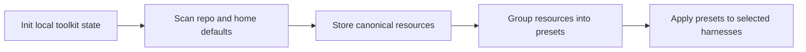

# harnessdeck

`harnessdeck` is an Agent harness configuration toolkit for Claude Code, Codex, Cursor, and other coding CLIs. It scans existing agent setup, stores canonical resources locally, groups them into reusable presets, and materializes those presets back into one or more supported harnesses.

## What you can do with it

`harnessdeck` helps you keep assistant configuration in one place while still materializing platform-specific files.

- Scan existing Claude Code, Codex, Cursor, GitHub Copilot, Copilot CLI, and related project layouts.
- Store imported configuration as canonical resources in SQLite.
- Group resources into reusable presets.
- Apply a preset to one or more target harnesses.
- Create presets from scanned projects, diff presets, and run `preset doctor` before apply.
- Record preset dependencies and Claude plugin version pins in portable preset bundles.
- Export or import presets as JSON bundles.
- Seed and apply built-in starter templates.
- Snapshot tracked projects before apply, detect drift later, and revert when needed.
- Search, install, and publish shared presets through HarnessDeck Cloud.
- Export your local preset library, harness preferences, and config for machine migration.

## Requirements

You need Node 20 or later to run the built CLI.

## Install

You can install `harnessdeck` globally with Bun either from the published npm package or from a local checkout of this repository.

### Install from the npm registry

```bash
bun install -g harnessdeck
hd init
```

```bash
bunx harnessdeck@latest init
```

### Install from a local git checkout

```bash
git clone https://github.com/bqbooster/harnessdeck.git
cd harnessdeck
bun install
bun run build
bun link
hd init
```

`bun link` registers the current checkout as the global `harnessdeck` and `hd` commands. After installation, you can invoke the CLI with either name. If your shell still cannot find them, make sure Bun's global bin directory is on your `PATH`:

```bash
export PATH="$HOME/.bun/bin:$PATH"
```

## Demo

Initialise HarnessDeck, scan an existing repository, browse built-in presets, apply one, and confirm the final state — all in about a minute:
[](docs/scenarios/vhs/walkthroughs/01-existing-repo-adoption.md)

```
harnessdeck init #initialise HarnessDeck in the repository
harnessdeck project scan . #detect existing resources
harnessdeck resource list #review discovered resources
harnessdeck preset list  #browse available presets
harnessdeck project apply nextjs-fullstack --project . --platform codex #apply a preset
harnessdeck project status . #confirm the final state
```

## Quick start

The fastest way to try `harnessdeck` is to initialize the local database, import supported defaults from your home directory, scan an existing repository, turn the imported resources into a reusable preset, and apply that preset back to your preferred harnesses.

Once installed, `hd` is a shorthand alias for the same CLI. Use whichever form you prefer in the examples below.

The visible CLI groups related actions under noun-based commands such as `project`, `preset`, and `harness`. Older top-level verbs and hidden aliases still work for compatibility, but they print deprecation warnings.

For the full grouped command surface, global flags, and compatibility alias map, see [docs/cli/command-reference.md](docs/cli/command-reference.md).



1. Initialize the local database, import any supported home-directory defaults, and optionally choose a default main harness plus aliases.
  ```bash
   hd init
   hd init --main claude-code --aliases cursor,codex
  ```
2. Scan the current repository.
  ```bash
   hd project scan .
  ```
3. List the imported resources.
  ```bash
   hd resource list
  ```
4. Create a preset.
  ```bash
   hd preset create my-setup --description "Shared project assistant setup"
  ```
5. Add imported resources to that preset.
   ```bash
   hd preset attach my-setup research-helper --type skill
   ```
6. Apply the preset to one or more target platforms.
  ```bash
   hd project apply my-setup --project . --platform claude-code,codex,cursor
  ```
   `hd project apply` also accepts multiple preset names, a local `.harnessdeck.json` bundle, or a bundle URL. When you pass multiple preset names, later presets override earlier ones for matching resources and plugin pins.
7. Check the tracked project state.
  ```bash
   hd project status .
   hd project history --project .
  ```
8. Inspect or change harness preferences after init.
  ```bash
   hd harness status --format json
   hd harness set --main claude-code --aliases cursor,codex
  ```

If the repository has a git `origin`, `hd project apply` stores a snapshot before it writes files. You can restore that snapshot later with `hd project revert`.

## Hidden compatibility aliases

HarnessDeck still accepts older top-level verbs for compatibility, but the grouped commands below are the supported public surface:

| Hidden alias | Grouped command |
| --- | --- |
| `hd scan` | `hd project scan` |
| `hd apply` | `hd project apply` |
| `hd history` | `hd project history` |
| `hd revert` | `hd project revert` |
| `hd status` | `hd project status` |
| `hd export` | `hd preset export` |
| `hd import` | `hd preset import` |
| `hd platforms` | `hd harness list` |

Use `hd --help --show-hidden` if you need to inspect those aliases directly.

## Built-in presets

`harnessdeck` ships with starter presets that are seeded during `hd init`. The same command also scans supported default folders in your home directory, imports any resources it finds, and prints the discovered locations. Use these commands to inspect and apply the built-in presets.

```bash
hd preset list
hd project apply nextjs-fullstack --project . --platform codex
```

The repository currently includes `nextjs-fullstack` and `python-fastapi`.

## More preset workflows

Use these commands when you want to compare, diagnose, or derive presets beyond the basic create/add/apply loop.

```bash
hd preset attach team-stack shared-baseline --type preset-dependency --version "^1.2.0"
hd preset doctor team-stack
hd preset diff team-stack ./team-stack.harnessdeck.json
hd preset from-project inferred-stack --project .
```

Preset dependencies are stored with semver constraints and round-trip through bundle export/import. `preset doctor` checks for problems such as duplicate resources, empty content, or invalid plugin metadata, `preset diff` compares preset metadata and contents, and `preset from-project` scans a repository and turns the imported resources into a new preset.

## Import and export

Presets can move between machines as JSON bundle files. Export strips local-only database fields and keeps the portable preset definition plus its resources.

Preset bundles may also include Claude Code marketplace configuration under a top-level `claude` key. When you apply such a preset to a project with `claude-code`, harnessdeck merges `extraKnownMarketplaces` and `enabledPlugins` into `.claude/settings.json`:

```json
{
  "$schema": "urn:harnessdeck:bundle:v1",
  "version": 1,
  "preset": {
    "name": "team-stack",
    "version": "1.0.0",
    "description": "...",
    "tags": []
  },
  "claude": {
    "marketplaces": {
      "team-plugins": {
        "source": { "source": "github", "repo": "org/claude-plugins" },
        "autoUpdate": true
      }
    },
    "plugins": [
      { "id": "formatter@team-plugins", "enabled": true, "version": "1.2.0" }
    ]
  },
  "resources": [],
  "plugins": [],
  "embedded_plugins": []
}
```

```bash
hd preset export my-setup --file ./my-setup.harnessdeck.json
hd preset import ./my-setup.harnessdeck.json
```

## Plugin inventory

For Claude Code, **committed** plugins are those declared in the project’s `.claude/settings.json` (what you commit). **Effective** plugins are the merged result of user, project, and local settings—the configuration Claude actually loads.

```bash
hd plugin list
hd plugin show formatter@my-marketplace
hd plugin installed
hd preset attach my-setup formatter@my-marketplace --type plugin --version "2.1.0"
hd preset detach my-setup formatter@my-marketplace --type plugin
hd preset export my-setup --file ./team.harnessdeck.json --embed-plugins
hd project apply my-setup --project . --strict-plugin-versions
```

On `project apply`, harnessdeck compares preset plugin pins to installed versions: it **warns** on mismatch by default; pass `**--strict-plugin-versions`** to fail the command (exit code 2), or `**--ignore-plugin-versions`** to skip validation. These flags are mutually exclusive.

Use `**hd -V**`, `**harnessdeck -V**`, or `**--harnessdeck-version**` for the harnessdeck CLI version. The `**--version**` on `preset attach ... --type plugin` is the **plugin semver pin or range**, not the global version flag.

Preset export bundles use schema `**urn:harnessdeck:bundle:v1`** and always include `plugins` and `embedded_plugins` arrays (empty when unused). `dependencies` is included when a preset declares versioned dependencies. See [bundle format](docs/superpowers/specs/2026-05-19-claude-plugin-inventory-design.md#bundle-format) in the design spec.

## Plugin check and update

Implementation notes and rollout for check/update live in [docs/superpowers/plans/2026-05-19-plugin-check-update.md](docs/superpowers/plans/2026-05-19-plugin-check-update.md).

Check and update plugins for harnesses that expose a discoverable plugin layout (Claude Code and Cursor today; more harnesses over time). Use `plugin installed` for the provider scan; use `plugin list` / `plugin show` for Claude **inventory** (committed vs effective) as described above.

```bash
hd plugin installed
hd plugin check --format json
hd plugin update --all
hd plugin refresh
```

Configure how often remote metadata is refreshed in `~/.harnessdeck/config.json`:

```json
{
  "plugins": {
    "refreshMaxAgeHours": 24
  }
}
```

Use `--refresh` on `plugin check` to force a marketplace/git refresh. Without it, harnessdeck uses cached metadata unless it is older than `refreshMaxAgeHours`.

## Output modes and exit codes

Most reporting commands accept `--format human|json`. Prefer `--format json` for automation and scripting.

HarnessDeck intentionally uses non-zero exit codes for some actionable findings:

| Exit code | Meaning | Examples |
| --- | --- | --- |
| `0` | Success / no actionable issue | `plugin check` with everything current |
| `1` | Actionable finding or user-correctable error | outdated plugins, drift detected, invalid command input |
| `2` | Strict validation failure during apply | `project apply --strict-plugin-versions` with mismatched plugin pins |

## Project maintenance and migration

HarnessDeck keeps snapshots of generated project files for tracked repositories, which lets you inspect drift, sync alias harnesses, and move your local setup to another machine.

```bash
hd project drift --project .
hd project sync . --force-shift-reference claude-code
hd migrate export ./harnessdeck-migrate.tar.gz
hd migrate import ./harnessdeck-migrate.tar.gz
```

`project drift` compares the current working tree against the latest apply/sync snapshot. Migration archives export local preset bundles plus global harness preferences and `~/.harnessdeck/config.json`; cloud profiles remain in `cloud-profiles.json`.

Project command preconditions:

- `project history` and `project drift` require a git-backed project.
- `project apply` can write files outside git, but snapshot/history support only works when the target project has a git `origin`.
- `project revert` requires a snapshot ID from `project history`.
- `harness project set` and `harness project status` require a git-backed project.

## Supported harnesses

`harnessdeck` has dedicated serializers for Claude Code, Codex, and Cursor. It also registers a broader set of harnesses through a generic path-driven serializer, including GitHub Copilot, Copilot CLI, Windsurf, Warp, OpenCode, Roo, Continue, Gemini CLI, and others.

Run this command to see the current registry in your installed version.

```bash
hd harness list
```

## Where data lives

`harnessdeck` stores its operational state in `~/.harnessdeck/harnessdeck.db`. The database holds resources, presets, tracked projects, snapshots, and harness preference state. Optional settings (such as plugin refresh cache age) live in `~/.harnessdeck/config.json`.

When you run `hd init`, the CLI also checks registered platform default folders in your home directory, such as `~/.claude/` and `~/.codex/`, and imports any supported resources it finds.

## HarnessDeck Cloud

HarnessDeck can interact with the Harness cloud for publishing, searching, and installing shared presets. Local cloud profiles are stored in `~/.harnessdeck/cloud-profiles.json` by default. You can override the base HarnessDeck directory by setting the `HARNESSDECK_HOME` environment variable; profiles will live under `<HARNESSDECK_HOME>/cloud-profiles.json` when set.

Common workflows

1. Authenticate and create a profile.

   ```bash
   harnessdeck cloud login [profile] [--base-url <url>]
   ```

   This performs device-code authentication in the browser/terminal and saves a named profile. If no name is provided the profile is saved as `default` and becomes the default profile. The default base URL is `https://harnessdeck.kayrnt.fr`.

2. Inspect the authenticated user.

   ```bash
   harnessdeck cloud whoami [--profile <name>] [--format human|json]
   ```

3. List organizations or switch the active organization.

   ```bash
   harnessdeck cloud orgs [--profile <name>] [--switch <slug>]
   ```

4. Log out and remove a local profile.

   ```bash
   harnessdeck cloud logout [--profile <name>]
   ```

5. Search the remote preset catalog.

   ```bash
   harnessdeck preset search <query> [--profile <name>] [--format human|json]
   ```

6. Install a preset from the cloud.

   ```bash
   harnessdeck preset install <org>/<library>[@version] [--as <name>] [--profile <name>]
   ```

   This downloads a preset bundle from the cloud and imports it into the local preset database. Use `--as` to avoid name conflicts with existing presets.

7. Publish a local preset to the cloud.

   ```bash
   harnessdeck preset publish <preset> [--profile <name>]
   ```

8. Apply an installed preset to a project.

   ```bash
   harnessdeck project apply <preset> --project <path> [--platform <harnesses>]
   ```

Notes

- The documentation above reflects the commands implemented in this branch. Run `harnessdeck <command> --help` for full details on flags and output formats.
- Cloud profiles are JSON files stored under the HarnessDeck directory (default `~/.harnessdeck/cloud-profiles.json`). Setting `HARNESSDECK_HOME` changes the directory where these files are written.

## Contributing

If you'd like to contribute, please see the [CONTRIBUTING.md](CONTRIBUTING.md) file for development and publishing instructions.
