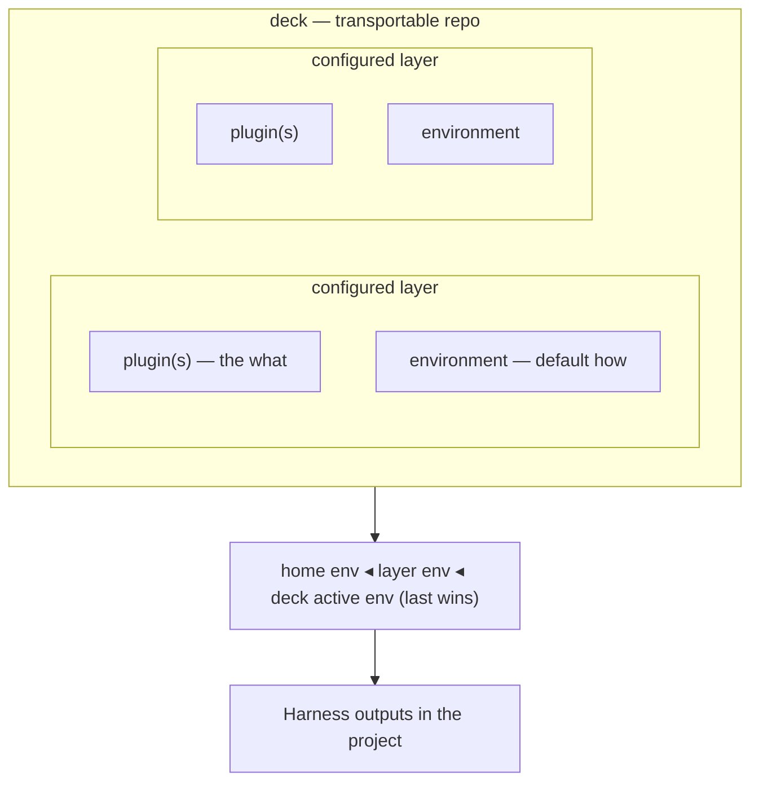

# Harnessdeck CLI specification

This document describes the intended behavior of `harnessdeck`.

## Product summary

`harnessdeck` is an Agent harness configuration toolkit for Claude Code, Codex, Cursor, and other coding CLIs. It collects agent configuration into canonical local resources, groups **what** resources into **plugins**, binds plugins and default **environments** into **configured layers**, curates those layers into portable **decks**, and syncs the resolved setup into project directories across supported agent harnesses.

An **agent harness** is the complete infrastructure that wraps around an LLM and makes it a functional agent. In practice, that includes things like skills, MCP servers, hooks, plugins, rules, agent manifests, commands, and harness-specific configuration files.

The product currently supports these main workflows:

- Initialize local state, seed built-in layers, discover supported home-directory defaults, and choose global harness preferences.
- Scan an existing repository and import agent configuration into a local database.
- Group imported resources into versioned layers.
- Diff, doctor, export, import, publish, search, install, or derive layers from a project scan.
- Record layer dependencies and Claude plugin version pins alongside layer resources.
- Apply one or more layers, a local bundle file, or a bundle URL to a project.
- Sync alias harness outputs, inspect drift from the latest snapshot, and revert a tracked project to an earlier snapshot.
- Inspect plugin inventory and run supported plugin lifecycle commands.
- Export or import a machine-migration archive of local plugins, configured layers, harness preferences, and config.
- Resolve **environment** values with a home → layer default → deck-active cascade on `project apply`.

Design reference: [docs/superpowers/specs/2026-06-03-deck-model-and-transportable-format-design.md](docs/superpowers/specs/2026-06-03-deck-model-and-transportable-format-design.md).

## Core concepts



The CLI uses a small set of concepts consistently across commands.

- `resource`: a single canonical item stored in SQLite with optional **namespace** and **origin** metadata. Plugin-side types: instruction, skill, rule, MCP server, hook, agent, command. Environment-side types: env var, model config, **permission** (permissions are *how* values, not plugin-side resources).
- `plugin`: an ordered bundle of plugin-side resources, optional Claude marketplace/plugin config, native plugin pins, and a `needs` config contract. This is what the earlier `layer` noun meant before the deck model (see [Migration](#migration-from-the-layer-only-model)).
- `environment`: a named, swappable bundle of how-values (env vars, model config, permissions) plus secret references. Non-secret values can travel in a deck; secrets are referenced, not embedded.
- `configured layer` (often called **layer** in user-facing copy): a binding of one or more plugins with an optional default environment — a configured capability such as "backend on-call."
- `deck`: a curated bundle of configured layers and environments, importable as a git repo and described by `.harnessdeck/deck.json`.
- `agent harness`: a supported target environment such as Claude Code, Codex, Cursor, or another tool-specific agent wrapper.
- `main harness`: the project's canonical harness reference. Imports, layer application, and sync planning normalize through this harness first.
- `alias harness`: an additional supported harness that mirrors the main harness. Alias harnesses should use symlinks when the file layout allows it, and generated copies otherwise.
- `project`: a git-backed repository tracked by normalized git origin.
- `snapshot`: a saved copy of files generated during layer application or project sync.

### Naming map (avoid three different "plugins")

| Concept | CLI / docs today | SQLite (after deck migrations) |
| --- | --- | --- |
| Design **plugin** (resource bundle + Claude config) | `hd layer …` (deprecated alias) | `plugins`, `plugin_resources`, … |
| **Native plugin pin** on a design plugin | `layer attach --type plugin` | `plugin_native_pins` |
| **Harness plugin lifecycle** (install/update inventory) | `hd plugin …` | `project_plugin_state`, `src/plugins/*` |
| **Configured layer** | `project apply <layer>` (target) | `configured_layers`, `configured_layer_plugins` |
| **Deck** | `hd deck …` (companion CLI spec; services exist) | `decks`, `deck_configured_layers` |

### Resource classification

| Plugin (*what*) | Environment (*how*) |
| --- | --- |
| `instruction`, `skill`, `rule`, `mcp_server`, `hook`, `agent`, `command` | `env_var`, `model_config`, `permission` |

An `mcp_server` **definition** lives on the plugin; tokens and URLs are contract keys (`needs`) filled by an environment.

### Settings umbrella (UX)

**Settings** is the user-facing umbrella for runtime configuration — there is no separate `settings` table:

```
settings ≡ environments (env_var, model_config, permission)
         + environment_secret_refs
         + harness_preferences / project_harnesses
         + ~/.harnessdeck/config.jsonc
```

Use `hd environment …` for named how-bundles today.

### Resource identity and selectors

Resources are uniquely keyed by `(type, name, namespace)` where `namespace=''` means unnamespaced.

Selector grammar:

```
selector ::= [ type ":" ] name [ "@" namespace ]
```

Examples: `brainstorming`, `skill:brainstorming@cursor-team-kit`, `01J…` (ULID id).

- **Display** commands (`resource show`, `resource delete`): bare names prefer the unnamespaced row when present; otherwise list ambiguous matches.
- **Compose** commands (`layer attach`, merge, apply): require `@namespace` (or a ULID) when more than one namespace exists for the same `type:name`.

Imported bodies are content-addressed under `~/.harnessdeck/blobs/sha256/…` with `content_hash` stored on the row.

### Environment cascade

Composition resolves by ordered override (last wins):

```
home environment  ◂  configured-layer default environment  ◂  deck active environment
```

On `project apply`, HarnessDeck merges environment fragments into plugin-side serialization so env vars and model config override matching `type:name` resources. Home environments may be stored under `~/.harnessdeck/environments/<name>.json` (JSONC).

Flagship workflow (companion CLI): `hd deck use staging` — same plugins and layers loaded; only the active environment and materialized how-values change.

### Hybrid deck repo layout

A deck ships as a git repo that is simultaneously a valid Claude **marketplace** (installable without HarnessDeck) and a carrier for the canonical bundle:

```
my-deck/
├─ .claude-plugin/marketplace.json
├─ <plugin-name>/.claude-plugin/plugin.json   # + harnessdeck.needs
├─ AGENTS.md · .cursor/rules/ · …             # generated native files
└─ .harnessdeck/
   ├─ deck.json                                # urn:harnessdeck:deck:v1
   └─ environments/<name>.json                 # non-secret values only
```

`.harnessdeck/deck.json` is the lossless source; marketplace and native files are **generated** and checked by deck doctor. See [Transport formats](#transport-formats).

### Progressive enhancement

| Consumer | What they get |
| --- | --- |
| Without HarnessDeck | `claude plugin install` and direct reads of `AGENTS.md` / `.cursor/rules/` |
| With HarnessDeck | Environment swap, cascade, cross-harness materialization, drift detection |

## Migration from the layer-only model

The codebase already renamed `preset → layer`. The deck model adds a second shift:

| Before | After |
| --- | --- |
| `layer` = resource bundle + `claude` config | **`plugin`** |
| env/model values only as loose resources | **`environment`** (named, swappable) |
| *(none)* | **`configured layer`** = plugin(s) + optional default environment |
| `urn:harnessdeck:bundle:v1` single-layer export | **`deck`** repo + `deck.json`; bundle v1 **still imports** via adapter |

**CLI:** `hd layer` remains as a **deprecated alias** for design-plugin operations (`create`, `export`, `import`, …) for one release. New noun groups (`hd plugin` for component bundles when the companion CLI lands, `hd environment`, `hd layer` for configured layers, `hd deck`) are specified in a companion CLI spec. **`hd plugin`** today still means Claude plugin **lifecycle** (installed/check/update) — do not conflate with design plugins.

**Bundles:** `hd layer export` / `import` and `project apply` on a `.harnessdeck.json` file continue to use `urn:harnessdeck:bundle:v1`. Importers treat a v1 bundle as one design plugin plus an implicit single-plugin configured layer.

## Command surface

The visible CLI groups commands by noun. Hidden top-level aliases such as `harnessdeck apply` or `harnessdeck export` still exist for compatibility, but the current surface is the grouped form below.

### Top-level commands

| Command | Current behavior |
| --- | --- |
| `harnessdeck init` | Creates `~/.harnessdeck/harnessdeck.db`, initializes the schema, seeds built-in plugins (via `builtin-layers/` JSON), scans supported home-directory defaults, and optionally records global main/alias harness preferences. |
| `harnessdeck layer ...` | **Deprecated alias** for design-**plugin** CRUD, bundle export/import, catalog, diff, and doctor. Prefer future `hd plugin` / `hd layer` split per companion CLI spec. |
| `harnessdeck deck ...` | *(Planned — companion CLI spec.)* Deck init, import/export, active environment, materialize, and doctor. Services exist; commands not wired yet (see [Deck commands](#deck-commands-planned)). |
| `harnessdeck migrate ...` | Exports or imports a machine-migration archive containing layer bundles plus local HarnessDeck preferences and config. |
| `harnessdeck resource ...` | Lists, shows, or deletes canonical resources stored in SQLite. |
| `harnessdeck project ...` | Scans projects, applies layers, syncs alias harnesses, inspects drift, lists snapshot history, reverts snapshots, and shows project status. |
| `harnessdeck harness list` | Lists registered harness targets. |
| `harnessdeck harness ...` | Manages global and project-scoped main/alias harness preferences. |
| `harnessdeck plugin ...` | Shows Claude plugin **lifecycle** inventory and runs installed/check/update/refresh. Not the design-plugin bundle noun. |
| `harnessdeck cloud ...` | Authenticates with Harness cloud and manages local cloud profiles. |

### Deck commands (planned)

These commands are defined for the companion CLI spec. Implementations call `deck-materializer` and `deck-doctor` services when wired:

| Command | Intended behavior |
| --- | --- |
| `hd deck init` | Scaffold a deck repo with `.harnessdeck/deck.json` and starter layout. |
| `hd deck import <path>` | Load `deck.json` into the local library (plugins, environments, configured layers, deck record). |
| `hd deck export` | Write or refresh `.harnessdeck/deck.json` from the local deck entity. |
| `hd deck use <environment>` | Set the deck active environment and re-materialize how-values (cascade payoff). |
| `hd deck materialize [path]` | Generate `.claude-plugin/`, per-plugin manifests, native harness files, and environment files from canonical `deck.json`. |
| `hd deck doctor [path]` | Compare generated marketplace/native files to a fresh materialization of `deck.json`; report drift without printing secrets. |

Until the CLI group ships, use the library APIs (`setDeckActiveEnvironment`, environment cascade on `project apply`, and future materializer/doctor modules) directly or via tests.

### `layer` subcommands (design plugins — deprecated noun)

| Command | Current behavior |
| --- | --- |
| `harnessdeck layer create` | Creates a **design plugin** with optional description and tags. |
| `harnessdeck layer list` | Lists locally stored design plugins. |
| `harnessdeck layer show` | Shows plugin metadata, resources, dependencies, and native plugin pins. |
| `harnessdeck layer attach <layer> <selector>` | Adds a typed attachment to a layer. Use `--type skill` or another resource type for canonical resources, `--type plugin --version <range>` for Claude plugin pins, and `--type dependency --version <range>` for layer dependencies. |
| `harnessdeck layer detach <layer> <selector>` | Removes a typed attachment from a layer. Use `--type` to distinguish resources, plugin pins, and dependency metadata. |
| `harnessdeck layer delete` | Deletes a layer by selector. |
| `harnessdeck layer export` | Writes a portable JSON bundle for one design plugin (`urn:harnessdeck:bundle:v1`), with optional embedded Claude plugin trees. |
| `harnessdeck layer import` | Imports a bundle v1 file into the local database (plugin + implicit configured layer). |
| `harnessdeck layer search` | Searches the remote layer catalog through the configured cloud profile. |
| `harnessdeck layer add [selector]` | Downloads a remote layer bundle and imports it into the local database. Accepts the canonical `org/library[@version]` selector, and on TTY launches interactive remote search when no selector is provided. |
| `harnessdeck layer publish` | Publishes a local layer to the remote catalog. |
| `harnessdeck layer diff` | Compares two local layers, or a layer and a bundle file, across metadata, resources, dependencies, and plugin pins. |
| `harnessdeck layer doctor` | Diagnoses a layer for duplicate resources, empty content, malformed plugin metadata, and related issues. |
| `harnessdeck layer from-project` | Scans a project and creates a layer from the imported resources. |

### `resource` subcommands

| Command | Current behavior |
| --- | --- |
| `harnessdeck resource list` | Lists canonical resources; shows `name@namespace` when namespace is non-empty. |
| `harnessdeck resource show` | Prints the full stored resource (supports selector grammar). |
| `harnessdeck resource sync [selector]` | Refreshes `marketplace_link` rows from installed plugin trees. |
| `harnessdeck resource delete` | Deletes a resource by selector or ID. |

### `project` subcommands

| Command | Current behavior |
| --- | --- |
| `harnessdeck project scan [path]` | Detects supported harnesses in a project, imports discovered resources via hash-aware upsert (`origin_kind=local_snapshot`), prompts on TTY when content differs, and supports `--overwrite`, `--skip-existing`, and `--namespace`. Persists Claude plugin inventory when possible; registers the project when a git origin exists. |
| `harnessdeck project apply <layers...>` | Applies one or more **configured layer** selectors (or legacy plugin/bundle selectors during deprecation), a local bundle file, or a bundle URL; resolves environment cascade; serializes files for each selected/detected platform; snapshots tracked projects before writing. |
| `harnessdeck project drift` | Compares the current project files against the latest apply/sync snapshot. |
| `harnessdeck project sync [path]` | Re-materializes alias harness outputs from the on-disk main harness reference, using symlinks when possible and copies otherwise. |
| `harnessdeck project history` | Lists stored snapshots for a tracked project. |
| `harnessdeck project revert [snapshot-id]` | Restores files captured in a saved snapshot. |
| `harnessdeck project status [path]` | Shows detected harnesses, tracked layers, snapshots, and configured harness preferences for a project. |

### `harness` subcommands

| Command | Current behavior |
| --- | --- |
| `harnessdeck harness set` | Sets global main/alias harness preferences, either from flags or an interactive prompt. |
| `harnessdeck harness status` | Shows the current global harness preference record. |
| `harnessdeck harness project set` | Sets project-scoped main/alias harness preferences and materialization strategy. |
| `harnessdeck harness project status` | Shows the project-scoped harness preference record. |

### `plugin` subcommands

| Command | Current behavior |
| --- | --- |
| `harnessdeck plugin list [path]` | Lists Claude Code plugin inventory: committed project plugins separately from the merged effective plugin set. |
| `harnessdeck plugin show <ref> [path]` | Shows one plugin ref, including effective install details and the settings scopes that declare it. |
| `harnessdeck plugin installed [path]` | Lists plugins as reported by lifecycle providers. |
| `harnessdeck plugin check [path]` | Reports outdated plugins, refreshing remote metadata when the cache is stale or `--refresh` is set. |
| `harnessdeck plugin update [ref]` | Updates one or more plugins via the provider-specific lifecycle tooling. |
| `harnessdeck plugin refresh` | Forces refresh of plugin marketplace/git metadata. |

### `cloud` subcommands

| Command | Current behavior |
| --- | --- |
| `harnessdeck cloud login [profile]` | Performs device authentication and saves a named local cloud profile. |
| `harnessdeck cloud whoami` | Shows information about the authenticated user/profile. |
| `harnessdeck cloud orgs` | Lists organizations and can switch the active organization for a profile. |
| `harnessdeck cloud logout` | Removes a local cloud profile. |

### `migrate` subcommands

| Command | Current behavior |
| --- | --- |
| `harnessdeck migrate export <file>` | Exports local layers as bundle files together with global harness preferences and config. |
| `harnessdeck migrate import <file>` | Imports a migration archive produced by `migrate export`. |

**Plugin check/update** behavior and rollout are documented in [docs/superpowers/plans/2026-05-19-plugin-check-update.md](docs/superpowers/plans/2026-05-19-plugin-check-update.md). Inventory and bundle format are specified in [docs/superpowers/specs/2026-05-19-claude-plugin-inventory-design.md](docs/superpowers/specs/2026-05-19-claude-plugin-inventory-design.md).

## Initialization and harness selection

`harnessdeck init` is the first-run configuration flow and establishes the default HarnessDeck home directory state for the local installation.

The init flow works in this order:

1. Initialize the local database.
2. Seed the built-in starter layers.
3. Discover supported harness configuration already present in the user's home directory and import what it finds.
4. Choose the **main harness** for future imports, layer application, and sync operations.
5. Choose any additional supported harnesses.
6. Mark those additional harnesses as **alias harnesses** and prefer symlinked materialization whenever the file layout and filesystem support it.

The CLI should allow the main harness to be selected even if that harness was not the one first discovered on disk. The important invariant is that every later sync operation has a single reference harness and a defined set of secondary outputs.

After init, users can update the global record with `harnessdeck harness set` or add project-specific overrides with `harnessdeck harness project set`. Both surfaces support interactive prompting as well as explicit flags.

## Wizard mode

Several noun-grouped commands support wizard mode for interactive use, including `layer add`, `layer show`, `layer delete`, `layer from-project`, `project apply`, and `resource delete`.

Wizard mode triggers when all of these are true:

1. The process is attached to a TTY.
2. CI is not enabled.
3. `HARNESSDECK_NO_INTERACTIVE` is not set to `1`.
4. `--no-interactive` is not present.
5. The command is not using `--format json`.
6. The command was invoked with `--interactive`, or required positional input is missing.

When those conditions are not met, the CLI stays in explicit flag-and-argument mode.

## Storage and state

`harnessdeck` stores persistent operational state in SQLite.

### Database location

The database lives at `~/.harnessdeck/harnessdeck.db`. The CLI creates the directory on demand and opens the database through `better-sqlite3` with WAL mode and foreign keys enabled.

Optional user settings live at `~/.harnessdeck/config.json`:

```json
{
  "plugins": {
    "refreshMaxAgeHours": 24
  }
}
```

Plugin metadata refresh timestamps are stored in `~/.harnessdeck/plugin-refresh-cache.json`. By default, `plugin check` compares local state only; sources older than `refreshMaxAgeHours` are refreshed automatically, and `--refresh` forces a refresh.

Named Harness cloud profiles are stored outside SQLite in `~/.harnessdeck/cloud-profiles.json`.

### Schema

The schema should include these logical tables:

- `resources`: canonical configuration items.
- `plugins`: design-time plugin bundles (formerly `layers`).
- `plugin_resources`, `plugin_dependencies`, `plugin_native_pins`: plugin composition and Claude pin metadata.
- `environments`, `environment_resources`, `environment_secret_refs`: named how-value bundles and secret references.
- `configured_layers`, `configured_layer_plugins`: configured capabilities (plugin binding + optional default environment).
- `decks`, `deck_configured_layers`: deck metadata, root path, and layer membership.
- `projects`: tracked repositories keyed by normalized git origin.
- `project_configured_layers`: which configured layers have been applied to which projects.
- `harness_preferences`: the global main/alias harness record.
- `project_harnesses`: the main harness, alias harnesses, and materialization strategy for each tracked project.
- `project_plugin_state`: persisted committed/effective Claude plugin inventory per tracked project.
- `snapshots`: saved generated output captured before sync writes files.
- `schema_version`: migration tracking (current version includes migrations 8–12 for the deck model).

### Project tracking

Project tracking is git-oriented. During `project scan`, `project apply`, and `project sync`, `harnessdeck` reads the repository's `origin` remote, normalizes it, and uses that value as the project identity. The last known local path is stored for convenience, but the git origin is the durable key.

### Snapshot behavior

Snapshots are created during `harnessdeck project apply` and `harnessdeck project sync` when the target directory has a git origin. A snapshot stores the generated file map for the main harness and every alias harness that was materialized for that sync. `harnessdeck project revert` restores those stored files directly to the project path. `harnessdeck project drift` compares the latest stored snapshot against the current on-disk files.

## Canonical model

The canonical model is broader than any single harness format, but it remains small and deterministic.

### Resource types

`harnessdeck` supports these resource types:

- `instruction`
- `skill`
- `rule`
- `mcp_server`
- `permission`
- `hook`
- `agent`
- `command`
- `env_var`
- `model_config`

Metadata is stored as JSON and varies by resource type.

### Plugin model (design-time component bundle)

A plugin has a unique `(name, version)`, description, tag list, optional Claude marketplace/plugin config, ordered plugin-side resources, optional native plugin pins, optional dependency metadata, and optional `needs` config contract keys. Resource order is preserved during serialization.

CLI selectors on the deprecated `layer` noun refer to a plugin by ULID, bare name (highest version wins), or `name@constraint`.

### Environment model

An environment has a unique `name`, description, ordered environment-side resources, and optional `environment_secret_refs` (`keychain`, `env`, or `file`). Secret values are not stored in the deck transport format.

### Configured layer model

A configured layer has `(name, version)`, description, an ordered list of plugin IDs, and an optional `default_environment_id`. This is the unit `project apply` targets when using configured-layer selectors. Multiple plugins merge their what-resources; the default environment contributes how-resources at lower precedence than the cascade.

### Deck model

A deck record has a `name`, optional `root_path` to a materialized repo, optional `active_environment_id`, and ordered configured-layer membership. The on-disk source of truth is `.harnessdeck/deck.json` (`urn:harnessdeck:deck:v1`).

`project apply` serializes merged plugin resources plus cascade-resolved environment values into the requested or detected platforms; alias harnesses remain derived outputs.

## Agent harness model

Harness support is split between a registry and serializers. The registry declares capability flags and default project and global paths. Serializers implement scan, canonicalization, aliasing rules, and write behavior.

### Native serializers

`harnessdeck` has dedicated serializers for these harnesses:

- `claude-code`
- `codex`
- `cursor`

These serializers read and write harness-specific files such as `CLAUDE.md`, `.claude/skills/`, `.cursor/rules/`, `AGENTS.md`, `.codex/config.toml`, and related directories.

### Generic serializer

All other registered harnesses may use the generic serializer. It relies on the registry's declared paths to scan and materialize instruction and skill layouts rather than implementing a fully native parser for each harness.

### Registered harnesses

The registry currently contains 31 harness IDs:

- `claude-code`
- `codex`
- `cursor`
- `warp`
- `opencode`
- `github-copilot`
- `copilot-cli`
- `windsurf`
- `amp`
- `cline`
- `continue`
- `goose`
- `roo`
- `gemini-cli`
- `kilo`
- `augment`
- `firebender`
- `trae`
- `junie`
- `zencoder`
- `openhands`
- `deepagents`
- `qwen-code`
- `crush`
- `droid`
- `codebuddy`
- `mux`
- `kode`
- `command-code`
- `cortex`
- `neovate`

`harnessdeck harness list` is the executable source of truth for this list. The hidden `platforms` alias remains for compatibility, but `harness list` is the visible command surface. `harnessdeck harness status` and `harnessdeck harness project status` are the source of truth for the user's configured main and alias harness selection.

## Scan, apply, import, and sync behavior

The CLI favors deterministic file I/O over merge-heavy workflows.

### Scan

`harnessdeck project scan` detects harnesses by checking whether any declared project path exists in the target directory. It then asks the relevant serializer to read resources. The persistence layer deduplicates resources by `type:name` within a single scan run before inserting them.

When one supported harness already exists in a project, that harness becomes the default main harness for the project. This preserves the existing project as the initial source of truth instead of forcing an immediate conversion.

### Apply

`harnessdeck project apply` accepts one or more configured-layer selectors (or deprecated plugin/bundle selectors), a local bundle file, or a bundle URL. When multiple layers are provided, later layers override earlier ones for matching `type:name` resources, Claude config entries, and plugin refs. Environment cascade merges home, per-layer defaults, and deck-active fragments before serialization.

The command serializes resources for the requested or detected platforms and, when the target has a git origin, updates tracked project metadata and stores a snapshot so later drift/revert/sync operations have a reference point.

If no `--platform` list is passed, `project apply` uses platform detection from the target directory. If no platforms can be detected, the command warns and does not write files.

### Project sync

`harnessdeck project sync` materializes the main harness and every configured alias harness for the project.

The sync rules are:

1. Use the project's main harness as the single reference representation.
2. Generate or refresh all configured alias harness outputs from that reference.
3. Use symlinks for alias harnesses when the target file layout is compatible and the filesystem supports symlinks.
4. Fall back to generated copies when symlinks are not possible.
5. Snapshot all generated files before overwriting them.

`harnessdeck project sync` also supports an option to force shifting the project's reference harness from the currently detected existing harness to the main harness configured by the user. This is the escape hatch for teams that start from one harness but want the project to converge on another long-term reference.

### Project drift

`harnessdeck project drift` loads the latest snapshot for a tracked project and reports generated files that were added, modified, or deleted relative to that snapshot.

### Transport formats

#### Bundle v1 (supported; legacy transport)

Layer export and import use a JSON bundle format with schema identifier `urn:harnessdeck:bundle:v1` and bundle version `1`. Each bundle contains exactly one **plugin** definition (still labeled `layer` in JSON), a flat list of resources, native plugin pins (`plugins[]`), optional inlined plugin trees (`embedded_plugins[]`), and optional dependency metadata (`dependencies[]`). Bundles may include a top-level `claude` object. Older hand-written bundles without `plugins`, `embedded_plugins`, or `dependencies` import as empty arrays.

Internal database IDs, timestamps, and `source` fields are not exported. Import creates a design plugin, an implicit single-plugin configured layer, and associated resources.

#### Deck v1 (canonical repo format)

`urn:harnessdeck:deck:v1` describes a deck in `.harnessdeck/deck.json`:

```json
{
  "$schema": "urn:harnessdeck:deck:v1",
  "version": 1,
  "name": "my-deck",
  "layers": [
    {
      "name": "backend-oncall",
      "version": "1.0.0",
      "plugins": [{ "name": "pagerduty", "version": "1.0.0" }],
      "environment": "oncall-prod"
    }
  ],
  "environments": [
    { "name": "staging", "values": { "PD_REGION": "eu" } },
    { "name": "prod", "values": { "PD_REGION": "us" } }
  ],
  "active_environment": "staging"
}
```

Non-secret environment values may also be written under `.harnessdeck/environments/<name>.json`. `hd deck materialize` and `hd deck doctor` (when wired) keep generated Claude marketplace files aligned with this canonical file.

### Migration archives

`harnessdeck migrate export` writes either a `.json` file or a tar.gz archive containing a manifest, exported layer bundles, the global harness preference record, and `config.json`. `harnessdeck migrate import` restores those artifacts on another machine.

Migration archives do not include tracked project records, snapshots, or cloud profiles.

## Cloud catalog and profiles

Harness cloud authentication stores named profiles in `~/.harnessdeck/cloud-profiles.json`.

- `harnessdeck cloud login` performs device authentication and saves a local profile.
- `harnessdeck cloud whoami`, `cloud orgs`, and `cloud logout` inspect, switch, or remove those local profiles.
- `harnessdeck layer search`, `layer add`, and `layer publish` use the selected cloud profile to interact with the remote layer catalog.

## Build, test, and release workflow

The project uses Bun for local dependency management, CI, and build execution. The package is still intended for distribution through the npm registry.

### Development commands

Use these commands while working on the repository:

```bash
bun install
bun run lint
bun run typecheck
bun run test:run
bun run build
```

### Build output

`tsup` builds the CLI from `src/index.ts` into `dist/` as a Node 20 ESM CLI with declaration files and a `#!/usr/bin/env node` banner.

### Publish flow

The package publishes to the npm registry. The package metadata should run `bun run build` before `npm publish`.

## Known gaps and non-goals

This section captures the biggest constraints in the current direction.

- Only a subset of registered harnesses will have fully native serializers at first.
- Generic harness support may remain path-driven and intentionally shallow.
- Sync writes files directly and does not yet provide interactive conflict resolution.
- Bundle v1 export/import still operates on one design plugin at a time; full `deck.json` repo import/export and `hd deck` CLI groups are companion-spec work.
- `hd deck materialize` and `hd deck doctor` are specified but not yet exposed on the CLI.
- Configured-layer and plugin dependency metadata is stored and exported, but `project apply` does not yet expand dependency graphs automatically.
- Secret resolution in v1 supports `keychain` and `env` providers; `file` provider and deck-doctor missing-secret reporting are follow-ups.
- Plugin lifecycle (`plugin check|update|refresh`) delegates to harness-native tooling; harnessdeck does not host its own plugin registry or install flow.

## Near-term direction

Ship the companion CLI surface (`hd deck`, `hd environment`, renamed design-plugin nouns), deck repo materialization and doctor, and `deck.json` round-trip import. Continue richer per-harness serializers and stronger sync semantics for teams that want one canonical agent harness while supporting many downstream harness targets.
