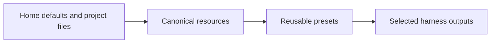

# Harnessdeck CLI specification

This document describes the intended behavior of `harnessdeck`.

## Product summary

`harnessdeck` is an Agent harness configuration toolkit for Claude Code, Codex, Cursor, and other coding CLIs. It collects agent configuration into canonical local resources, groups those resources into reusable presets, and syncs those presets into project directories across supported agent harnesses.

An **agent harness** is the complete infrastructure that wraps around an LLM and makes it a functional agent. In practice, that includes things like skills, MCP servers, hooks, plugins, rules, agent manifests, commands, and harness-specific configuration files.

The product currently supports these main workflows:

- Initialize local state, seed built-in presets, discover supported home-directory defaults, and choose global harness preferences.
- Scan an existing repository and import agent configuration into a local database.
- Group imported resources into versioned presets.
- Diff, doctor, export, import, publish, search, install, or derive presets from a project scan.
- Record preset dependencies and Claude plugin version pins alongside preset resources.
- Apply one or more presets, a local bundle file, or a bundle URL to a project.
- Sync alias harness outputs, inspect drift from the latest snapshot, and revert a tracked project to an earlier snapshot.
- Inspect plugin inventory and run supported plugin lifecycle commands.
- Export or import a machine-migration archive of local presets, harness preferences, and config.

## Core concepts



The CLI uses a small set of concepts consistently across commands.

- `resource`: a single canonical item such as an instruction, skill, rule, MCP server definition, permission rule, hook, agent, command, environment variable, or model configuration.
- `preset`: an ordered collection of resources. Presets are the main reusable unit.
- `agent harness`: a supported target environment such as Claude Code, Codex, Cursor, or another tool-specific agent wrapper.
- `main harness`: the project's canonical harness reference. Imports, preset application, and sync planning normalize through this harness first.
- `alias harness`: an additional supported harness that mirrors the main harness. Alias harnesses should use symlinks when the file layout allows it, and generated copies otherwise.
- `project`: a git-backed repository tracked by normalized git origin.
- `snapshot`: a saved copy of files generated during preset application or project sync.

## Command surface

The visible CLI groups commands by noun. Hidden top-level aliases such as `harnessdeck apply` or `harnessdeck export` still exist for compatibility, but the current surface is the grouped form below.

### Top-level commands

| Command | Current behavior |
| --- | --- |
| `harnessdeck init` | Creates `~/.harnessdeck/harnessdeck.db`, initializes the schema, seeds built-in presets, scans supported home-directory defaults, and optionally records global main/alias harness preferences. |
| `harnessdeck preset ...` | Manages reusable presets, preset bundles, remote preset catalog operations, and preset comparison/validation helpers. |
| `harnessdeck migrate ...` | Exports or imports a machine-migration archive containing preset bundles plus local HarnessDeck preferences and config. |
| `harnessdeck resource ...` | Lists, shows, or deletes canonical resources stored in SQLite. |
| `harnessdeck project ...` | Scans projects, applies presets, syncs alias harnesses, inspects drift, lists snapshot history, reverts snapshots, and shows project status. |
| `harnessdeck harness list` | Lists registered harness targets. |
| `harnessdeck harness ...` | Manages global and project-scoped main/alias harness preferences. |
| `harnessdeck plugin ...` | Shows Claude plugin inventory and runs lifecycle commands such as installed/check/update/refresh. |
| `harnessdeck cloud ...` | Authenticates with Harness cloud and manages local cloud profiles. |

### `preset` subcommands

| Command | Current behavior |
| --- | --- |
| `harnessdeck preset create` | Creates a preset with optional description and tags. |
| `harnessdeck preset list` | Lists locally stored presets. |
| `harnessdeck preset show` | Shows preset metadata, resources, dependencies, and plugin pins. |
| `harnessdeck preset attach <preset> <selector>` | Adds a typed attachment to a preset. Use `--type skill` or another resource type for canonical resources, `--type plugin --version <range>` for Claude plugin pins, and `--type dependency --version <range>` for preset dependencies. |
| `harnessdeck preset detach <preset> <selector>` | Removes a typed attachment from a preset. Use `--type` to distinguish resources, plugin pins, and dependency metadata. |
| `harnessdeck preset add-dependency` | Records version-constrained dependency metadata on a preset. |
| `harnessdeck preset remove-dependency` | Removes dependency metadata from a preset. |
| `harnessdeck preset delete` | Deletes a preset by selector. |
| `harnessdeck preset export` | Writes a portable JSON bundle for a preset (`urn:harnessdeck:bundle:v1`), with optional embedded Claude plugin trees. |
| `harnessdeck preset import` | Imports a preset bundle into the local database. |
| `harnessdeck preset search` | Searches the remote preset catalog through the configured cloud profile. |
| `harnessdeck preset add [selector]` | Downloads a remote preset bundle and imports it into the local database. Accepts the canonical `org/library[@version]` selector, and on TTY launches interactive remote search when no selector is provided. |
| `harnessdeck preset publish` | Publishes a local preset to the remote catalog. |
| `harnessdeck preset diff` | Compares two local presets, or a preset and a bundle file, across metadata, resources, dependencies, and plugin pins. |
| `harnessdeck preset doctor` | Diagnoses a preset for duplicate resources, empty content, malformed plugin metadata, and related issues. |
| `harnessdeck preset from-project` | Scans a project and creates a preset from the imported resources. |

### `resource` subcommands

| Command | Current behavior |
| --- | --- |
| `harnessdeck resource list` | Lists canonical resources, optionally filtered by type or search query. |
| `harnessdeck resource show` | Prints the full stored resource, including metadata and content. |
| `harnessdeck resource delete` | Deletes a resource by ID. |

### `project` subcommands

| Command | Current behavior |
| --- | --- |
| `harnessdeck project scan [path]` | Detects supported harnesses in a project, imports discovered resources, persists Claude plugin inventory when possible, and registers the project when a git origin exists. |
| `harnessdeck project apply <presets...>` | Applies one or more preset selectors, a local bundle file, or a bundle URL to a project; serializes files for each selected/detected platform; snapshots tracked projects before writing. |
| `harnessdeck project drift` | Compares the current project files against the latest apply/sync snapshot. |
| `harnessdeck project sync [path]` | Re-materializes alias harness outputs from the on-disk main harness reference, using symlinks when possible and copies otherwise. |
| `harnessdeck project history` | Lists stored snapshots for a tracked project. |
| `harnessdeck project revert [snapshot-id]` | Restores files captured in a saved snapshot. |
| `harnessdeck project status [path]` | Shows detected harnesses, tracked presets, snapshots, and configured harness preferences for a project. |

### `harness` subcommands

| Command | Current behavior |
| --- | --- |
| `harnessdeck harness set` | Sets global main/alias harness preferences, either from flags or an interactive prompt. |
| `harnessdeck harness status` | Shows the current global harness preference record. |
| `harnessdeck harness project set` | Sets project-scoped main/alias harness preferences and materialization strategy. |
| `harnessdeck harness project status` | Shows the project-scoped harness preference record. |

### `plugin` subcommands

| Command | Current behavior |
| --- | --- |
| `harnessdeck plugin list [path]` | Lists Claude Code plugin inventory: committed project plugins separately from the merged effective plugin set. |
| `harnessdeck plugin show <ref> [path]` | Shows one plugin ref, including effective install details and the settings scopes that declare it. |
| `harnessdeck plugin installed [path]` | Lists plugins as reported by lifecycle providers. |
| `harnessdeck plugin check [path]` | Reports outdated plugins, refreshing remote metadata when the cache is stale or `--refresh` is set. |
| `harnessdeck plugin update [ref]` | Updates one or more plugins via the provider-specific lifecycle tooling. |
| `harnessdeck plugin refresh` | Forces refresh of plugin marketplace/git metadata. |

### `cloud` subcommands

| Command | Current behavior |
| --- | --- |
| `harnessdeck cloud login [profile]` | Performs device authentication and saves a named local cloud profile. |
| `harnessdeck cloud whoami` | Shows information about the authenticated user/profile. |
| `harnessdeck cloud orgs` | Lists organizations and can switch the active organization for a profile. |
| `harnessdeck cloud logout` | Removes a local cloud profile. |

### `migrate` subcommands

| Command | Current behavior |
| --- | --- |
| `harnessdeck migrate export <file>` | Exports local presets as bundle files together with global harness preferences and config. |
| `harnessdeck migrate import <file>` | Imports a migration archive produced by `migrate export`. |

**Plugin check/update** behavior and rollout are documented in [docs/superpowers/plans/2026-05-19-plugin-check-update.md](docs/superpowers/plans/2026-05-19-plugin-check-update.md). Inventory and bundle format are specified in [docs/superpowers/specs/2026-05-19-claude-plugin-inventory-design.md](docs/superpowers/specs/2026-05-19-claude-plugin-inventory-design.md).

## Initialization and harness selection

`harnessdeck init` is the first-run configuration flow and establishes the default HarnessDeck home directory state for the local installation.

The init flow works in this order:

1. Initialize the local database.
2. Seed the built-in starter presets.
3. Discover supported harness configuration already present in the user's home directory and import what it finds.
4. Choose the **main harness** for future imports, preset application, and sync operations.
5. Choose any additional supported harnesses.
6. Mark those additional harnesses as **alias harnesses** and prefer symlinked materialization whenever the file layout and filesystem support it.

The CLI should allow the main harness to be selected even if that harness was not the one first discovered on disk. The important invariant is that every later sync operation has a single reference harness and a defined set of secondary outputs.

After init, users can update the global record with `harnessdeck harness set` or add project-specific overrides with `harnessdeck harness project set`. Both surfaces support interactive prompting as well as explicit flags.

## Wizard mode

Several noun-grouped commands support wizard mode for interactive use, including `preset add`, `preset show`, `preset delete`, `preset from-project`, `project apply`, and `resource delete`.

Wizard mode triggers when all of these are true:

1. The process is attached to a TTY.
2. CI is not enabled.
3. `HARNESSDECK_NO_INTERACTIVE` is not set to `1`.
4. `--no-interactive` is not present.
5. The command is not using `--format json`.
6. The command was invoked with `--interactive`, or required positional input is missing.

When those conditions are not met, the CLI stays in explicit flag-and-argument mode.

## Storage and state

`harnessdeck` stores persistent operational state in SQLite.

### Database location

The database lives at `~/.harnessdeck/harnessdeck.db`. The CLI creates the directory on demand and opens the database through `better-sqlite3` with WAL mode and foreign keys enabled.

Optional user settings live at `~/.harnessdeck/config.json`:

```json
{
  "plugins": {
    "refreshMaxAgeHours": 24
  }
}
```

Plugin metadata refresh timestamps are stored in `~/.harnessdeck/plugin-refresh-cache.json`. By default, `plugin check` compares local state only; sources older than `refreshMaxAgeHours` are refreshed automatically, and `--refresh` forces a refresh.

Named Harness cloud profiles are stored outside SQLite in `~/.harnessdeck/cloud-profiles.json`.

### Schema

The schema should include these logical tables:

- `resources`: canonical configuration items.
- `presets`: versioned named collections of resources.
- `preset_resources`: ordered many-to-many link table between presets and resources.
- `preset_dependencies`: ordered dependency metadata for presets.
- `preset_plugins`: Claude plugin version pins associated with presets.
- `projects`: tracked repositories keyed by normalized git origin.
- `project_presets`: which presets have been applied to which projects.
- `harness_preferences`: the global main/alias harness record.
- `project_harnesses`: the main harness, alias harnesses, and materialization strategy for each tracked project.
- `project_plugin_state`: persisted committed/effective Claude plugin inventory per tracked project.
- `snapshots`: saved generated output captured before sync writes files.
- `schema_version`: migration tracking.

### Project tracking

Project tracking is git-oriented. During `project scan`, `project apply`, and `project sync`, `harnessdeck` reads the repository's `origin` remote, normalizes it, and uses that value as the project identity. The last known local path is stored for convenience, but the git origin is the durable key.

### Snapshot behavior

Snapshots are created during `harnessdeck project apply` and `harnessdeck project sync` when the target directory has a git origin. A snapshot stores the generated file map for the main harness and every alias harness that was materialized for that sync. `harnessdeck project revert` restores those stored files directly to the project path. `harnessdeck project drift` compares the latest stored snapshot against the current on-disk files.

## Canonical model

The canonical model is broader than any single harness format, but it remains small and deterministic.

### Resource types

`harnessdeck` supports these resource types:

- `instruction`
- `skill`
- `rule`
- `mcp_server`
- `permission`
- `hook`
- `agent`
- `command`
- `env_var`
- `model_config`

Metadata is stored as JSON and varies by resource type.

### Preset model

Presets are the shareable unit. A preset has a unique `(name, version)`, description, tag list, optional Claude marketplace/plugin config, ordered resources, optional plugin pins, and optional dependency metadata. Resource order is stored in the join table and is preserved during serialization.

CLI preset selectors may refer to a preset by ULID, by bare name (highest local version wins), or by `name@constraint` (highest compatible local version wins).

Preset bundles store canonical resources directly. `project apply` serializes those canonical resources into the requested or detected platforms, while alias harnesses remain derived outputs rather than independent preset variants.

## Agent harness model

Harness support is split between a registry and serializers. The registry declares capability flags and default project and global paths. Serializers implement scan, canonicalization, aliasing rules, and write behavior.

### Native serializers

`harnessdeck` has dedicated serializers for these harnesses:

- `claude-code`
- `codex`
- `cursor`

These serializers read and write harness-specific files such as `CLAUDE.md`, `.claude/skills/`, `.cursor/rules/`, `AGENTS.md`, `.codex/config.toml`, and related directories.

### Generic serializer

All other registered harnesses may use the generic serializer. It relies on the registry's declared paths to scan and materialize instruction and skill layouts rather than implementing a fully native parser for each harness.

### Registered harnesses

The registry currently contains 31 harness IDs:

- `claude-code`
- `codex`
- `cursor`
- `warp`
- `opencode`
- `github-copilot`
- `copilot-cli`
- `windsurf`
- `amp`
- `cline`
- `continue`
- `goose`
- `roo`
- `gemini-cli`
- `kilo`
- `augment`
- `firebender`
- `trae`
- `junie`
- `zencoder`
- `openhands`
- `deepagents`
- `qwen-code`
- `crush`
- `droid`
- `codebuddy`
- `mux`
- `kode`
- `command-code`
- `cortex`
- `neovate`

`harnessdeck harness list` is the executable source of truth for this list. The hidden `platforms` alias remains for compatibility, but `harness list` is the visible command surface. `harnessdeck harness status` and `harnessdeck harness project status` are the source of truth for the user's configured main and alias harness selection.

## Scan, apply, import, and sync behavior

The CLI favors deterministic file I/O over merge-heavy workflows.

### Scan

`harnessdeck project scan` detects harnesses by checking whether any declared project path exists in the target directory. It then asks the relevant serializer to read resources. The persistence layer deduplicates resources by `type:name` within a single scan run before inserting them.

When one supported harness already exists in a project, that harness becomes the default main harness for the project. This preserves the existing project as the initial source of truth instead of forcing an immediate conversion.

### Apply

`harnessdeck project apply` accepts one or more local preset selectors, a local bundle file, or a bundle URL. When multiple local presets are provided, later presets override earlier ones for matching `type:name` resources, Claude config entries, and plugin refs.

The command serializes resources for the requested or detected platforms and, when the target has a git origin, updates tracked project metadata and stores a snapshot so later drift/revert/sync operations have a reference point.

If no `--platform` list is passed, `project apply` uses platform detection from the target directory. If no platforms can be detected, the command warns and does not write files.

### Project sync

`harnessdeck project sync` materializes the main harness and every configured alias harness for the project.

The sync rules are:

1. Use the project's main harness as the single reference representation.
2. Generate or refresh all configured alias harness outputs from that reference.
3. Use symlinks for alias harnesses when the target file layout is compatible and the filesystem supports symlinks.
4. Fall back to generated copies when symlinks are not possible.
5. Snapshot all generated files before overwriting them.

`harnessdeck project sync` also supports an option to force shifting the project's reference harness from the currently detected existing harness to the main harness configured by the user. This is the escape hatch for teams that start from one harness but want the project to converge on another long-term reference.

### Project drift

`harnessdeck project drift` loads the latest snapshot for a tracked project and reports generated files that were added, modified, or deleted relative to that snapshot.

### Import and export

Preset export and import use a JSON bundle format with schema identifier `urn:harnessdeck:bundle:v1` and bundle version `1`. Each bundle contains exactly one preset definition, a flat list of resources, preset plugin pins (`plugins[]`), optional inlined plugin trees (`embedded_plugins[]`, for example when exporting with `--embed-plugins`), and optional dependency metadata (`dependencies[]`). Bundles may also include an optional top-level `claude` object with Claude Code marketplace and plugin configuration (`extraKnownMarketplaces` and `enabledPlugins` semantics). Older hand-written bundles without `plugins`, `embedded_plugins`, or `dependencies` import as empty arrays.

Internal database IDs, timestamps, and `source` fields are not exported.

When importing a preset bundle, `harnessdeck` creates a local preset together with its canonical resources, plugin pins, and dependency metadata. If the bundle carries embedded plugin trees, those trees are written into the selected target directory during import/apply of that bundle.

### Migration archives

`harnessdeck migrate export` writes either a `.json` file or a tar.gz archive containing a manifest, exported preset bundles, the global harness preference record, and `config.json`. `harnessdeck migrate import` restores those artifacts on another machine.

Migration archives do not include tracked project records, snapshots, or cloud profiles.

## Cloud catalog and profiles

Harness cloud authentication stores named profiles in `~/.harnessdeck/cloud-profiles.json`.

- `harnessdeck cloud login` performs device authentication and saves a local profile.
- `harnessdeck cloud whoami`, `cloud orgs`, and `cloud logout` inspect, switch, or remove those local profiles.
- `harnessdeck preset search`, `preset install`, and `preset publish` use the selected cloud profile to interact with the remote preset catalog.

## Build, test, and release workflow

The project uses Bun for local dependency management, CI, and build execution. The package is still intended for distribution through the npm registry.

### Development commands

Use these commands while working on the repository:

```bash
bun install
bun run lint
bun run typecheck
bun run test:run
bun run build
```

### Build output

`tsup` builds the CLI from `src/index.ts` into `dist/` as a Node 20 ESM CLI with declaration files and a `#!/usr/bin/env node` banner.

### Publish flow

The package publishes to the npm registry. The package metadata should run `bun run build` before `npm publish`.

## Known gaps and non-goals

This section captures the biggest constraints in the current direction.

- Only a subset of registered harnesses will have fully native serializers at first.
- Generic harness support may remain path-driven and intentionally shallow.
- Sync writes files directly and does not yet provide interactive conflict resolution.
- Export and import operate on one preset bundle at a time.
- Preset dependency metadata is stored, shown, diffed, and exported/imported, but `project apply` does not yet expand dependency graphs automatically.
- Plugin lifecycle (`plugin check|update|refresh`) delegates to harness-native tooling; harnessdeck does not host its own plugin registry or install flow.

## Near-term direction

The next meaningful improvements are richer per-harness serializers, clearer user configuration around main and alias harness defaults, and stronger sync semantics for teams that want one canonical agent harness while still supporting many downstream harness targets.
