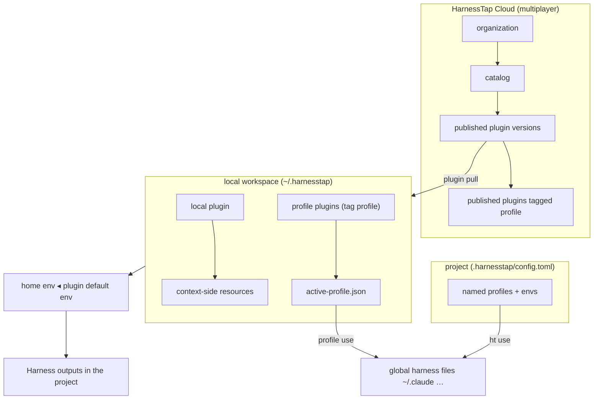

# HarnessTap CLI specification

This document is the authoritative specification for `harnesstap` / `ht`.

## Product summary

`harnesstap` is an Agent harness configuration toolkit for Claude Code, Codex, Cursor, and other coding CLIs. It collects agent configuration into canonical local **resources**, composes **what** into versioned **plugins** (with optional default **environments**) in a single local **workspace**, and syncs the resolved setup into project directories across supported agent harnesses. Teams publish plugins to HarnessTap Cloud **catalogs** under an **organization** for multiplayer discovery, install, and governance.

An **agent harness** is the complete infrastructure that wraps around an LLM and makes it a functional agent. In practice, that includes skills, MCP servers, hooks, plugins, rules, agent manifests, commands, and harness-specific configuration files.

The product currently supports these main workflows:

- Initialize local state, discover supported home-directory defaults, and choose global harness preferences.
- Scan an existing repository (or plugin source) and import agent configuration into a local database.
- Add skills from a remote or local skill package (`add`), optionally attaching them to a new or existing plugin.
- Group imported resources into versioned **local plugins** (`name` + semver); edit the working head, **cut** immutable versions, and open definitions in `$EDITOR`.
- Diff, doctor, export, import, publish, search, install, or derive plugins from a scan or skill package (`plugin create --from`).
- Compose plugins by attaching context-side material resources, **`plugin_pin`** references (host marketplace/local plugins), and nested **`plugin`** references through one attachment model.
- Register plugin **marketplaces**, search catalogs, and attach pins with `marketplace` / `plugin`.
- Apply one or more plugins, a local bundle file, or a plugin export URL to a project.
- Declare repo **project profiles** in `.harnesstap/config.toml` and switch with `ht use`.
- Sync plugin composition resources from marketplace or local install roots via `resource sync`.
- Sync alias harness outputs, inspect drift from the latest snapshot, and revert a tracked project to an earlier snapshot.
- Export or import a machine-transfer archive of local plugins, harness preferences, and config (`migrate`).
- Authenticate with HarnessTap Cloud (`auth`); search, install, and publish plugins into org **catalogs**.
- Create **environments** (blank, from a project, or from configured plugin requirements); edit values; bind default environments to plugins; switch home or session-local active environment; cascade on `apply` / `profile use`.
- Manage **profiles** (plugins tagged `profile`) for global machine presets; switch with `profile use` / `profile switch`; stash untracked home resources with `profile stash`.
- Authenticate HarnessTap Cloud with named **accounts** (`cloud-accounts.json`, `--account` on catalog commands).
- Optional **desktop** control plane (`apps/desktop`) talks to a local `ht-agent` sidecar (`agent serve` / `ui --serve` for engineering debug).

## Core concepts



The CLI uses a small set of concepts consistently across commands.

- `resource`: a single canonical item on the **context-side** (what the model sees) or **environment-side** (how it runs).
   - Context-side material types: instruction, skill, rule, MCP server, hook, agent, command.
   - Environment-side types: env var, model config, permission, secret references.
- `plugin`: a versioned **context package** — material resources plus optional **`plugin_pin`** and **`plugin`** composition refs, optional Claude host-plugin config, a `needs` contract satisfied by environment resources, and an optional default **environment**. Plugins are what `apply` targets. See [Plugin identity & scope](#plugin-identity--scope).
- `host plugin`: an installable bundle in the host harness world (Claude/Cursor/Codex marketplace plugin): manifest + tree. Not a HarnessTap storage row; materialized as namespaced resources after `resource sync` on a **plugin pin**.
- `plugin_pin`: a plugin dependency on a host plugin (`plugin_pin:ref@marketplace`), with version constraint and sync metadata. Stored as `type=plugin_pin` in SQLite.
- `environment`: a named, swappable bundle of environment-side resources. Non-secret values can travel in migrate archives and plugin exports; secrets are referenced, not embedded.
- `organization`: a Cloud tenant boundary (members, roles, billing). Required to publish plugins for multiplayer use.
- `catalog`: a named collection of plugins within an organization — the browse, search, and install scope in Cloud and the CLI. Required alongside an organization when publishing; omitted for purely local plugins.
- `profile`: a plugin whose `tags` include the reserved string `profile`; switchable global preset. `profile use` merges the profile stack (including transitive `plugin` refs) and applies to machine home harness paths. Stored as a normal plugin row — not a separate entity type.
- `workspace`: the single implicit local library in `~/.harnesstap/harnesstap.db` — all plugins, resources, and environments. Share offline with `migrate export` / `import` (`--workspace`, `--plugin`, or `--resource`).
- `account`: a named HarnessTap Cloud login identity in `~/.harnesstap/cloud-accounts.json` (access tokens, refresh tokens, active org). Use `--account <name>` on catalog commands; distinct from a profile plugin.
- `project config`: optional `{project}/.harnesstap/config.toml` declaring named profiles (local / catalog / inline) and environments for `ht use`.
- `agent harness`: a supported target environment such as Claude Code, Codex, Cursor, or another tool-specific agent wrapper.
- `main harness`: the project's canonical harness reference. Imports, plugin application, and sync planning normalize through this harness first.
- `alias harness`: an additional supported harness that mirrors the main harness. Alias harnesses use symlinks when the file layout allows it, and generated copies otherwise.
- `project`: a git-backed directory tracked by HarnessTap, keyed by normalized `origin` when available.
- `snapshot`: a saved copy of files generated during plugin application or mirror.

### Plugin identity & scope

Every plugin has a **name** and **version** (semver). Identity is either **local** or **published**.

| Scope | Identity | Collision key | Cloud required? |
| --- | --- | --- | --- |
| **Local** | `name@version` | Unique in the local SQLite database | No — default for solo work |
| **Published** | `org/catalog/name@version` | Unique per org + catalog + name + version | Yes — required for `plugin publish` and catalog browse |

**Selector grammar (target):**

```
layer_selector ::= [ org "/" catalog "/" ] name [ "@" version ]
```

Examples:

- `backend-oncall` — local plugin; highest matching version when omitted.
- `backend-oncall@1.2.0` — local plugin; exact version.
- `acme/platform-personas/frontend-engineer@2.1.0` — published plugin in org `acme`, catalog `platform-personas`.

**Publishing rules:**

1. Local plugins may be created, composed, exported, and applied with **no** organization or catalog.
2. `plugin publish` requires an active Cloud account and at least one **registered** publish catalog (`plugin catalog register`). By default it fans out to all registered catalogs; per-plugin allow lists are configured with `plugin catalog` / `plugin catalog bindings`.
3. `plugin list --search` and `plugin pull` resolve against the CLI [catalog scope](#harnesstap-cloud) (default public org + connected catalogs + authenticated private plugins).

**Wire compatibility:** Cloud APIs and the CLI still accept `org/library[@version]` today. Treat `library` as the published **plugin name** inside the org's default or named catalog until selectors migrate to `org/catalog/name`.

### Naming map (homonyms)

Use this table to disambiguate overlapping words. See also [CONTEXT.md](CONTEXT.md).

| Term | Meaning | CLI / storage |
| --- | --- | --- |
| **Plugin** | Versioned context package (material resources + deps + optional default environment) | `ht plugin …`, `apply <plugin>` · `plugins` + `layer_resources` |
| **Host plugin** | Claude/Cursor/Codex installable bundle (manifest + tree) | Host commands (`claude plugin install`, …) — not a HarnessTap row |
| **`plugin_pin`** | Dependency on a host plugin attached to a plugin | `plugin edit --add plugin_pin:ref@mp`, `resource sync plugin_pin:…` · `resources.type=plugin_pin` |
| **`plugin` ref** | Dependency on another HarnessTap plugin (catalog/local) | `plugin edit --add plugin:name@^1.0` · `resources.type=plugin` |
| **Profile** | Plugin tagged `profile`; global switch preset | `ht profile use <name>` · `plugins.tags` includes `profile` |
| **Workspace** | Single local SQLite library; offline share via `migrate` | `~/.harnesstap/harnesstap.db` |
| **Catalog** | Org-scoped published plugin collection (multiplayer) | `plugin list --search`, `plugin pull` · Cloud APIs |
| **Account** | Cloud auth identity (tokens, org context) | `auth login`, `--account` · `cloud-accounts.json` |
| **Project config** | Repo-declared profiles for `ht use` | `.harnesstap/config.toml` · `config show|init`, `use` |

**Package.json analogy:** a **plugin** is the package; **context-side resources** are source files; **`plugin_pin`** / **`plugin` ref** are dependencies; **`environment`** is runtime config (.env).

Plugin freshness and composition use `resource sync`, `plugin doctor`, and `apply` plugin-version flags.

### Resource classification

| Context-side (*what*) | Environment-side (*how*) | Composition |
| --- | --- | --- |
| `instruction`, `skill`, `rule`, `mcp_server`, `hook`, `agent`, `command` | `env_var`, `model_config`, `permission` | `plugin_pin`, `plugin` |

An `mcp_server` **definition** lives on the plugin; tokens and URLs are contract keys (`needs`) filled by an environment.

`plugin` composition resources are hidden from default `resource list`; `plugin_pin` resources are listed.

### Environment values

An **environment** is a named bundle of **environment values** — the runtime *how* configuration that plugins may depend on:

| Kind | Storage |
| --- | --- |
| `env_var` | Non-secret key/value pairs |
| `model_config` | Model and provider selection |
| `permission` | Allow/deny/ask patterns |
| Secret reference | `environment_secret_refs` (`keychain`, `env`, `file`) — never the secret value |

Plugins declare requirements via `needs[]`; MCP server definitions declare env keys in `mcp_server.env`. Environments satisfy those requirements.

**Toolkit configuration** (`harness_preferences`, `project_harnesses`, `~/.harnesstap/config.jsonc`) controls HarnessTap behavior and harness selection. It is not an environment.

See [Environment from project](#environment-from-project) for creating or updating environments from project state.

### Resource identity and selectors

Resources are uniquely keyed by `(type, name, namespace)` where `namespace=''` means unnamespaced.

Selector grammar:

```
selector ::= [ type ":" ] name [ "@" namespace ]
```

Examples: `brainstorming`, `skill:brainstorming@cursor-team-kit`, `plugin_pin:posthog@cursor-team-kit`, `plugin:backend-oncall`, `01J…` (ULID id).

- **Display** commands (`resource show`, `resource delete`): bare names prefer the unnamespaced row when present; otherwise list ambiguous matches.
- **Compose** commands (`plugin edit`, merge, apply): require `@namespace` (or a ULID) when more than one namespace exists for the same `type:name`.

Imported bodies are content-addressed under `~/.harnesstap/blobs/sha256/…` with `content_hash` stored on the row.

### Unified composition model

A plugin is an ordered list of attachments:

| Attachment | `resource list` | Attach example | Refresh |
| --- | --- | --- | --- |
| Material (`skill`, …) | yes | `plugin edit L --add skill:foo@ns` | via `resource sync` when `origin_kind=marketplace_link` |
| `plugin_pin` | yes | `plugin edit L --add plugin_pin:posthog@cursor-team-kit` | `resource sync plugin_pin:posthog@cursor-team-kit` |
| `plugin` | no | `plugin edit L --add plugin:backend-oncall@^1.0` | resolves to another local or published plugin version |

Nested `plugin` refs expand depth-first with cycle detection at apply time.

**Lazy plugin pin attach:** `plugin edit --add plugin_pin:…` links only. Sync is explicit via `resource sync`, `plugin edit --sync`, or `apply --sync-plugins`.

**Plugin pin metadata** (harness-agnostic):

```ts
interface PluginPinMetadata {
  source_kind: "marketplace" | "local" | "git";
  marketplace_name?: string;
  version_constraint?: string;   // absent = floating latest
  resolved_version?: string;     // set by last successful sync
  sync_status?: "synced" | "stale" | "pinned" | "never_synced";
  portable?: "reference" | "embed";
  manifests?: { claude?: Record<string, unknown>; cursor?: Record<string, unknown> };
}
```

### Environment cascade

Composition resolves by ordered override (last wins):

```
home environment  ◂  plugin default environment
```

On `apply`, HarnessTap merges environment fragments into plugin serialization so env vars and model config override matching `type:name` resources. Home environments may be stored under `~/.harnesstap/environments/<name>.json` (JSONC).

Switching the home active environment re-materializes how-values without reloading plugin content — for example, moving from staging to prod while keeping the same plugin stack.

### Offline workspace sharing

Share the full local workspace between machines with `migrate export` / `migrate import`. Archives include plugin bundles, named environments (secret refs only), harness preferences, config, and `active-profile.json` when present. For surgical sharing, use `migrate export --plugin` or `migrate export --resource`. For multiplayer distribution, use `plugin publish` / `plugin pull` via HarnessTap Cloud catalogs.

### Progressive enhancement

| Consumer | What they get |
| --- | --- |
| Without HarnessTap | `claude plugin install` and direct reads of `AGENTS.md` / `.cursor/rules/` |
| With HarnessTap | Environment swap, cascade, cross-harness materialization, drift detection |

## Invocation and global options

The package publishes two binaries (`harnesstap` and `ht`) pointing at the same entrypoint. Help text, usage lines, and follow-up hints use whichever name launched the process.

Global options:

| Flag | Behavior |
| --- | --- |
| `-V, --harnesstap-version` | Print CLI version |
| `-v, --verbose` | Show stack traces on errors |
| `--no-color` | Disable ANSI colors (also respects `NO_COLOR`) |
| `--no-interactive` | Disable interactive prompts |
| `-h, --help` | Show help (`--help --all` includes hidden aliases) |

### Noun shorthand aliases

| Full noun | Alias |
| --- | --- |
| `plugin` | `l` |
| `resource` | `r` |
| `harness` | `h` |
| `environment` | `e` |
| `profile` | `p` |
| `auth` | `a` |
| `migrate` | `m` |
| `marketplace` | `mkt` |

## Command surface

Commands are grouped by noun. For flag-level detail see [docs/cli/command-reference.md](docs/cli/command-reference.md).

### Top-level commands

| Command | Current behavior |
| --- | --- |
| `harnesstap init` | Creates `~/.harnesstap/harnesstap.db`, initializes the schema, seeds a `default` profile plugin (unless `--no-default-profile`), scans supported home-directory defaults, and optionally records global main/alias harness preferences. |
| `harnesstap add <source>` | Discovers and installs skills from a GitHub repo, Git URL, or local skill package; optionally creates or attaches a plugin. |
| `harnesstap plugin ...` | Plugin CRUD, **cut**, **editor**, **apply**, composition attach/detach, cloud catalog workflows, diff, and doctor. |
| `harnesstap migrate ...` | Exports or imports workspace archives, plugin/resource/environment TOML (offline sharing). |
| `harnesstap resource ...` | Lists, shows, deletes, and syncs canonical resources. |
| `harnesstap marketplace ...` | Registers and browses plugin marketplace sources. |
| `harnesstap plugin ...` | Searches marketplaces and attaches `plugin_pin` refs to plugins. |
| `harnesstap scan`, `mirror`, `status`, `history`, `revert` | Scans, mirrors, reports status/drift, and manages snapshots for git-backed projects. |
| `harnesstap use` | Switches to a profile/environment declared in `.harnesstap/config.toml`. |
| `harnesstap config ...` | Shows, validates, or initializes project profile config (`.harnesstap/config.toml`). |
| `harnesstap harness ...` | Lists harness targets and manages global/project main/alias preferences. |
| `harnesstap environment ...` | Creates and manages environments; edits values and secret refs; sets global or session-local active environment; status/drift against terminal env. |
| `harnesstap profile ...` | Lists, shows, creates, tags, switches, and stashes profile plugins; global apply via `profile use`. |
| `harnesstap auth ...` | Authenticates with HarnessTap Cloud and manages local cloud accounts. |
| `harnesstap help` / `help scenario` | Core concepts and numbered scenario playbooks. |
| `harnesstap completion <shell>` | Prints bash/zsh/fish completion scripts (dynamic plugin/resource/harness completion). |
| `harnesstap agent` / `ui` | Engineering debug: loopback agent HTTP server and desktop UI entry (not primary end-user workflows). |

### `plugin` subcommands

| Command | Current behavior |
| --- | --- |
| `plugin create` | Creates a local plugin with optional description, tags, and version; or imports a skill package with `--from` (attach selected skills, optional `--install` to hub paths). |
| `plugin list` | Lists local plugins, then streams remote catalog plugins from catalog scope ∪ registered publish catalogs (`NAME`, `VERSION`, `DESCRIPTION` columns; `--show-id` optional). Dirty heads show a trailing `*` on the version. `--local-only` / `--remote-only`; `--search` filters local and remote. Interactive TTY browse can install a selected remote plugin. |
| `plugin show` | Shows plugin metadata, resources, dependencies, composition attachments, dirty/frozen state, and default environment when set. |
| `plugin edit` | Edit composition attachments and default environment (interactive checkbox UI, or `--add` / `--remove` / `--apply` / `--environment` / `--clear-environment` scripting). Marks the working head **dirty** after a cut. Selectors may use `type:` prefixes (`skill:foo`, `plugin_pin:posthog@mp`, `plugin:baseline`) or `--type` when the prefix is omitted. Plugin pin attach is lazy by default; use `--sync` or `resource sync` to materialize install roots. |
| `plugin editor` | Opens the plugin definition in `$EDITOR` (or the system editor) for direct editing. |
| `plugin cut` | Freezes the current working head and advances to a new semver (`--version`). Previous version becomes immutable. |
| `plugin delete` | Deletes a plugin by selector. |
| `apply` | Applies plugin selectors, bundle paths, or bundle URLs to a project; resolves environment cascade; serializes per platform; snapshots git-backed projects. Flags: `--strict-plugin-versions`, `--ignore-plugin-versions`, `--sync-plugins`. |
| `plugin pull` | Downloads a published plugin and imports it locally (`org/catalog/name[@version]`; `org/library[@version]` accepted during migration). |
| `plugin publish` | Publishes a local plugin to effective publish targets (all registered catalogs, or per-plugin allow list). Refuses dirty heads unless `--version` cuts first. One-off `org/catalog` override supported. |
| `plugin publish plan` | Dry-run publish: effective targets and planned versions per catalog. |
| `plugin catalog` | Interactive wizard for per-plugin publish bindings. |
| `plugin catalog bindings` | Show or set per-plugin publish allow list (`--add` replaces full list, `--remove`, `--clear`). |
| `plugin catalog register` | Register an `org/catalog` publish destination in `config.jsonc`. |
| `plugin catalog unregister` | Remove a registered publish destination. |
| `plugin catalog registered` | List registered publish catalogs. |
| `plugin catalog list` | Shows default catalog, connected orgs, connected plugins, registered publish catalogs, and effective cloud base URL. |
| `plugin catalog connect org <slug>` | Opt in to public plugins from another org in browse/search scope. |
| `plugin catalog disconnect org <slug>` | Remove a connected org from scope (cannot remove `harnesstap-cloud`). |
| `plugin catalog connect plugin <org>/<name>` | Opt in to one published plugin without subscribing to the whole org. |
| `plugin catalog disconnect plugin <org>/<name>` | Remove a connected plugin from scope. |
| `plugin diff` | Compares two plugins, or a plugin and a bundle file. |
| `plugin doctor` | Multi-check diagnostic (`--check`, `--list-checks`; exits `1` when invalid). |
| `plugin from-project` | Scans a project and creates a plugin from imported resources. |

### `environment` subcommands

| Command | Behavior |
| --- | --- |
| `environment create` | Creates a blank environment (default), from a project (`--from-project`), or from configured plugin requirements (`--from-plugin`). Interactive wizard on TTY when no mode flags are set. |
| `environment edit` | Edits environment values interactively or via scripting flags (`--var` / `--unset-var`, `--model`, `--permission`, `--secret` / `--unset-*`). `--format json` returns a read-only snapshot on non-TTY. |
| `environment list` | Lists environments with value counts and plugin bindings. |
| `environment show` | Shows environment values, secret refs, and reverse references; `--plugin` analyzes requirement gaps against a configured plugin. |
| `environment delete` | Deletes an environment when unreferenced (or with `--force`). |
| `environment use` | Sets the home active environment pointer; `--local` applies only to the current terminal session. |
| `environment status` | Shows active environment and whether terminal env vars match expected values; `--check` exits non-zero on drift. |

### `marketplace` / `plugin` subcommands

| Command | Current behavior |
| --- | --- |
| `marketplace add <url>` | Registers a plugin marketplace URL in toolkit config. |
| `marketplace list` | Lists configured marketplace sources. |
| `marketplace remove <name>` | Removes a marketplace registration. |
| `marketplace show <name>` | Lists or interactively browses plugins from a marketplace catalog. |
| `plugin search [query]` | Searches configured marketplace catalogs for plugins. |
| `plugin add <ref>` | Attaches a marketplace plugin pin to a plugin (`--plugin`). |

Host install/ensure of pinned plugins still runs through providers when a profile is active or on apply/use — see [Known gaps](#known-gaps-and-non-goals).

### `config` / `use` (project profile config)

Repositories may declare named profiles in `.harnesstap/config.toml` (`urn:harnesstap:project:v1`): local plugins, catalog selectors, or inline plugin tables, plus optional project-scoped environments.

| Command | Current behavior |
| --- | --- |
| `config show` | Shows resolved project profile config. |
| `config validate` | Validates references (inline plugins, default profile/environment keys); exits `1` when invalid. |
| `config init` | Creates a starter `.harnesstap/config.toml` from local profile plugins (`--profile`, `--default`, `--force`). |
| `use` | Resolves a profile from project config and applies it to **home** harness paths (same materialization path as `profile use`), optionally switching the active environment. `--list` lists profiles without applying; `--profile` selects a key; interactive picker when multiple profiles exist. |

### `resource` subcommands

| Command | Current behavior |
| --- | --- |
| `resource list` | Lists canonical resources; shows `name@namespace` when namespace is non-empty. Hides `type=plugin` composition refs by default; use `--all` to disable per-type caps. |
| `resource show` | Prints the full stored resource (supports selector grammar). |
| `resource sync` | Refreshes `plugin_pin` resources and `marketplace_link` children from install roots. Supports `--on-conflict`, `--prune`, `--force`, `--dry-run`. |
| `resource delete` | Deletes a resource by selector or ID. |

### Project-local commands (top-level)

| Command | Current behavior |
| --- | --- |
| `scan` | Detects harnesses, imports resources via hash-aware upsert, respects `.harnesstapignore`, canonicalizes shared `AGENTS.md` instruction imports, prompts on TTY when content differs. Accepts plugin directories and marketplace manifests as scan sources. `--global` installs imported plugin sources into global harness locations. |
| `use` | Applies a profile from `.harnesstap/config.toml` to home harness paths (see [config / use](#config--use-project-profile-config)). |
| `status --check` | Compares working tree against the latest apply/sync snapshot. |
| `mirror` | Re-materializes alias harness outputs from the main harness reference. |
| `history` | Lists stored snapshots (requires git-backed project). |
| `revert` | Restores files from a snapshot. |
| `status` | Shows harnesses, applied plugins, snapshots, and harness preferences. |

### `harness` subcommands

| Command | Current behavior |
| --- | --- |
| `harness list` | Lists registered harness targets (`--supported` filters to natively serialized harnesses). |
| `harness set` | Sets global main/alias harness preferences (flags or interactive). |
| `harness status` | Shows the global harness preference record. |
| `harness project set` | Sets project-scoped main/alias harness preferences and materialization strategy. |
| `harness project status` | Shows project-scoped harness preferences. |

### `auth` subcommands

| Command | Current behavior |
| --- | --- |
| `auth login [account]` | Device authentication; saves a named local cloud account. |
| `auth status` | Shows authenticated user/account context. |
| `auth orgs` | Lists organizations; `--switch` updates the active org. |
| `auth logout` | Removes a local cloud account. |

### `profile` subcommands

A **profile** is a plugin whose `tags` include the reserved string `profile`. Profiles are not a separate storage type — they use the same `plugins` table and publish pipeline as any plugin.

| Command | Current behavior |
| --- | --- |
| `profile list` | Lists local profile plugins, then streams remote catalog plugins with `tag=profile` (same discovery model as `plugin list`). Marks the active profile from `active-profile.json`. |
| `profile show <name>` | Same detail view as `plugin show`, plus active profile marker. |
| `profile status` | Shows the active profile and whether global harness files match it (drift, pending apply, stack changes). `--check` exits `1` when out of sync. |
| `profile use <name>` | Resolves and merges the profile stack (transitive `plugin` refs), optionally auto-pulls missing published dependencies, applies to **global** harness paths, writes `active-profile.json`, and records a global apply snapshot. If the profile plugin has `default_environment_id`, updates the home active environment pointer. |
| `profile switch <name>` | Like `profile use`, but restores the previous active profile if the switch fails. |
| `profile stash` | Stashes untracked on-disk resources for the active profile (git-stash-like). Subcommands: `stash list`, `stash pop`, `stash apply`. |
| `profile create <name>` | Creates an empty local plugin with `tags: ["profile"]`, promotes an existing plugin with the same name, or imports from `--from` (skill package). `--use` applies globally after create. |
| `profile delete <name>` | Demotes a profile plugin (removes `profile` tag, clears `active-profile.json` when deleting the active profile) and optionally deletes the underlying plugin. |
| `profile pull <selector>` | Alias for `plugin pull`; warns when the installed plugin is not profile-tagged. |
| `profile publish <name>` | Alias for `plugin publish` with profile validation warnings (empty stack, unpublished local deps). |

`profile use` flags:

| Flag | Purpose |
| --- | --- |
| `--dry-run` | Preview global diff without writing |
| `--harness <slugs>` | Override harness targets (default: global harness preference) |
| `--on-conflict <policy>` | `replace` \| `skip` \| `prompt` |
| `--account <name>` | Cloud account for catalog resolution during dependency pull |
| `--base-url <url>` | Cloud base URL for dependency pull |
| `--no-pull` | Fail when composition refs are missing locally instead of auto-pull |

**Scope:** `profile use` applies to machine **home** harness paths only. Project apply is `apply` only.

**Root shorthand:** when `argv[2]` is not a registered top-level command or alias and matches a local profile plugin name, the CLI rewrites to `profile use <name>`. Reserved names always win — e.g. `ht init` stays `init`, `ht work` becomes `profile use work` when `work` is a profile-tagged plugin.

Remote catalog workflows live on **`plugin`**, not `cloud`:

- `plugin list` — discover local and remote plugins (catalog scope ∪ registered publish catalogs)
- `plugin list --search` — filter local and remote plugins
- `plugin pull` — fetch a published plugin + local import (distinct from `migrate import` on a local file)
- `plugin publish` — export bundle + upload a versioned plugin to an org catalog

`apply` resolves local plugin names, bundle paths, and URLs. Published selectors (`org/catalog/name@version` or `org/name@version`) that are not installed locally are fetched from the catalog at apply time (same import path as `plugin pull`).

### `migrate` subcommands

| Command | Current behavior |
| --- | --- |
| `migrate export [file]` | Exports workspace archive, plugin TOML, resource TOML, or environment TOML (`--workspace`, `--plugin`, `--resource`, `--environment`). Interactive when `[file]` omitted on a TTY. Optional `--include-plugins` / `--embed-plugins`. |
| `migrate import [file]` | Imports a machine-transfer archive or TOML into the local workspace (auto-detects scope; force with `--workspace` / `--plugin` / `--resource` / `--environment`). |

### `add`, `help`, `completion`

| Command | Current behavior |
| --- | --- |
| `add <source>` | Installs skills from GitHub `owner/repo`, a Git URL, or a local skill-package directory. Discovers skills recursively, imports under a source namespace, installs a subset to the hub (`~/.agents/skills/` or `{project}/.agents/skills/`) with fan-out to harnesses, and optionally creates/attaches a plugin. `--list`, `--dry-run`, `--create-plugin` / `--plugin`. |
| `help` | Prints core concepts; `help scenario <id>` shows a numbered playbook from `docs/scenarios/`. |
| `completion <shell>` | Emits bash, zsh, or fish completion (commands, flags, and dynamic names). |

## CLI UX contract

Human-readable output is the default. Automation uses explicit flags — output shape never changes based on TTY detection alone.

### Output modes

Structured read/report commands support:

- `--format human` (default)
- `--format json`

JSON coverage includes (non-exhaustive): `resource list|show`, `plugin list|show|cut|apply --dry-run|doctor`, `profile list|show|status|use|switch|stash`, `environment list|show|edit|status|create --dry-run`, `status|history`, `harness list|status`, `init`, `auth status|orgs`, `migrate export|import`, `config show|validate|init`, `use --dry-run`, `add --dry-run|--list`, `marketplace list|show`, `plugin search`.

Mutation commands return concise human verdict lines unless they already expose structured summaries useful to scripts.

### Selector rules

- **Environments:** name or ULID.
- **Local plugins:** `name`, `name@version`, or ULID.
- **Published plugins:** `org/catalog/name`, `org/catalog/name@version`, or ULID when stored locally after `plugin pull`.
- During migration, `org/library[@version]` resolves as `org/<default-catalog>/library`.
- **Resources:** `name`, `type:name`, `type:name@namespace`, or ULID.
- **Snapshots:** full snapshot IDs in `history`; `revert` accepts the same ID.

Ambiguous selectors are errors. Human mode lists candidates; JSON mode returns a structured ambiguity payload. The CLI never silently picks the first match.

### Reusable identifiers

When human output supports follow-up commands, it includes canonical identifiers:

- `resource list --show-id` prints full resource IDs (hidden by default in list tables).
- `plugin show` prints resource IDs in the resources sub-table when `--show-id` is set.
- `history` prints full snapshot IDs.

### Error handling

| Situation | Behavior |
| --- | --- |
| Not found | Clear message, non-zero exit |
| Ambiguous selector | Non-zero exit; candidates in human or JSON mode |
| Invalid option | Explicit validation error, non-zero exit |
| Plugin version mismatch on apply (default) | Warning; apply continues |
| Plugin version mismatch with `--strict-plugin-versions` | Exit `2` |
| `--strict-plugin-versions` and `--ignore-plugin-versions` together | Error |

## Wizard mode

Several commands support wizard mode for interactive use: `plugin pull`, `plugin show`, `plugin delete`, `plugin edit`, `plugin editor`, `plugin from-project`, `apply`, `resource delete`, `environment create`, `environment edit`, `environment delete`, `environment use`, `init`, `harness set`, `harness project set`, `use`, `config init`, `add`, `plugin add`, and `marketplace show`.

Wizard mode triggers when all of these are true:

1. stdin and stdout are TTYs.
2. `CI` is not `"true"`.
3. `HARNESSTAP_NO_INTERACTIVE` is not `"1"`.
4. `--no-interactive` is not present.
5. `--format json` is not requested.
6. The command was invoked with `--interactive`, or required positional input is missing.

When those conditions are not met, the CLI stays in explicit flag-and-argument mode.

## Human output

The CLI renders human mode through `src/ui/` primitives (`table`, `panel`, `diff`, `status`, `progress`). Design goals:

- One visual language across commands (semantic colors, `✓` / `⚠` / `✗` verdicts, boxed tables).
- List tables use uppercase muted headers and optional summary footers.
- Diff and drift output color rows by change kind (`+` / `−` / `~`).
- Spinners for long operations (`scan`, `apply`, `mirror`, `resource sync`) resolve to verdict lines in TTY mode; JSON mode and non-TTY runs skip spinners.
- `--no-color` and `NO_COLOR` disable styling; box-drawing degrades to ASCII when not a TTY.

JSON output is unchanged by the visual plugin.

## Initialization and harness selection

`harnesstap init` is the explicit first-run flow. It:

1. Initializes the local database.
2. Discovers supported harness configuration in the user's home directory and imports findings.
3. Seeds a local **`default` profile plugin** (tagged `profile`) when none exists and writes `active-profile.json` → `{ "name": "default" }`. Does **not** run global apply — switch explicitly with `ht profile use default`. Pass `--no-default-profile` to skip.
4. Chooses the **main harness** and optional **alias harnesses** (interactive or via `--main` / `--aliases`).

Catalog baselines are not auto-applied at init. Apply them to projects with `apply <name>` (bare names resolve against the public catalog) or cache them with `plugin pull`.

The main harness may differ from the first harness discovered on disk. Every later mirror operation uses one reference harness and a defined set of alias outputs.

After init, update preferences with `harness set` or `harness project set` (flags or interactive prompts).

## Storage and state

Persistent operational state lives in SQLite at `~/.harnesstap/harnesstap.db` (override with `HARNESSTAP_HOME`). The CLI creates the directory on demand and opens the database with WAL mode and foreign keys enabled.

### Configuration files

| Path | Purpose |
| --- | --- |
| `~/.harnesstap/config.jsonc` | Toolkit configuration (JSONC comments allowed) |
| `~/.harnesstap/cloud-accounts.json` | HarnessTap Cloud accounts and tokens |
| `~/.harnesstap/active-profile.json` | Active profile pointer (`{ "name": "<plugin-name>" }`) |
| `~/.harnesstap/plugin-refresh-cache.json` | Internal refresh timestamps used during `resource sync` |
| `~/.harnesstap/environments/<name>.json` | Named environment fragments (JSONC) |
| `~/.harnesstap/blobs/sha256/…` | Content-addressed resource bodies |
| `{project}/.harnesstap/config.toml` | Project profile config (`urn:harnesstap:project:v1`) for `ht use` |

Example `config.jsonc`:

```jsonc
{
  "plugins": {
    "refreshMaxAgeHours": 24,
    "marketplaces": []
  },
  "layerVersionHistoryLimit": 10
}
```

Edit `config.jsonc` directly to tune toolkit options such as plugin refresh age, registered marketplaces, and how many frozen plugin versions to retain per name.

### Schema (logical tables)

**Target model** (single plugin table with optional `org_slug`, `catalog_slug`, composition attachments, dirty/frozen versioning, and `default_environment_id`):

- `plugins` — versioned capabilities (local or published identity); `dirty` and `frozen_at` track working-head edits and immutable cuts.
- `layer_working_snapshots` — payload captured when a dirty head diverges from its cut base (schema v23).
- `layer_resources` — ordered attachments on a plugin.
- `layer_publish_targets` — per-plugin publish allow list.
- `environments`, `environment_resources`, `environment_secret_refs` — named how-value bundles.
- `projects`, `project_layers` — tracked directories and applied plugins.
- `resources` — canonical configuration items (including `plugin_pin` and `plugin` composition resource types).
- `imported_snapshots`, `imported_snapshot_installs` — plugin/skill-package import install records.
- `harness_preferences`, `project_harnesses`, `snapshots`, `global_apply_snapshots`, `global_apply_snapshot_installs`, `schema_version`.

**Current schema version:** **23**. Fresh databases bootstrap at v22 DDL then apply v23. Databases older than v22 cannot upgrade in place — export with `ht migrate export`, remove the old DB, then `ht migrate import`.

**Global apply snapshots:** each `profile use` / `profile switch` / successful `ht use` records a `global_apply_snapshots` row plus per-harness file maps in `global_apply_snapshot_installs` for conflict tracking and future revert support. Project-bound `snapshots` remain separate.

### Project tracking

Project identity uses a normalized git `origin` remote. `history`, `status --check`, `harness project set`, and `harness project status` require a git-backed project.

During `scan`, `apply`, and `mirror`, HarnessTap reads `origin`, normalizes it, and uses it as the durable key. The last known local path is stored for convenience.

### Snapshot behavior

Snapshots are created during `apply` and `mirror` when the target has a git origin. A snapshot stores the generated file map for the main harness and every alias harness materialized in that operation. `revert` restores those files. `status --check` compares the latest snapshot to the working tree.

## Canonical model

### Resource types

`instruction`, `skill`, `rule`, `mcp_server`, `permission`, `hook`, `agent`, `command`, `env_var`, `model_config`, `plugin_pin`, `plugin`.

Metadata varies by type. See [Unified composition model](#unified-composition-model).

### Environment model

An environment has a unique `name`, description, ordered **environment values** (`env_var`, `model_config`, `permission` resources linked via `environment_resources`), and optional `environment_secret_refs` (`keychain`, `env`, or `file`). Secret values are not stored in migrate archives or plugin exports.

### Environment from project

**Environment from project** creates or updates an environment from the current state of a project. It is distinct from **apply snapshots** stored during `apply` / `mirror`.

Use `environment create <name> --from-project <path>` to create from a project, or add `--refresh` to update an existing environment.

Project import stores only environment values **required by the plugin stack in scope** — not the full machine environment:

1. Resolve scope: `--from-project <path>` (required), `--plugins` (default: project's last-applied configured plugins).
2. Compute requirements from plugin `needs[]`, MCP `env` keys, and (by default) agent model metadata in the merged stack.
3. Read values from project harness files first, then matching plugin/resource rows, then `process.env[key]` for missing keys only.
4. Store non-secrets as `env_var` / `model_config` environment values; store likely secrets as secret references (`provider: env`), never literal secret values.
5. Missing required keys: warn and continue by default; `--strict` exits non-zero.

Permissions are included only with `--include-permissions`.

`environment create --from-plugin` seeds an environment from configured plugin requirements without scanning a project; `--bind` sets the new environment as the configured plugin default.

### Plugin model

A **plugin** is the primary composable unit.

**Body:**

- Ordered context-side **resources** (instructions, skills, rules, MCP servers, hooks, agents, commands).
- Composition attachments: **`plugin_pin`** refs (host marketplace/local) and **`plugin`** refs (other plugins, local or published).
- Optional Claude marketplace/plugin config and `needs[]` contract keys.
- Optional `default_environment_id` for environment cascade on apply.

**Identity:**

| Field | Local plugin | Published plugin |
| --- | --- | --- |
| `name` | required | required |
| `version` | required (semver) | required (immutable per publish) |
| `org_slug` | null | required |
| `catalog_slug` | null | required |
| `description`, `tags` | optional | optional |

**Behavior:**

- `apply` resolves and materializes one or more plugins (later plugins override earlier for matching `type:name` keys).
- Nested `plugin` refs expand depth-first; published refs resolve through catalog scope and semver constraints.
- Resource order is preserved during serialization.

**CLI selectors:** ULID; `name` (highest version / working head wins locally); `name@version`; `org/catalog/name@version` for published plugins.

**Version cuts and dirty heads:** Each plugin name has a **working head** — the latest editable version. Edits after a cut mark the head **dirty** without changing its semver (human lists show `1.2.0*`; JSON keeps `version` plus `dirty: true`). `plugin cut --version <semver>` freezes the current composition (copy-on-write) and advances a clean head. Frozen versions cannot be edited or cut again. At most `layerVersionHistoryLimit` versions are retained per name (default `10` in `config.jsonc`); oldest frozen rows prune on cut. `migrate export --plugin` and `plugin publish` refuse dirty heads; pass `--version` on `plugin publish` to cut and publish in one step.

**Implementation (SQLite v23):** composition and apply identity share one `plugins` row per capability version. `layer_resources` holds ordered attachments. Published identity uses `org_slug` / `catalog_slug` (empty strings for local plugins). Dirty/frozen metadata and `layer_working_snapshots` support cut history.

### Workspace model

The local workspace is the single SQLite library at `~/.harnesstap/harnesstap.db`. All plugins, resources, and environments live here. Share offline with `migrate export` / `import`.

## Agent harness model

Harness support splits between a registry and serializers. The registry declares capability flags and default project/global paths. Serializers implement scan, canonicalization, aliasing rules, and write behavior.

Not every host surface round-trips through apply or mirror. Static resources (skills, instructions, rules, MCP, commands, agents) bridge faithfully; hooks with install-time `${*_PLUGIN_ROOT}` paths, OpenCode `.mjs` server plugins, pi extensions, runtime mode state, and host-specific statusline integrations do not. Registry metadata such as `skillEmission: instruction-only` and project `cursor_skill_mode` control how skills are re-emitted per harness. See [Portability limits](docs/portability-limits.md) for the full fidelity matrix, workarounds (`resource sync`, plugin pins, `mirror --reference`), and related scenarios 31–34.

### Native serializers

Dedicated serializers exist for `claude-code`, `codex`, `cursor`, `goose`, `opencode`, `github-copilot`, `copilot-cli`, `gemini-cli`, and `grok-build`. Remaining registered harnesses use the generic serializer.

### Generic serializer

Other registered harnesses use the generic serializer with registry-declared paths.

### Registered harnesses

`harness list` is the executable source of truth (**41** harness IDs at time of writing). `harness list --supported` filters to the nine native serializers. `harness status` and `harness project status` report configured main and alias harness selection. See [docs/supported-harnesses.md](docs/supported-harnesses.md) for the full capability matrix.

## Scan, apply, import, and sync behavior

The CLI favors deterministic file I/O over merge-heavy workflows.

### Scan

`scan` detects harnesses by declared project paths, reads resources through serializers, and deduplicates within a run before upserting into SQLite (`origin_kind=local_snapshot`).

**Shared instruction canonicalization:** when multiple AGENTS-based platforms share one `AGENTS.md`, the scanner imports a single canonical instruction instead of per-platform `*-instructions` synthetic names. Rescans remove stale synthetic duplicates when content matches.

**`.harnesstapignore`:** gitignore-style patterns at the project root exclude paths from scan and `plugin from-project`. Applies to project-derived flows only (not home-default discovery during `init`).

**Plugin sources:** scanning a plugin root (`.cursor-plugin/plugin.json`, `.claude-plugin/plugin.json`, `.codex-plugin/plugin.json`, `.github/plugin/plugin.json`, Goose Open Plugins manifests) or marketplace manifest snapshots plugin content into canonical resources. `--global` installs into each configured harness's global paths; `--harness` limits targets.

**Dual-mode repos:** when a project has both harness files and a plugin manifest, `scan` automatically merges harness scan with plugin-source import. `plugin from-project` always uses the merged scan.

**Symlinked `AGENTS.md`:** platform detection ignores symlinked `AGENTS.md` so a link to `CLAUDE.md` does not register a spurious AGENTS-based harness.

When one supported harness already exists in a project, it becomes the default main harness for that project.

### `add`

`ht add <source>` installs skills from a remote GitHub repo, Git URL, or local skill-package directory. It discovers skills recursively, imports the full package into the library under a source namespace, installs a selected subset to the hub (`~/.agents/skills/` globally or `{project}/.agents/skills/` for project scope) with fan-out symlinks to target harnesses, and optionally creates or attaches a plugin with namespaced skill refs (`skill:{name}@{namespace}`). Use `--list` to discover only, `--dry-run` to preview, and `--create-plugin` / `--plugin` to bridge into apply workflows.

### Apply

`apply` accepts plugin selectors, bundle files, or bundle URLs. Later plugins override earlier ones for matching `type:name` resources, Claude config entries, and plugin refs. Environment cascade merges home and per-plugin default fragments before serialization.

`plugin` composition resources expand depth-first with cycle detection.

Plugin resources with `never_synced` or `stale` status warn by default; pass `--sync-plugins` to refresh before materialize.

When generated files already exist, `apply` uses `--on-conflict replace|skip|prompt` (default: `prompt` on TTY, otherwise `replace`).

### Global profile apply

`profile use` (and `profile switch`, `ht use`) applies merged profile plugin resources to **machine home** harness paths (e.g. `~/.claude/`, `~/.codex/`). Flow:

1. Resolve profile plugin by selector; require `tags` includes `profile` (or resolve from project config for `ht use`).
2. `mergeLayersForApply` for the profile plugin plus transitive `plugin` refs (auto-pull missing published refs unless `--no-pull`).
3. Resolve harness targets from global `harness_preferences` when `--harness` is omitted.
4. `resolveEnvironmentCascadeForApply` with `projectRoot: homedir()`, configured plugin IDs from the merged stack.
5. `preparePluginPinsForApply` at global/home scope.
6. `applyToGlobal` with conflict policy; record `global_apply_snapshots`.

`profile switch` wraps the same path and restores the previous active profile if apply fails. `environment use` (optionally `--local` for session scope) remains valid for env-only switches; prefer `profile use` when changing both stack and default environment.

For `apply`, when no `--harness` list is passed, platforms are detected from the target directory. If none are detected, the command warns and does not write files.

### Project sync

`mirror` materializes alias harness outputs from the main harness reference, preferring symlinks and falling back to copies. `--force-shift-reference` shifts the project's reference harness before syncing. `--reference auto|main|plugin|agents` selects the on-disk source; `auto` merges repo-root plugin skills when the main harness has instructions but no on-disk skills, and falls back to plugin-source then `AGENTS.md` instructions when the main harness tree is empty.

### Project drift

`status --check` loads the latest snapshot and reports added, modified, or deleted generated files.

### `resource sync`

For `type=plugin_pin` resources:

1. Resolve marketplace or local install path.
2. Fetch or re-scan via `plugin-source-import`.
3. Update plugin metadata (`resolved_version`, `manifests`, `sync_status`).
4. Diff and upsert child resources in the plugin namespace.
5. On conflict, prompt on TTY or honor `--on-conflict overwrite|ignore|fail` (default `fail` when non-interactive).

Orphans are removed only with `--prune`.

## Transport formats

Every portable artifact is an Agent Plugins package: a directory with a root `plugin.json`, or a single `.ap.json` envelope of the same content. TOML is for local files only — `.harnesstap/lock.toml`, project config, and environment documents. There is no second transport format.

Toolkit config (`~/.harnesstap/config.jsonc`) remains JSONC. Project config (`.harnesstap/config.toml`) is TOML with schema `urn:harnesstap:project:v1`. Lockfiles use `.harnesstap/lock.toml` (`urn:harnesstap:lock:v1`).

### Agent Plugins package

`migrate export --plugin` writes an Agent Plugins 1.0 package directory by default (`plugin.json`, optional `skills/` and `mcp.json`, plus `com.harnesstap/` for HarnessTap-only material). Pass `--single-file` for a `plugin.ap.json` envelope (`schema = urn:harnesstap:ap-package:v1`) whose `files` map is the same content. Dirty heads cannot be exported — cut first.

HarnessTap-specific composition (dependencies, overrides, profile flag, needs, non-AP component pointers) lives under `extensions["com.harnesstap"]` and the `com.harnesstap/` directory — never as invented top-level `plugin.json` fields. Non-HarnessTap clients load skills and MCP servers and ignore the namespace.

`migrate export --resource` wraps one resource in a single-resource package. Standalone `migrate export --environment` is removed — environments are machine-local secret references and travel only inside a workspace archive.

Legacy `*.harnesstap.toml` / `*.environment.toml` transport files are rejected with a message naming the package form.

### Machine transfer archives

`migrate export --workspace` writes Agent Plugins packages and environment definitions inside a tar.gz archive with JSON metadata. `migrate import` restores them into the local workspace. Archives include harness preferences, config, and `active-profile.json` when present. Environment secret refs are preserved; secret values are not embedded. They do not include tracked project records, project snapshots, or cloud accounts.

Use `migrate export` / `import` for workspace, plugin, or resource sharing.

## HarnessTap Cloud

HarnessTap Cloud is the multiplayer control plane for **published plugins**. An **organization** owns **catalogs**; each catalog holds versioned plugins teams can search, review, and install. Offline workspace sharing uses `migrate`; catalogs are the default multiplayer distribution surface.

Authentication stores named accounts in `~/.harnesstap/cloud-accounts.json`. There is no `cloud-profiles.json` and no `--profile` flag — use `--account` on catalog and auth commands. Re-run `auth login` after upgrading from pre-account CLI builds.

- `auth login [account]` performs device authentication and saves a named cloud account.
- `auth status`, `auth orgs`, and `auth logout` manage accounts and active org context.
- `plugin list --search`, `plugin pull`, and `plugin publish` use the selected cloud account (`--account`).
- `profile list --search` and `profile pull` filter or validate profile-tagged plugins (`tag=profile`).

### Catalog scope

The CLI builds a **catalog scope** from:

| Source | Contents |
| --- | --- |
| Default catalog | Public plugins in the `harnesstap-cloud` org (always included) |
| Connected org | `plugin catalog connect org <slug>` — public plugins from that org |
| Connected plugin | `plugin catalog connect plugin <org/name>` — opt-in to one published plugin |
| Authenticated | Private and shared plugins in orgs the user belongs to |
| Registered publish catalogs | `plugin catalog register org/catalog` — also included in `plugin list` / `profile list` remote discovery (supplemental queries per registered org/catalog) |

`plugin list`, `profile list`, and `plugin list --search` / `profile list --search` query the union of catalog scope and registered catalogs (best-effort per source). Configuration persists under `catalog` in `~/.harnesstap/config.jsonc`.

### Publish registry and bindings

Publish scope is separate from pull scope:

| Source | Contents |
| --- | --- |
| Registered catalog | `plugin catalog register org/catalog` — machine may publish to this destination |
| Per-plugin allow list | SQLite `layer_publish_targets`; empty = all registered catalogs |
| Effective targets | Allow list when non-empty, else all registered; always intersected with registry |

Configure bindings interactively with `plugin catalog` or in scripts with `plugin catalog bindings <plugin> --add org/catalog` (replace semantics).

### Publish and install

| Action | Requires | Result |
| --- | --- | --- |
| `plugin publish` | Registered catalogs (or explicit one-off `org/catalog`) | New immutable version per target under `org/catalog/name` |
| `plugin pull` | Selector in catalog scope (or explicit `org/catalog/name@version`) | Local import of the published bundle |
| Solo local work | Neither org nor catalog | Plugins exist only in local SQLite until published |

**Wire compatibility:** Cloud APIs today expose published plugins as `org/library` entries (`layer_libraries` in HarnessTap Cloud). Spec-wise, `library` is a published **plugin name**; explicit `catalog` segments in selectors and APIs are the target shape. See [harnesstap-cloud SPEC](../harnesstap-cloud/SPEC.md).

Local integration behavior:

- Token refresh before remote calls; re-login guidance on refresh failure.
- No silent account/org switching during other commands.
- `plugin pull` fails on local name conflict instead of overwriting.

## Terminal demos (VHS)

Executable terminal demos supplement written scenarios in `docs/scenarios/`. Sources live under `docs/scenarios/vhs/tapes/`; rendered GIFs under `docs/scenarios/vhs/output/`. Regenerate with `bun run docs:vhs` (`scripts/generate-vhs-scenarios.sh`). Demos run against isolated fixture workspaces — not contributor home directories. VHS is not part of `bun run preflight`.

The primary walkthrough is a single adoption story (`init` → `scan` → `resource list` → `plugin list` → `apply` → `status`) embedded from the root README.

## Build, test, and release workflow

The project uses Bun for local dependency management, CI, and builds. Distribution of the CLI is through the npm registry. An optional Tauri desktop app lives under `apps/desktop/` (`bun run desktop:dev` / `desktop:build`); it is not part of the published npm package.

```bash
bun install
bun run lint
bun run typecheck
bun run test:run
bun run build
```

`tsup` builds the CLI from `src/index.ts` into `dist/` as a Node 20 ESM CLI with declaration files and a `#!/usr/bin/env node` banner. `prepublishOnly` runs `bun run build`. The agent sidecar used by desktop is built with `bun run build:sidecar`.

## Known gaps and non-goals

- Remaining registered harnesses (beyond the nine dedicated serializers) use path-driven generic serialization.
- `migrate export --plugin` / `migrate import` operate on plugin TOML bundles; full workspace handoff uses archive paths (`.tar.gz`).
- HarnessTap does not host a plugin marketplace. CLI `marketplace` / `plugin search|add` browse configured marketplace URLs and pin plugins onto plugins; host install/ensure runs through providers when the target profile is active (or on apply/use). Uninstall/disable remains out of scope.
- Desktop (`apps/desktop`) and `agent serve` / `ui` are engineering/control-plane surfaces; the published npm package remains the CLI.
- Project profile config (`ht use`) applies selected stacks to **home** harness paths today — it does not replace `apply` for repository working-tree baselines.
