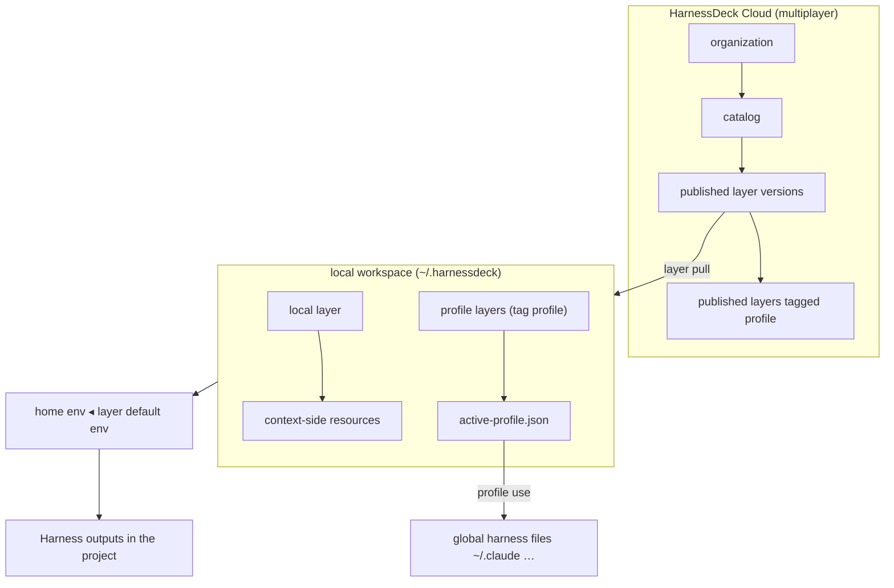

# Harnessdeck CLI specification

This document is the authoritative specification for `harnessdeck` / `hd`.

## Product summary

`harnessdeck` is an Agent harness configuration toolkit for Claude Code, Codex, Cursor, and other coding CLIs. It collects agent configuration into canonical local **resources**, composes **what** into versioned **layers** (with optional default **environments**) in a single local **workspace**, and syncs the resolved setup into project directories across supported agent harnesses. Teams publish layers to HarnessDeck Cloud **catalogs** under an **organization** for multiplayer discovery, install, and governance.

An **agent harness** is the complete infrastructure that wraps around an LLM and makes it a functional agent. In practice, that includes skills, MCP servers, hooks, plugins, rules, agent manifests, commands, and harness-specific configuration files.

The product currently supports these main workflows:

- Initialize local state, discover supported home-directory defaults, and choose global harness preferences.
- Scan an existing repository (or plugin source) and import agent configuration into a local database.
- Group imported resources into versioned **local layers** (`name` + `version` only).
- Diff, doctor, export, import, publish, search, install, or derive layers from a project scan.
- Compose layers by attaching context-side material resources, **`plugin_pin`** references (host marketplace/local plugins), and nested **`layer`** references through one attachment model.
- Apply one or more layers, a local bundle file, or a layer export URL to a project.
- Sync plugin composition resources from marketplace or local install roots via `resource sync`.
- Sync alias harness outputs, inspect drift from the latest snapshot, and revert a tracked project to an earlier snapshot.
- Export or import a machine-transfer archive of local layers, harness preferences, and config.
- Authenticate with HarnessDeck Cloud; search, install, and publish layers into org **catalogs**.
- Create, capture, and refresh **environments**; bind default environments to layers; switch home active environment; resolve the home → layer-default cascade on `layer apply`.
- Manage **profiles** (layers tagged `profile`) for global machine presets; switch active profile and apply to home harness paths with `profile use`.
- Authenticate HarnessDeck Cloud with named **accounts** (`cloud-accounts.json`, `--account` on catalog commands).

## Core concepts



The CLI uses a small set of concepts consistently across commands.

- `resource`: a single canonical item on the **context-side** (what the model sees) or **environment-side** (how it runs).
   - Context-side material types: instruction, skill, rule, MCP server, hook, agent, command.
   - Environment-side types: env var, model config, permission, secret references.
- `layer`: a versioned **context package** — material resources plus optional **`plugin_pin`** and **`layer`** composition refs, optional Claude host-plugin config, a `needs` contract satisfied by environment resources, and an optional default **environment**. Layers are what `layer apply` targets. See [Layer identity & scope](#layer-identity--scope).
- `host plugin`: an installable bundle in the host harness world (Claude/Cursor/Codex marketplace plugin): manifest + tree. Not a HarnessDeck storage row; materialized as namespaced resources after `resource sync` on a **plugin pin**.
- `plugin_pin`: a layer dependency on a host plugin (`plugin_pin:ref@marketplace`), with version constraint and sync metadata. Stored as `type=plugin_pin` in SQLite.
- `environment`: a named, swappable bundle of environment-side resources. Non-secret values can travel in migrate archives and layer exports; secrets are referenced, not embedded.
- `organization`: a Cloud tenant boundary (members, roles, billing). Required to publish layers for multiplayer use.
- `catalog`: a named collection of layers within an organization — the browse, search, and install scope in Cloud and the CLI. Required alongside an organization when publishing; omitted for purely local layers.
- `profile`: a layer whose `tags` include the reserved string `profile`; switchable global preset. `profile use` merges the profile stack (including transitive `layer` refs) and applies to machine home harness paths. Stored as a normal layer row — not a separate entity type.
- `workspace`: the single implicit local library in `~/.harnessdeck/harnessdeck.db` — all layers, resources, and environments. Share offline with `migrate export` / `import`, or share individual layers with `layer export` / `import`.
- `account`: a named HarnessDeck Cloud login identity in `~/.harnessdeck/cloud-accounts.json` (access tokens, refresh tokens, active org). Use `--account <name>` on catalog commands; distinct from a profile layer.
- `agent harness`: a supported target environment such as Claude Code, Codex, Cursor, or another tool-specific agent wrapper.
- `main harness`: the project's canonical harness reference. Imports, layer application, and sync planning normalize through this harness first.
- `alias harness`: an additional supported harness that mirrors the main harness. Alias harnesses use symlinks when the file layout allows it, and generated copies otherwise.
- `project`: a git-backed directory tracked by HarnessDeck, keyed by normalized `origin` when available.
- `snapshot`: a saved copy of files generated during layer application or project mirror.

### Layer identity & scope

Every layer has a **name** and **version** (semver). Identity is either **local** or **published**.

| Scope | Identity | Collision key | Cloud required? |
| --- | --- | --- | --- |
| **Local** | `name@version` | Unique in the local SQLite database | No — default for solo work |
| **Published** | `org/catalog/name@version` | Unique per org + catalog + name + version | Yes — required for `layer publish` and catalog browse |

**Selector grammar (target):**

```
layer_selector ::= [ org "/" catalog "/" ] name [ "@" version ]
```

Examples:

- `backend-oncall` — local layer; highest matching version when omitted.
- `backend-oncall@1.2.0` — local layer; exact version.
- `acme/platform-personas/frontend-engineer@2.1.0` — published layer in org `acme`, catalog `platform-personas`.

**Publishing rules:**

1. Local layers may be created, composed, exported, and applied with **no** organization or catalog.
2. `layer publish` requires an active Cloud organization, a target **catalog** name, and produces an immutable published version.
3. `layer search` and `layer pull` resolve against the CLI [catalog scope](#harnessdeck-cloud) (default public org + connected catalogs + authenticated private layers).

**Wire compatibility:** Cloud APIs and the CLI still accept `org/library[@version]` today. Treat `library` as the published **layer name** inside the org's default or named catalog until selectors migrate to `org/catalog/name`.

### Naming map (homonyms)

Use this table to disambiguate overlapping words. See also [CONTEXT.md](CONTEXT.md).

| Term | Meaning | CLI / storage |
| --- | --- | --- |
| **Layer** | Versioned context package (material resources + deps + optional default environment) | `hd layer …`, `layer apply <layer>` · `layers` + `layer_resources` |
| **Host plugin** | Claude/Cursor/Codex installable bundle (manifest + tree) | Host commands (`claude plugin install`, …) — not a HarnessDeck row |
| **`plugin_pin`** | Dependency on a host plugin attached to a layer | `layer combine plugin_pin:ref@mp`, `resource sync plugin_pin:…` · `resources.type=plugin_pin` |
| **`layer` ref** | Dependency on another HarnessDeck layer (catalog/local) | `layer combine layer:name@^1.0` · `resources.type=layer` |
| **Profile** | Layer tagged `profile`; global switch preset | `hd profile use <name>` · `layers.tags` includes `profile` |
| **Workspace** | Single local SQLite library; offline share via `migrate` | `~/.harnessdeck/harnessdeck.db` |
| **Catalog** | Org-scoped published layer collection (multiplayer) | `layer search`, `layer pull` · Cloud APIs |
| **Account** | Cloud auth identity (tokens, org context) | `auth login`, `--account` · `cloud-accounts.json` |

**Package.json analogy:** a **layer** is the package; **context-side resources** are source files; **`plugin_pin`** / **`layer` ref** are dependencies; **`environment`** is runtime config (.env).

Layer freshness and composition use `resource sync`, `layer doctor`, and `layer apply` plugin-version flags.

### Resource classification

| Context-side (*what*) | Environment-side (*how*) | Composition |
| --- | --- | --- |
| `instruction`, `skill`, `rule`, `mcp_server`, `hook`, `agent`, `command` | `env_var`, `model_config`, `permission` | `plugin_pin`, `layer` |

An `mcp_server` **definition** lives on the layer; tokens and URLs are contract keys (`needs`) filled by an environment.

`layer` composition resources are hidden from default `resource list`; `plugin_pin` resources are listed.

### Environment values

An **environment** is a named bundle of **environment values** — the runtime *how* configuration that layers may depend on:

| Kind | Storage |
| --- | --- |
| `env_var` | Non-secret key/value pairs |
| `model_config` | Model and provider selection |
| `permission` | Allow/deny/ask patterns |
| Secret reference | `environment_secret_refs` (`keychain`, `env`, `file`) — never the secret value |

Layers declare requirements via `needs[]`; MCP server definitions declare env keys in `mcp_server.env`. Environments satisfy those requirements.

**Toolkit configuration** (`harness_preferences`, `project_harnesses`, `~/.harnessdeck/config.jsonc`) controls HarnessDeck behavior and harness selection. It is not an environment.

See [Environment capture](#environment-capture) for creating or refreshing environments from project state.

### Resource identity and selectors

Resources are uniquely keyed by `(type, name, namespace)` where `namespace=''` means unnamespaced.

Selector grammar:

```
selector ::= [ type ":" ] name [ "@" namespace ]
```

Examples: `brainstorming`, `skill:brainstorming@cursor-team-kit`, `plugin_pin:posthog@cursor-team-kit`, `layer:backend-oncall`, `01J…` (ULID id).

- **Display** commands (`resource show`, `resource delete`): bare names prefer the unnamespaced row when present; otherwise list ambiguous matches.
- **Compose** commands (`layer combine`, merge, apply): require `@namespace` (or a ULID) when more than one namespace exists for the same `type:name`.

Imported bodies are content-addressed under `~/.harnessdeck/blobs/sha256/…` with `content_hash` stored on the row.

### Unified composition model

A layer is an ordered list of attachments:

| Attachment | `resource list` | Attach example | Refresh |
| --- | --- | --- | --- |
| Material (`skill`, …) | yes | `layer combine L skill:foo@ns` | via `resource sync` when `origin_kind=marketplace_link` |
| `plugin_pin` | yes | `layer combine L plugin_pin:posthog@cursor-team-kit` | `resource sync plugin_pin:posthog@cursor-team-kit` |
| `layer` | no | `layer combine L layer:backend-oncall@^1.0` | resolves to another local or published layer version |

Nested `layer` refs expand depth-first with cycle detection at apply time.

**Lazy plugin pin attach:** `layer combine plugin_pin:…` links only. Sync is explicit via `resource sync`, `layer combine --sync`, or `layer apply --sync-plugins`.

**Plugin pin metadata** (harness-agnostic):

```ts
interface PluginPinMetadata {
  source_kind: "marketplace" | "local" | "git";
  marketplace_name?: string;
  version_constraint?: string;   // absent = floating latest
  resolved_version?: string;     // set by last successful sync
  sync_status?: "synced" | "stale" | "pinned" | "never_synced";
  portable?: "reference" | "embed";
  manifests?: { claude?: Record<string, unknown>; cursor?: Record<string, unknown> };
}
```

### Environment cascade

Composition resolves by ordered override (last wins):

```
home environment  ◂  layer default environment
```

On `layer apply`, HarnessDeck merges environment fragments into layer serialization so env vars and model config override matching `type:name` resources. Home environments may be stored under `~/.harnessdeck/environments/<name>.json` (JSONC).

Switching the home active environment re-materializes how-values without reloading layer content — for example, moving from staging to prod while keeping the same layer stack.

### Offline workspace sharing

Share the full local workspace between machines with `migrate export` / `migrate import`. Archives include layer bundles, named environments (secret refs only), harness preferences, config, and `active-profile.json` when present. For surgical sharing, use `layer export` / `layer import` on individual layers. For multiplayer distribution, use `layer publish` / `layer pull` via HarnessDeck Cloud catalogs.

### Progressive enhancement

| Consumer | What they get |
| --- | --- |
| Without HarnessDeck | `claude plugin install` and direct reads of `AGENTS.md` / `.cursor/rules/` |
| With HarnessDeck | Environment swap, cascade, cross-harness materialization, drift detection |

## Invocation and global options

The package publishes two binaries (`harnessdeck` and `hd`) pointing at the same entrypoint. Help text, usage lines, and follow-up hints use whichever name launched the process.

Global options:

| Flag | Behavior |
| --- | --- |
| `-V, --harnessdeck-version` | Print CLI version |
| `-v, --verbose` | Show stack traces on errors |
| `--no-color` | Disable ANSI colors (also respects `NO_COLOR`) |
| `--no-interactive` | Disable interactive prompts |
| `-h, --help` | Show help (`--help --all` includes hidden aliases) |

### Noun shorthand aliases

| Full noun | Alias |
| --- | --- |
| `layer` | `l` |
| `resource` | `r` |
| `project` | `p` |
| `harness` | `h` |
| `environment` | `e` |
| `profile` | `p` |
| `cloud` | `c` |

## Command surface

Commands are grouped by noun. For flag-level detail see [docs/cli/command-reference.md](docs/cli/command-reference.md).

### Top-level commands

| Command | Current behavior |
| --- | --- |
| `harnessdeck init` | Creates `~/.harnessdeck/harnessdeck.db`, initializes the schema, seeds built-in layers, scans supported home-directory defaults, and optionally records global main/alias harness preferences. |
| `harnessdeck layer ...` | Layer CRUD, **apply**, composition attach/detach, bundle export/import, cloud catalog workflows, diff, and doctor. |
| `harnessdeck migrate ...` | Exports or imports a machine-transfer archive (offline workspace sharing). |
| `harnessdeck resource ...` | Lists, shows, deletes, and syncs canonical resources. |
| `harnessdeck project ...` | Scans projects, drift, mirror, snapshots, and status. |
| `harnessdeck harness ...` | Lists harness targets and manages global/project main/alias preferences. |
| `harnessdeck environment ...` | Creates and manages environments, environment values, secret refs, active-environment pointers, scoped capture/refresh, and cascade preview. |
| `harnessdeck profile ...` | Lists, shows, creates, tags, and switches profile layers; global apply via `profile use`. |
| `harnessdeck cloud ...` | Authenticates with HarnessDeck Cloud and manages local cloud accounts. |

### `layer` subcommands

| Command | Current behavior |
| --- | --- |
| `layer create` | Creates a local layer with optional description, tags, and version. |
| `layer list` | Lists layers (`NAME`, `VERSION`, `DESCRIPTION` columns; `--show-id` optional). |
| `layer show` | Shows layer metadata, resources, dependencies, composition attachments, and default environment when set. |
| `layer combine` | Adds a composition attachment. Selectors may use `type:` prefixes (`skill:foo`, `plugin_pin:posthog@mp`, `layer:baseline`) or `--type` when the prefix is omitted. Plugin pin attach is lazy by default; use `--sync` or `resource sync` to materialize install roots. |
| `layer uncombine` | Removes a typed attachment. |
| `layer delete` | Deletes a layer by selector. |
| `layer export` | Writes a portable JSONC layer export (`urn:harnessdeck:layer:v1`). |
| `layer import` | Imports a layer v1 file into the local database. |
| `layer apply` | Applies layer selectors, bundle paths, or bundle URLs to a project; resolves environment cascade; serializes per platform; snapshots git-backed projects. Flags: `--strict-plugin-versions`, `--ignore-plugin-versions`, `--sync-plugins`. |
| `layer search` | Searches remote catalogs through the configured cloud account and connected org scopes. |
| `layer pull` | Downloads a published layer and imports it locally (`org/catalog/name[@version]`; `org/library[@version]` accepted during migration). Interactive remote search on TTY when no selector is provided. |
| `layer publish` | Publishes a local layer to a Cloud org **catalog** (requires organization, catalog name, and publish scope). |
| `layer catalog list` | Shows default catalog, connected orgs, connected layers, and effective cloud base URL. |
| `layer catalog connect org <slug>` | Opt in to public layers from another org in browse/search scope. |
| `layer catalog disconnect org <slug>` | Remove a connected org from scope (cannot remove `harnessdeck-cloud`). |
| `layer catalog connect layer <org>/<name>` | Opt in to one published layer without subscribing to the whole org. |
| `layer catalog disconnect layer <org>/<name>` | Remove a connected layer from scope. |
| `layer diff` | Compares two layers, or a layer and a bundle file. |
| `layer doctor` | Multi-check diagnostic (`--check`, `--list-checks`; exits `1` when invalid). |
| `layer from-project` | Scans a project and creates a layer from imported resources. |
| `layer set-environment` | Sets the default environment on the layer that `layer apply` resolves for the given selector. |
| `layer unset-environment` | Clears the layer's default environment. |

### `environment` subcommands

| Command | Behavior |
| --- | --- |
| `environment create` | Creates an empty environment. |
| `environment list` | Lists environments with value counts and layer bindings. |
| `environment show` | Shows environment values, secret refs, and reverse references. |
| `environment delete` | Deletes an environment when unreferenced (or with `--force`). |
| `environment set` | Upserts environment values (`--var`, `--model`, `--permission`). |
| `environment unset` | Removes environment values. |
| `environment secret set` / `secret unset` | Manages secret references. |
| `environment import` / `export` | Reads or writes environment JSONC transport. |
| `environment use` | Sets the home active environment pointer; `--reapply` opt-in re-runs last applied layers. |
| `environment active` | Shows active environment and cascade preview. |
| `environment resolve` | Dry-run merged environment values per cascade tier. |
| `environment capture` | Creates an environment from scoped project capture (see [Environment capture](#environment-capture)). |
| `environment refresh` | Updates an existing environment from scoped project capture. |

### `resource` subcommands

| Command | Current behavior |
| --- | --- |
| `resource list` | Lists canonical resources; shows `name@namespace` when namespace is non-empty. Hides `type=layer` composition refs by default; use `--all` to disable per-type caps. |
| `resource show` | Prints the full stored resource (supports selector grammar). |
| `resource sync` | Refreshes `plugin_pin` resources and `marketplace_link` children from install roots. Supports `--on-conflict`, `--prune`, `--force`, `--dry-run`. |
| `resource delete` | Deletes a resource by selector or ID. |

### `project` subcommands

| Command | Current behavior |
| --- | --- |
| `project scan` | Detects harnesses, imports resources via hash-aware upsert, respects `.harnessdeckignore`, canonicalizes shared `AGENTS.md` instruction imports, prompts on TTY when content differs. Accepts plugin directories and marketplace manifests as scan sources. `--global` installs imported plugin sources into global harness locations. |
| `project drift` | Compares working tree against the latest apply/sync snapshot. |
| `project mirror` | Re-materializes alias harness outputs from the main harness reference. |
| `project history` | Lists stored snapshots (requires git-backed project). |
| `project revert` | Restores files from a snapshot. |
| `project status` | Shows harnesses, applied layers, snapshots, and harness preferences. |

### `harness` subcommands

| Command | Current behavior |
| --- | --- |
| `harness list` | Lists registered harness targets (`--supported` filters to natively serialized harnesses). |
| `harness set` | Sets global main/alias harness preferences (flags or interactive). |
| `harness status` | Shows the global harness preference record. |
| `harness project set` | Sets project-scoped main/alias harness preferences and materialization strategy. |
| `harness project status` | Shows project-scoped harness preferences. |

### `cloud` subcommands

| Command | Current behavior |
| --- | --- |
| `auth login [account]` | Device authentication; saves a named local cloud account. |
| `auth status` | Shows authenticated user/account context. |
| `auth orgs` | Lists organizations; `--switch` updates the active org. |
| `auth logout` | Removes a local cloud account. |

### `profile` subcommands

A **profile** is a layer whose `tags` include the reserved string `profile`. Profiles are not a separate storage type — they use the same `layers` table and publish pipeline as any layer.

| Command | Current behavior |
| --- | --- |
| `profile list` | Lists local layers where `tags` includes `profile`; marks the active profile from `active-profile.json`. |
| `profile show <name>` | Layer metadata plus profile summary (stack refs, active marker). |
| `profile active` | Prints the active profile name from `~/.harnessdeck/active-profile.json`. |
| `profile use <name>` | Resolves and merges the profile stack (transitive `layer` refs), optionally auto-pulls missing published dependencies, applies to **global** harness paths, writes `active-profile.json`, and records a global apply snapshot. If the profile layer has `default_environment_id`, updates the home active environment pointer. |
| `profile create <name>` | Creates an empty local layer with `tags: ["profile"]`. |
| `profile tag <layer>` | Adds the `profile` tag to an existing layer. |
| `profile untag <layer>` | Removes the `profile` tag; clears `active-profile.json` when untagging the active profile. |
| `profile search <query>` | Catalog search filtered to `tag=profile` (alias over `layer search`). |
| `profile pull <selector>` | Alias for `layer pull`; warns when the installed layer is not profile-tagged. |
| `profile publish <name>` | Alias for `layer publish` with profile validation warnings (empty stack, unpublished local deps). |

`profile use` flags:

| Flag | Purpose |
| --- | --- |
| `--dry-run` | Preview global diff without writing |
| `--harness <slugs>` | Override harness targets (default: global harness preference) |
| `--on-conflict <policy>` | `replace` \| `skip` \| `prompt` |
| `--account <name>` | Cloud account for catalog resolution during dependency pull |
| `--base-url <url>` | Cloud base URL for dependency pull |
| `--no-pull` | Fail when composition refs are missing locally instead of auto-pull |

**Scope:** `profile use` applies to machine **home** harness paths only. Project apply is `layer apply` only.

**Root shorthand:** when `argv[2]` is not a registered top-level command or alias and matches a local profile layer name, the CLI rewrites to `profile use <name>`. Reserved names always win — e.g. `hd init` stays `init`, `hd work` becomes `profile use work` when `work` is a profile-tagged layer.

Remote catalog workflows live on **`layer`**, not `cloud`:

- `layer search` — search catalogs in scope
- `layer pull` — fetch a published layer + local import (distinct from `layer import` on a local file)
- `layer publish` — export bundle + upload a versioned layer to an org catalog

`layer apply` resolves local layer names, bundle paths, and URLs. Published selectors (`org/catalog/name@version` or `org/name@version`) that are not installed locally are fetched from the catalog at apply time (same import path as `layer pull`).

### `migrate` subcommands

| Command | Current behavior |
| --- | --- |
| `migrate export <file>` | Exports local layers, environments (secret refs only), harness preferences, and config as a portable archive. |
| `migrate import <file>` | Imports a machine-transfer archive into the local workspace. |

## CLI UX contract

Human-readable output is the default. Automation uses explicit flags — output shape never changes based on TTY detection alone.

### Output modes

Structured read/report commands support:

- `--format human` (default)
- `--format json`

JSON coverage includes (non-exhaustive): `resource list|show`, `layer list|show`, `profile list|show|active|use`, `environment list|show|active|resolve`, `project status|history|drift`, `harness list|status`, `layer apply --dry-run`, `init`, `auth status|orgs`, `layer doctor`, `migrate export|import`, `environment capture|refresh` with `--dry-run`.

Mutation commands return concise human verdict lines unless they already expose structured summaries useful to scripts.

### Selector rules

- **Environments:** name or ULID.
- **Local layers:** `name`, `name@version`, or ULID.
- **Published layers:** `org/catalog/name`, `org/catalog/name@version`, or ULID when stored locally after `layer pull`.
- During migration, `org/library[@version]` resolves as `org/<default-catalog>/library`.
- **Resources:** `name`, `type:name`, `type:name@namespace`, or ULID.
- **Snapshots:** full snapshot IDs in `project history`; `project revert` accepts the same ID.

Ambiguous selectors are errors. Human mode lists candidates; JSON mode returns a structured ambiguity payload. The CLI never silently picks the first match.

### Reusable identifiers

When human output supports follow-up commands, it includes canonical identifiers:

- `resource list --show-id` prints full resource IDs (hidden by default in list tables).
- `layer show` prints resource IDs in the resources sub-table when `--show-id` is set.
- `project history` prints full snapshot IDs.

### Error handling

| Situation | Behavior |
| --- | --- |
| Not found | Clear message, non-zero exit |
| Ambiguous selector | Non-zero exit; candidates in human or JSON mode |
| Invalid option | Explicit validation error, non-zero exit |
| Plugin version mismatch on apply (default) | Warning; apply continues |
| Plugin version mismatch with `--strict-plugin-versions` | Exit `2` |
| `--strict-plugin-versions` and `--ignore-plugin-versions` together | Error |

## Wizard mode

Several commands support wizard mode for interactive use: `layer pull`, `layer show`, `layer delete`, `layer combine`, `layer uncombine`, `layer from-project`, `layer set-environment`, `layer apply`, `resource delete`, `environment create`, `environment capture`, `environment use`, `init`, `harness set`, and `harness project set`.

Wizard mode triggers when all of these are true:

1. stdin and stdout are TTYs.
2. `CI` is not `"true"`.
3. `HARNESSDECK_NO_INTERACTIVE` is not `"1"`.
4. `--no-interactive` is not present.
5. `--format json` is not requested.
6. The command was invoked with `--interactive`, or required positional input is missing.

When those conditions are not met, the CLI stays in explicit flag-and-argument mode.

## Human output

The CLI renders human mode through `src/ui/` primitives (`table`, `panel`, `diff`, `status`, `progress`). Design goals:

- One visual language across commands (semantic colors, `✓` / `⚠` / `✗` verdicts, boxed tables).
- List tables use uppercase muted headers and optional summary footers.
- Diff and drift output color rows by change kind (`+` / `−` / `~`).
- Spinners for long operations (`project scan`, `layer apply`, `project mirror`, `resource sync`) resolve to verdict lines in TTY mode; JSON mode and non-TTY runs skip spinners.
- `--no-color` and `NO_COLOR` disable styling; box-drawing degrades to ASCII when not a TTY.

JSON output is unchanged by the visual layer.

## Initialization and harness selection

`harnessdeck init` is the explicit first-run flow. It:

1. Initializes the local database.
2. Discovers supported harness configuration in the user's home directory and imports findings.
3. Seeds a local **`default` profile layer** (tagged `profile`) when none exists and writes `active-profile.json` → `{ "name": "default" }`. Does **not** run global apply — switch explicitly with `hd profile use default`. Pass `--no-default-profile` to skip.
4. Chooses the **main harness** and optional **alias harnesses** (interactive or via `--main` / `--aliases`).

Catalog baselines are not auto-applied at init. Apply them to projects with `layer apply <name>` (bare names resolve against the public catalog) or cache them with `layer pull`.

The main harness may differ from the first harness discovered on disk. Every later mirror operation uses one reference harness and a defined set of alias outputs.

After init, update preferences with `harness set` or `harness project set` (flags or interactive prompts).

## Storage and state

Persistent operational state lives in SQLite at `~/.harnessdeck/harnessdeck.db` (override with `HARNESSDECK_HOME`). The CLI creates the directory on demand and opens the database with WAL mode and foreign keys enabled.

### Configuration files

| Path | Purpose |
| --- | --- |
| `~/.harnessdeck/config.jsonc` | Toolkit configuration (JSONC comments allowed) |
| `~/.harnessdeck/cloud-accounts.json` | HarnessDeck Cloud accounts and tokens |
| `~/.harnessdeck/active-profile.json` | Active profile pointer (`{ "name": "<layer-name>" }`) |
| `~/.harnessdeck/plugin-refresh-cache.json` | Internal refresh timestamps used during `resource sync` |
| `~/.harnessdeck/environments/<name>.json` | Named environment fragments (JSONC) |
| `~/.harnessdeck/blobs/sha256/…` | Content-addressed resource bodies |

Example `config.jsonc`:

```jsonc
{
  "plugins": {
    "refreshMaxAgeHours": 24
  }
}
```

Edit `config.jsonc` directly to tune toolkit options such as plugin refresh age.

### Schema (logical tables)

**Target model** (single layer table with optional `org_slug`, `catalog_slug`, composition attachments, and `default_environment_id`):

- `layers` — versioned capabilities (local or published identity).
- `layer_resources` — ordered attachments on a layer.
- `environments`, `environment_resources`, `environment_secret_refs` — named how-value bundles.
- `projects`, `project_layers` — tracked directories and applied layers.
- `resources` — canonical configuration items (including `plugin_pin` and `layer` composition resource types).
- `harness_preferences`, `project_harnesses`, `snapshots`, `global_apply_snapshots`, `global_apply_snapshot_installs`, `schema_version`.

**Global apply snapshots** (schema v20): each `profile use` records a `global_apply_snapshots` row plus per-harness file maps in `global_apply_snapshot_installs` for conflict tracking and future revert support. Project-bound `snapshots` remain separate.

### Project tracking

Project identity uses a normalized git `origin` remote. `project history`, `project drift`, `harness project set`, and `harness project status` require a git-backed project.

During `project scan`, `layer apply`, and `project mirror`, HarnessDeck reads `origin`, normalizes it, and uses it as the durable key. The last known local path is stored for convenience.

### Snapshot behavior

Snapshots are created during `layer apply` and `project mirror` when the target has a git origin. A snapshot stores the generated file map for the main harness and every alias harness materialized in that operation. `project revert` restores those files. `project drift` compares the latest snapshot to the working tree.

## Canonical model

### Resource types

`instruction`, `skill`, `rule`, `mcp_server`, `permission`, `hook`, `agent`, `command`, `env_var`, `model_config`, `plugin_pin`, `layer`.

Metadata varies by type. See [Unified composition model](#unified-composition-model).

### Environment model

An environment has a unique `name`, description, ordered **environment values** (`env_var`, `model_config`, `permission` resources linked via `environment_resources`), and optional `environment_secret_refs` (`keychain`, `env`, or `file`). Secret values are not stored in migrate archives or layer exports.

### Environment capture

**Environment capture** creates or refreshes an environment from the current state of a project. It is distinct from **apply snapshots** stored during `layer apply` / `project mirror`.

`environment capture` and `environment refresh` store only environment values **required by the layer stack in scope** — not the full machine environment:

1. Resolve scope: `--project` (required), `--layers` (default: project's last-applied layers).
2. Compute requirements from layer `needs[]`, MCP `env` keys, and (by default) agent model metadata in the merged stack.
3. Read values from project harness files first, then matching layer/resource rows, then `process.env[key]` for missing keys only.
4. Store non-secrets as `env_var` / `model_config` environment values; store likely secrets as secret references (`provider: env`), never literal secret values.
5. Missing required keys: warn and continue by default; `--strict` exits non-zero.

Permissions are captured only with `--include-permissions`.

### Layer model

A **layer** is the primary composable unit.

**Body:**

- Ordered context-side **resources** (instructions, skills, rules, MCP servers, hooks, agents, commands).
- Composition attachments: **`plugin_pin`** refs (host marketplace/local) and **`layer`** refs (other layers, local or published).
- Optional Claude marketplace/plugin config and `needs[]` contract keys.
- Optional `default_environment_id` for environment cascade on apply.

**Identity:**

| Field | Local layer | Published layer |
| --- | --- | --- |
| `name` | required | required |
| `version` | required (semver) | required (immutable per publish) |
| `org_slug` | null | required |
| `catalog_slug` | null | required |
| `description`, `tags` | optional | optional |

**Behavior:**

- `layer apply` resolves and materializes one or more layers (later layers override earlier for matching `type:name` keys).
- Nested `layer` refs expand depth-first; published refs resolve through catalog scope and semver constraints.
- Resource order is preserved during serialization.

**CLI selectors:** ULID; `name` (highest version wins locally); `name@version`; `org/catalog/name@version` for published layers.

**Implementation (SQLite v15):** composition and apply identity share one `layers` row per capability. `layer_resources` holds ordered attachments. Published identity uses `org_slug` / `catalog_slug` (empty strings for local layers).

### Workspace model

The local workspace is the single SQLite library at `~/.harnessdeck/harnessdeck.db`. All layers, resources, and environments live here. Share the full workspace offline with `migrate export` / `import`, or share individual layers with `layer export` / `import`.

## Agent harness model

Harness support splits between a registry and serializers. The registry declares capability flags and default project/global paths. Serializers implement scan, canonicalization, aliasing rules, and write behavior.

Not every host surface round-trips through apply or mirror. Static resources (skills, instructions, rules, MCP, commands, agents) bridge faithfully; hooks with install-time `${*_PLUGIN_ROOT}` paths, OpenCode `.mjs` server plugins, pi extensions, runtime mode state, and host-specific statusline integrations do not. Registry metadata such as `skillEmission: instruction-only` and project `cursor_skill_mode` control how skills are re-emitted per harness. See [Portability limits](docs/portability-limits.md) for the full fidelity matrix, workarounds (`resource sync`, plugin pins, `project mirror --reference`), and related scenarios 31–34.

### Native serializers

Dedicated serializers exist for `claude-code`, `codex`, `cursor`, `opencode`, `github-copilot`, and `copilot-cli`. Remaining registered harnesses use the generic serializer.

### Generic serializer

Other registered harnesses use the generic serializer with registry-declared paths.

### Registered harnesses

`harness list` is the executable source of truth (31 harness IDs at time of writing). `harness status` and `harness project status` report configured main and alias harness selection.

## Scan, apply, import, and sync behavior

The CLI favors deterministic file I/O over merge-heavy workflows.

### Scan

`project scan` detects harnesses by declared project paths, reads resources through serializers, and deduplicates within a run before upserting into SQLite (`origin_kind=local_snapshot`).

**Shared instruction canonicalization:** when multiple AGENTS-based platforms share one `AGENTS.md`, the scanner imports a single canonical instruction instead of per-platform `*-instructions` synthetic names. Rescans remove stale synthetic duplicates when content matches.

**`.harnessdeckignore`:** gitignore-style patterns at the project root exclude paths from project scan and `layer from-project`. Applies to project-derived flows only (not home-default discovery during `init`).

**Plugin sources:** scanning a plugin root (`.cursor-plugin/plugin.json`, `.claude-plugin/plugin.json`, `.codex-plugin/plugin.json`, `.github/plugin/plugin.json`) or marketplace manifest snapshots plugin content into canonical resources. `--global` installs into each configured harness's global paths; `--harness` limits targets.

**Dual-mode repos:** when a project has both harness files and a plugin manifest, `project scan` automatically merges harness scan with plugin-source import. `layer from-project` always uses the merged scan.

**Symlinked `AGENTS.md`:** platform detection ignores symlinked `AGENTS.md` so a link to `CLAUDE.md` does not register a spurious AGENTS-based harness.

When one supported harness already exists in a project, it becomes the default main harness for that project.

### `add`

`hd add <source>` installs skills from a remote GitHub repo, Git URL, or local skill-package directory. It discovers skills recursively, imports the full package into the library under a source namespace, installs a selected subset to the hub (`~/.agents/skills/` globally or `{project}/.agents/skills/` for project scope) with fan-out symlinks to target harnesses, and optionally creates or attaches a layer with namespaced skill refs (`skill:{name}@{namespace}`). Use `--list` to discover only, `--dry-run` to preview, and `--create-layer` / `--layer` to bridge into layer apply workflows.

### Apply

`layer apply` accepts layer selectors, bundle files, or bundle URLs. Later layers override earlier ones for matching `type:name` resources, Claude config entries, and plugin refs. Environment cascade merges home and per-layer default fragments before serialization.

`layer` composition resources expand depth-first with cycle detection.

Plugin resources with `never_synced` or `stale` status warn by default; pass `--sync-plugins` to refresh before materialize.

When generated files already exist, `layer apply` uses `--on-conflict replace|skip|prompt` (default: `prompt` on TTY, otherwise `replace`).

### Global profile apply

`profile use` applies merged profile layer resources to **machine home** harness paths (e.g. `~/.claude/`, `~/.codex/`). Flow:

1. Resolve profile layer by selector; require `tags` includes `profile`.
2. `mergeLayersForApply` for the profile layer plus transitive `layer` refs (auto-pull missing published refs unless `--no-pull`).
3. Resolve harness targets from global `harness_preferences` when `--harness` is omitted.
4. `resolveEnvironmentCascadeForApply` with `projectRoot: homedir()`, configured layer IDs from the merged stack.
5. `preparePluginPinsForApply` at global/home scope.
6. `applyToGlobal` with conflict policy; record `global_apply_snapshots`.

`environment use` without `--project` remains valid for env-only switches; prefer `profile use` when changing both stack and default environment.

For `layer apply`, when no `--harness` list is passed, platforms are detected from the target directory. If none are detected, the command warns and does not write files.

### Project sync

`project mirror` materializes alias harness outputs from the main harness reference, preferring symlinks and falling back to copies. `--force-shift-reference` shifts the project's reference harness before syncing. `--reference auto|main|plugin|agents` selects the on-disk source; `auto` merges repo-root plugin skills when the main harness has instructions but no on-disk skills, and falls back to plugin-source then `AGENTS.md` instructions when the main harness tree is empty.

### Project drift

`project drift` loads the latest snapshot and reports added, modified, or deleted generated files.

### `resource sync`

For `type=plugin_pin` resources:

1. Resolve marketplace or local install path.
2. Fetch or re-scan via `plugin-source-import`.
3. Update plugin metadata (`resolved_version`, `manifests`, `sync_status`).
4. Diff and upsert child resources in the plugin namespace.
5. On conflict, prompt on TTY or honor `--on-conflict overwrite|ignore|fail` (default `fail` when non-interactive).

Orphans are removed only with `--prune`.

## Transport formats

All portable transport uses **TOML** (`smol-toml`). JSON and JSONC transport files are rejected. Toolkit config (`~/.harnessdeck/config.jsonc`) remains JSONC.

### Layer v1

`urn:harnessdeck:layer:v1` in `*.harnessdeck.toml`. Each file contains one or more `[[layers]]` rows with nested `[[layers.resources]]`, optional `plugin_pins` (or `[[layers.plugin_pins]]` tables), optional root `embedded_plugins`, and optional `claude` configuration. Multiline resource and host-plugin file bodies use TOML `"""` strings.

Default export path: `<name>.harnessdeck.toml`.

### Machine transfer archives

`migrate export` writes layer bundles and environment definitions inside a tar.gz archive with JSON metadata. `migrate import` restores them into the local workspace. Archives include harness preferences, config, and `active-profile.json` when present. Environment secret refs are preserved; secret values are not embedded. They do not include tracked project records, project snapshots, or cloud accounts.

Use `migrate` for full workspace handoff; use `layer export` / `layer import` for sharing individual layers.

## HarnessDeck Cloud

HarnessDeck Cloud is the multiplayer control plane for **published layers**. An **organization** owns **catalogs**; each catalog holds versioned layers teams can search, review, and install. Offline workspace sharing uses `migrate`; catalogs are the default multiplayer distribution surface.

Authentication stores named accounts in `~/.harnessdeck/cloud-accounts.json`. There is no `cloud-profiles.json` and no `--profile` flag — use `--account` on catalog and auth commands. Re-run `auth login` after upgrading from pre-account CLI builds.

- `auth login [account]` performs device authentication and saves a named cloud account.
- `auth status`, `auth orgs`, and `auth logout` manage accounts and active org context.
- `layer search`, `layer pull`, and `layer publish` use the selected cloud account (`--account`).
- `profile search` and `profile pull` filter or validate profile-tagged layers (`tag=profile`).

### Catalog scope

The CLI builds a **catalog scope** from:

| Source | Contents |
| --- | --- |
| Default catalog | Public layers in the `harnessdeck-cloud` org (always included) |
| Connected org | `layer catalog connect org <slug>` — public layers from that org |
| Connected layer | `layer catalog connect layer <org/name>` — opt-in to one published layer |
| Authenticated | Private and shared layers in orgs the user belongs to |

`layer search` and interactive `layer pull` query this union. Configuration persists under `catalog` in `~/.harnessdeck/config.jsonc`.

### Publish and install

| Action | Requires | Result |
| --- | --- | --- |
| `layer publish` | Cloud org, target **catalog**, publish scope | New immutable version under `org/catalog/name` |
| `layer pull` | Selector in catalog scope (or explicit `org/catalog/name@version`) | Local import of the published bundle |
| Solo local work | Neither org nor catalog | Layers exist only in local SQLite until published |

**Wire compatibility:** Cloud APIs today expose published layers as `org/library` entries (`layer_libraries` in HarnessDeck Cloud). Spec-wise, `library` is a published **layer name**; explicit `catalog` segments in selectors and APIs are the target shape. See [harnessdeck-cloud SPEC](../harnessdeck-cloud/SPEC.md).

Local integration behavior:

- Token refresh before remote calls; re-login guidance on refresh failure.
- No silent account/org switching during other commands.
- `layer pull` fails on local name conflict instead of overwriting.

## Terminal demos (VHS)

Executable terminal demos supplement written scenarios in `docs/scenarios/`. Sources live under `docs/scenarios/vhs/tapes/`; rendered GIFs under `docs/scenarios/vhs/output/`. Regenerate with `bun run docs:vhs` (`scripts/generate-vhs-scenarios.sh`). Demos run against isolated fixture workspaces — not contributor home directories. VHS is not part of `bun run preflight`.

The primary walkthrough is a single adoption story (`init` → `project scan` → `resource list` → `layer list` → `layer apply` → `project status`) embedded from the root README.

## Build, test, and release workflow

The project uses Bun for local dependency management, CI, and builds. Distribution is through the npm registry.

```bash
bun install
bun run lint
bun run typecheck
bun run test:run
bun run build
```

`tsup` builds the CLI from `src/index.ts` into `dist/` as a Node 20 ESM CLI with declaration files and a `#!/usr/bin/env node` banner. `prepublishOnly` runs `bun run build`.

## Known gaps and non-goals

- Remaining registered harnesses (beyond the six dedicated serializers) use path-driven generic serialization.
- `layer export` / `layer import` operate on one layer at a time; use `migrate export` / `import` for full workspace handoff.
- HarnessDeck does not host a plugin marketplace or wrap `claude plugin install|uninstall`.
