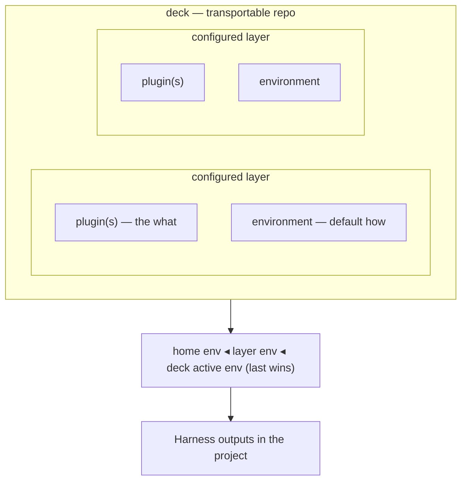

# Harnessdeck CLI specification

This document is the authoritative specification for `harnessdeck` / `hd`.

## Product summary

`harnessdeck` is an Agent harness configuration toolkit for Claude Code, Codex, Cursor, and other coding CLIs. It collects agent configuration into canonical local resources, groups **what** resources into **plugins**, binds plugins and default **environments** into **configured layers**, curates those layers into portable **decks**, and syncs the resolved setup into project directories across supported agent harnesses.

An **agent harness** is the complete infrastructure that wraps around an LLM and makes it a functional agent. In practice, that includes skills, MCP servers, hooks, plugins, rules, agent manifests, commands, and harness-specific configuration files.

The product currently supports these main workflows:

- Initialize local state, seed built-in layers, discover supported home-directory defaults, and choose global harness preferences.
- Scan an existing repository (or plugin source) and import agent configuration into a local database.
- Group imported resources into versioned design plugins and configured layers.
- Diff, doctor, export, import, publish, search, install, or derive layers from a project scan.
- Compose layers by attaching material resources, `plugin` references, and `layer` dependencies through one attachment model.
- Apply one or more configured layers, a local bundle file, or a bundle URL to a project.
- Sync plugin composition resources from marketplace or local install roots via `resource sync`.
- Sync alias harness outputs, inspect drift from the latest snapshot, and revert a tracked project to an earlier snapshot.
- Export or import a machine-transfer archive of local plugins, configured layers, harness preferences, and config.
- Authenticate with HarnessDeck Cloud and search, install, or publish layer bundles.
- Resolve **environment** values with a home → layer default → deck-active cascade on `project apply`.

## Core concepts



The CLI uses a small set of concepts consistently across commands.

- `resource`: a single canonical item stored in SQLite with optional **namespace** and **origin** metadata. Plugin-side types: instruction, skill, rule, MCP server, hook, agent, command. Environment-side types: env var, model config, **permission** (permissions are *how* values, not plugin-side resources). Composition types: `plugin`, `layer`.
- `plugin` (design-time): an ordered bundle of plugin-side resources, optional Claude marketplace/plugin config, composition attachments (`plugin` and `layer` resource refs), and a `needs` config contract. The `layer` command group manages these bundles in the CLI.
- `environment`: a named, swappable bundle of how-values (env vars, model config, permissions) plus secret references. Non-secret values can travel in a deck; secrets are referenced, not embedded.
- `configured layer`: a binding of one or more design plugins with an optional default environment — a configured capability such as "backend on-call." This is what `project apply` targets when applying layer selectors.
- `deck`: a curated bundle of configured layers and environments, importable as a git repo and described by `.harnessdeck/deck.json`.
- `agent harness`: a supported target environment such as Claude Code, Codex, Cursor, or another tool-specific agent wrapper.
- `main harness`: the project's canonical harness reference. Imports, layer application, and sync planning normalize through this harness first.
- `alias harness`: an additional supported harness that mirrors the main harness. Alias harnesses use symlinks when the file layout allows it, and generated copies otherwise.
- `project`: a git-backed directory tracked by HarnessDeck, keyed by normalized `origin` when available.
- `snapshot`: a saved copy of files generated during layer application or project sync.

### Naming map (three kinds of "plugin" / "layer")

| Concept | CLI | SQLite |
| --- | --- | --- |
| Design **plugin** (resource bundle + Claude config) | `hd layer …` | `plugins`, `plugin_resources`, … |
| **`plugin` resource** (marketplace/local reference) | `layer attach plugin:ref` or `--type plugin` | `resources` (`type=plugin`) + `plugin_resources` |
| **`layer` resource** (composition ref) | `layer attach layer:name` or `--type layer` | `resources` (`type=layer`) + `plugin_resources` |
| **Configured layer** | `project apply <layer>` | `configured_layers`, `configured_layer_plugins` |
| **Deck** | library APIs + `.harnessdeck/deck.json` | `decks`, `deck_configured_layers` |

Plugin freshness and composition use `resource sync`, `layer doctor`, and `project apply` plugin-version flags.

### Resource classification

| Plugin (*what*) | Environment (*how*) | Composition |
| --- | --- | --- |
| `instruction`, `skill`, `rule`, `mcp_server`, `hook`, `agent`, `command` | `env_var`, `model_config`, `permission` | `plugin`, `layer` |

An `mcp_server` **definition** lives on the plugin; tokens and URLs are contract keys (`needs`) filled by an environment.

`layer` composition resources are hidden from default `resource list`; `plugin` resources are listed.

### Settings umbrella (UX)

**Settings** is the user-facing umbrella for runtime configuration — there is no separate `settings` table:

```
settings ≡ environments (env_var, model_config, permission)
         + environment_secret_refs
         + harness_preferences / project_harnesses
         + ~/.harnessdeck/config.jsonc
```

Environments are managed through the library schema and deck transport.

### Resource identity and selectors

Resources are uniquely keyed by `(type, name, namespace)` where `namespace=''` means unnamespaced.

Selector grammar:

```
selector ::= [ type ":" ] name [ "@" namespace ]
```

Examples: `brainstorming`, `skill:brainstorming@cursor-team-kit`, `plugin:posthog@cursor-team-kit`, `layer:backend-oncall`, `01J…` (ULID id).

- **Display** commands (`resource show`, `resource delete`): bare names prefer the unnamespaced row when present; otherwise list ambiguous matches.
- **Compose** commands (`layer attach`, merge, apply): require `@namespace` (or a ULID) when more than one namespace exists for the same `type:name`.

Imported bodies are content-addressed under `~/.harnessdeck/blobs/sha256/…` with `content_hash` stored on the row.

### Unified composition model

A design plugin is an ordered list of attachments on a `layer`:

| Attachment | `resource list` | Attach example | Refresh |
| --- | --- | --- | --- |
| Material (`skill`, …) | yes | `layer attach L skill:foo@ns` | via `resource sync` when `origin_kind=marketplace_link` |
| `plugin` | yes | `layer attach L plugin:posthog@cursor-team-kit` | `resource sync plugin:posthog@cursor-team-kit` |
| `layer` | no | `layer attach L layer:backend-oncall@^1.0` | resolves to a library layer version |

**Lazy plugin attach:** `layer attach plugin:…` links only. Sync is explicit via `resource sync`, `layer attach --sync`, or `project apply --sync-plugins`.

**Plugin resource metadata** (harness-agnostic):

```ts
interface PluginResourceMetadata {
  source_kind: "marketplace" | "local" | "git";
  marketplace_name?: string;
  version_constraint?: string;   // absent = floating latest
  resolved_version?: string;     // set by last successful sync
  sync_status?: "synced" | "stale" | "pinned" | "never_synced";
  portable?: "reference" | "embed";
  manifests?: { claude?: Record<string, unknown>; cursor?: Record<string, unknown> };
}
```

### Environment cascade

Composition resolves by ordered override (last wins):

```
home environment  ◂  configured-layer default environment  ◂  deck active environment
```

On `project apply`, HarnessDeck merges environment fragments into plugin-side serialization so env vars and model config override matching `type:name` resources. Home environments may be stored under `~/.harnessdeck/environments/<name>.json` (JSONC).

Switching deck active environment re-materializes how-values without reloading plugins — for example, moving from staging to prod while keeping the same layer stack.

### Hybrid deck repo layout

A deck ships as a git repo that is simultaneously a valid Claude **marketplace** (installable without HarnessDeck) and a carrier for the canonical bundle:

```
my-deck/
├─ .claude-plugin/marketplace.json
├─ <plugin-name>/.claude-plugin/plugin.json   # + harnessdeck.needs
├─ AGENTS.md · .cursor/rules/ · …             # generated native files
└─ .harnessdeck/
   ├─ deck.json                                # urn:harnessdeck:deck:v1
   └─ environments/<name>.json                 # non-secret values only
```

`.harnessdeck/deck.json` is the lossless source; marketplace and native files are **generated** and checked by deck doctor. See [Transport formats](#transport-formats).

### Progressive enhancement

| Consumer | What they get |
| --- | --- |
| Without HarnessDeck | `claude plugin install` and direct reads of `AGENTS.md` / `.cursor/rules/` |
| With HarnessDeck | Environment swap, cascade, cross-harness materialization, drift detection |

## Invocation and global options

The package publishes two binaries (`harnessdeck` and `hd`) pointing at the same entrypoint. Help text, usage lines, and follow-up hints use whichever name launched the process.

Global options:

| Flag | Behavior |
| --- | --- |
| `-V, --harnessdeck-version` | Print CLI version |
| `-v, --verbose` | Show stack traces on errors |
| `--no-color` | Disable ANSI colors (also respects `NO_COLOR`) |
| `--no-interactive` | Disable interactive prompts |
| `-h, --help` | Show help (`--help --all` includes hidden aliases) |

### Noun shorthand aliases

| Full noun | Alias |
| --- | --- |
| `layer` | `l` |
| `resource` | `r` |
| `project` | `p` |
| `harness` | `h` |
| `cloud` | `c` |

## Command surface

Commands are grouped by noun. For flag-level detail see [docs/cli/command-reference.md](docs/cli/command-reference.md).

### Top-level commands

| Command | Current behavior |
| --- | --- |
| `harnessdeck init` | Creates `~/.harnessdeck/harnessdeck.db`, initializes the schema, seeds built-in plugins, scans supported home-directory defaults, and optionally records global main/alias harness preferences. |
| `harnessdeck layer ...` | Plugin bundle CRUD, composition attach/detach, bundle export/import, cloud catalog, diff, and doctor. |
| `harnessdeck migrate ...` | Exports or imports a machine-transfer archive. |
| `harnessdeck resource ...` | Lists, shows, deletes, and syncs canonical resources. |
| `harnessdeck project ...` | Scans projects, applies layers, syncs alias harnesses, inspects drift, lists snapshot history, reverts snapshots, and shows project status. |
| `harnessdeck harness ...` | Lists harness targets and manages global/project main/alias preferences. |
| `harnessdeck cloud ...` | Authenticates with HarnessDeck Cloud and manages local cloud profiles. |

### `layer` subcommands

| Command | Current behavior |
| --- | --- |
| `layer create` | Creates a design plugin with optional description, tags, and version. |
| `layer list` | Lists design plugins (`NAME`, `VERSION`, `DESCRIPTION` columns; `--show-id` optional). |
| `layer show` | Shows plugin metadata, resources, dependencies, and composition attachments. |
| `layer attach` | Adds a composition attachment. Selectors may use `type:` prefixes (`skill:foo`, `plugin:posthog@mp`, `layer:baseline`) or `--type` when the prefix is omitted. Plugin attach is lazy by default; use `--sync` or `resource sync` to materialize install roots. |
| `layer detach` | Removes a typed attachment. |
| `layer delete` | Deletes a layer by selector. |
| `layer export` | Writes a portable JSONC bundle (`urn:harnessdeck:bundle:v1`). |
| `layer import` | Imports a bundle v1 file into the local database. |
| `layer search` | Searches the remote layer catalog through the configured cloud profile. |
| `layer add` | Downloads a remote layer bundle and imports it (`org/library[@version]`). Interactive remote search on TTY when no selector is provided. |
| `layer publish` | Publishes a local layer to the remote catalog. |
| `layer diff` | Compares two local layers, or a layer and a bundle file. |
| `layer doctor` | Multi-check diagnostic (`--check`, `--list-checks`; exits `1` when invalid). |
| `layer from-project` | Scans a project and creates a layer from imported resources. |

### `resource` subcommands

| Command | Current behavior |
| --- | --- |
| `resource list` | Lists canonical resources; shows `name@namespace` when namespace is non-empty. Hides `type=layer` composition refs by default; use `--all` to disable per-type caps. |
| `resource show` | Prints the full stored resource (supports selector grammar). |
| `resource sync` | Refreshes `plugin` resources and `marketplace_link` children from install roots. Supports `--on-conflict`, `--prune`, `--force`, `--dry-run`. |
| `resource delete` | Deletes a resource by selector or ID. |

### `project` subcommands

| Command | Current behavior |
| --- | --- |
| `project scan` | Detects harnesses, imports resources via hash-aware upsert, respects `.harnessdeckignore`, canonicalizes shared `AGENTS.md` instruction imports, prompts on TTY when content differs. Accepts plugin directories and marketplace manifests as scan sources. `--global` installs imported plugin sources into global harness locations. |
| `project apply` | Applies configured-layer selectors, bundle paths, or bundle URLs; resolves environment cascade; serializes per platform; snapshots git-backed projects. Flags: `--strict-plugin-versions`, `--ignore-plugin-versions`, `--sync-plugins`. |
| `project drift` | Compares working tree against the latest apply/sync snapshot. |
| `project sync` | Re-materializes alias harness outputs from the main harness reference. |
| `project history` | Lists stored snapshots (requires git-backed project). |
| `project revert` | Restores files from a snapshot. |
| `project status` | Shows harnesses, applied layers, snapshots, and harness preferences. |

### `harness` subcommands

| Command | Current behavior |
| --- | --- |
| `harness list` | Lists registered harness targets (`--supported` filters to natively serialized harnesses). |
| `harness set` | Sets global main/alias harness preferences (flags or interactive). |
| `harness status` | Shows the global harness preference record. |
| `harness project set` | Sets project-scoped main/alias harness preferences and materialization strategy. |
| `harness project status` | Shows project-scoped harness preferences. |

### `cloud` subcommands

| Command | Current behavior |
| --- | --- |
| `cloud login [profile]` | Device authentication; saves a named local cloud profile. |
| `cloud whoami` | Shows authenticated user/profile context. |
| `cloud orgs` | Lists organizations; `--switch` updates the active org. |
| `cloud logout` | Removes a local cloud profile. |

Remote library workflows live on **`layer`**, not `cloud`:

- `layer search` — remote discovery
- `layer add` — remote fetch + local import (distinct from `layer import` on a local file)
- `layer publish` — export bundle + upload to cloud

`project apply` applies already-resolved local inputs; fetch remote layers with `layer add` first.

### `migrate` subcommands

| Command | Current behavior |
| --- | --- |
| `migrate export <file>` | Exports local layers as bundle files plus harness preferences and config. |
| `migrate import <file>` | Imports a machine-transfer archive. |

## CLI UX contract

Human-readable output is the default. Automation uses explicit flags — output shape never changes based on TTY detection alone.

### Output modes

Structured read/report commands support:

- `--format human` (default)
- `--format json`

JSON coverage includes (non-exhaustive): `resource list|show`, `layer list|show`, `project status|history|drift`, `harness list|status`, `project apply --dry-run`, `init`, `cloud whoami|orgs`, `layer doctor`, `migrate export|import`.

Mutation commands return concise human verdict lines unless they already expose structured summaries useful to scripts.

### Selector rules

- **Layers / design plugins:** name, `name@version`, or ULID.
- **Resources:** `name`, `type:name`, `type:name@namespace`, or ULID.
- **Snapshots:** full snapshot IDs in `project history`; `project revert` accepts the same ID.

Ambiguous selectors are errors. Human mode lists candidates; JSON mode returns a structured ambiguity payload. The CLI never silently picks the first match.

### Reusable identifiers

When human output supports follow-up commands, it includes canonical identifiers:

- `resource list --show-id` prints full resource IDs (hidden by default in list tables).
- `layer show` prints resource IDs in the resources sub-table when `--show-id` is set.
- `project history` prints full snapshot IDs.

### Error handling

| Situation | Behavior |
| --- | --- |
| Not found | Clear message, non-zero exit |
| Ambiguous selector | Non-zero exit; candidates in human or JSON mode |
| Invalid option | Explicit validation error, non-zero exit |
| Plugin version mismatch on apply (default) | Warning; apply continues |
| Plugin version mismatch with `--strict-plugin-versions` | Exit `2` |
| `--strict-plugin-versions` and `--ignore-plugin-versions` together | Error |

## Wizard mode

Several commands support wizard mode for interactive use: `layer add`, `layer show`, `layer delete`, `layer attach`, `layer detach`, `layer from-project`, `project apply`, `resource delete`, `init`, `harness set`, and `harness project set`.

Wizard mode triggers when all of these are true:

1. stdin and stdout are TTYs.
2. `CI` is not `"true"`.
3. `HARNESSDECK_NO_INTERACTIVE` is not `"1"`.
4. `--no-interactive` is not present.
5. `--format json` is not requested.
6. The command was invoked with `--interactive`, or required positional input is missing.

When those conditions are not met, the CLI stays in explicit flag-and-argument mode.

## Human output

The CLI renders human mode through `src/ui/` primitives (`table`, `panel`, `diff`, `status`, `progress`). Design goals:

- One visual language across commands (semantic colors, `✓` / `⚠` / `✗` verdicts, boxed tables).
- List tables use uppercase muted headers and optional summary footers.
- Diff and drift output color rows by change kind (`+` / `−` / `~`).
- Spinners for long operations (`project scan`, `project apply`, `project sync`, `resource sync`) resolve to verdict lines in TTY mode; JSON mode and non-TTY runs skip spinners.
- `--no-color` and `NO_COLOR` disable styling; box-drawing degrades to ASCII when not a TTY.

JSON output is unchanged by the visual layer.

## Initialization and harness selection

`harnessdeck init` is the explicit first-run flow. It:

1. Initializes the local database.
2. Seeds built-in starter plugins from `builtin-plugins/`.
3. Discovers supported harness configuration in the user's home directory and imports findings.
4. Chooses the **main harness** and optional **alias harnesses** (interactive or via `--main` / `--aliases`).

The main harness may differ from the first harness discovered on disk. Every later sync operation uses one reference harness and a defined set of alias outputs.

After init, update preferences with `harness set` or `harness project set` (flags or interactive prompts).

## Storage and state

Persistent operational state lives in SQLite at `~/.harnessdeck/harnessdeck.db` (override with `HARNESSDECK_HOME`). The CLI creates the directory on demand and opens the database with WAL mode and foreign keys enabled.

### Configuration files

| Path | Purpose |
| --- | --- |
| `~/.harnessdeck/config.jsonc` | User settings (JSONC comments allowed) |
| `~/.harnessdeck/cloud-profiles.json` | HarnessDeck Cloud profiles and tokens |
| `~/.harnessdeck/plugin-refresh-cache.json` | Internal refresh timestamps used during `resource sync` |
| `~/.harnessdeck/environments/<name>.json` | Named environment fragments (JSONC) |
| `~/.harnessdeck/blobs/sha256/…` | Content-addressed resource bodies |

Example `config.jsonc`:

```jsonc
{
  "plugins": {
    "refreshMaxAgeHours": 24
  }
}
```

Edit `config.jsonc` directly to tune settings such as plugin refresh age.

### Schema (logical tables)

- `resources` — canonical configuration items (including `plugin` and `layer` composition types).
- `plugins` — design-time plugin bundles.
- `plugin_resources` — ordered attachments on a design plugin.
- `environments`, `environment_resources`, `environment_secret_refs` — named how-value bundles.
- `configured_layers`, `configured_layer_plugins` — configured capabilities.
- `decks`, `deck_configured_layers` — deck metadata and membership.
- `projects` — tracked directories (`git_origin` and/or `local_id`).
- `project_configured_layers` — applied configured layers per project.
- `harness_preferences`, `project_harnesses` — main/alias harness records.
- `snapshots` — saved generated output before sync writes.
- `schema_version` — schema version tracking.

### Project tracking

Project identity uses a normalized git `origin` remote. `project history`, `project drift`, `harness project set`, and `harness project status` require a git-backed project.

During `project scan`, `project apply`, and `project sync`, HarnessDeck reads `origin`, normalizes it, and uses it as the durable key. The last known local path is stored for convenience.

### Snapshot behavior

Snapshots are created during `project apply` and `project sync` when the target has a git origin. A snapshot stores the generated file map for the main harness and every alias harness materialized in that operation. `project revert` restores those files. `project drift` compares the latest snapshot to the working tree.

## Canonical model

### Resource types

`instruction`, `skill`, `rule`, `mcp_server`, `permission`, `hook`, `agent`, `command`, `env_var`, `model_config`, `plugin`, `layer`.

Metadata varies by type. See [Unified composition model](#unified-composition-model).

### Design plugin model

A design plugin has unique `(name, version)`, description, tags, optional Claude config, ordered plugin-side resources, composition attachments, and optional `needs` contract keys. Resource order is preserved during serialization.

CLI selectors: ULID, bare name (highest version wins), or `name@version`.

### Environment model

An environment has a unique `name`, description, ordered environment-side resources, and optional `environment_secret_refs` (`keychain`, `env`, or `file`). Secret values are not stored in deck transport.

### Configured layer model

A configured layer has `(name, version)`, description, an ordered list of plugin IDs, and an optional `default_environment_id`. Multiple plugins merge their what-resources; the default environment contributes how-resources at lower cascade precedence.

### Deck model

A deck record has a `name`, optional `root_path`, optional `active_environment_id`, and ordered configured-layer membership. On-disk source of truth: `.harnessdeck/deck.json` (`urn:harnessdeck:deck:v1`).

## Agent harness model

Harness support splits between a registry and serializers. The registry declares capability flags and default project/global paths. Serializers implement scan, canonicalization, aliasing rules, and write behavior.

### Native serializers

Dedicated serializers exist for `claude-code`, `codex`, and `cursor`.

### Generic serializer

Other registered harnesses use the generic serializer with registry-declared paths.

### Registered harnesses

`harness list` is the executable source of truth (31 harness IDs at time of writing). `harness status` and `harness project status` report configured main and alias harness selection.

## Scan, apply, import, and sync behavior

The CLI favors deterministic file I/O over merge-heavy workflows.

### Scan

`project scan` detects harnesses by declared project paths, reads resources through serializers, and deduplicates within a run before upserting into SQLite (`origin_kind=local_snapshot`).

**Shared instruction canonicalization:** when multiple AGENTS-based platforms share one `AGENTS.md`, the scanner imports a single canonical instruction instead of per-platform `*-instructions` synthetic names. Rescans remove stale synthetic duplicates when content matches.

**`.harnessdeckignore`:** gitignore-style patterns at the project root exclude paths from project scan and `layer from-project`. Applies to project-derived flows only (not home-default discovery during `init`).

**Plugin sources:** scanning a plugin root (`.cursor-plugin/plugin.json`, `.claude-plugin/plugin.json`) or marketplace manifest snapshots plugin content into canonical resources. `--global` installs into each configured harness's global paths; `--harness` limits targets.

When one supported harness already exists in a project, it becomes the default main harness for that project.

### Apply

`project apply` accepts configured-layer selectors, bundle files, or bundle URLs. Later layers override earlier ones for matching `type:name` resources, Claude config entries, and plugin refs. Environment cascade merges home, per-layer defaults, and deck-active fragments before serialization.

`layer` composition resources expand depth-first with cycle detection.

Plugin resources with `never_synced` or `stale` status warn by default; pass `--sync-plugins` to refresh before materialize.

If no `--platform` list is passed, platforms are detected from the target directory. If none are detected, the command warns and does not write files.

### Project sync

`project sync` materializes alias harness outputs from the main harness reference, preferring symlinks and falling back to copies. `--force-shift-reference` shifts the project's reference harness before syncing.

### Project drift

`project drift` loads the latest snapshot and reports added, modified, or deleted generated files.

### `resource sync`

For `type=plugin` resources:

1. Resolve marketplace or local install path.
2. Fetch or re-scan via `plugin-source-import`.
3. Update plugin metadata (`resolved_version`, `manifests`, `sync_status`).
4. Diff and upsert child resources in the plugin namespace.
5. On conflict, prompt on TTY or honor `--on-conflict overwrite|ignore|fail` (default `fail` when non-interactive).

Orphans are removed only with `--prune`.

## Transport formats

### Bundle v1

Layer export/import uses JSONC with schema `urn:harnessdeck:bundle:v1` and bundle version `1`. Each bundle contains one design plugin (labeled `layer` in JSON), a flat `resources[]` list (including `plugin` and `layer` composition resources), optional `plugins[]` / `embedded_plugins[]`, optional `dependencies[]`, and optional top-level `claude` object. Missing optional arrays import as empty.

Internal database IDs, timestamps, and `source` fields are not exported. Import creates a design plugin, an implicit single-plugin configured layer, and associated resources.

Default export path: `<name>.harnessdeck.jsonc`.

### Deck v1 (canonical repo format)

`urn:harnessdeck:deck:v1` in `.harnessdeck/deck.json`:

```json
{
  "$schema": "urn:harnessdeck:deck:v1",
  "version": 1,
  "name": "my-deck",
  "layers": [
    {
      "name": "backend-oncall",
      "version": "1.0.0",
      "plugins": [{ "name": "pagerduty", "version": "1.0.0" }],
      "environment": "oncall-prod"
    }
  ],
  "environments": [
    { "name": "staging", "values": { "PD_REGION": "eu" } },
    { "name": "prod", "values": { "PD_REGION": "us" } }
  ],
  "active_environment": "staging"
}
```

Non-secret environment values may also live under `.harnessdeck/environments/<name>.json`. Library services materialize and doctor generated marketplace/native files against canonical `deck.json`.

### Machine transfer archives

`migrate export` writes JSON or tar.gz containing a manifest, exported layer bundles, the global harness preference record, and config. `migrate import` restores them. Archives do not include tracked project records, snapshots, or cloud profiles.

## HarnessDeck Cloud

Authentication stores named profiles in `~/.harnessdeck/cloud-profiles.json`.

- `cloud login` performs device authentication.
- `cloud whoami`, `cloud orgs`, and `cloud logout` manage profiles and active org context.
- `layer search`, `layer add`, and `layer publish` use the selected cloud profile.

Local integration behavior:

- Token refresh before remote calls; re-login guidance on refresh failure.
- No silent profile/org switching during other commands.
- `layer add` fails on local name conflict instead of overwriting.

## Terminal demos (VHS)

Executable terminal demos supplement written scenarios in `docs/scenarios/`. Sources live under `docs/scenarios/vhs/tapes/`; rendered GIFs under `docs/scenarios/vhs/output/`. Regenerate with `bun run docs:vhs` (`scripts/generate-vhs-scenarios.sh`). Demos run against isolated fixture workspaces — not contributor home directories. VHS is not part of `bun run preflight`.

The primary walkthrough is a single adoption story (`init` → `project scan` → `resource list` → `layer list` → `project apply` → `project status`) embedded from the root README.

## Build, test, and release workflow

The project uses Bun for local dependency management, CI, and builds. Distribution is through the npm registry.

```bash
bun install
bun run lint
bun run typecheck
bun run test:run
bun run build
```

`tsup` builds the CLI from `src/index.ts` into `dist/` as a Node 20 ESM CLI with declaration files and a `#!/usr/bin/env node` banner. `prepublishOnly` runs `bun run build`.

## Known gaps and non-goals

- Only a subset of registered harnesses have fully native serializers; generic harness support remains path-driven.
- Sync writes files directly; no interactive conflict resolution on apply.
- Bundle export/import operates on one design plugin at a time; full deck-repo round-trip is library-only today.
- Secret resolution supports `keychain` and `env` providers; `file` provider support is incomplete.
- HarnessDeck does not host a plugin marketplace or wrap `claude plugin install|uninstall`.
