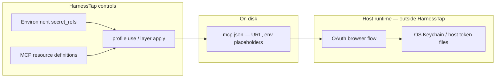

# Environments

An **environment** is a named bundle of *how* values — env vars, model defaults, permission overrides, and secret references — that layers and profiles satisfy at apply time. Environments do not replace layers; they parameterize the same context stack for different machines, accounts, or deployment targets.

## Context vs environment

| Side | Examples | Stored as |
| --- | --- | --- |
| **Context** (what the model sees) | Skills, rules, MCP server definitions | Layer resources in SQLite |
| **Environment** (how it runs) | API tokens, model choice, env vars | `environments` + `environment_resources` + `environment_secret_refs` |

See [Resources](./resources.md) for the full resource-type split.

## Cascade (last wins)

On `layer apply` and `profile use`, environment values merge with this precedence:

```
home environment  ◂  layer default environment  ◂  deck active environment
```

- **Home** — fragments under `~/.harnesstap/environments/` (optional)
- **Layer default** — `default_environment_id` on a configured layer
- **Deck active** — pointer from `environment use` (global) or `environment use --local` (terminal session)

Switch the active environment to change secrets and env vars without rebuilding the layer stack:

```bash
ht environment create work --from-layer my-setup --bind
ht environment edit work --secret SLACK_TOKEN:keychain:harnesstap/slack-work
ht environment use work
ht profile use default --reapply
```

Use `environment status` to see the active pointer and terminal drift. Use `environment show <name> --layer <selector>` to find missing keys required by a layer's MCP env vars or plugin `needs[]`.

## Environment resource types

| Type | Role | Exported in migrate/layer archives? |
| --- | --- | --- |
| **env_var** | Plain key/value pairs | Yes (values) |
| **model_config** | Default model and provider | Yes |
| **permission** | Runtime permission overrides | Yes |
| **secret_ref** | Indirection to a secret — never the plaintext value | Ref only (`KEY:provider:ref`) |

### Secret ref providers

| Provider | Ref format | Resolved at apply time from |
| --- | --- | --- |
| `env` | env var name | `process.env[ref]` |
| `file` | absolute path | File contents (trimmed trailing newline) |
| `keychain` | `service` or `service/account` | macOS Keychain (`security find-generic-password`) |

```bash
ht environment edit staging --secret GITHUB_TOKEN:env:GITHUB_TOKEN
ht environment edit staging --secret SLACK_TOKEN:keychain:harnesstap/slack-staging
ht environment edit staging --secret API_KEY:file:/run/secrets/api-key
```

Secret values are resolved when the cascade is built, merged into the substitution `vars` map, and never written into layer exports or migrate archives.

## MCP servers and environments

MCP server resources are **context-side** (server URL, command, args). Sensitive values belong in the **environment**, referenced from MCP metadata with `${VAR}` placeholders:

```json
{
  "mcpServers": {
    "slack": {
      "command": "npx",
      "args": ["-y", "@modelcontextprotocol/server-slack"],
      "env": { "SLACK_BOT_TOKEN": "${SLACK_BOT_TOKEN}" }
    }
  }
}
```

At apply time, HarnessTap substitutes `${VAR}` in MCP `command`, `args`, `env`, `url`, `headers`, and `auth` fields from the resolved cascade (`substituteMcpServerMetadata` in `mcp-config-bridge`).

Recommended workflow for switching accounts (static tokens):

1. Create one environment per account (`work`, `personal`).
2. Set a `secret_ref` (or `env_var`) for each token key the MCP server expects.
3. `environment use <name>` then `profile use` / `layer apply --reapply` (or `environment use --reapply` when only env changed).

## MCP authentication limitations

MCP auth falls into two models. HarnessTap only controls the first.

### Static auth (supported)

Credentials live in config or environment variables: API keys, bot tokens, Bearer headers, `${ENV_VAR}` / `${env:VAR}` expansion.

HarnessTap can switch these across environments via `secret_ref` + apply. Keep tokens out of committed layers — use placeholders and resolve at apply time.

### OAuth 2.1 (host-managed, not switchable via environments)

Remote MCP servers (Linear, Slack hosted MCP, GitHub Copilot MCP, etc.) often use browser OAuth. The **host application** runs the flow and stores tokens outside MCP config:

| Host | Config file | OAuth token storage (typical) |
| --- | --- | --- |
| **Cursor** | `~/.cursor/mcp.json`, `.cursor/mcp.json` | Browser OAuth for SSE/HTTP (access tokens: host-managed, storage not documented in [Cursor MCP docs](https://cursor.com/docs/mcp)); static OAuth client creds in `auth` block stay in config |
| **Claude Code** | `.mcp.json`, `claude mcp` | macOS: Keychain `Claude Code-credentials` (`mcpOAuth` blob); Linux: `~/.claude/.credentials.json` |
| **Copilot CLI** | `~/.copilot/mcp-config.json` | Keytar (`copilot-mcp-oauth`) or `~/.copilot/mcp-oauth-config/*.tokens.json` |
| **VS Code family** | `.vscode/mcp.json` | VS Code Secret Storage API → OS keychain |

OAuth config entries contain **server URL and transport only** — no access token. HarnessTap cannot swap OAuth sessions by changing environments because:

1. Tokens are not in files HarnessTap materializes.
2. Each host uses a private, undocumented credential schema.
3. OAuth sessions are **per host app**, not shared across Cursor, Claude Code, and Copilot.
4. Re-auth often requires interactive browser login inside the host.



### Workarounds for OAuth-heavy setups

| Approach | Trade-off |
| --- | --- |
| **Static token MCP** (bot token, PAT in `env` / `headers`) | Fully environment-switchable; you manage token rotation |
| **Static OAuth client credentials** in Cursor `auth` block | `CLIENT_ID` / `CLIENT_SECRET` in `mcp.json` (or `${env:…}`); HarnessTap can swap via environments; access tokens still from browser OAuth |
| **Stdio OAuth bridge** (`mcp-stdio`, `mcp-remote`) | Bridge owns OAuth; tokens on disk keyed by server URL — partial environment control |
| **Remote MCP gateway** | Gateway holds OAuth; HarnessTap swaps gateway API keys per environment |
| **Per-host login** | Log in separately in each IDE/CLI after apply — no HarnessTap automation |

### Cursor behavior ([official docs](https://cursor.com/docs/mcp))

Confirmed against Cursor's published MCP reference:

| Topic | Official behavior | HarnessTap alignment |
| --- | --- | --- |
| **Config paths** | `.cursor/mcp.json` (project), `~/.cursor/mcp.json` (global) | Registry paths match |
| **Transports** | `stdio` (local, manual auth), `SSE` and Streamable HTTP (OAuth) | Metadata models `stdio` / `http`; no separate SSE flag yet |
| **Static secrets** | `env`, `headers`, and `auth` values; Cursor resolves `${env:NAME}` at runtime | HarnessTap resolves `${VAR}` at **apply** time to literals in `command`, `args`, `env`, `url`, `headers`, and `auth` |
| **Remote HTTP** | `url` + optional `headers` (e.g. `Authorization: Bearer ${env:MY_SERVICE_TOKEN}`) | `headers` scanned, substituted, and emitted via `mcp-config-bridge` |
| **Static OAuth** | `auth` block: `CLIENT_ID`, optional `CLIENT_SECRET`, optional `scopes`; redirect URI `cursor://anysphere.cursor-mcp/oauth/callback` | `auth` round-trips in metadata; client credentials are config-side and environment-switchable |
| **Stdio** | `type: "stdio"`, `command`, `args`, `env`, optional `envFile` | `type: "stdio"`, `envFile`, and stdio fields round-trip on Cursor emit |
| **OAuth access tokens** | Docs describe browser OAuth for SSE/HTTP; **do not document** where access/refresh tokens are persisted after login | Host-managed; not switchable via HarnessTap environments |
| **Programmatic MCP** | Extension API `vscode.cursor.mcp.registerServer()` | Outside `mcp.json`; HarnessTap does not manage |

Cursor's docs state that MCP servers "use environment variables for authentication" and that you should pass API keys through config — consistent with HarnessTap's static-auth / environment model. For SSE and Streamable HTTP, Cursor lists **OAuth** as the auth column; that session is separate from values in `mcp.json`.

## Harness coverage for environments

Full environment emission (`env_var`, `model_config`, `permission` written to harness settings files) is implemented for **Claude Code** and **Codex** only.

Other harnesses still benefit from the cascade for **MCP `${VAR}` substitution** at apply time when their serializer emits MCP config (including **Cursor** — scan/emit of `.cursor/mcp.json` and global `~/.cursor/mcp.json`). See [Known gaps](#known-gaps-and-fix-plan) for remaining limitations.

## Related

- [Resources](./resources.md) — context vs environment resource types
- [Layers](./layers.md) — `default_environment_id` and `needs[]`
- [Profiles](./profiles.md) — global apply and home environment pointer
- [Portability limits — MCP auth](../../portability-limits.md#mcp-authentication-and-environments)
- [Supported harnesses](../../supported-harnesses.md) — per-harness MCP and environment matrix
- [Command reference — environment](../command-reference.md#environment-e)

## Known gaps and fix plan

Tracked limitations as of the current CLI. **Shipped** items are resolved in the CLI; **medium** items extend coverage or UX; **hard** items need host integration or new product surface.

### Shipped — Cursor MCP parity

| Item | Resolution |
| --- | --- |
| **Cursor MCP scan/emit** | `CursorSerializer` scans `.cursor/mcp.json` (project) and `~/.cursor/mcp.json` (global); emits `mcpServers` on `layer apply` / `profile use`. |
| **`headers` in `McpServerMetadata`** | HTTP MCP `headers` round-trip through scan/import and Cursor emit; `${VAR}` substitution applies to header values. |
| **`auth` / `env_file` / `connection_type` metadata** | Static OAuth `auth`, stdio `envFile`, and `type`/`connection_type` are modeled and emitted in Cursor-native shape via `mcp-config-bridge`. |
| **Substitution for `headers` / `url` / `auth`** | `substituteMcpServerMetadata` resolves `${VAR}` in `url`, `headers`, and `auth.CLIENT_ID` / `auth.CLIENT_SECRET` at apply time. |
| **`secret_ref` in supported-harnesses** | Environment resources table documents `secret_ref` and MCP substitution. |
| **Environments concept page** | This document. |

### Medium — coverage and UX

| Gap | Impact | Proposed fix |
| --- | --- | --- |
| **Claude global MCP not scanned** | `init` / home scan imports `~/.claude/skills` but not user-scoped MCP (Claude may store these outside project `.mcp.json`). | Discover Claude Code user MCP path from upstream docs; add `scanGlobal` import if stable. |
| **Environment switch without re-apply** | `environment use` updates pointer; harness files stay stale until `profile use --reapply` or `layer apply`. | Document workflow; consider `environment use --reapply` default or clearer status warning when drift detected. |
| **`environment create --from-project` captures plaintext secrets** | Import may pull literal tokens from scanned MCP `env` into `env_var` instead of promoting to `secret_ref`. | Wizard prompt: offer `secret_ref` promotion for keys matching MCP env / `needs[]`. |
| **Copilot HTTP MCP auth fields** | Copilot may use auth blocks beyond `env`; not modeled in metadata. | Audit Copilot MCP schema; extend metadata if needed for round-trip. |

### Hard — out of scope for near term

| Gap | Why hard |
| --- | --- |
| **OAuth session per environment** | Requires read/write adapters for each host's private credential store; brittle across host upgrades. |
| **`ht mcp auth` wrapper** | Would duplicate host OAuth UX; better documented as manual host login or stdio bridge. |
| **Cross-harness shared OAuth** | Each app maintains separate sessions; HarnessTap cannot unify without a gateway. |

### Suggested implementation order

1. Claude global MCP scan (if path is stable).
2. Environment create secret promotion UX.
3. Copilot HTTP MCP auth field audit (if round-trip gaps remain).
