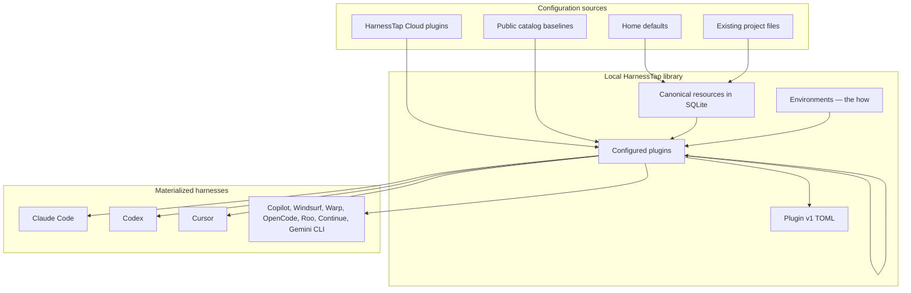
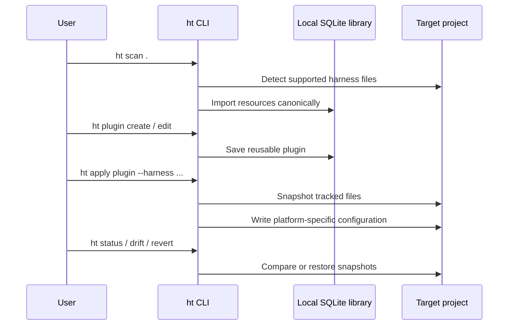
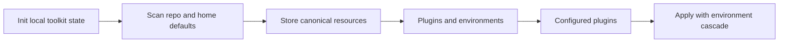

# Concepts overview

HarnessTap keeps assistant configuration in one place while materializing platform-specific files for Claude Code, Codex, Cursor, and dozens of other agent harnesses.

## Architecture

Configuration flows from sources (home defaults, existing project files, cloud plugins, public catalog baselines) into a local SQLite library, then out to target harnesses on disk.

A typical session looks like this:

## Concept model

HarnessTap separates **context-side** configuration (skills, MCP, hooks, rules — what the model sees) from **environment-side** configuration (secrets, env vars, models — how it runs).

| Concept | Role |
| --- | --- |
| **Resource** | Atomic instruction, skill, rule, MCP server, hook, agent, command, etc. |
| **Plugin** | Bundle of *what* resources plus Claude config and a `needs` contract |
| **Environment** | Named *how* values (and secret refs) — prod, staging, personal |
| **Plugin** | One or more plugins plus an optional default environment |
| **Workspace** | Local library of plugins, resources, and environments at `~/.harnesstap` |

A **plugin** is the versioned context package you apply to projects or profiles. **Plugin pins** and nested **plugin** refs are dependencies attached during composition.

**Cascade (last wins):** `home env ◂ plugin default env`. Switch the home active environment to change how-values without reloading the same plugin stack.

## Two apply surfaces

HarnessTap materializes configuration in two places:

| Surface | Scope | Primary commands |
| --- | --- | --- |
| **Profiles** | Machine-wide home harness paths (`~/.claude/`, `~/.codex/`, …) | `profile use`, `ht <profile-name>` |
| **Projects** | Repository working tree | `apply`, `mirror`, `status --check` |

Profiles answer "what stack runs on this machine by default?" Projects answer "what baseline does this repo get?" See [Profiles](./profiles.md) and [Projects](./projects.md).

## Where to go next

| Topic | Page |
| --- | --- |
| Plugins, plugins, pins, catalog | [Plugins](./plugins.md) |
| Scan, import, canonical library | [Resources](./resources.md) |
| Machine-wide home harness state | [Profiles](./profiles.md) |
| Env vars, secret refs, MCP auth limits | [Environments](./environments.md) |
| Repo apply, mirror, drift, snapshots | [Projects](./projects.md) |
| Harness matrix and resource types | [Supported harnesses](../../supported-harnesses.md) |
| Cross-harness fidelity caveats | [Portability limits](../../portability-limits.md) |
| Full CLI surface | [Command reference](../command-reference.md) |

Full specification: [SPEC.md](https://github.com/harnesstap/harnesstap/blob/main/SPEC.md) in the HarnessTap repository.
