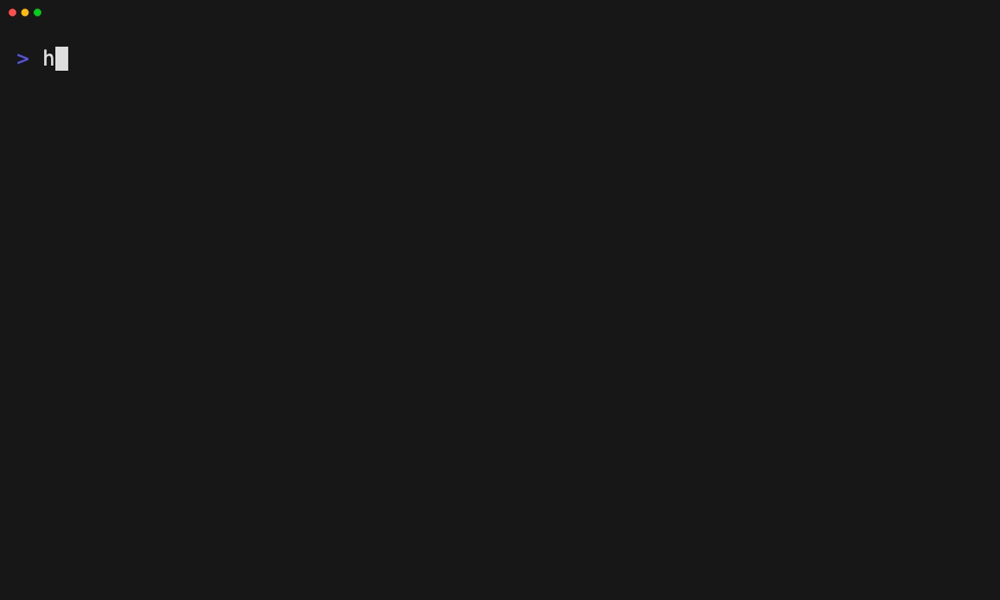

# Preview and apply a layer

Tape: [../tapes/07-preview-apply-layer.tape](../tapes/07-preview-apply-layer.tape)

## Commands

1. `ht init --main codex --aliases claude-code,cursor`
2. `ht layer list --search foundation --remote-only`
3. `ht layer apply engineering-foundation --dry-run`
4. `ht layer apply engineering-foundation`
5. `ht status .`
