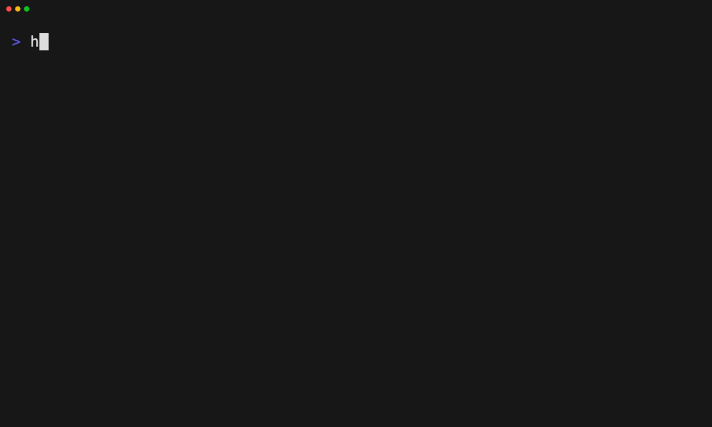

# Preview and apply a plugin

Dry-run a catalog plugin against a project, then apply it and confirm the result.

Tape: [../tapes/07-preview-apply-plugin.tape](../tapes/07-preview-apply-plugin.tape)

## Commands

1. `ht init --main codex --aliases claude-code,cursor` — initialise HarnessTap and set harness preferences
2. `ht plugin list --search foundation --remote-only` — browse catalog plugins
3. `ht apply engineering-foundation --dry-run` — preview planned writes
4. `ht apply engineering-foundation` — materialize the plugin into the project
5. `ht status .` — confirm the final state
