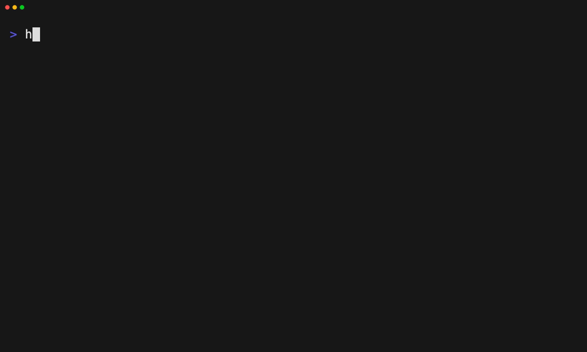

# Export or import a layer bundle

Tape: [../tapes/10-export-import-layer.tape](../tapes/10-export-import-layer.tape)

## Commands

1. `harnessdeck init`
2. `harnessdeck project scan .`
3. `harnessdeck layer create my-setup`
4. `harnessdeck layer export my-setup --file ./my-setup.harnessdeck.toml`
5. `harnessdeck layer import ./my-setup.harnessdeck.toml`
