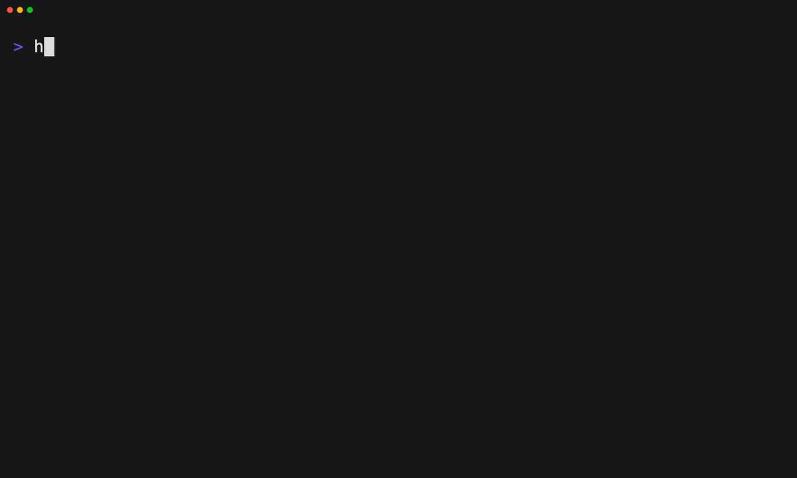

# Start from a catalog baseline

Tape: [../tapes/11-catalog-baseline.tape](../tapes/11-catalog-baseline.tape)

## Commands

1. `ht init --main codex --aliases claude-code,cursor`
2. `ht layer list --search foundation --remote-only`
3. `ht layer apply engineering-foundation`
4. `ht status .`
