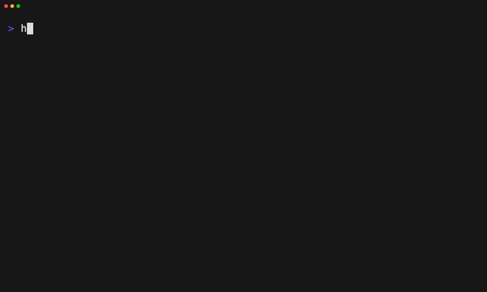

# Enforce layer and plugin state in CI

Tape: [../tapes/16-ci-enforcement.tape](../tapes/16-ci-enforcement.tape)

## Commands

1. `harnessdeck init --main codex --aliases claude-code,cursor`
2. `harnessdeck project apply engineering-foundation`
3. `harnessdeck project drift --project .`
