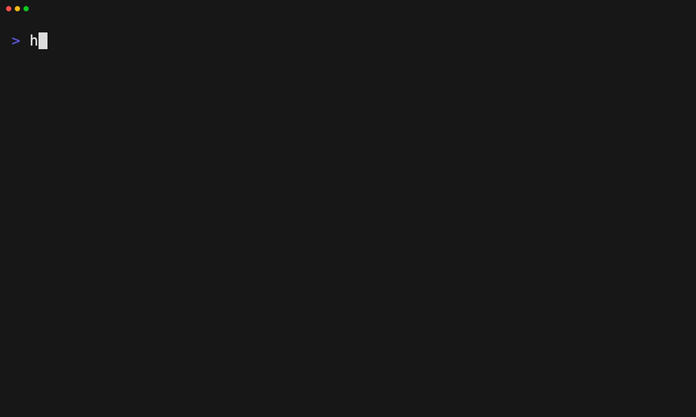

# Detect drift between project and last applied layer

Tape: [../tapes/21-detect-drift.tape](../tapes/21-detect-drift.tape)

## Commands

1. `harnessdeck init --main codex --aliases claude-code,cursor`
2. `harnessdeck project scan .`
3. `harnessdeck layer search foundation`
4. `harnessdeck project apply engineering-foundation`
5. `harnessdeck project drift --project .`
