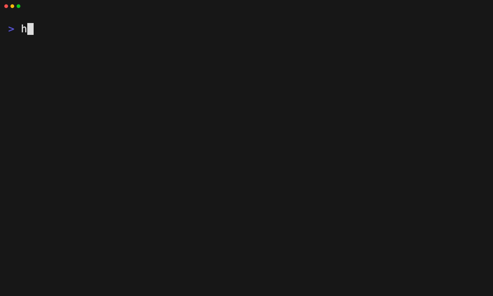

# Doctor-check a layer without writing

Tape: [../tapes/23-validate-layer.tape](../tapes/23-validate-layer.tape)

## Commands

1. `harnessdeck init`
2. `harnessdeck project scan .`
3. `harnessdeck layer create my-setup`
4. `harnessdeck layer doctor my-setup`
5. `harnessdeck layer doctor --list-checks`
