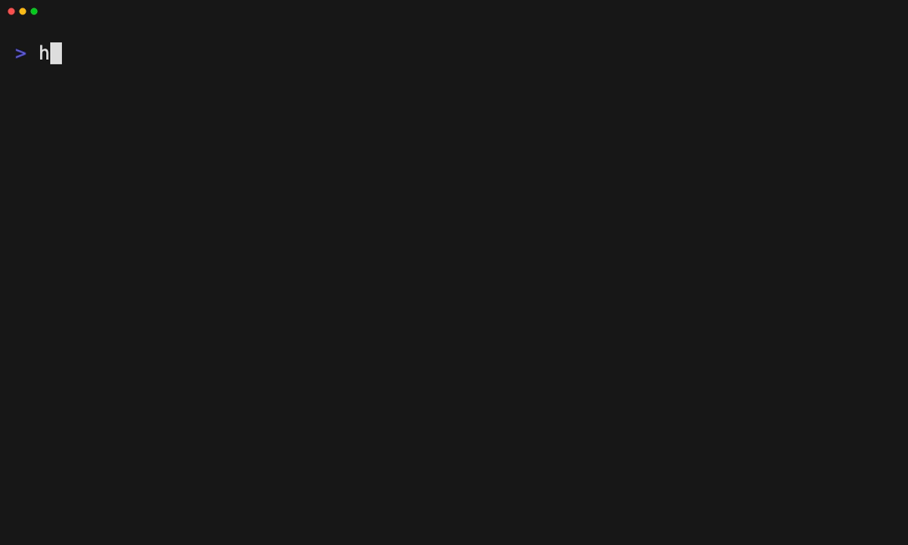

# Apply a layer directly from a URL

Tape: [../tapes/24-apply-from-url.tape](../tapes/24-apply-from-url.tape)

## Commands

1. `harnessdeck init --main codex --aliases claude-code,cursor`
2. `harnessdeck layer search foundation`
3. `harnessdeck project apply engineering-foundation --dry-run`
