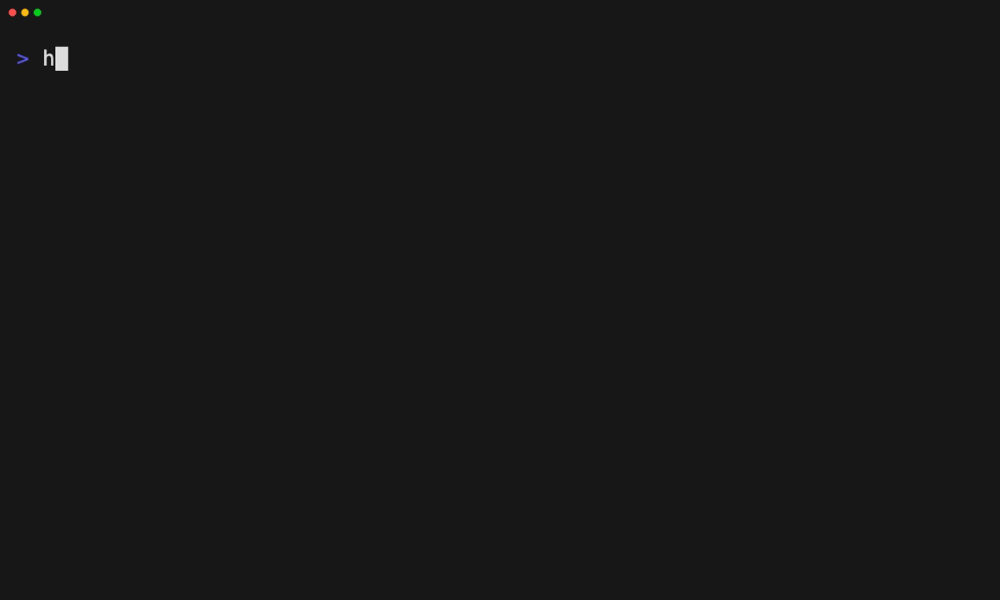

# Turn a project's current state into a layer

Tape: [../tapes/26-layer-from-project.tape](../tapes/26-layer-from-project.tape)

## Commands

1. `harnessdeck init`
2. `harnessdeck project scan .`
3. `harnessdeck layer from-project my-setup --project .`
