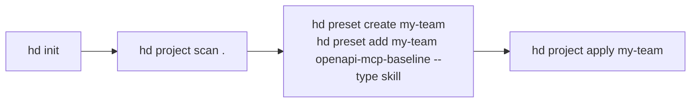

# CLI Noun Reorg and Wizard Implementation Plan

> **For agentic workers:** REQUIRED SUB-SKILL: Use superpowers:subagent-driven-development (recommended) or superpowers:executing-plans to implement this plan task-by-task. Steps use checkbox (`- [ ]`) syntax for tracking.

**Goal:** Implement the CLI noun-surface changes from the 2026-05-26 spec: `harness list`, noun aliases, typed preset attachments, `preset doctor`, and auto-triggered wizard flows in the linked worktree.

**Architecture:** Keep the existing single-entry CLI in `src/index.ts`, but extract the new behavior into focused helpers where branching would otherwise sprawl: a preset doctor service, a wizard trigger helper, and per-command wizard modules. Preserve existing storage models and serializer behavior; only the CLI surface and prompt plumbing should change.

**Tech Stack:** Bun, TypeScript, Commander, Inquirer, better-sqlite3

---

### Task 1: Rename the command surface and add noun aliases

**Files:**
- Modify: `src/index.ts`
- Modify: `src/platforms/registry.ts`
- Test: `test/cli/harness.test.ts`
- Test: `test/cli/package-manifest.test.ts`

- [ ] **Step 1: Write the failing command-surface tests**

```ts
it("routes noun aliases to the canonical command groups", async () => {
  const list = await runCli(["p", "ls"], { commandName: "hd" });
  const harness = await runCli(["h", "list"], { commandName: "hd" });
  expect(list.exitCode ?? 0).toBe(0);
  expect(harness.stdout).toContain("Claude Code");
});

it("rejects the removed platform list command", async () => {
  const result = await runCli(["platform", "list"], { commandName: "hd" });
  expect(result.exitCode).toBe(1);
  expect(result.stderr).toMatch(/unknown command/i);
});
```

- [ ] **Step 2: Run the targeted tests to verify they fail**

Run: `bun test test/cli/harness.test.ts test/cli/package-manifest.test.ts`
Expected: FAIL because `preset`, `resource`, `project`, `harness`, and `cloud` do not yet expose noun aliases and `platform list` is still registered.

- [ ] **Step 3: Implement the renamed command surface**

```ts
const NATIVE_HARNESS_IDS = new Set(["claude-code", "codex", "cursor"]);

function listHarnesses(opts: { format?: string; supported?: boolean } = {}): void {
  const format = parseOutputFormat(opts.format);
  const harnesses = getAllPlatforms().filter(
    (platform) => !opts.supported || NATIVE_HARNESS_IDS.has(platform.id),
  );
  if (format === "json") {
    printJson(harnesses);
    return;
  }
  ui.table.print({
    columns: [
      { key: "id", header: "ID", width: 20 },
      { key: "name", header: "NAME", width: 20 },
      { key: "supports", header: "SUPPORTS", width: 40 },
    ],
    rows: harnesses.map((platform) => ({
      id: platform.id,
      name: platform.name,
      supports: [...platform.supports].join(", "),
    })),
    summary: `${harnesses.length} harnesses`,
    empty: "No harnesses found.",
  });
}

const presetCmd = configureCommandGroup(program.command("preset").alias("p"));
const resourceCmd = configureCommandGroup(program.command("resource").alias("r"));
const projectCmd = configureCommandGroup(program.command("project").alias("pj"));
const harnessCmd = configureCommandGroup(program.command("harness").alias("h"));
const cloudCmd = configureCommandGroup(program.command("cloud").alias("c"));
```

- [ ] **Step 4: Re-run the command-surface tests**

Run: `bun test test/cli/harness.test.ts test/cli/package-manifest.test.ts`
Expected: PASS for alias routing and `harness list`; FAILs move to later tasks only.

- [ ] **Step 5: Commit the command-surface slice**

```bash
git add src/index.ts src/platforms/registry.ts test/cli/harness.test.ts test/cli/package-manifest.test.ts
git commit -m "feat: rename CLI nouns and add aliases"
```

### Task 2: Replace `preset validate` with `preset doctor`

**Files:**
- Create: `src/services/preset-doctor.ts`
- Create: `src/services/preset-doctor/checks/duplicate-resources.ts`
- Create: `src/services/preset-doctor/checks/empty-content.ts`
- Create: `src/services/preset-doctor/checks/plugin-metadata.ts`
- Modify: `src/index.ts`
- Modify: `test/cli/preset.test.ts`
- Modify: `test/cli/planned-scenarios.test.ts`

- [ ] **Step 1: Write the failing doctor tests**

```ts
it("runs preset doctor and renders the severity table", async () => {
  const result = await runCli(["preset", "doctor", "empty-preset"]);
  expect(result.stdout).toContain("SEVERITY");
  expect(result.stdout).toContain("empty-content");
});

it("lists doctor checks without requiring a preset", async () => {
  const result = await runCli(["preset", "doctor", "--list-checks", "--format", "json"]);
  expect(result.stdout).toContain("duplicate-resources");
  expect(result.stdout).toContain("plugin-metadata");
});
```

- [ ] **Step 2: Run the doctor tests to verify they fail**

Run: `bun test test/cli/preset.test.ts test/cli/planned-scenarios.test.ts`
Expected: FAIL because `preset doctor` is not registered and `preset validate` is still referenced.

- [ ] **Step 3: Implement the doctor registry and command rename**

```ts
export interface PresetDoctorResult {
  id: string;
  severity: "ok" | "warn" | "error";
  message: string;
  fix?: string;
}

export interface PresetDoctorCheck {
  id: string;
  run(preset: Preset): PresetDoctorResult[];
}

const checks: PresetDoctorCheck[] = [
  duplicateResourcesCheck,
  emptyContentCheck,
  pluginMetadataCheck,
];
```

- [ ] **Step 4: Re-run the doctor tests**

Run: `bun test test/cli/preset.test.ts test/cli/planned-scenarios.test.ts`
Expected: PASS for `preset doctor`; old `preset validate` references are updated or intentionally asserted as unknown-command failures.

- [ ] **Step 5: Commit the doctor slice**

```bash
git add src/index.ts src/services/preset-doctor.ts src/services/preset-doctor/checks test/cli/preset.test.ts test/cli/planned-scenarios.test.ts
git commit -m "feat: replace preset validate with doctor"
```

### Task 3: Unify preset attachments under `preset add/remove --type`

**Files:**
- Create: `src/services/preset-attachments.ts`
- Modify: `src/index.ts`
- Modify: `test/cli/preset.test.ts`
- Modify: `test/cli/preset-plugin.test.ts`

- [ ] **Step 1: Write the failing typed-attachment tests**

```ts
it("requires --type for preset add", async () => {
  const result = await runCli(["preset", "add", "team", "shared-skill"]);
  expect(result.exitCode).toBe(1);
  expect(result.stderr).toContain("--type is required");
});

it("adds a plugin pin through preset add --type plugin", async () => {
  const result = await runCli([
    "preset", "add", "team", "formatter@marketplace",
    "--type", "plugin",
    "--version", "^1.0.0",
  ]);
  expect(result.stdout).toContain("formatter@marketplace");
});
```

- [ ] **Step 2: Run the typed-attachment tests to verify they fail**

Run: `bun test test/cli/preset.test.ts test/cli/preset-plugin.test.ts`
Expected: FAIL because `preset add` still assumes a resource selector and legacy plugin/dependency commands are still primary.

- [ ] **Step 3: Implement typed add/remove helpers and hidden legacy shims**

```ts
const PRESET_ATTACHMENT_TYPES = [
  ...RESOURCE_TYPES,
  "plugin",
  "preset-dependency",
] as const;

if (!opts.type) {
  throw new Error(`--type is required (one of: ${PRESET_ATTACHMENT_TYPES.join(", ")})`);
}

if (opts.type === "plugin") {
  if (!opts.version) throw new Error("--version is required for --type plugin");
  addPluginToPreset(preset.id, selector, opts.version, { embedOnExport: Boolean(opts.embed) });
}
```

- [ ] **Step 4: Re-run the typed-attachment tests**

Run: `bun test test/cli/preset.test.ts test/cli/preset-plugin.test.ts`
Expected: PASS for typed resource, plugin, and dependency add/remove paths; hidden legacy commands still work with deprecation warnings.

- [ ] **Step 5: Commit the preset-attachment slice**

```bash
git add src/index.ts src/services/preset-attachments.ts test/cli/preset.test.ts test/cli/preset-plugin.test.ts
git commit -m "feat: unify preset attachment commands"
```

### Task 4: Add wizard trigger plumbing and prompt-capable commands

**Files:**
- Create: `src/services/wizards/shared.ts`
- Create: `src/services/wizards/preset-add.ts`
- Create: `src/services/wizards/preset-delete.ts`
- Create: `src/services/wizards/resource-delete.ts`
- Modify: `src/services/harness-config.ts`
- Modify: `src/index.ts`
- Modify: `test/helpers/cli.ts`
- Modify: `test/services/harness-config.test.ts`
- Modify: `test/cli/preset.test.ts`
- Modify: `test/cli/harness.test.ts`

- [ ] **Step 1: Write the failing wizard trigger tests**

```ts
it("auto-prompts preset add on a TTY when required args are missing", async () => {
  const result = await runCli(["preset", "add", "team"], { isTTY: true });
  expect(result.stdout).toContain("Added");
});

it("does not auto-prompt when --format json is requested", async () => {
  const result = await runCli(["preset", "add", "team", "--format", "json"], { isTTY: true });
  expect(result.exitCode).toBe(1);
});
```

- [ ] **Step 2: Run the wizard-focused tests to verify they fail**

Run: `bun test test/services/harness-config.test.ts test/cli/preset.test.ts test/cli/harness.test.ts`
Expected: FAIL because `runCli` cannot toggle TTY state and missing-arg wizard resolution does not exist.

- [ ] **Step 3: Implement the wizard trigger helper and prompt flows**

```ts
export function shouldUseWizard(input: {
  interactive?: boolean;
  noInteractive?: boolean;
  format?: string;
  missingRequiredArgs: boolean;
}): boolean {
  return Boolean(
    process.stdin.isTTY &&
    process.stdout.isTTY &&
    process.env.CI !== "true" &&
    process.env.HARNESSDECK_NO_INTERACTIVE !== "1" &&
    !input.noInteractive &&
    input.format !== "json" &&
    (input.interactive || input.missingRequiredArgs),
  );
}
```

- [ ] **Step 4: Re-run the wizard-focused tests**

Run: `bun test test/services/harness-config.test.ts test/cli/preset.test.ts test/cli/harness.test.ts`
Expected: PASS for TTY auto-prompt behavior and non-interactive suppression paths.

- [ ] **Step 5: Commit the wizard slice**

```bash
git add src/services/wizards src/services/harness-config.ts src/index.ts test/helpers/cli.ts test/services/harness-config.test.ts test/cli/preset.test.ts test/cli/harness.test.ts
git commit -m "feat: add CLI wizard auto-prompting"
```

### Task 5: Update README, SPEC, and package metadata

**Files:**
- Modify: `README.md`
- Modify: `SPEC.md`
- Modify: `package.json`
- Modify: `test/cli/package-manifest.test.ts`
- Modify: `test/services/vhs-scenarios.test.ts`

- [ ] **Step 1: Write the failing documentation metadata tests**

```ts
it("uses the toolkit description in package.json", () => {
  expect(pkg.description).toBe(
    "Agent harness configuration toolkit for Claude Code, Codex, Cursor, and other coding CLIs",
  );
});
```

- [ ] **Step 2: Run the metadata tests to verify they fail**

Run: `bun test test/cli/package-manifest.test.ts test/services/vhs-scenarios.test.ts`
Expected: FAIL because the old tagline and README command examples still reference `platform list`, `preset validate`, and legacy preset attachment commands.

- [ ] **Step 3: Update the docs and package description**

```md
`harnessdeck` is the agent harness configuration toolkit — manage AI coding assistant configuration across multiple tools through reusable presets.


```

- [ ] **Step 4: Re-run the documentation tests**

Run: `bun test test/cli/package-manifest.test.ts test/services/vhs-scenarios.test.ts`
Expected: PASS, including the pre-existing VHS README assertions if the updated README now points at the canonical GIF and walkthrough paths.

- [ ] **Step 5: Commit the docs slice**

```bash
git add README.md SPEC.md package.json test/cli/package-manifest.test.ts test/services/vhs-scenarios.test.ts
git commit -m "docs: update CLI nouns and toolkit branding"
```

### Final Verification

**Files:**
- Verify: `src/index.ts`
- Verify: `src/services/preset-doctor.ts`
- Verify: `src/services/preset-attachments.ts`
- Verify: `src/services/wizards/*.ts`
- Verify: `README.md`
- Verify: `SPEC.md`

- [ ] **Step 1: Run the targeted command and service tests**

Run: `bun test test/cli/harness.test.ts test/cli/preset.test.ts test/cli/preset-plugin.test.ts test/cli/planned-scenarios.test.ts test/services/harness-config.test.ts test/cli/package-manifest.test.ts test/services/vhs-scenarios.test.ts`
Expected: PASS for all touched behavior.

- [ ] **Step 2: Run the full validation suite**

Run: `bun run preflight`
Expected: lint, typecheck, test:run, and build all PASS.

- [ ] **Step 3: Check git status**

Run: `git status --short`
Expected: Only intended implementation files remain modified.

- [ ] **Step 4: Finish without an extra empty commit**

```bash
git status --short
```
