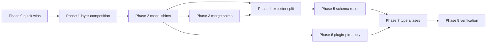

# Legacy consolidation implementation plan

> **For agentic workers:** REQUIRED SUB-SKILL: Use superpowers:subagent-driven-development (recommended) or superpowers:executing-plans to implement this plan task-by-task. Steps use checkbox (`- [ ]`) syntax for tracking.

**Goal:** Remove legacy shims, merge shallow modules, split the monolithic exporter, reset schema to current DDL only, and align all vocabulary with `CONTEXT.md` (layer, plugin_pin, context-side) so the codebase matches the current implementation with minimal indirection.

**Architecture:** Work in dependency order — composition module first (unblocks pin APIs), then model shims and merge pass-throughs, then transport/export split, then destructive schema reset, then apply-pipeline consolidation, then type-alias purge. Each phase ends with `bun run preflight`. Keep `src/models/plugin.ts` (project plugin *inventory* — different concept from layer plugin pins). Do not touch harness-specific `plugins/` package (Claude marketplace install adapters).

**Tech Stack:** TypeScript, Bun test runner, SQLite (`src/db/schema.ts`), tsup build, Biome lint.

**Prerequisite:** Read `CONTEXT.md` naming rules. Pre-release: no backward-compat requirement for legacy import shapes or DB upgrade from v1–v17.

---

## File map (target state)

| Path | Responsibility |
| --- | --- |
| `src/services/layer-composition.ts` | **New.** plugin_pin + layer ref CRUD, attachment orchestration, `LayerAttachmentHintError`, `listAttachedPluginPins`, `addLayerAttachment` |
| `src/models/layer-model.ts` | Canonical layer CRUD (unchanged role, updated imports) |
| `src/services/layer-export.ts` | **New.** DB → layer transport doc |
| `src/services/layer-import.ts` | **New.** Layer transport doc → DB |
| `src/services/deck-export-import.ts` | **New.** Deck TOML round-trip (thin over transport + layer import) |
| `src/services/plugin-pin-apply.ts` | **New.** install + sync + validate + expand for apply |
| `src/db/schema.ts` | v19: fresh DDL only; no migrations 8–18 bodies |
| **Deleted** | `plugin-component.ts`, `layer.ts`, `configured-layer.ts`, `plugin-pins.ts`, `layer-merge.ts`, `configured-layer-merge.ts`, `composition-resource.ts`, `layer-attachments.ts`, `plugin-apply-sync.ts`, `plugin-materialize.ts` (folded), `migrate-to-unified-layers.ts` |

Temporary re-export shims (`composition-resource.ts` → `layer-composition.ts`) may exist for one commit between phases; delete before phase complete.

---

## Phase 0 — Quick wins (no behaviour change)

**Candidate:** architecture review quick wins + prep for later phases.

### Task 0.1: Delete unused exports and no-op wrapper

**Files:**
- Modify: `src/services/composition-resource.ts` (delete `migrationUpsertPluginResource`, `migrationUpsertLayerResource`, `createMigrationResourceId`)
- Modify: `src/services/plugin-apply-validation.ts` (delete `validateLayerPluginConstraints`)
- Modify: `src/index.ts` (inline `ensureImplicitConfiguredLayer` call sites to `getLayerById` + throw)
- Modify: `src/models/configured-layer.ts` (delete `ensureImplicitConfiguredLayer` export)

- [ ] **Step 1: Remove dead code**

Delete from `composition-resource.ts` lines ~302–334 (migration upsert helpers).

Delete `validateLayerPluginConstraints` from `plugin-apply-validation.ts` (function + any private helpers only it uses).

In `index.ts`, replace `ensureImplicitConfiguredLayer(id)` with:

```typescript
const layer = getLayerById(id);
if (!layer) throw new Error(`Layer not found: ${id}`);
return layer;
```

Remove `ensureImplicitConfiguredLayer` from `configured-layer.ts` and its import from `index.ts`.

- [ ] **Step 2: Verify**

Run: `bun run typecheck && bun run test:run`
Expected: PASS

- [ ] **Step 3: Commit**

```bash
git add src/services/composition-resource.ts src/services/plugin-apply-validation.ts src/index.ts src/models/configured-layer.ts
git commit -m "chore: remove unused migration helpers and no-op layer wrapper"
```

---

## Phase 1 — Merge composition modules (Candidate #2)

### Task 1.1: Create `layer-composition.ts`

**Files:**
- Create: `src/services/layer-composition.ts`
- Modify: `src/services/composition-resource.ts` (become re-export barrel temporarily)
- Modify: `src/services/layer-attachments.ts` (become re-export barrel temporarily)
- Test: `test/services/composition-resource.test.ts` (update import path)

- [ ] **Step 1: Merge implementations**

Create `src/services/layer-composition.ts` by concatenating `composition-resource.ts` + `layer-attachments.ts` into one file:

1. Single import block at top (merge both files' imports; resolve `plugin-component` → keep as-is for now).
2. Move `LayerAttachmentHintError`, attachment types, `addLayerAttachment`, `removeLayerAttachment` **below** core composition helpers (no circular import).
3. Remove `migrationUpsert*` (already deleted in Phase 0).
4. Export everything both old files exported.

- [ ] **Step 2: Temporary re-export barrels**

Replace bodies of old files with:

```typescript
/** @deprecated Import from layer-composition.js */
export * from "./layer-composition.js";
```

- [ ] **Step 3: Run tests**

Run: `bun test test/services/composition-resource.test.ts`
Expected: PASS

- [ ] **Step 4: Commit**

```bash
git add src/services/layer-composition.ts src/services/composition-resource.ts src/services/layer-attachments.ts
git commit -m "refactor: merge composition-resource and layer-attachments into layer-composition"
```

### Task 1.2: Collapse duplicate pin list API

**Files:**
- Modify: `src/services/layer-composition.ts`
- Modify: `src/models/plugin-pins.ts`
- Modify: `src/index.ts`, `src/services/layer-diff.ts`, `src/services/layer-doctor.ts`, `src/services/layer-validate.ts`, `src/services/exporter.ts`, `src/services/plugin-apply-validation.ts`

- [ ] **Step 1: Add canonical view type**

In `layer-composition.ts`, ensure `PluginPinView` is the canonical type. Add alias only if needed:

```typescript
export type AttachedPluginPin = PluginPinView;
```

- [ ] **Step 2: Deprecate `listLayerPlugins`**

In `plugin-pins.ts`, change `listLayerPlugins` to call `listAttachedPluginPins` and map to `LayerPluginRow` (unchanged shape for now).

- [ ] **Step 3: Switch call sites**

In `index.ts` layer show path: remove duplicate import of `listLayerPlugins` if `listAttachedPluginPins` already used — use **one** call only.

- [ ] **Step 4: Verify**

Run: `bun run test:run`
Expected: PASS

- [ ] **Step 5: Commit**

```bash
git commit -am "refactor: single plugin pin list path via layer-composition"
```

### Task 1.3: Delete old composition files

**Files:**
- Delete: `src/services/composition-resource.ts`, `src/services/layer-attachments.ts`
- Modify: all import sites (~15 files) → `./layer-composition.js`

- [ ] **Step 1: Update imports**

```bash
rg -l 'composition-resource|layer-attachments' src test --glob '*.ts' | while read f; do
  sed -i '' 's|composition-resource|layer-composition|g; s|layer-attachments|layer-composition|g' "$f"
done
```

(Use `sed` without `-i ''` on Linux.)

- [ ] **Step 2: Delete barrel files**

- [ ] **Step 3: Preflight**

Run: `bun run preflight`
Expected: PASS

- [ ] **Step 4: Commit**

```bash
git add -A
git commit -m "refactor: drop composition-resource and layer-attachments barrels"
```

---

## Phase 2 — Delete model shims (Candidate #1)

### Task 2.1: Rename map and codemod

**Canonical replacements:**

| Deprecated | Canonical |
| --- | --- |
| `createPlugin` | `createLayer` |
| `getPlugin` | `getLayer` |
| `getPluginById` | `getLayerById` |
| `listPlugins` | `listLayers` |
| `deletePlugin` | `deleteLayer` |
| `addResourceToPlugin` | `addResourceToLayer` |
| `removeResourceFromPlugin` | `removeResourceFromLayer` |
| `getPluginResources` | `getLayerResources` |
| `addDependencyToPlugin` | `addDependencyToLayer` |
| `listPluginDependencies` | `listLayerDependencies` |
| `removeDependencyFromPlugin` | `removeDependencyFromLayer` |
| `parsePluginSelector` | `parseLayerSelectorString` |
| `createConfiguredLayer({ pluginIds })` | `createLayerFromSources({ sourceLayerIds })` |
| `getConfiguredLayer` | `getLayerById` |
| `getConfiguredLayerByName` | `getLayerByName` |
| `listConfiguredLayers` | `listLayers` |
| `resolveConfiguredLayerSelector` | `resolveLayerSelector` |
| `addPluginToLayer` | `attachPluginPinToLayer` (new thin fn in layer-composition or layer-model) |
| `removePluginFromLayer` | `detachPluginPinFromLayer` |
| `listLayerPlugins` | `listAttachedPluginPins` (map to row shape at CLI boundary if needed) |

**Files:** ~35 `src/` + `test/` files importing shims (see `rg 'plugin-component|configured-layer|models/layer'|plugin-pins`).

- [ ] **Step 1: Move pin attach helpers**

Move `addPluginToLayer` / `removePluginFromLayer` logic from `plugin-pins.ts` into `layer-composition.ts` as `attachPluginPinToLayer` / `detachPluginPinFromLayer`.

- [ ] **Step 2: Update imports file-by-file**

Priority order: `layer-model.ts` → services → `index.ts` → tests.

Replace:

```typescript
import { getPlugin, createPlugin } from "../models/plugin-component.js";
```

with:

```typescript
import { getLayer, createLayer } from "../models/layer-model.js";
```

Replace configured-layer imports with `layer-model.js` equivalents per table above.

- [ ] **Step 3: Update tests**

Rename `test/models/plugin-component.test.ts` → `test/models/layer-model-public-api.test.ts` (or merge into existing layer tests). Update `test/models/configured-layer.test.ts` to use `createLayerFromSources`.

- [ ] **Step 4: Delete shim files**

Delete:
- `src/models/plugin-component.ts`
- `src/models/layer.ts`
- `src/models/configured-layer.ts`
- `src/models/plugin-pins.ts`

- [ ] **Step 5: Preflight**

Run: `bun run preflight`
Expected: PASS

- [ ] **Step 6: Commit**

```bash
git commit -am "refactor: remove layer model shims; use layer-model and layer-composition"
```

---

## Phase 3 — Delete merge pass-throughs (Candidate #3)

### Task 3.1: Remove merge shims

**Files:**
- Delete: `src/services/layer-merge.ts`, `src/services/configured-layer-merge.ts`
- Modify: `src/index.ts`, `test/services/layer-merge.test.ts`, `test/services/configured-layer-merge.test.ts`
- Modify: `src/services/layer-apply-merge.ts` (remove `mergeConfiguredLayers` deprecated export if unused)

- [ ] **Step 1: Update index.ts**

Replace:

```typescript
import { mergePlugins } from "./services/layer-merge.js";
```

with:

```typescript
import { mergeLayersById } from "./models/layer-model.js";
```

Replace `mergePlugins(ids)` → `mergeLayersById(ids)`.

For apply path, ensure `mergeLayersForApply` from `layer-apply-merge.ts` is used (not merge shims).

- [ ] **Step 2: Update tests**

`test/services/layer-merge.test.ts`: import `mergeLayersById` from `layer-model`; rename describe block to `mergeLayersById`.

`test/services/configured-layer-merge.test.ts`: import `mergeLayersForApply` from `layer-apply-merge.ts` directly.

- [ ] **Step 3: Delete shim files**

- [ ] **Step 4: Preflight**

Run: `bun run preflight`
Expected: PASS

- [ ] **Step 5: Commit**

```bash
git commit -am "refactor: remove deprecated layer merge pass-through modules"
```

---

## Phase 4 — Split exporter and drop legacy transport (Candidate #4)

### Task 4.1: Extract layer export/import

**Files:**
- Create: `src/services/layer-export.ts`
- Create: `src/services/layer-import.ts`
- Modify: `src/services/exporter.ts` (thin re-exports temporarily)
- Test: `test/services/exporter.test.ts`, `test/cli/export-import.test.ts`

- [ ] **Step 1: Move layer export**

Move from `exporter.ts` into `layer-export.ts`:
- `exportLayer`, `exportToFile`, `inspectLayerExportFile`, `layerExportToDeckJson`
- Types: `ExportLayerOptions`, `ImportedLayerBundle`, `ImportedLayerBundleEntry`
- Private helpers used only by layer export (grep within exporter.ts)

Update imports to use `layer-model` + `layer-composition` (post Phase 1–2 names).

- [ ] **Step 2: Move layer import**

Move into `layer-import.ts`:
- `importFromFile`, `importLayerExportAsDeck`
- Types: `ImportLayerOptions`, `ImportLayerExportAsDeckResult`, `ParsedLayerExportSummary`

- [ ] **Step 3: Remove legacy embedded_plugins export path**

Delete or gate behind `import { LEGACY_IMPORT }` constant default `false`:
- `LegacyLayerExport` union arm production in export
- `embedded_plugins` assembly in `exportLayer`
- `useLegacyEmbeddedFallback` branches

Keep **read** compat for one release only if tests demand it — prefer updating fixtures to current TOML transport shape per `test/fixtures/builtin-plugins/*.harnessdeck.toml`.

- [ ] **Step 4: Temporary re-export**

```typescript
// exporter.ts — deprecated barrel, delete in Task 4.3
export * from "./layer-export.js";
export * from "./layer-import.js";
export * from "./deck-export-import.js";
```

- [ ] **Step 5: Run exporter tests**

Run: `bun test test/services/exporter.test.ts test/services/exporter-deck.test.ts test/cli/export-import.test.ts`
Expected: PASS (update assertions that expect `embedded_plugins`)

- [ ] **Step 6: Commit**

```bash
git add src/services/layer-export.ts src/services/layer-import.ts src/services/exporter.ts test/
git commit -m "refactor: extract layer export/import; drop embedded_plugins export"
```

### Task 4.2: Extract deck export/import

**Files:**
- Create: `src/services/deck-export-import.ts`
- Modify: `src/services/deck-transport.ts`, `src/services/exporter.ts`

- [ ] **Step 1: Move deck functions**

Move into `deck-export-import.ts`:
- `exportDeckToDeckJson`, `importDeckToml`, `readDeckToml`, `writeDeckToml`
- Types: `ImportDeckJsonResult`, `ImportDeckJsonOptions`
- Remove deprecated aliases `readDeckJson`, `importDeckJson`, `writeDeckJson` (update call sites)

- [ ] **Step 2: Drop deck `plugins[]` import**

In import path, remove resolution of deprecated `deck.plugins[]` array. Deck layers resolve via `deck_layers` / selector entries only.

Update `test/services/exporter-deck.test.ts` and `test/cli/deck-actionability.test.ts`.

- [ ] **Step 3: Simplify deck-transport.ts**

`deck-transport.ts` should delegate to `deck-export-import.ts` + `src/services/transport/*` only.

- [ ] **Step 4: Commit**

```bash
git commit -am "refactor: extract deck export/import; remove plugins[] deck import"
```

### Task 4.3: Delete monolithic exporter

**Files:**
- Delete: `src/services/exporter.ts`
- Modify: all import sites

- [ ] **Step 1: Update imports across codebase**

```bash
rg -l 'from.*exporter' src test --glob '*.ts'
```

Map to `layer-export`, `layer-import`, or `deck-export-import` per symbol.

- [ ] **Step 2: Clean types.ts**

Remove `LegacyLayerExport` interface and `LayerExport` union if nothing references legacy shape. Keep `MultiLayerExport` / current transport types.

- [ ] **Step 3: Preflight**

Run: `bun run preflight`
Expected: PASS

- [ ] **Step 4: Commit**

```bash
git commit -am "refactor: remove monolithic exporter module"
```

### Task 4.4: Docs alignment

**Files:**
- Modify: `SPEC.md`, `README.md`, `docs/scenarios/details/*.md` (only if they mention `embedded_plugins` or `plugins[]` deck import)

- [ ] **Step 1: Grep and update**

```bash
rg 'embedded_plugins|plugins\[\]|LegacyLayerExport|configured.layer' docs SPEC.md README.md
```

- [ ] **Step 2: Commit docs**

```bash
git commit -am "docs: remove legacy layer/deck transport references"
```

---

## Phase 5 — Schema reset (Candidate #5)

**Policy:** Fresh installs get v19 DDL only. Existing v18 DBs: document `hd migrate export` → delete DB → `hd migrate import` OR manual re-init. No in-place upgrade from v1–v17 after this change.

### Task 5.1: Extract current DDL snapshot

**Files:**
- Create: `src/db/schema-v19.sql` (reference DDL — optional, for readability)
- Modify: `src/db/schema.ts`
- Delete: `src/db/migrate-to-unified-layers.ts`
- Delete: `test/db/migrate-to-unified-layers.test.ts`

- [ ] **Step 1: Capture v18 end-state schema**

Run fresh `initializeSchema` on empty DB at v18 (before changes). Dump:

```bash
sqlite3 :memory: ".read ..."  # or use test helper
```

Alternatively: copy migration 1 body + incremental ALTERs from v18 into a single `MIGRATIONS[19]` CREATE script that matches current tables:

Tables (from `test/db/schema.test.ts`): `resources`, `layers`, `layer_resources`, `decks`, `deck_layers`, `projects`, `project_layers`, `environments`, `environment_resources`, `environment_secret_refs`, `harness_preferences`, `project_harnesses`, `snapshots`, `imported_snapshots`, `imported_snapshot_installs`, `schema_version`.

**Omit:** `plugins`, `configured_layers`, `layer_dependencies`, `plugin_native_pins`, `deck_configured_layers`, `project_configured_layers`.

- [ ] **Step 2: Rewrite schema.ts**

```typescript
const SCHEMA_VERSION = 19;

const MIGRATIONS: Record<number, string> = {
  19: `/* full current DDL + INSERT schema_version */`,
};
```

Remove:
- `import { migrateToUnifiedLayers }`
- `applyMigration8` through `applyMigration18` functions
- Special-case version loop branches for v8–v18
- `LEGACY_LOCAL_ID_PREFIX` migration logic if superseded by current `projects.local_id`

- [ ] **Step 3: Delete migrate-to-unified-layers**

- [ ] **Step 4: Update schema tests**

`test/db/schema.test.ts`:
- Expect `version === 19`
- Remove tests that build pre-v15 `plugins` / `configured_layers` tables
- Remove `type='plugin'` → `plugin_pin` migration tests (fresh DB uses `plugin_pin` only)
- Keep constraint/index tests against v19 DDL

- [ ] **Step 5: Add README migration note**

In `README.md` or `docs/migration.md` (short section):

```markdown
## Upgrading from HarnessDeck < 0.2 (schema v18)

Export state: `hd migrate export backup.tar`
Remove old database (see `hd config path`)
Import: `hd migrate import backup.tar`
```

- [ ] **Step 6: Preflight**

Run: `bun run preflight`
Expected: PASS

- [ ] **Step 7: Commit**

```bash
git add src/db/ test/db/ README.md
git commit -m "refactor: reset schema to v19 fresh DDL; remove legacy migrations"
```

---

## Phase 6 — Consolidate plugin-pin apply pipeline (Candidate #6)

### Task 6.1: Create `plugin-pin-apply.ts`

**Files:**
- Create: `src/services/plugin-pin-apply.ts`
- Modify: `src/index.ts`
- Delete: `src/services/plugin-apply-sync.ts`
- Fold: `src/services/plugin-materialize.ts` into `plugin-pin-apply.ts`
- Keep: `plugin-install.ts`, `resource-sync.ts` (host scan seam — real adapter boundary)
- Modify: `src/services/plugin-apply-validation.ts` (validation only, no sync)

- [ ] **Step 1: Move sync glue**

Move from `plugin-apply-sync.ts` into `plugin-pin-apply.ts`:
- `syncPluginPinsForApply`
- `SyncPluginPinsForApplyOptions`, `SyncPluginPinsForApplyResult`, progress types

- [ ] **Step 2: Fold materialize**

Move from `plugin-materialize.ts`:
- `expandPluginMaterialResources` (and private helpers)

Into `plugin-pin-apply.ts` as `expandPluginPinMaterialResources`.

- [ ] **Step 3: Add high-level apply entry**

```typescript
export async function preparePluginPinsForApply(opts: {
  layerId: string;
  pins: PluginConstraintPin[];
  projectRoot: string;
  syncAll?: boolean;
  scope?: PluginScope;
  progress?: SyncPluginPinsForApplyProgress;
}): Promise<{
  installs: InstallPluginPinResult[];
  materialResources: Resource[];
  unresolvedPins: string[];
  validationIssues: PluginValidationIssue[];
}> {
  const syncResult = await syncPluginPinsForApply({ ... });
  const materialResources = expandPluginPinMaterialResources(opts.layerId, syncResult);
  const validationIssues = validatePluginPinsAgainstInventory(opts.layerId, syncResult);
  return { ...syncResult, materialResources, validationIssues };
}
```

Wire `validatePluginPinsAgainstInventory` from `plugin-apply-validation.ts` (rename if needed).

- [ ] **Step 4: Update index.ts apply path**

Replace multi-module apply chain with single `preparePluginPinsForApply` call.

- [ ] **Step 5: Delete old modules**

Delete `plugin-apply-sync.ts`, `plugin-materialize.ts`.

Update tests:
- `test/services/plugin-apply-sync.test.ts` → import from `plugin-pin-apply.ts`
- `test/services/plugin-materialize.test.ts` → merge into `test/services/plugin-pin-apply.test.ts`

- [ ] **Step 6: Preflight**

Run: `bun run preflight`
Expected: PASS

- [ ] **Step 7: Commit**

```bash
git commit -am "refactor: consolidate plugin pin apply into plugin-pin-apply module"
```

---

## Phase 7 — Purge deprecated type aliases (Candidate #7)

### Task 7.1: Remove type aliases from types.ts

**Files:**
- Modify: `src/types.ts`
- Modify: `src/services/resource-classification.ts`
- Modify: `src/models/environment.ts`
- Modify: ~40 import sites

- [ ] **Step 1: Remove deprecated aliases**

Delete from `types.ts`:

```typescript
export type Plugin = Layer;
export type ConfiguredLayer = Layer;
export type PluginResourceMetadata = PluginPinMetadata;
export type ProjectConfiguredLayer = ProjectLayer; // use actual canonical name
```

Keep `PluginPinMetadata` as canonical. Grep for `PluginResourceMetadata` → replace with `PluginPinMetadata`.

- [ ] **Step 2: Rename classification constants**

In `resource-classification.ts`:

```typescript
// Delete:
export const PLUGIN_RESOURCE_TYPES = CONTEXT_SIDE_RESOURCE_TYPES;
export type PluginResourceType = ContextSideResourceType;
```

Update `exporter`/`layer-export` and any file importing `PLUGIN_RESOURCE_TYPES`.

- [ ] **Step 3: Environment reference field**

In `environment.ts` `listEnvironmentReferences` (or equivalent), rename response field `configured_layers` → `layers`. Update `environment-commands.ts`, `environment-selectors.ts`, tests in `test/models/environment.test.ts`, `test/cli/environment.test.ts`.

- [ ] **Step 4: Deck JSON types**

Remove deprecated `DeckJson.plugins` field from `types.ts` if still present. Update transport validators.

- [ ] **Step 5: Preflight**

Run: `bun run preflight`
Expected: PASS

- [ ] **Step 6: Commit**

```bash
git commit -am "refactor: remove deprecated type aliases; align environment API with layer vocabulary"
```

---

## Phase 8 — Final verification and cleanup

### Task 8.1: Repo-wide legacy grep gate

- [ ] **Step 1: Run legacy vocabulary check**

```bash
rg -n 'plugin-component|configured-layer|configured_layers|mergePlugins|mergeConfiguredLayers|LegacyLayerExport|embedded_plugins|PLUGIN_RESOURCE_TYPES|PluginResourceMetadata|getPlugin\(|createPlugin\(|listLayerPlugins' src test --glob '*.ts' || true
```

Expected: **no matches** (except `src/models/plugin.ts`, `src/plugins/*`, host-plugin domain strings in comments/docs, and `plugin_pin` selector strings).

- [ ] **Step 2: Full preflight**

Run: `bun run preflight`
Expected: PASS

- [ ] **Step 3: Scenario smoke**

Run: `bun run check:scenario-smoke`
Expected: PASS

- [ ] **Step 4: Update CONTEXT.md**

Add under Naming rules:

```markdown
**Consolidated modules (2026-06):** `layer-composition` owns composition resources; `layer-model` owns layer CRUD; `plugin-pin-apply` owns apply-time pin install/sync/expand; transport split across `layer-export`, `layer-import`, `deck-export-import`.
```

- [ ] **Step 5: Final commit**

```bash
git add CONTEXT.md
git commit -m "docs: record post-consolidation module map in CONTEXT.md"
```

---

## Dependency graph



Phases 5 and 6 can run in parallel after Phase 4 if using separate branches; merge order: 5 then 6 then 7.

---

## Risk register

| Risk | Mitigation |
| --- | --- |
| Schema reset loses user data | Document `migrate export` / `migrate import`; bump minor version in changelog |
| Large import rename misses a site | Phase 8 grep gate; `tsc --noEmit` |
| Exporter split breaks deck adoption | Run `test/cli/deck-actionability.test.ts`, `ponytail-portability.test.ts` |
| Circular imports reappear | `layer-composition` must not import from `layer-export` |
| `plugin` in `src/plugins/` confused with layer | Do not rename harness plugin install package |

---

## Self-review (spec coverage)

| Candidate | Phase | Covered |
| --- | --- | --- |
| #1 Model shims | Phase 2 | Yes |
| #2 composition + attachments | Phase 1 | Yes |
| #3 Merge pass-throughs | Phase 3 | Yes |
| #4 Exporter split + legacy transport | Phase 4 | Yes |
| #5 Schema collapse | Phase 5 | Yes |
| #6 Apply pipeline | Phase 6 | Yes |
| #7 Type aliases | Phase 7 | Yes |
| Quick wins | Phase 0 | Yes |
| index.ts god file | Not split (out of scope for this plan) | N/A — optional follow-up: extract `commands/layer.ts` |

**Placeholder scan:** No TBD steps. Each task names concrete files and symbols.

**Type consistency:** `attachPluginPinToLayer`, `PluginPinMetadata`, `listAttachedPluginPins` used consistently from Phase 1 onward.

---

## Estimated effort

| Phase | Commits | Relative size |
| --- | --- | --- |
| 0 | 1 | XS |
| 1 | 3 | M |
| 2 | 1 | L (many import updates) |
| 3 | 1 | S |
| 4 | 4 | L |
| 5 | 1 | M |
| 6 | 1 | M |
| 7 | 1 | M |
| 8 | 1 | S |

**Total:** ~14 commits, 1–3 working sessions.
