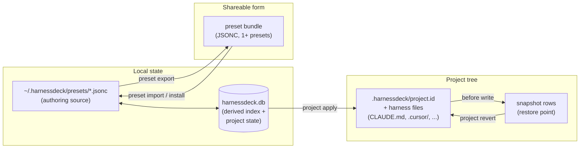
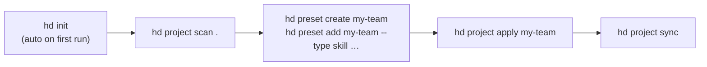

# CLI Noun Reorg and Wizard Mode Design

## Problem

The CLI's command surface has acquired enough overlap and missing affordances to feel uneven:

- `platform` and `harness` are synonyms in the data model but separate noun groups in the CLI.
- `preset add-plugin / remove-plugin / add-dependency / remove-dependency` are four commands doing the same thing — attaching a thing to a preset.
- Plugins are conceptually "stuff you put in a preset" alongside resources and dependencies, but the CLI presents them as a separate verb namespace.
- There is no shorthand for noun groups: every command starts with `hd preset`, `hd project`, `hd resource`. The existing `hd` binary alias (per [2026-05-24-hd-alias-design.md](2026-05-24-hd-alias-design.md)) halves the typing of the program name, not of the noun.
- Some commands have rich interactive flows (`harness set`), others have nothing (`preset add`, `project apply`, `resource delete`). Required-arg discovery means scanning `--help` instead of being walked through.
- README and SPEC have no visual diagram of how the concepts relate.

This design covers the CLI command-surface and ergonomics changes. The storage and project-identity changes are in the companion spec `2026-05-26-storage-and-identity-design.md`. The two specs may land independently.

## Goals

- Collapse synonymous noun groups and merge add/remove sub-commands that take different object types.
- Make plugins feel like first-class members of a preset without conflating them with resources internally.
- Add a wizard mode that auto-triggers when the user is at a TTY and required args are missing, and never auto-triggers in CI or scripted contexts.
- Add short aliases for noun groups for fluent typing.
- Add diagrams to SPEC and README that show how preset, bundle, resource, plugin, project, harness, and snapshot relate.

## Non-Goals

- Renaming `migrate` to `backup` (rejected during brainstorming: `backup` collides with `project history/revert` semantics).
- Removing `preset search / install / publish` (already the cloud-equivalents; nothing to merge with on the CLI side until the cloud product itself takes them over).
- Replacing the JSON output format anywhere.
- Changing the storage model — see companion spec.

## Design Summary

Six independently shippable changes:

1. **Merge `platform` into `harness`.** `hd harness list` replaces `hd platform list`. No back-compat alias — `platform list` is removed in the same release.
2. **Unify preset attachments.** `hd preset add <preset> <selector> --type <type>` where `<type>` is one of the resource subtypes (`instruction`, `skill`, `rule`, `mcp_server`, `permission`, `hook`, `agent`, `command`, `env_var`, `model_config`), `plugin`, or `preset-dependency`. `--type` is **always required** — no defaulting. The four legacy commands stay as hidden aliases for one minor version.
3. **Rename `preset validate` → `preset doctor`.** A multi-check diagnostic surface designed for future expansion (`--check <name>`, `--list-checks`). The current single validation becomes the first check in the registry.
4. **Wizard mode + multi-select hotkeys.** Auto-trigger at TTY when required args are missing and `--no-interactive` is not set; never trigger when `CI=true`, `stdin.isTTY === false`, or `--format json` is requested. Available for `init`, `harness set`, `preset add/remove/delete`, `preset from-project`, `project apply`, `project track`, `resource delete`. Multi-select prompts gain "Select all", "Select none", and "search-as-you-type" hotkeys.
5. **Shorthand aliases.** `hd p` (preset), `hd r` (resource), `hd c` (cloud), `hd h` (harness), `hd pj` (project). Registered via `commander`'s `.alias()`; no behavior change.
6. **Concept diagrams and branding wordsmithing.** Mermaid diagrams in SPEC.md and README.md showing the resource → preset → bundle → project → snapshot pipeline; tagline alignment to "Agent harness configuration toolkit" (CLI) and "Agent harness configuration platform" (cloud) in README/package.json.

## 1. Merge `platform` into `harness`

`platform list` and `harness status` already read the same registry (`src/platforms/registry.ts`). The SPEC even acknowledges them as synonymous. Make the verb hierarchy reflect that.

### New surface

| Old | New |
| --- | --- |
| `hd platform list` | `hd harness list` |
| (no equivalent) | `hd harness list --supported` (filter to natively-serialized harnesses) |
| `hd harness status` | `hd harness status` (unchanged) |
| `hd harness set` | `hd harness set` (unchanged) |
| `hd harness project set` | `hd harness project set` (unchanged) |
| `hd harness project status` | `hd harness project status` (unchanged) |

`hd platform list` is **removed** in the same release. No hidden alias, no deprecation window. The release notes call this out as a breaking change with the one-line migration: `hd platform list` → `hd harness list`. The `harness list --supported` flag mirrors the original intent of `platform list`: discoverable list of what the CLI can target.

### Help text

`harness` group description gets updated to:
> Inspect supported harnesses and manage main/alias harness preferences.

`harness list` description:
> List supported harnesses (Claude Code, Codex, Cursor, and others).

## 2. Unify Preset Attachments

### Current surface

```
preset add        <preset> <resource>
preset remove     <preset> <resource>
preset add-plugin       <preset> <ref> --version <range>
preset remove-plugin    <preset> <ref>
preset add-dependency   <preset> <name> --version <range>
preset remove-dependency <preset> <name>
```

### New surface

```
preset add    <preset> <selector> --type <type> [--version <range>] [--embed]
preset remove <preset> <selector> --type <type>
```

`--type` is one of:

| Group | Values |
| --- | --- |
| Resource subtypes | `instruction`, `skill`, `rule`, `mcp_server`, `permission`, `hook`, `agent`, `command`, `env_var`, `model_config` |
| External | `plugin`, `preset-dependency` |

`--type` is **always required**. There is no default. This trades a few keystrokes for two benefits:

1. The user always declares intent up front; ambiguity between a resource name and a plugin ref that happens to look similar (e.g. `formatter` vs `formatter@mp`) is impossible.
2. The command tells you what kind of thing you are attaching — readable in scripts and shell history.

Behavior by type group:

- **Resource subtypes** (`instruction`, `skill`, etc.) — `selector` resolves to a stored resource. The CLI asserts that the resolved resource's type matches `--type`; mismatch is a clear error. `--version` and `--embed` are rejected.
- **`plugin`** — `selector` is a plugin ref like `formatter@marketplace`. `--version` is **required**. `--embed` opts the plugin tree into bundle exports.
- **`preset-dependency`** — `selector` is a preset name. `--version` is **required**. `--embed` is rejected.

The name `preset-dependency` is deliberately verbose: `dependency` alone is ambiguous in a config tool that already has plugin pins, resource pins, and harness preferences.

### Hidden back-compat aliases

The four legacy commands remain registered as hidden aliases that print a one-line deprecation note to stderr and forward to the unified command:

```
preset add-plugin <preset> <ref> --version <range> [--embed]
  → preset add <preset> <ref> --type plugin --version <range> [--embed]

preset add-dependency <preset> <name> --version <range>
  → preset add <preset> <name> --type preset-dependency --version <range>
```

The existing two-argument `preset add <preset> <selector>` form (no `--type`) is **not** preserved. Invoking it errors with `--type is required (one of: instruction, skill, rule, mcp_server, permission, hook, agent, command, env_var, model_config, plugin, preset-dependency)`. The release notes call this out alongside the `platform list` and `preset validate` breaking changes; "always declare the type" is the trade-off the user asked for in brainstorming.

### Wizard mode shape (see section 4 below)

When a TTY runs `hd preset add my-team` with no further args:

```
? What do you want to add to "my-team"?
  ❯ Resource — instruction / skill / rule / …
    Plugin
    Dependency on another preset

? Which resource type?
    instruction
  ❯ skill
    rule
    mcp_server
    ...

? Which skill? (search-as-you-type)
  ❯ brainstorming
    debugging
    writing-skills
    [show all 12 skills]
```

For plugins and preset-dependencies, the wizard prompts for `--version` after the selector.

## 3. Rename `preset validate` → `preset doctor`

The current `preset validate` runs a single composite check (duplicate resources, empty content, malformed plugin metadata). The intent going forward is a multi-check diagnostic surface — a "doctor" in the sense `npm doctor`, `gh doctor`, and `flutter doctor` use the word. Renaming aligns the name with the planned scope.

### New surface

```
preset doctor [<preset>]
  --check <name>      Run a single named check; can be repeated.
  --list-checks       Print the registered checks and exit.
  --format <mode>     human (default) or json.
```

When no preset selector is passed at a TTY, the wizard prompts for one (multi-select). With `--format json` and no selector, the command errors with a clear "preset selector required in non-interactive mode" message.

### Check registry

Each check is a small named function in `src/services/preset-doctor/checks/`:

| Check id | What it verifies |
| --- | --- |
| `duplicate-resources` | No two `(type, name)` pairs collide in the preset (current `validate` behavior). |
| `empty-content` | No resource has empty `content` and no `content_ref` (current). |
| `plugin-metadata` | Plugin pins parse as valid semver ranges and refs are well-formed (current). |
| `dependency-cycles` | The preset's transitive `preset-dependency` graph is acyclic. (new) |
| `missing-references` | Any `preset-dependency` resolves to a known local preset version. (new) |
| `claude-config` | Marketplace and plugin entries in `claude.*` are well-formed. (new) |
| `content-blob-presence` | Every `content_ref` has its blob file present in `~/.harnessdeck/blobs/`. (new — once content refs ship from the storage spec) |

The "new" checks ship as the registry expands; `preset doctor` always runs every registered check unless `--check` narrows the set. Each check returns a structured result `{ id, severity: "ok|warn|error", message, fix?: string }`. Human mode prints them grouped by severity; JSON mode prints the array directly.

### Back-compat

`preset validate` is removed in the same release. No hidden alias — the rename is small enough that breaking the surface and adding it to the release notes is cleaner than a deprecation period.

## 4. Wizard Mode

### Trigger rule

```
auto-interactive =
       stdin.isTTY
    && stdout.isTTY
    && process.env.CI !== "true"
    && process.env.HARNESSDECK_NO_INTERACTIVE !== "1"
    && !flag("--no-interactive")
    && !(flag("--format=json") || flag("--format", "json"))
    && (required args missing OR explicit --interactive)
```

The flag `--no-interactive` is added globally to the program. `--interactive` (which already exists on `init` and `harness set`) keeps working but is no longer required to trigger a wizard.

When any of the conditions fail, the CLI behaves exactly as it does today: missing required args → Commander error, full args → execute non-interactively.

### Wizard-capable commands

These commands gain wizard mode in this design:

| Command | Wizard offers |
| --- | --- |
| `init` | (existing) main + alias harness picker |
| `harness set` | (existing) main + alias harness picker |
| `harness project set` | main + alias harness picker scoped to a project |
| `preset add` | what-type → which-selector → version (if plugin/dep) → embed (if plugin) |
| `preset remove` | which-attachment (multi-select of attached resources/plugins/deps) |
| `preset delete` | which preset (search) → confirm |
| `preset from-project` | preset name → version → which resources to include (multi-select) |
| `project apply` | preset(s) (multi-select) → platforms (multi-select, default detected) → dry-run/apply |
| `project track` (new in storage spec) | confirm path → optional label |
| `resource delete` | which resource (search + multi-select) → confirm |

Commands explicitly *not* getting wizards: `*-list`, `*-show`, `*-status`, `*-diff`, `*-validate`, `preset export`, `preset import`, `project scan`, `project sync`, `project drift`, `project history`, `project revert`, `plugin *`, `migrate *`. These are either pure read flows or single-action with one obvious arg.

### Wizard implementation

All wizards live in `src/services/wizards/<command>.ts` and return the same shape Commander would have parsed from explicit flags. The action handler runs the same code path either way:

```ts
async function handlePresetAddCommand(args, opts, cmd) {
  const resolved = await resolveOrPrompt({
    args,
    opts,
    cmd,
    prompt: presetAddWizard,
  });
  return runPresetAdd(resolved);
}
```

`resolveOrPrompt` encapsulates the trigger rule and returns either the parsed argv or the wizard's output.

### Interaction hotkeys

`inquirer` (already a dependency) supports multi-select hotkeys via `@inquirer/checkbox`. The wizard primitive enables:

- `a` / Space — select / deselect highlighted item
- `i` — invert selection
- `Ctrl+A` — select all
- `Ctrl+D` — deselect all
- typing — search-as-you-type filter

A small wrapper in `src/ui/prompts.ts` injects these defaults so individual wizards do not repeat the configuration.

## 5. Shorthand Aliases

Registered via Commander's `.alias()`:

```ts
program.command("preset").alias("p")
program.command("resource").alias("r")
program.command("project").alias("pj")
program.command("harness").alias("h")
program.command("cloud").alias("c")
```

Behavior is identical to the full noun; help output shows both forms. `hd p ls`, `hd p add my-team x`, `hd pj scan .`, `hd h list` all work.

Plugin and migrate intentionally do not get short aliases — `plugin` is a short word already, and `migrate` is rare-use.

## 6. Concept Diagrams and Branding

A mermaid diagram is added to SPEC.md immediately after the "Core concepts" list:



A second smaller mermaid in README.md ("Quick start" section) shows the happy-path command flow:



### Branding wordsmithing

The product currently describes itself in `package.json` and the README as a *"preset-based AI coding assistant configuration manager"*. Update to align CLI and cloud naming:

| Surface | Current | New |
| --- | --- | --- |
| `package.json#description` | preset-based AI coding assistant configuration manager for Claude Code, Codex, Cursor, and other coding CLIs | Agent harness configuration toolkit for Claude Code, Codex, Cursor, and other coding CLIs |
| README opening sentence | `harnessdeck` is a preset-based CLI for managing AI coding assistant configuration across multiple tools. | `harnessdeck` is the agent harness configuration toolkit — manage AI coding assistant configuration across multiple tools through reusable presets. |
| Cloud product references | (currently referred to inconsistently as "HarnessDeck Cloud" / "Harness Cloud" / "the cloud") | "HarnessDeck Cloud — the agent harness configuration platform." Standardize the long-form name on first mention per doc. |

This is a wording-only change. No command names, schema identifiers, database filenames, or product internals change.

## Command Reference After This Spec Lands

Visible top-level commands (alphabetical):

```
hd cloud      [c]   - Manage Harness Cloud profiles
hd config           - Show/set/reset user config       (new — see storage spec)
hd harness    [h]   - Inspect harnesses, manage prefs  (subsumes `platform`)
hd init             - Bootstrap (rarely needed; auto on first command)
hd migrate          - Cross-machine state transfer
hd plugin           - Plugin inventory and lifecycle
hd preset     [p]   - Manage presets
hd project    [pj]  - Scan, apply, sync, track projects (gains `track` — see storage spec)
hd resource   [r]   - List, show, delete canonical resources
```

Removed (breaking; release note + migration in one line each):

```
hd platform list                  → hd harness list
hd preset validate                → hd preset doctor
hd preset add <preset> <selector> → hd preset add <preset> <selector> --type <type>
                                    (--type is now required; errors if omitted)
```

Hidden / deprecated (one minor-version window):

```
hd preset add-plugin              → hd preset add ... --type plugin
hd preset remove-plugin           → hd preset remove ... --type plugin
hd preset add-dependency          → hd preset add ... --type preset-dependency
hd preset remove-dependency       → hd preset remove ... --type preset-dependency
hd apply / scan / status / export / import / history / revert / platforms
(existing hidden aliases from the noun-group migration — unchanged)
```

## Testing Strategy

- `hd harness list` returns the same data as the old `hd platform list`, both in human and JSON modes.
- `hd platform list` is no longer a registered command and errors with Commander's standard unknown-command message.
- `hd preset add my-team formatter@mp --type plugin --version "^1.0"` produces the same DB state as `hd preset add-plugin my-team formatter@mp --version "^1.0"`.
- `hd preset add my-team --type plugin formatter@mp` errors clearly because `--version` is missing.
- `hd preset add my-team --type skill instruction-name` errors clearly because the resolved resource type does not match `--type`.
- `hd preset add my-team --type preset-dependency other-preset` requires `--version`.
- `hd preset add my-team res-name` (no `--type`) fails with the "--type is required" error and lists the valid values in the error message.
- `hd preset doctor my-team` runs all registered checks. `hd preset doctor my-team --check duplicate-resources` runs only that check. `hd preset doctor --list-checks` prints the registry.
- `hd preset validate` is no longer registered and errors as unknown.
- Wizard trigger matrix: TTY+no-args = wizard; TTY+full-args = no wizard; CI=true = no wizard; `--format json` = no wizard; `--no-interactive` = no wizard.
- `hd p ls`, `hd r ls`, `hd pj status`, `hd h list`, `hd c whoami` all dispatch to the canonical commands.
- Multi-select prompts respect Ctrl+A / Ctrl+D / search hotkeys.
- Mermaid blocks in SPEC.md and README.md render in GitHub preview (manual check).
- `package.json#description` matches the new toolkit tagline (assertable in a small unit test).

## Documentation Changes

- SPEC.md: replace the `harnessdeck platform list` row in the top-level command table with `harnessdeck harness list`. Remove the four plugin/dependency add/remove rows from the preset subcommand table; replace with the unified `preset add` and `preset remove` rows that document `--type`. Replace `preset validate` with `preset doctor`. Add the mermaid diagram.
- SPEC.md: add a "Wizard mode" subsection under "Command surface" describing the trigger rule and the wizard-capable command list.
- SPEC.md "Product summary" first paragraph: update the one-line product description to the new "agent harness configuration toolkit" framing.
- README.md: update the Quick Start example to use the explicit `hd preset add my-setup openapi-mcp-baseline --type skill` form and add a sibling example for `--type plugin`. Add the smaller mermaid diagram.
- README.md: remove the references to `preset validate`; replace with `preset doctor`. Remove references to `preset add-plugin`, `preset remove-plugin`, `preset add-dependency`, `preset remove-dependency`; replace with the unified form.
- README.md opening paragraph: replace with the new toolkit-framing sentence.
- `package.json#description`: update to the new tagline.

## Implementation Notes

Phasing:

1. Shorthand aliases — trivial, lands first.
2. Branding wordsmithing + Mermaid diagrams in SPEC + README — doc-only, lands second.
3. `harness list` + remove `platform list` — small (breaking, release note).
4. `preset doctor` rename + check registry scaffold (one check to start) — small (breaking, release note).
5. Unified `preset add / remove --type` + hidden legacy aliases + hidden two-arg shim — medium.
6. Wizard trigger rule (`resolveOrPrompt` helper) + first wizard (`preset add`).
7. Remaining wizards, command by command. Each ships independently behind the same trigger rule.

Each step is independently testable and preserves `bun run preflight`. The two specs (this one and storage) are independent — either can ship first.

## Open Questions

- Should `--no-interactive` be an alias for `--format json` (since JSON output already implies non-interactive)? Leaving them separate for now; the JSON path already forces non-interactive internally, and `--no-interactive` covers the human-output-but-no-prompts case.
- Should the wizard for `project apply` confirm before writing files? Today `project apply` writes immediately and snapshots before write. The wizard can show a one-line summary and require Enter to proceed — that is the proposed default for the wizard path only; flag-only invocations stay non-confirming.
