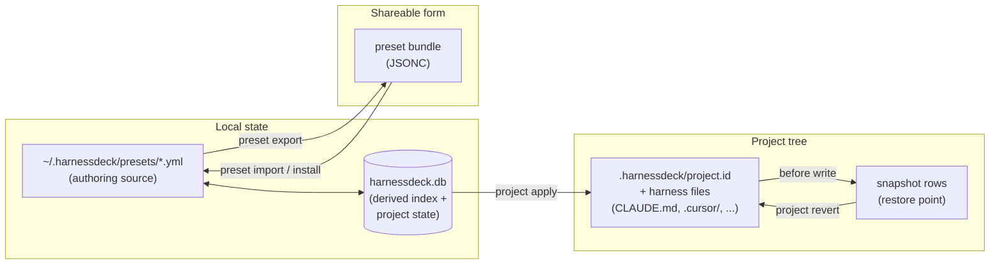
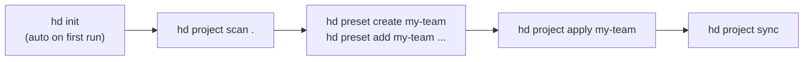

# CLI Noun Reorg and Wizard Mode Design

## Problem

The CLI's command surface has acquired enough overlap and missing affordances to feel uneven:

- `platform` and `harness` are synonyms in the data model but separate noun groups in the CLI.
- `preset add-plugin / remove-plugin / add-dependency / remove-dependency` are four commands doing the same thing — attaching a thing to a preset.
- Plugins are conceptually "stuff you put in a preset" alongside resources and dependencies, but the CLI presents them as a separate verb namespace.
- There is no shorthand for noun groups: every command starts with `hd preset`, `hd project`, `hd resource`. The existing `hd` binary alias (per [2026-05-24-hd-alias-design.md](2026-05-24-hd-alias-design.md)) halves the typing of the program name, not of the noun.
- Some commands have rich interactive flows (`harness set`), others have nothing (`preset add`, `project apply`, `resource delete`). Required-arg discovery means scanning `--help` instead of being walked through.
- README and SPEC have no visual diagram of how the concepts relate.

This design covers the CLI command-surface and ergonomics changes. The storage and project-identity changes are in the companion spec `2026-05-26-storage-and-identity-design.md`. The two specs may land independently.

## Goals

- Collapse synonymous noun groups and merge add/remove sub-commands that take different object types.
- Make plugins feel like first-class members of a preset without conflating them with resources internally.
- Add a wizard mode that auto-triggers when the user is at a TTY and required args are missing, and never auto-triggers in CI or scripted contexts.
- Add short aliases for noun groups for fluent typing.
- Add diagrams to SPEC and README that show how preset, bundle, resource, plugin, project, harness, and snapshot relate.

## Non-Goals

- Renaming `migrate` to `backup` (rejected during brainstorming: `backup` collides with `project history/revert` semantics).
- Renaming `preset validate` to `preset doctor` (rejected: scope is single-check, not multi-diagnostic).
- Removing `preset search / install / publish` (already the cloud-equivalents; nothing to merge with).
- Replacing the JSON output format anywhere.
- Changing the storage model — see companion spec.

## Design Summary

Six independently shippable changes:

1. **Merge `platform` into `harness`.** `hd harness list` replaces `hd platform list`. `hd platform list` becomes a hidden alias.
2. **Unify preset attachments.** `hd preset add <preset> <selector> --type resource|plugin|dependency` (default `resource`). The four existing commands stay as hidden aliases.
3. **Wizard mode.** Auto-trigger at TTY when required args are missing and `--no-interactive` is not set; never trigger when `CI=true`, `stdin.isTTY === false`, or `--format json` is requested. Available for `init`, `harness set`, `preset add/remove/delete`, `preset from-project`, `project apply`, `project track`, `resource delete`.
4. **Hotkeys in interactive lists.** "Select all", "Select none", and "search-as-you-type" hotkeys in any multi-select prompt.
5. **Shorthand aliases.** `hd p` (preset), `hd r` (resource), `hd c` (cloud), `hd h` (harness), `hd pj` (project). Registered via `commander`'s `.alias()`; no behavior change.
6. **Concept diagrams.** Mermaid diagrams in SPEC.md and README.md showing the resource → preset → bundle → project → snapshot pipeline and the harness/alias-harness relationship.

## 1. Merge `platform` into `harness`

`platform list` and `harness status` already read the same registry (`src/platforms/registry.ts`). The SPEC even acknowledges them as synonymous. Make the verb hierarchy reflect that.

### New surface

| Old | New |
| --- | --- |
| `hd platform list` | `hd harness list` |
| (no equivalent) | `hd harness list --supported` (filter to natively-serialized harnesses) |
| `hd harness status` | `hd harness status` (unchanged) |
| `hd harness set` | `hd harness set` (unchanged) |
| `hd harness project set` | `hd harness project set` (unchanged) |
| `hd harness project status` | `hd harness project status` (unchanged) |

`hd platform list` is registered as a hidden Commander alias of `hd harness list` for two minor versions. It prints `note: \`platform list\` is deprecated; use \`harness list\`` to stderr and exits 0. The `harness list --supported` flag mirrors the original intent of `platform list`: discoverable list of what the CLI can target.

### Help text

`harness` group description gets updated to:
> Inspect supported harnesses and manage main/alias harness preferences.

`harness list` description:
> List supported harnesses (Claude Code, Codex, Cursor, and others).

## 2. Unify Preset Attachments

### Current surface

```
preset add        <preset> <resource>
preset remove     <preset> <resource>
preset add-plugin       <preset> <ref> --version <range>
preset remove-plugin    <preset> <ref>
preset add-dependency   <preset> <name> --version <range>
preset remove-dependency <preset> <name>
```

### New surface

```
preset add    <preset> <selector> [--type resource|plugin|dependency] [--version <range>] [--embed]
preset remove <preset> <selector> [--type resource|plugin|dependency]
```

Behavior:

- `--type resource` (default) — `selector` is a resource name or ID. `--version` and `--embed` are rejected.
- `--type plugin` — `selector` is a plugin ref like `formatter@marketplace`. `--version` is **required**. `--embed` opts the plugin tree into bundle exports.
- `--type dependency` — `selector` is a preset name. `--version` is **required**. `--embed` is rejected.

No silent type guessing. The default is `resource` because that is the most common usage path.

### Hidden back-compat aliases

The four removed commands remain registered as hidden aliases that print a one-line deprecation note to stderr and forward to the unified command:

```
preset add-plugin <preset> <ref> --version <range> [--embed]
  → preset add <preset> <ref> --type plugin --version <range> [--embed]
```

They stay hidden for two minor versions, then are removed.

### Wizard mode shape (see section 3)

When a TTY runs `hd preset add my-team` with no further args:

```
? What do you want to add to "my-team"?
  ❯ Resource
    Plugin
    Dependency on another preset

? Which resource? (search-as-you-type)
  ❯ instruction:project-context
    skill:brainstorming
    rule:naming-conventions
    [show all 47 resources]
```

For plugins and dependencies, the wizard then prompts for `--version`.

## 3. Wizard Mode

### Trigger rule

```
auto-interactive =
       stdin.isTTY
    && stdout.isTTY
    && process.env.CI !== "true"
    && process.env.HARNESSDECK_NO_INTERACTIVE !== "1"
    && !flag("--no-interactive")
    && !(flag("--format=json") || flag("--format", "json"))
    && (required args missing OR explicit --interactive)
```

The flag `--no-interactive` is added globally to the program. `--interactive` (which already exists on `init` and `harness set`) keeps working but is no longer required to trigger a wizard.

When any of the conditions fail, the CLI behaves exactly as it does today: missing required args → Commander error, full args → execute non-interactively.

### Wizard-capable commands

These commands gain wizard mode in this design:

| Command | Wizard offers |
| --- | --- |
| `init` | (existing) main + alias harness picker |
| `harness set` | (existing) main + alias harness picker |
| `harness project set` | main + alias harness picker scoped to a project |
| `preset add` | what-type → which-selector → version (if plugin/dep) → embed (if plugin) |
| `preset remove` | which-attachment (multi-select of attached resources/plugins/deps) |
| `preset delete` | which preset (search) → confirm |
| `preset from-project` | preset name → version → which resources to include (multi-select) |
| `project apply` | preset(s) (multi-select) → platforms (multi-select, default detected) → dry-run/apply |
| `project track` (new in storage spec) | confirm path → optional label |
| `resource delete` | which resource (search + multi-select) → confirm |

Commands explicitly *not* getting wizards: `*-list`, `*-show`, `*-status`, `*-diff`, `*-validate`, `preset export`, `preset import`, `project scan`, `project sync`, `project drift`, `project history`, `project revert`, `plugin *`, `migrate *`. These are either pure read flows or single-action with one obvious arg.

### Wizard implementation

All wizards live in `src/services/wizards/<command>.ts` and return the same shape Commander would have parsed from explicit flags. The action handler runs the same code path either way:

```ts
async function handlePresetAddCommand(args, opts, cmd) {
  const resolved = await resolveOrPrompt({
    args,
    opts,
    cmd,
    prompt: presetAddWizard,
  });
  return runPresetAdd(resolved);
}
```

`resolveOrPrompt` encapsulates the trigger rule and returns either the parsed argv or the wizard's output.

### Interaction hotkeys

`inquirer` (already a dependency) supports multi-select hotkeys via `@inquirer/checkbox`. The wizard primitive enables:

- `a` / Space — select / deselect highlighted item
- `i` — invert selection
- `Ctrl+A` — select all
- `Ctrl+D` — deselect all
- typing — search-as-you-type filter

A small wrapper in `src/ui/prompts.ts` injects these defaults so individual wizards do not repeat the configuration.

## 4. Shorthand Aliases

Registered via Commander's `.alias()`:

```ts
program.command("preset").alias("p")
program.command("resource").alias("r")
program.command("project").alias("pj")
program.command("harness").alias("h")
program.command("cloud").alias("c")
```

Behavior is identical to the full noun; help output shows both forms. `hd p ls`, `hd p add my-team x`, `hd pj scan .`, `hd h list` all work.

Plugin and migrate intentionally do not get short aliases — `plugin` is a short word already, and `migrate` is rare-use.

## 5. Concept Diagrams

A mermaid diagram is added to SPEC.md immediately after the "Core concepts" list:



A second smaller mermaid in README.md ("Quick start" section) shows the happy-path command flow:



## Command Reference After This Spec Lands

Visible top-level commands (alphabetical):

```
hd cloud      [c]   - Manage Harness Cloud profiles
hd config           - Show/set/reset user config       (new — see storage spec)
hd harness    [h]   - Inspect harnesses, manage prefs  (subsumes `platform`)
hd init             - Bootstrap (rarely needed; auto on first command)
hd migrate          - Cross-machine state transfer
hd plugin           - Plugin inventory and lifecycle
hd preset     [p]   - Manage presets
hd project    [pj]  - Scan, apply, sync, track projects (gains `track` — see storage spec)
hd resource   [r]   - List, show, delete canonical resources
```

Hidden / deprecated:

```
hd platform list                  → hd harness list
hd preset add-plugin              → hd preset add ... --type plugin
hd preset remove-plugin           → hd preset remove ... --type plugin
hd preset add-dependency          → hd preset add ... --type dependency
hd preset remove-dependency       → hd preset remove ... --type dependency
hd apply / scan / status / export / import / history / revert / platforms
(existing hidden aliases from the noun-group migration — unchanged)
```

## Testing Strategy

- `hd harness list` returns the same data as the old `hd platform list`, both in human and JSON modes.
- `hd platform list` still works and prints the deprecation note to stderr (assertable in tests).
- `hd preset add my-team formatter@mp --type plugin --version "^1.0"` produces the same DB state as `hd preset add-plugin my-team formatter@mp --version "^1.0"`.
- `hd preset add my-team res-name` defaults to `--type resource`.
- `hd preset add my-team --type plugin x` errors clearly because `--version` is missing.
- Wizard trigger matrix: TTY+no-args = wizard; TTY+full-args = no wizard; CI=true = no wizard; `--format json` = no wizard.
- `hd p ls`, `hd r ls`, `hd pj status`, `hd h list`, `hd c whoami` all dispatch to the canonical commands.
- Multi-select prompts respect Ctrl+A / Ctrl+D / search hotkeys.
- Mermaid blocks in SPEC.md and README.md render in GitHub preview (manual check).

## Documentation Changes

- SPEC.md: replace the `harnessdeck platform list` row in the top-level command table with `harnessdeck harness list`. Move plugin/dependency add/remove rows out of the preset subcommand table; replace with the unified `preset add` and `preset remove` rows. Add the mermaid diagram.
- SPEC.md: add a "Wizard mode" subsection under "Command surface" describing the trigger rule and the wizard-capable command list.
- README.md: update the Quick Start example to use `hd preset add my-setup openapi-mcp-baseline` (no `--type` — default is resource) and add a sibling example for `--type plugin`. Add the smaller mermaid diagram.
- README.md: remove the `--type` flag from any spot where the old four commands are referenced; replace with the unified form.

## Implementation Notes

Phasing:

1. Shorthand aliases — trivial, lands first.
2. Mermaid diagrams in SPEC + README — doc-only, lands second.
3. `harness list` + hidden `platform list` alias — small.
4. Unified `preset add / remove --type` + hidden back-compat — medium.
5. Wizard trigger rule (`resolveOrPrompt` helper) + first wizard (`preset add`).
6. Remaining wizards, command by command. Each ships independently behind the same trigger rule.

Each step is independently testable and preserves `bun run preflight`. The two specs (this one and storage) are independent — either can ship first.

## Open Questions

- Should `--no-interactive` be an alias for `--format json` (since JSON output already implies non-interactive)? Leaving them separate for now; the JSON path already forces non-interactive internally, and `--no-interactive` covers the human-output-but-no-prompts case.
- Should the wizard for `project apply` confirm before writing files? Today `project apply` writes immediately and snapshots before write. The wizard can show a one-line summary and require Enter to proceed — that is the proposed default for the wizard path only; flag-only invocations stay non-confirming.
