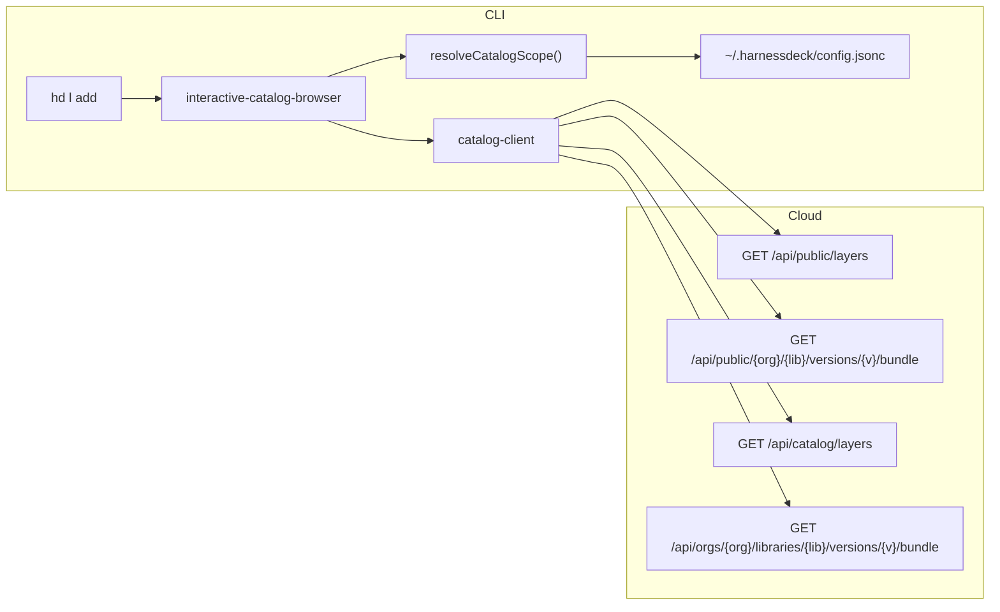

# Catalog browse design (anonymous + connected sources)

**Date:** 2026-06-07  
**Status:** Implemented  
**Related:** [SPEC.md](../../../SPEC.md), [harnessdeck-cloud SPEC](../../../../harnessdeck-cloud/SPEC.md)

## Problem

`layer add` without a selector requires a logged-in cloud profile and prefetches the entire remote catalog into a static searchable picker. That blocks the primary OSS onboarding path: discover and install curated public layers from the `harnessdeck-cloud` org without `cloud login`.

Other orgs may publish `visibility=public` libraries, but exposing every public library globally would flood the browse UI. Users need an explicit opt-in mechanism for additional orgs or individual libraries.

## Goals

1. **Anonymous browse and install** for the default OSS catalog (`harnessdeck-cloud` org only).
2. **Interactive `hd l add`** on TTY with live server-side filtering (like `hd resource ls`).
3. **Empty search → top 10** most recently published libraries in scope.
4. **Explicit catalog connections** so users can add other public orgs or individual libraries without flooding the default view.
5. **Auth is additive** — login unlocks private org libraries and cross-org shares on top of the connected public set.

## Non-goals (this design)

- Multi-registry fan-out beyond one HarnessDeck Cloud base URL.
- Version picker inside the browse UI (`latestVersion` on install; `@version` stays on the CLI arg).
- Replacing `layer search` (it reuses the same catalog client and scope rules).
- Web UI for managing CLI catalog connections.

## Vocabulary

| Term | Meaning |
| --- | --- |
| **Default catalog** | Public libraries in the `harnessdeck-cloud` org. Always included; not removable. |
| **Connected org** | An additional org slug the user opted into via `layer catalog connect org`. Only `visibility=public` libraries from that org appear in browse/search. |
| **Connected library** | A single `org/library` selector opted in without subscribing to the whole org. |
| **Authenticated catalog** | Org-scoped and shared libraries visible to a logged-in user, merged with the public connected set. |
| **Catalog scope** | The union of default catalog + connected sources + (when authenticated) private org + shared libraries. |

## Architecture

### Access tiers

```
Anonymous user
  └─ default catalog (harnessdeck-cloud public)
  └─ connected orgs (public only)
  └─ connected libraries (public only)

Authenticated user
  └─ everything above
  └─ organization libraries in member orgs
  └─ libraries shared to member orgs (library_shares)
```

### Data flow



### Local configuration

Extend `~/.harnessdeck/config.jsonc`:

```jsonc
{
  "plugins": { "refreshMaxAgeHours": 24 },
  "catalog": {
    "cloudBaseUrl": "https://harnessdeck.kayrnt.fr",
    "connectedOrgs": ["acme"],
    "connectedLayers": ["partner-co/design-system"]
  }
}
```

| Field | Default | Meaning |
| --- | --- | --- |
| `catalog.cloudBaseUrl` | `https://harnessdeck.kayrnt.fr` | HarnessDeck Cloud API root. Overridable via `--base-url` or `HARNESSDECK_CLOUD_URL`. |
| `catalog.connectedOrgs` | `[]` | Additional org slugs whose public libraries are included in browse/search. |
| `catalog.connectedLayers` | `[]` | Individual `org/library` selectors included even when the org is not connected. |

`harnessdeck-cloud` is **not** stored in `connectedOrgs`; it is always implicit.

## Cloud API

### Public listing (anonymous)

`GET /api/public/layers`

Remove the authentication requirement. Response is already limited to `visibility=public` libraries.

**Query parameters:**

| Param | Default | Behavior |
| --- | --- | --- |
| `q` | — | Case-insensitive match on `name`, `slug`, `summary`, `orgSlug`, `tags` |
| `tag` | — | Exact tag filter |
| `org` | — | Restrict to one org slug. Repeatable (`org=harnessdeck-cloud&org=acme`) or comma-separated. |
| `selector` | — | Restrict to `org/library` pairs. Repeatable. Used for connected-library entries. |
| `sort` | `updated` | `updated` (desc) or `name` (asc) |
| `limit` | `10` | Max 100 |
| `cursor` | — | Offset cursor (existing encoding) |

**Sort `updated`:** join `library_versions`, take `MAX(publishedAt)` per library where `yankedAt IS NULL`, order descending. Expose as `updatedAt` in the response.

**Response:**

```json
{
  "layers": [{
    "orgSlug": "harnessdeck-cloud",
    "slug": "incident-response",
    "name": "Incident Response",
    "summary": "...",
    "latestVersion": "1.2.0",
    "updatedAt": "2026-06-01T12:00:00Z",
    "tags": ["oncall"],
    "visibility": "public"
  }],
  "nextCursor": null
}
```

### Public bundle download (new)

`GET /api/public/{orgSlug}/{layerSlug}/versions/{version}/bundle`

- No authentication.
- `version` accepts `latest` (resolves to `library.latestVersion`).
- `404` when library is not `public`, version is yanked, or selector does not exist.
- Stream bundle JSON with immutable cache headers per harnessdeck-cloud SPEC.

### Authenticated unified catalog (new)

`GET /api/catalog/layers`

Requires bearer token with `read` scope (CLI JWT or PAT).

Returns the union of:

1. Public libraries in `harnessdeck-cloud` (always).
2. `organization` libraries in orgs the user belongs to.
3. `shared` libraries granted to those orgs via `library_shares`.
4. Public libraries from orgs/libraries explicitly requested by the CLI via `org` / `selector` query params (connected sources).

Same query params, sort, limit, and response shape as the public route. Dedupe by `(orgSlug, slug)`; prefer the entry with the richest visibility metadata.

Authenticated bundle download for non-public libraries uses the existing org-scoped route:

`GET /api/orgs/{orgSlug}/libraries/{layerSlug}/versions/{version}/bundle`

### Rate limiting

Public routes: IP-based limit (e.g. 60 req/min). Authenticated routes: per-token limits. Return `429` with `Retry-After`.

## CLI design

### Catalog client

Split `cloud-client.ts` responsibilities:

| Module | Auth | Role |
| --- | --- | --- |
| `public-catalog-client.ts` | None | `listPublicLibraries`, `downloadPublicBundle` |
| `authenticated-catalog-client.ts` | Bearer | `listCatalogLibraries`, `downloadOrgBundle` |
| `catalog-scope.ts` | — | Resolve default + connected orgs/libraries from config |
| `resolveCatalogClient({ profile?, baseUrl? })` | Picks mode | Used by layer commands |

Migrate all HTTP paths to the `/api/...` prefix (fixes the wire-protocol gap in both SPECs).

**`listLibrariesInScope({ q, tag, limit, cursor })`** — CLI-side orchestration:

1. Build org/selector param sets from `resolveCatalogScope()`.
2. If anonymous → one or more `GET /api/public/layers` calls, merge, dedupe, sort by `updatedAt`, apply `limit`.
3. If authenticated → `GET /api/catalog/layers` with the same scope params (single round-trip).

**`downloadBundle(org, slug, version?)`** — pick public or authenticated download path based on library visibility and auth state.

Default base URL is used when no cloud profile exists. No profile file is required for anonymous browse/install of in-scope public libraries.

### Catalog connection commands

New `layer catalog` subcommand group:

| Command | Behavior |
| --- | --- |
| `layer catalog list` | Show default catalog, connected orgs, connected libraries, and effective cloud base URL. |
| `layer catalog connect org <slug>` | Append org slug to `catalog.connectedOrgs` (idempotent). Validates org exists and has at least one public library. |
| `layer catalog disconnect org <slug>` | Remove org from `catalog.connectedOrgs`. Cannot disconnect `harnessdeck-cloud`. |
| `layer catalog connect layer <org>/<slug>` | Append selector to `catalog.connectedLayers`. Validates public visibility. |
| `layer catalog disconnect layer <org>/<slug>` | Remove selector from `catalog.connectedLayers`. |

`--format human|json` on `list`. Mutations write `config.jsonc` atomically.

**Flooding guardrails:**

- Default browse never queries all public libraries globally.
- `connect org` only adds one org at a time; the CLI validates the org slug against the API before persisting.
- `connect layer` allows pinning a single public library from any org without subscribing to the whole org.
- Authenticated private/shared libraries appear only for orgs the user belongs to — never from arbitrary orgs.

### Interactive browse (`hd l add`)

New `src/services/wizards/interactive-catalog-browser.ts`, modeled on `interactive-resource-list.ts`.

Replace the current `promptForSearchableChoice` path in `handleLayerInstallCommand`.

**UI sketch:**

```
Select a layer to install
Search: oncall
Install: > harnessdeck-cloud/incident-response

  ORG/LIBRARY                    NAME              UPDATED
  harnessdeck-cloud/pagerduty    PagerDuty         2d ago
> harnessdeck-cloud/oncall       On-Call Kit       5d ago

  ↑↓ select • type search • ⌫ erase • ⏎ install • esc cancel
```

**Behavior:**

| State | Action |
| --- | --- |
| Empty query | `listLibrariesInScope({ limit: 10, sort: updated })` |
| User types | 300ms debounce → `listLibrariesInScope({ q, limit: 25 })` |
| ↑ / ↓ | Move selection |
| Enter | Return `{ orgSlug, slug, version: latestVersion }` → install |
| Esc | Cancel (exit 1) |

Scope badge in the header when connected sources exist: `Catalog: harnessdeck-cloud + acme, partner-co/design-system`.

### `layer add` command flow

```
hd l add [selector] [flags]
```

| Input | Behavior |
| --- | --- |
| `selector` provided | Skip browse; install directly if library is in scope (or user is authenticated with access). |
| No selector, TTY | Launch `interactive-catalog-browser` |
| No selector, non-TTY | Error (unchanged) |
| `--org <slug>` | One-shot org filter on top of scope (must be default or connected, unless authenticated with org access). |
| `--profile <name>` | Use authenticated catalog when token is valid |
| `--base-url <url>` | Override `catalog.cloudBaseUrl` for this invocation |
| `--format json` | Skip interactive UI |

**Install without profile:** allowed when the target library is public and in catalog scope. Uses `GET /api/public/.../bundle`.

**Error copy when out of scope:**

```
Library acme/team is not in your catalog scope.
Connect the org:  hd layer catalog connect org acme
Connect one lib:  hd layer catalog connect layer acme/team
```

### `layer search`

Thin wrapper over `listLibrariesInScope({ q: query })`. Same scope rules as browse. Works without login. Human output uses the same table columns as the interactive browser.

## End-to-end workflows

### OSS user (no login)

```bash
hd l add
# → interactive browse, harnessdeck-cloud public libraries only
# → top 10 by updatedAt when search is empty
# → type to filter live against the API
# → Enter installs latestVersion

hd l add harnessdeck-cloud/incident-response
# → direct install, no profile required
```

### User opting into a partner org

```bash
hd layer catalog connect org acme
hd l add
# → browse spans harnessdeck-cloud + acme public libraries

hd layer catalog connect layer partner-co/design-system
# → browse also includes that single library
```

### Authenticated team member

```bash
hd cloud login
hd l add
# → harnessdeck-cloud + connected sources + own org libraries + shared libraries
# → private entries show a visibility hint in the table (e.g. "org" vs "shared" vs "public")
```

## Implementation phases

### Phase 1 — Cloud public catalog (harnessdeck-cloud)

- Remove auth gate on `GET /api/public/layers`.
- Add `sort`, `org`, `selector`, `updatedAt` sort via `publishedAt` join.
- Implement `GET /api/public/{org}/{slug}/versions/{version}/bundle`.
- Tests: anonymous list/download, yanked/non-public 404, multi-org filter.

### Phase 2 — CLI catalog client + config

- `catalog` section in `config.jsonc` read/write helpers.
- `public-catalog-client` + `catalog-scope.ts`.
- `layer catalog connect|disconnect|list`.
- Anonymous `layer add <harnessdeck-cloud/...>` and `layer search`.

### Phase 3 — Interactive browse UX

- `interactive-catalog-browser` with debounced server search.
- `catalog-list-render.ts` table renderer.
- Wire into `handleLayerInstallCommand`.
- CLI integration tests with mocked fetch.

### Phase 4 — Authenticated catalog

- `GET /api/catalog/layers` on Cloud.
- `authenticated-catalog-client` aligned to `/api/cli/*` device-auth paths.
- Merge authenticated libraries in browse; visibility hints in table.

## Testing

| Layer | Cases |
| --- | --- |
| Cloud API | Anonymous 200 on public list; sort by `updatedAt`; `org` / `selector` filters; public bundle download; 404 for private/yanked |
| CLI unit | Scope resolution, debounce, dedupe merge, config mutations |
| CLI integration | Interactive add on TTY; install without profile; out-of-scope error with connect hint; `catalog connect org` expands browse results |
| Smoke | Install a real `harnessdeck-cloud/*` library against staging |

## CLI UX contract

- Follow existing `--format json`, selector grammar, and TTY wizard conventions.
- JSON coverage: `layer catalog list`, `layer search`, `layer add` (install result).
- Human warnings when `connect org` finds no public libraries (still allow connect — org may publish later).
