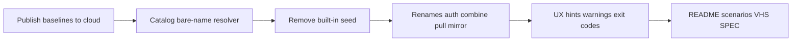

# CLI UX realignment design

**Date:** 2026-06-11  
**Status:** Approved  
**Related:** [SPEC.md](../../../SPEC.md), [2026-06-07 catalog browse](2026-06-07-catalog-browse-design.md), [command reference](../../cli/command-reference.md)

## Problem

The current CLI optimizes for power users who build custom layers from scanned resources. New engineers face unnecessary friction:

- Built-in starter layers ship inside the npm package instead of the public catalog.
- `project apply` only auto-fetches remote layers when the selector is a published path (`org/catalog/name`); bare names require a prior `layer pull`.
- Similar verbs (`attach` vs `add`, `apply` vs `sync`, `cloud` vs `layer`) compete for the same mental slot.
- `--harness` duplicates `--harness`.
- Business-logic errors often lack recovery hints; some failure paths return exit code `0`.
- README Quick start walks through create/attach before the user sees value from applying a baseline.
- Install docs lead with Bun instead of `npx`/`npm`, the path most engineers expect.

## Goals

1. **Catalog-first baselines** — remove built-in layer seeding; resolve bare names against the public catalog (and connected orgs) at apply time.
2. **Apply as the primary action** — users should not need to distinguish local vs remote for `project apply`.
3. **Clearer command vocabulary** — `combine`/`uncombine`, `pull`, `mirror`, `auth`.
4. **Single harness flag** — `--harness` only; remove `--harness`.
5. **Onboarding that applies first** — Quick start applies an existing layer; a follow-up section covers scan → compose → publish.
6. **Actionable errors and warnings** — every common failure suggests the next command; surface git/catalog/auth preconditions early.
7. **npm-first install** — `npx`/`npm` primary; Bun and source install in collapsible README sections.

## Non-goals

- Redesigning the resource → plugin → layer → deck domain model.
- Replacing `layer search` or the interactive browse UI.
- Multi-registry fan-out beyond one HarnessDeck Cloud base URL.
- Purging built-in layers already seeded in existing local databases.
- Web UI changes (harnessdeck-cloud docs sync is in scope; product UI is not).

## Decisions (approved 2026-06-11)

| Topic | Decision |
| --- | --- |
| `attach` / `detach` | **`combine` / `uncombine`** only (pre-0.1.0; no aliases) |
| `layer add` | **`layer pull`** only |
| `project sync` | **`project mirror`** only |
| `cloud` command group | **`auth`** only (`login`, `status`, `orgs`, `logout`) |
| `--platform` | **Removed**; `--harness` only |
| Bare-name catalog resolve | Search **all orgs in catalog scope** (default `harnessdeck-cloud` + connected orgs + connected libraries); exact name match required |
| Built-in seeding | **Remove** from `init`; publish `nextjs-fullstack` and `python-fastapi` to public catalog first |
| Spec location | This document |

---

## 1. Remove built-in starter layers

### Current behavior

`harnessdeck init` calls `seedBuiltInPlugins()`, which imports bundles from `builtin-plugins/` (`nextjs-fullstack`, `python-fastapi`) into SQLite.

### Target behavior

`init` creates the database, initializes schema, scans supported home-directory harness folders, and optionally records global main/alias harness preferences. **No layer seeding.**

### Package layout

- Remove `builtin-plugins/` from npm `files` array.
- Keep fixture copies under `test/fixtures/` for tests only.

### Existing installations

Do **not** delete layers already seeded with `source: builtin:*`. They remain ordinary local layers. New installs simply will not seed.

### Blocker

`nextjs-fullstack` and `python-fastapi` must be published to the `harnessdeck-cloud` public catalog **before** built-in removal ships, or Quick start and VHS demos break offline-first expectations.

---

## 2. Unified layer resolution for `project apply`

### Resolver algorithm

`resolveApplyLayerSource(selector)` order:

1. **URL** (`http…` / `https…`) → fetch bundle to temp file → bundle import path.
2. **Local bundle path** (`.jsonc` / `.json` file) → bundle import path.
3. **Local DB match** — `name`, `name@version`, ULID, or published identity already stored locally.
4. **Published selector** (`org/catalog/name[@version]`) → download from catalog (authenticated or public API per existing rules) → cache locally → apply.
5. **Bare name** (no `/` in selector) — **catalog scope search**:
   - If `catalog.publicCatalog` is `false` → error with hint to enable public catalog or use a published selector.
   - Query public (and authenticated when logged in) catalog APIs across **full catalog scope**: default org + `connectedOrgs` + `connectedLayers`.
   - **Exact name match** on layer slug or display name (case-insensitive).
   - **0 matches** → `Layer not found` + hints (`layer search`, `layer pull`, `layer list`).
   - **1 match** → download, cache in SQLite (same path as `layer pull`), apply.
   - **2+ matches** → non-zero exit; list candidates as `org/catalog/name@version` selectors (human table or JSON ambiguity payload per SPEC).

### Caching

On-demand fetch during apply uses the same import path as `layer pull` (`installLayerFromCatalog`). Repeat applies hit the local DB.

Human mode prints:

```
ℹ Fetched harnessdeck-cloud/default/nextjs-fullstack@1.0.0 from catalog
```

### `layer pull` vs `project apply`

| Command | Purpose |
| --- | --- |
| `project apply <selector>` | Resolve (local or catalog) and materialize to project harness files |
| `layer pull <selector>` | Resolve and **cache only** — no project writes |

Users who only apply never need `pull`. Use `pull` to prefetch, curate the local library, or work offline later.

### Public catalog disable

Extend `~/.harnessdeck/config.jsonc`:

```jsonc
{
  "catalog": {
    "publicCatalog": true,
    "cloudBaseUrl": "https://harnessdeck.kayrnt.fr",
    "connectedOrgs": [],
    "connectedLayers": []
  }
}
```

| Field | Default | Meaning |
| --- | --- | --- |
| `catalog.publicCatalog` | `true` | When `false`, bare-name resolve skips catalog; published selectors and authenticated private catalogs still work per existing auth rules |
| Env override | — | `HARNESSDECK_PUBLIC_CATALOG=0` disables bare-name catalog fallback |

Disconnecting the default org is **not** supported (same as today). Disabling `publicCatalog` is the explicit opt-out for anonymous catalog access.

---

## 3. Command vocabulary changes

### 3.1 `layer combine` / `layer uncombine`

Replace `layer attach` / `layer detach`.

```
hd layer combine <layer> <selector> [--type …] [--version …] [--sync] [--embed]
hd layer uncombine <layer> <selector> [--type …]
```

Help groups under `layer`:

```
LOCAL LIBRARY
  create, combine, uncombine, from-project, export, import

REMOTE CATALOG
  search, pull, publish, catalog …
```

### 3.2 `layer pull`

Replace `layer add`.

```
hd layer pull [selector] [--as <name>] [--org …] [--catalog …] [--version …] [--profile …]
```

Interactive TTY browse when selector omitted (unchanged behavior from former `layer add`).

### 3.3 `project mirror`

Replace `project sync`.

```
hd project mirror [path] [--dry-run] [--force-shift-reference <slug>] [--format json]
```

**Semantics unchanged:** re-materialize alias harness outputs from the on-disk main harness configuration. Does not fetch layers from catalog.

Drift/history copy updates: “last apply/**mirror** snapshot”.

### 3.4 `auth` command group

Replace top-level `cloud`:

| Command | Description |
| --- | --- |
| `auth login [profile]` | Device authentication; save cloud profile |
| `auth status [--profile]` | Authenticated user and profile context |
| `auth orgs [--switch <slug>]` | List orgs; optionally switch active org |
| `auth logout [profile]` | Remove local cloud profile |

Layer catalog operations stay on `layer`:

- `layer search`, `layer pull`, `layer publish`, `layer catalog …`

Unauthenticated `layer search` and public `project apply` continue to work. `layer publish` errors with:

```
✗ Not authenticated. Run `hd auth login` then retry.
```

### 3.5 Remove `--platform`

Remove from `project apply` and `project scan`. Use `-h, --harness` only.

---

## 4. README and onboarding

### Install (npm first)

```markdown
## Install

### npm (recommended)

npx harnessdeck@latest init

# or global:
npm install -g harnessdeck && hd init

<details>
<summary>Other install methods</summary>

#### Bun
bun install -g harnessdeck && hd init

#### From source
git clone … && bun install && bun run build && bun link
</details>
```

Requirements: Node.js 20+. Bun only required for development.

### Quick start — apply a baseline

```bash
npx harnessdeck@latest init
hd layer search nextjs          # optional
hd project apply nextjs-fullstack --project . --harness codex
hd project status .
```

### Follow-up — build and share

```bash
hd project scan .
hd resource list
hd layer from-project my-team-setup --project .
hd layer combine my-team-setup skill:research-helper
hd auth login
hd layer publish my-team-setup --catalog default
```

### Post-init next steps

After successful `init`, print:

```
NEXT STEPS
  hd layer search <query>
  hd project apply <layer> --project .
  hd guide
```

### `hd guide`

New command (or `init --help` subtext) printing Quick start commands and a link to `docs/scenarios/scenarios.md`.

---

## 5. UX guardrails

### Actionable errors

Introduce `ui.danger(message, { hints?: string[] })` (or equivalent). Apply to:

| Situation | Hints |
| --- | --- |
| Layer not found (bare name) | `layer search`, `layer pull org/catalog/name`, `layer list` |
| Layer not found (published) | `layer catalog list`, `auth login` (if private) |
| Ambiguous bare name | List candidates; suggest fully qualified selector |
| Not authenticated (publish) | `auth login` |
| No git origin (history/drift) | `git remote add origin …` or explain snapshot limitation |
| Catalog unreachable | `layer pull` while online; check `catalog.cloudBaseUrl` |
| `publicCatalog: false` + bare name | enable in config or use published selector |

Commander-style unknown-command errors keep appending contextual help (existing `renderCliError` behavior).

### Exit codes

Audit and fix all early returns. Minimum contract:

| Situation | Exit |
| --- | --- |
| Success | `0` |
| User/validation error | `1` |
| Strict plugin versions on apply | `2` |
| Drift detected (`project drift`) | `1` |
| Layer doctor invalid | `1` |

`project apply` catch blocks must set `process.exitCode = 1` on resolution failures.

### Warnings

| Trigger | Message |
| --- | --- |
| `init` when `~/.harnessdeck` already exists | Warn; show current main/aliases; clarify harness prefs unchanged unless flags passed |
| `project apply` in dir without git `origin` | Warn: no snapshot stored |
| `project history` / `drift` / `revert` without git origin | Error or warn per SPEC; suggest adding remote |
| Deprecated command/flag | One-line deprecation per invocation |
| Catalog fetch during apply | Info line (not warning) on successful fetch |

---

## 6. Documentation and scenario updates

| Asset | Change |
| --- | --- |
| `README.md` | Install order, Quick start, follow-up section |
| `SPEC.md` | Command table, init behavior, resolver rules, deprecation notes |
| `docs/cli/command-reference.md` | Full command rename surface |
| `docs/scenarios/scenarios.md` | Scenario 11 → catalog layer; scenario 27 → `project mirror` |
| `docs/scenarios/details/*` | Command renames throughout |
| `docs/scenarios/vhs/*` | Retarget demo tapes |
| `harnessdeck-cloud/content/docs/cli/*` | Mirror command reference |
| `docs/superpowers/specs/README.md` | Link this spec |

---

## 7. Pre-release note

HarnessDeck has not shipped v0.1.0. The CLI uses canonical command names only — no deprecated aliases for `attach`, `add`, `sync`, `cloud`, or `--platform`.

---

## 8. Implementation phases



### Phase A — Prerequisites (harnessdeck-cloud)

Publish `nextjs-fullstack` and `python-fastapi` to `harnessdeck-cloud` public catalog if not already present.

### Phase B — Resolver and config

- `catalog.publicCatalog` setting + env override
- Bare-name search across full catalog scope (public + connected + authenticated)
- Cache on apply; unify with `layer pull` import path
- Remove `seedBuiltInPlugins()` from `init`

### Phase C — Command renames

- `auth` group (no `cloud` alias)
- `combine` / `uncombine` (no `attach` / `detach`)
- `pull` (no `add`)
- `mirror` (no `sync`)
- Remove `--platform`

### Phase D — UX guardrails

- `ui.danger` hints helper
- Exit code audit
- Post-init next steps + `hd guide`
- Warning matrix

### Phase E — Documentation

- README, SPEC, command-reference, scenarios, VHS, cloud docs

---

## 9. Testing

| Area | Tests |
| --- | --- |
| Init | No built-in layers after init; home scan unchanged |
| Resolver | Local hit; published selector; bare name unique; bare name ambiguous; bare name miss; `publicCatalog: false` |
| Apply + fetch | Mocks public catalog; verifies cache in DB; exit code `1` on miss |
| Renames | Deprecated aliases invoke same handlers; deprecation stderr |
| `auth` | Login/status/orgs/logout parity with `cloud` |
| `mirror` | Parity with former `sync` tests |
| Help | Grouped help shows new names; old names in deprecation only |
| README | No broken command examples (grep / scenario tests) |

---

## 10. Open questions (resolved)

All open questions from the brainstorming session are resolved in **Decisions** above. No remaining blockers for implementation planning.
