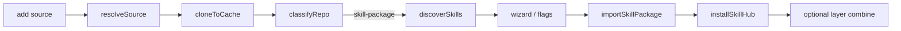

# `harnessdeck add` — remote skill package install design

**Date:** 2026-06-15  
**Status:** Approved  
**Related:** [supported-harnesses.md](../../supported-harnesses.md), [command-reference.md](../../cli/command-reference.md), [portability-limits.md](../../portability-limits.md)

## Problem

The [`skills`](https://skills.sh) CLI provides a one-liner to install skill packages from GitHub:

```bash
bunx skills@latest add mattpocock/skills
```

HarnessDeck can scan and import skills from **local** trees (`project scan`, plugin-source import, `layer from-project`) and install plugin snapshots globally (`project scan --global` on a local plugin root). It lacks:

| Gap | Impact |
| --- | --- |
| No remote clone + install in one command | Users must `git clone` before HarnessDeck can see skills |
| No skill-package picker UX | Cannot choose a subset interactively like `skills add` |
| No universal hub install | Global apply writes per-harness paths via serializers; no `~/.agents/skills/` hub + fan-out symlinks |
| Shallow skill discovery | Plugin import scans only `skills/{entry}/SKILL.md` one level; nested layouts (e.g. `skills/engineering/tdd/SKILL.md`) are missed |
| No top-level `add` router | Repos may contain skills, plugins, layers, or decks — no unified entry point |

Primary user goal (**A**): personal global install parity with `skills add`, **with skills imported into the HarnessDeck library** so they compose into layers and decks via existing `layer combine` / `deck apply` workflows.

## Goals

1. **`hd add <source>`** — GitHub shorthand or URL; clone (or use local path), auto-detect repo profile, run interactive wizard by default.
2. **Skill-package path (v1)** — Discover skills recursively, import full package to SQLite under a source namespace, install selected subset to disk (global or project).
3. **Hub + symlink global install** — Canonical skill dirs under `~/.agents/skills/{name}/`, fan-out symlinks to harness global skill paths (matches `skills` CLI).
4. **Layer bridge** — Optional wizard step (or flags) to create/combine a layer with selected skill refs (`skill:name@namespace`).
5. **Scriptable output** — `--format json`, `-y`, `--dry-run` for agents and CI.

## Non-goals (v1)

- Security risk assessments (Gen / Socket / Snyk); optional link to `skills.sh/{owner}/{repo}` in summary when source is GitHub.
- Plugin / layer / deck routing in the same wizard (detect and defer with hint; Phase 2).
- `hd add --update` refresh from upstream (Phase 2).
- Replacing `skills` CLI or skills.sh registry search (Phase 3).
- Bundled skill assets (`references/`, `scripts/`) as separate library resources; v1 symlinks/copies the skill directory tree as a unit.

## Command surface

```bash
bunx harnessdeck@latest add mattpocock/skills
hd add https://github.com/mattpocock/skills
hd add mattpocock/skills --list
hd add mattpocock/skills --skill caveman,grill-me --global --yes
hd add mattpocock/skills --create-layer mattpocock-skills --global -y
hd add ./local/skills-repo --project .
```

### Flags

| Flag | Purpose |
| ---- | ------- |
| `--skill <names>` | Install subset (comma-separated or repeatable) |
| `--all` | All discovered skills |
| `--harness <slugs>` | Target harnesses (default: `harness status` main + aliases, else home detection) |
| `--global` | Install to user home paths |
| `--project [path]` | Install to project (default `.` when flag present without value) |
| `--method symlink\|copy` | Default `symlink` |
| `--layer <name>` | Combine selected skills into existing layer after import |
| `--create-layer <name>` | Create layer and attach selected skills |
| `--list` | Discover skills only; no import or install |
| `--dry-run` | Show plan; no clone side effects beyond cache read |
| `-y, --yes` | Skip interactive prompts |
| `--format human\|json` | Output mode |

Scope rule: exactly one of `--global` or `--project` must be resolved before install (wizard asks if neither set). Import to library always runs on successful add (except `--list` / `--dry-run`).

## Architecture



### Source resolution

New `src/services/source-resolver.ts`:

| Input | Resolved |
| ----- | -------- |
| `owner/repo` | `https://github.com/owner/repo.git` |
| `https://github.com/...` | normalized URL |
| `git@github.com:owner/repo.git` | as-is |
| Existing directory | local scan (no clone) |

Clone via existing `refreshGitSource` into:

`~/.harnessdeck/cache/sources/{owner}/{repo}/`

Record commit SHA on imported snapshot metadata.

### Repo classification

New `src/services/repo-profile.ts` returns ordered profiles:

| Profile | Detection |
| ------- | --------- |
| `skill-package` | Any `**/SKILL.md` under `skills/` or `.agents/skills/` |
| `plugin-source` | `hasPluginSourceLayout()` |
| `layer-bundle` | HarnessDeck layer bundle marker |
| `deck-repo` | `.harnessdeck/deck.toml` |
| `harness-project` | `detectPlatforms()` non-empty |

**v1 routing:** When `skill-package` matches, run skill wizard. If only other profiles match, exit with actionable hint (Phase 2 adds multi-profile routing). Dual-mode repos (e.g. `mattpocock/skills` with `.claude-plugin/plugin.json`) use skill-package path for bare `hd add`.

### Skill discovery

New `src/services/skill-discovery.ts`:

- Walk `skills/` and `.agents/skills/` recursively for `SKILL.md`.
- Skill **name** from frontmatter `name` or parent directory basename (deepest directory containing `SKILL.md`).
- **Category** from path segment under `skills/` (e.g. `engineering` for `skills/engineering/tdd/SKILL.md`); top-level skills → `general`.
- Return `{ name, description, category, skillDirRelative, skillMdPath }[]`.

### Library import

New `src/services/skill-package-import.ts`:

1. Build `ResourceCreateInput[]` for **all** discovered skills (namespace = source slug, e.g. `mattpocock/skills`).
2. Create `ImportedSnapshot` with `source_kind: "skill-package"`.
3. Upsert resources via existing resource model (same provenance pattern as plugin import).
4. Extend `IMPORTED_SOURCE_KINDS` in `src/types.ts` with `"skill-package"`.

Metadata on snapshot:

```typescript
{
  git_url: string;
  git_sha: string;
  git_ref?: string;
  categories: Record<string, string[]>;
  installed_skill_names?: string[];
}
```

Resources addressable as `skill:caveman@mattpocock/skills` for `layer combine`.

### Global install (hub model)

New `src/services/skill-install.ts`:

For each selected skill:

1. **Hub path:** `~/.agents/skills/{name}/` → symlink to `{cacheCheckout}/{skillDirRelative}` (or copy when `--method copy`).
2. **Fan-out:** For each target harness, symlink `{globalPaths.skills}{name}/` → hub path when harness global skill path differs from hub.
3. Record installed paths in `imported_snapshot_installs` (reuse existing table).
4. On re-install from same source, replace files owned by prior snapshot for that source (reuse `replaceOwnedSnapshotIds` pattern from `applyImportedSnapshotToGlobal`).

Harness targets resolved via same logic as `resolveScanGlobalHarnessTargets()` (extract to shared helper).

Project scope (`--project`): hub at `{project}/.agents/skills/{name}/`, fan-out to harness project skill paths; respect `materialization_strategy` from project harness config when mirroring aliases.

### Interactive wizard

New `src/cli/add-wizard.ts` (prompts via existing UI helpers):

1. Source confirmation + clone status  
2. Skill multi-select (grouped by category)  
3. Harness multi-select (registry names; default from preferences)  
4. Scope: Global | Project  
5. Method: Symlink (recommended) | Copy  
6. Installation summary panel  
7. Layer step: Skip | Create `{repo-name}` | Add to existing layer  
8. Confirm  

Non-interactive: all choices from flags; error if required choice missing.

### Layer / deck integration

After import, when `--create-layer` or `--layer`:

- `layer create` if needed (non-interactive when name supplied).
- `addLayerAttachment` for each selected skill: `skill:{name}@{namespace}`.

Downstream:

```bash
hd layer combine team-setup skill:caveman@mattpocock/skills
hd layer apply team-setup --project .
hd deck apply my-deck
```

## Error handling

| Case | Behavior |
| ---- | -------- |
| Invalid source | Clear error; suggest `owner/repo` or URL |
| Empty skill tree | Exit 1; hint that repo may be plugin-only (Phase 2) |
| Git clone failure | Surface stderr; no partial import |
| Global install conflict | Prompt (interactive) or `--yes` replaces snapshot-owned files |
| No harness targets | Error referencing `hd harness set` or `--harness` |
| Layer name conflict on `--create-layer` | Same behavior as `layer create` conflict |

## Testing strategy

- **Unit:** source-resolver, skill-discovery (nested fixture), repo-profile, skill-install symlink layout.
- **Service:** skill-package-import persists namespace + snapshot; install writes expected symlinks under temp `HOME`.
- **CLI:** `hd add fixture --global -y --format json` end-to-end with mattpocock-style fixture.
- **Fixture:** `test/fixtures/skill-packages/mattpocock-minimal/` with nested `skills/engineering/tdd/SKILL.md`, flat `skills/caveman/SKILL.md`, and `.claude-plugin/plugin.json` (unused in v1 routing).

## Documentation updates

- `docs/cli/command-reference.md` — `add` command group  
- `docs/scenarios/scenarios.md` — new scenario row  
- `docs/scenarios/details/35-add-skill-package.md` — workflow  
- `SPEC.md` — scan/add behavior summary  
- `docs/superpowers/specs/README.md` — link this spec  

## Phasing

| Phase | Deliverable |
| ----- | ----------- |
| **1 (v1)** | `hd add` skill-package path: clone, discover, import, hub install, wizard, layer flags |
| **2** | `--update`, project-only polish, route plugin/layer/deck profiles |
| **3** | skills.sh registry search, optional security summary delegate |
