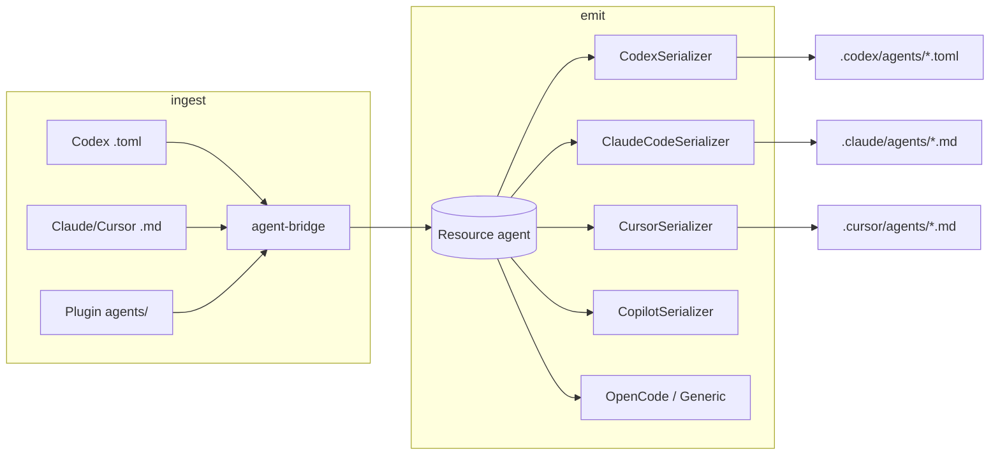

# Agent / subagent cross-harness bridge design

**Date:** 2026-06-15  
**Status:** Implemented  
**Related:** [supported-harnesses.md](../../supported-harnesses.md), [portability-limits.md](../../portability-limits.md), [2026-06-14-toml-transport-design.md](./2026-06-14-toml-transport-design.md)

## Problem

HarnessDeck treats `agent` resources as opaque file bodies for most harnesses. That works for same-format round-trips but breaks cross-harness portability and leaves documented agent surfaces unimplemented:

| Gap | Impact |
| --- | --- |
| Codex `.codex/agents/*.toml` stored as opaque text | `developer_instructions`, `model_reasoning_effort`, and `description` are not normalized; apply from layers emits invalid TOML when the canonical body is markdown |
| Claude / Cursor / OpenCode scan stores raw files | Frontmatter metadata is not extracted on scan (only plugin import and Claude serialize partially handle it) |
| Cursor serializer skips `agent` resources | Layers cannot materialize `.cursor/agents/*.md` despite registry support |
| Copilot serializers skip agents | `.github/agents/` is declared but never scanned or emitted |
| Plugin `agents/` import is `.md` only | Codex plugin packs and awesome-codex-subagents-style `.toml` agents are ignored |

Hosts with a real subagent model today:

- **Codex** — TOML (`developer_instructions`, `model_reasoning_effort`, `sandbox_mode`)
- **Claude Code** — Markdown + YAML (`model`, `tools`, `effort`, …)
- **Cursor** — Markdown + YAML (`model`, `readonly`, `is_background`)
- **OpenCode** — Markdown body (lighter)
- **GitHub Copilot / Copilot CLI** — Markdown under `.github/agents/`

## Goals

1. **Canonical agent model** — one internal representation for name, description, instruction body, model, reasoning effort, and sandbox/readonly semantics.
2. **Faithful Codex TOML** — parse and emit official Codex subagent files (including awesome-codex-subagents layout).
3. **Cross-harness apply** — layer apply from any source format produces valid native files for Codex, Claude Code, Cursor, OpenCode, and Copilot.
4. **Plugin import** — accept `agents/*.md` and `agents/*.toml` in plugin trees.
5. **Backward compatibility** — existing opaque round-trips keep working; normalization is additive.

## Non-goals

- Full fidelity for Claude-only fields (`tools`, `disallowedTools`, `mcpServers`, `hooks`, `isolation`, `skills`, …) in the first pass. Store unknown frontmatter/TOML keys in `metadata.extra` for round-trip within the same harness.
- Roo `.roomodes`, Gemini custom agents, or harnesses without an `agents` registry path.
- Auto-spawn / runtime subagent orchestration (host behavior stays outside HarnessDeck).
- Rewriting existing library resources on upgrade (normalization happens on scan, import, and serialize).

## Canonical model

Extend `AgentMetadata` in `src/types.ts`:

```typescript
export interface AgentMetadata {
  model?: string;
  /** Canonical field; maps to Codex `model_reasoning_effort` */
  reasoning_effort?: string;
  /** Codex-native sandbox level: read-only | workspace-write | danger-full-access */
  sandbox_mode?: string;
  /** Cursor-native write restriction */
  readonly?: boolean;
  /** Cursor-native background execution */
  is_background?: boolean;
  /** Preserved host-specific keys for same-harness round-trip */
  extra?: Record<string, unknown>;
  /** Hint set on parse: codex-toml | markdown-frontmatter | markdown-body */
  wire_format?: "codex-toml" | "markdown-frontmatter" | "markdown-body";
}
```

Resource fields:

| Field | Role |
| ----- | ---- |
| `name` | Agent identifier (from filename or explicit `name` in file) |
| `description` | Delegation hint (required by Codex; used by Claude/Cursor) |
| `content` | Instruction body only (markdown body or `developer_instructions` text) |
| `metadata` | Structured agent config per table above |

### Field mapping

| Canonical | Codex TOML | Markdown frontmatter |
| --------- | ---------- | -------------------- |
| `description` | `description` | `description` |
| `content` | `developer_instructions` | body after `---` |
| `model` | `model` | `model` |
| `reasoning_effort` | `model_reasoning_effort` | `reasoning_effort` or `effort` (read either) |
| `sandbox_mode` | `sandbox_mode` | — |
| `readonly` | — | `readonly` |
| `is_background` | — | `is_background` |

**Cross-harness defaults (lossy but useful):**

- Codex `sandbox_mode = "read-only"` → Cursor `readonly: true` on emit
- Cursor `readonly: true` → Codex `sandbox_mode = "read-only"` on emit
- Omit host-specific fields when the target harness does not support them

## Architecture

New module `src/services/agent-bridge.ts` (pure functions, no I/O):

```
parseCodexAgentToml(toml: string) → CanonicalAgent | undefined
emitCodexAgentToml(agent: CanonicalAgent) → string

parseMarkdownAgent(raw: string, filename: string) → CanonicalAgent | undefined
emitMarkdownAgent(agent: CanonicalAgent, flavor: "claude" | "cursor" | "generic") → string

normalizeAgentResource(input: ResourceCreateInput) → ResourceCreateInput
```

`CanonicalAgent` is a small internal type (not persisted separately):

```typescript
interface CanonicalAgent {
  name: string;
  description: string;
  instructions: string;
  metadata: AgentMetadata;
}
```

Serializers call the bridge at scan (normalize) and serialize (emit). Plugin import calls the same parsers.



## Per-harness behavior

### Codex (`src/platforms/codex.ts`)

- **Scan:** parse TOML → populate `description`, `content` (instructions), `metadata`
- **Serialize:** always emit valid TOML via `emitCodexAgentToml` (never dump raw `content` alone)
- **Preserve:** unknown TOML keys in `metadata.extra`

### Claude Code (`src/platforms/claude-code.ts`)

- **Scan:** `parseMarkdownAgent` → split frontmatter and body; map `effort` → `reasoning_effort`
- **Serialize:** `emitMarkdownAgent(..., "claude")`; merge `metadata.extra` keys into frontmatter when present
- **Existing tests:** extend for scan-side normalization

### Cursor (`src/platforms/cursor.ts`)

- **Scan:** add `.cursor/agents/*.md` scan (currently missing)
- **Serialize:** add `agent` case; emit `.cursor/agents/{name}.md` with `readonly`, `is_background`, `model`, `description`

### OpenCode + generic (`opencode.ts`, `generic-agents.ts`)

- **Scan:** normalize markdown agents when frontmatter present; pass through body-only files unchanged
- **Serialize:** emit markdown with frontmatter when metadata exists; else body-only (current behavior)

### Copilot (`src/platforms/copilot.ts`)

- **Scan:** `.github/agents/*.md` via shared markdown parser
- **Serialize:** emit `.github/agents/{name}.md` for `github-copilot` and `copilot-cli`

### Plugin import (`src/services/plugin-source-import.ts`)

- **Scan:** `agents/*.md` and `agents/*.toml`
- Route `.toml` through `parseCodexAgentToml`; `.md` through `parseMarkdownAgent`

## Error handling

- Malformed TOML or frontmatter on scan: skip file (match existing skill/agent skip behavior), do not abort project scan
- Missing `description` on Codex emit: use `Agent ${name}` fallback (Codex requires the field)
- Missing `developer_instructions` on Codex emit: use `content` or empty string with warning in dry-run only (serialize still writes valid TOML)
- Name mismatch between filename and in-file `name`: prefer in-file `name`; filename used only when absent

## Testing

| Area | Fixture / test file |
| ---- | ------------------- |
| Codex TOML parse/emit | `api-designer.toml` shape from awesome-codex-subagents |
| Cross-harness | Layer with one agent → apply to `codex`, `claude-code`, `cursor` |
| Plugin import | `agents/reviewer.toml` in plugin fixture |
| Regression | Existing `codex.test.ts`, `claude-code.test.ts` opaque round-trip |
| Cursor emit | New `cursor.test.ts` agent cases |

## Documentation updates

- `docs/supported-harnesses.md` — agent bridging notes per native harness
- `docs/portability-limits.md` — clarify agent cross-harness fidelity and Claude-only fields
- Optional scenario snippet under `docs/scenarios/details/` for Codex subagent adoption

## Phased delivery

| Phase | Scope | Outcome |
| ----- | ----- | ------- |
| **1** | `agent-bridge.ts` + types + unit tests | Shared parse/emit, no serializer changes |
| **2** | Codex scan/serialize + plugin `.toml` | Native Codex subagents fully structured |
| **3** | Cursor + Copilot scan/serialize | Registry matches behavior |
| **4** | Claude + OpenCode + generic scan normalize | Cross-harness layer apply |
| **5** | Docs + integration test | User-visible fidelity matrix |

## Success criteria

1. Copy `api-designer.toml` to `.codex/agents/`, scan, layer apply to Codex → byte-equivalent valid TOML (modulo formatting).
2. Same layer applied to Claude Code → valid `.claude/agents/api-designer.md` with description, model, and instruction body.
3. Same layer applied to Cursor → valid `.cursor/agents/api-designer.md` with `readonly: true` when source had `sandbox_mode = "read-only"`.
4. Plugin tree with `agents/*.toml` imports successfully via `project scan` / plugin-source import.
5. `bun test` green; no regression for minimal `name = "reviewer"` Codex fixture.

## Open questions

None blocking — defaults above are sufficient to implement. Claude extended fields (`tools`, `mcpServers`) land in `metadata.extra` until a follow-up spec.
