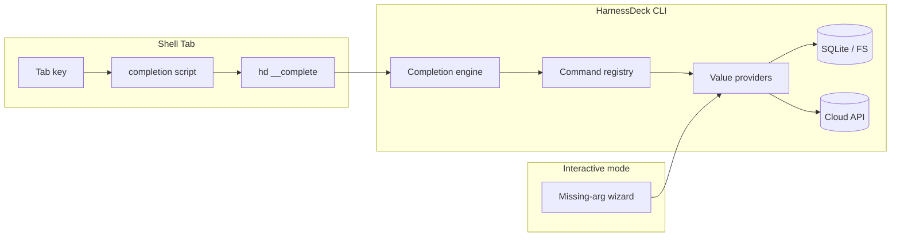

# CLI autocomplete design

**Date:** 2026-06-16  
**Status:** Approved for implementation  
**Related:** [command reference](../../cli/command-reference.md), [onboarding improvements](2026-06-14-onboarding-improvements-design.md), [CLI UX realignment](2026-06-11-cli-ux-realignment-design.md)

## Problem

HarnessDeck ships basic shell completion via `hd completion`, but it only completes static command paths (e.g. `layer apply`). Users cannot Tab-complete flags, layer names, harness slugs, or other dynamic selectors. Many commands accept optional selectors on a TTY but fall back to plain text input or hard errors instead of searchable pickers.

This creates friction for both daily shell usage and exploratory CLI workflows.

## Goals

1. **Shell tab completion** — bash, zsh, and fish complete commands, flags, and dynamic values via a runtime `hd __complete` callback.
2. **Interactive prompts** — when required or optional selectors are omitted on a TTY, show searchable pickers backed by the same data sources as shell completion.
3. **Tiered dynamic sources** — local SQLite/filesystem values always; catalog (network) values only for specific commands when an authenticated cloud profile exists.
4. **Discoverability** — document install steps in `hd guide` and the command reference; hint after `hd init` (human output only).

## Non-goals

- PowerShell completion.
- Auto-writing shell rc files during `init`.
- Completing secret key names or free-text search queries.
- Network-backed completion outside explicit catalog commands (`layer pull`, `layer search`, `project apply`, `auth orgs --switch`, `layer publish --org`).
- Completing inside `--format json`, CI, or `--no-interactive` paths.

## Decisions

| Topic | Decision |
| --- | --- |
| UX tracks | Shell Tab **and** interactive prompts |
| Shell strategy | Runtime callback — hidden `hd __complete` command |
| Dynamic sources | Tiered — local always; catalog for specific commands when authenticated |
| Architecture | Completion provider registry (Approach 2) |
| Commander integration | Lightweight partial-line parser; no full Commander parse or action execution |
| Install UX | Manual `hd completion <shell> >> …` documented; no `completion install` in v1 |

---

## Architecture



### Components

| Component | Role |
| --- | --- |
| `hd __complete <shell>` | Hidden command; reads partial line; prints one candidate per line |
| Completion engine | Parses partial line → current command + slot (subcommand / flag / flag-value / positional) |
| Provider registry | Maps `(command path, arg index \| flag name) → provider` |
| Value providers | Sync/async functions returning `{ value, description? }[]` |
| Updated `hd completion` | Emits shell scripts that delegate to `__complete` instead of static word lists |

### `__complete` protocol

```bash
echo "hd layer show eng" | hd __complete zsh
# stdout (one candidate per line):
engineering-foundation
engineering-foundation@1.2.0
```

- **Input:** shell name (`bash`, `zsh`, `fish`) + partial command line (program name stripped).
- **Output:** newline-separated values; optional `\t` + description for zsh/fish display.
- **Exit code:** always `0` (errors → empty stdout).
- **Fast path:** if `~/.harnessdeck/` does not exist, complete only static commands and flags.
- **Catalog timeout:** 300ms cap; fall back to local-only on timeout or error.

### Tiered catalog rules

| Provider | When active |
| --- | --- |
| `local-layer`, `local-deck`, `local-resource`, `local-environment` | Always (SQLite) |
| `harness-slug` | Always (built-in platform list) |
| `cloud-profile` | Always (local profile files) |
| `catalog-layer` | `layer pull`, `layer search` positional context, `project apply` positional; authenticated profile required |
| `catalog-org` | `auth orgs --switch`, `layer publish --org`, `layer catalog connect/disconnect` |

---

## Shell script generation

Replace static word-list scripts in `src/services/shell-completion.ts` with thin wrappers.

### Bash

```bash
_harnessdeck_completions() {
  local line="${COMP_LINE:0:$COMP_POINT}"
  mapfile -t COMPREPLY < <(hd __complete bash -- "$line" 2>/dev/null)
}
complete -F _harnessdeck_completions hd harnessdeck
```

Uses `COMP_LINE` truncated at cursor so partial flags like `--har` complete correctly.

### Zsh

```zsh
#compdef hd harnessdeck

_harnessdeck() {
  local -a suggestions
  suggestions=("${(@f)$(hd __complete zsh -- "$BUFFER" 2>/dev/null)}")
  compadd -a suggestions
}
_harnessdeck
```

Descriptions via `\t` suffix → `compadd -d` when present.

### Fish

```fish
function __harnessdeck_complete
  hd __complete fish -- (commandline -cp) 2>/dev/null
end
complete -c hd -f -a "(__harnessdeck_complete)"
complete -c harnessdeck -f -a "(__harnessdeck_complete)"
```

Register both `hd` and `harnessdeck` to match `resolveInvocationName()`.

---

## Registry layout

### File structure

```
src/services/completion/
  engine.ts
  registry.ts
  providers/
    local-layer.ts
    local-deck.ts
    local-resource.ts
    local-environment.ts
    harness-slug.ts
    cloud-profile.ts
    catalog-layer.ts
    catalog-org.ts
    resource-type.ts
    file-path.ts
    static-enum.ts
  types.ts
  __complete.ts
```

### Completion context

```typescript
type CompletionContext = {
  commandPath: string[];
  slot: "subcommand" | "flag" | "flag-value" | "positional";
  flag?: string;
  positionalIndex?: number;
  prefix: string;
  profile?: string;
};
```

Parsing walks the Commander subcommand tree using known names (same source as `collectCommandPaths`), then classifies the trailing token. Does not execute command actions.

### Provider interface

```typescript
type CompletionCandidate = { value: string; description?: string };

type CompletionProvider = (ctx: CompletionContext) =>
  CompletionCandidate[] | Promise<CompletionCandidate[]>;
```

All providers filter by `ctx.prefix` (case-insensitive prefix match). Local providers use synchronous SQLite reads. Catalog providers are async with a 300ms timeout.

### Registry entries (v1)

**Global flags** (every command): `--verbose`, `--no-color`, `--no-interactive`, `--help`; `--format` → `static-enum(human|json)`; `--harness` → `harness-slug`.

| Command path | Slot | Provider |
| --- | --- | --- |
| `layer show` | positional 0 | `local-layer` |
| `layer delete` | positional 0 | `local-layer` |
| `layer export` | positional 0 | `local-layer` |
| `layer export` | `--file` | `file-path` |
| `layer import` | positional 0 | `file-path` (*.toml/jsonc) |
| `layer apply` | positional 0 | `local-layer` |
| `layer combine` / `uncombine` | positional 0 | `local-layer` |
| `layer combine` / `uncombine` | positional 1 | `layer-attachment` |
| `layer combine` | `--type` | `static-enum(LAYER_ATTACHMENT_TYPES)` |
| `layer diff` | positional 0, 1 | `local-layer` or `file-path` |
| `layer set-environment` / `unset-environment` | positional 0 | `local-layer` |
| `layer set-environment` | positional 1 | `local-environment` |
| `layer pull` | positional 0 | `catalog-layer` |
| `layer search` | positional 0 | none (free text) |
| `layer publish` | positional 0 | `local-layer` |
| `layer publish` | `--org` | `catalog-org` |
| `layer catalog connect` / `disconnect` | positional 1 | `catalog-org` or `catalog-layer` |
| `layer *` | `--profile` | `cloud-profile` |
| `deck show` / `delete` / `export` / `apply` | positional 0 | `local-deck` |
| `deck import` | positional 0 | `file-path` (directory) |
| `resource show` / `delete` | positional 0 | `local-resource` |
| `resource list` | positional 0 | `resource-type` |
| `resource sync` | positional 0 | `local-resource` |
| `environment show` / `delete` / `set` / `unset` / `use` / `active` / … | positional 0 | `local-environment` |
| `environment secret set` / `unset` | positional 1 | none (secret keys) |
| `environment import` / `export` | positional 0 / `--file` | `local-environment` / `file-path` |
| `project apply` | positional 0 | `local-layer` + `catalog-layer` (merged, local first) |
| `project apply` | `--project` | `file-path` (directory) |
| `project revert` | positional 0 | `snapshot-id` |
| `harness set` | `--main`, `--aliases` | `harness-slug` |
| `harness project set` | `--main`, `--aliases` | `harness-slug` |
| `init` | `--main`, `--aliases` | `harness-slug` |
| `add` | `--layer`, `--create-layer` | `local-layer` |
| `add` | `--harness` | `harness-slug` |
| `add` | `--project` | `file-path` |
| `auth login` | positional 0 | `cloud-profile` |
| `auth status` / `logout` / `orgs` | `--profile` | `cloud-profile` |
| `auth orgs` | `--switch` | `catalog-org` |
| `migrate export` / `import` | positional 0 | `file-path` |

Subcommand completion remains tree-derived (static). The registry covers flags and positionals only.

### Hidden command registration

```typescript
program
  .command("__complete")
  .argument("<shell>", "bash | zsh | fish")
  .argument("[line...]", "Partial command line")
  .description(false)
  .action(...)
```

- Hidden from `hd --help` and completion output.
- Read-only DB access when `HARNESSDECK_COMPLETE=1` (set by the handler).

---

## Interactive prompts

Reuse providers via existing wizard helpers (`shouldUseWizard`, `resolveOrPrompt`, `promptForSearchableChoice`).

### Priority upgrades

| Priority | Command | Change |
| --- | --- | --- |
| P0 | `layer show`, `deck show`, `resource show` | Searchable picker when `[name]` omitted |
| P0 | `project apply` | Upgrade plain list to searchable choice |
| P1 | `layer pull`, `layer combine` / `uncombine` | Catalog browser or searchable attachment picker |
| P1 | `environment *` with optional `[name]` | Searchable environment picker |
| P2 | `harness set`, `deck apply` | Searchable when >8 harness choices |

Trigger via existing `shouldUseWizard({ missingRequiredArgs: true })` — no new flags.

---

## Discoverability

- **`hd guide`** — add line: `hd completion zsh >> ~/.zshrc`
- **`hd init`** — human output hint after success (do not auto-write rc files)
- **`docs/cli/command-reference.md`** — expand completion section with install steps and what Tab completes

---

## Testing

| Layer | Coverage |
| --- | --- |
| Unit | Each provider with fixture DB; engine slot resolution for sample partial lines |
| Integration | `hd __complete zsh -- "hd layer show eng"` returns matching layer names |
| Shell smoke | Generated bash script delegates to `__complete` (replace current static-only test) |
| Wizard | `@inquirer/testing` for upgraded show/apply pickers |

No live network in CI — catalog providers return `[]` without a profile or use mocked clients.

---

## Phasing

### Phase 1 — Plumbing

- `__complete` command, engine, registry skeleton
- Rewrite `shell-completion.ts` scripts
- Local providers: layer, deck, harness, cloud-profile
- Top 10 registry entries

### Phase 2 — Coverage

- Remaining registry entries
- Catalog providers (tiered)
- Interactive prompt upgrades (P0 commands)

### Phase 3 — Polish

- `hd guide`, docs, command-reference updates
- P1 interactive prompts
- 100ms in-process provider cache for repeated `__complete` calls

---

## Success criteria

- After installing completion, Tab on `hd layer show ` lists local layer names.
- Tab on `hd project apply --harness ` lists harness slugs.
- Tab on `hd layer pull ` lists catalog layers when authenticated; empty when not.
- `hd layer show` with no args on a TTY opens a searchable layer picker.
- All existing CLI tests pass; new completion tests cover engine and at least three providers.
